# CLAUDE.md

This file provides guidance to Claude Code (claude.ai/code) when working with code in this repository.

## このリポジトリの概要

このリポジトリは、技術記事の投稿サービス [Zenn](https://zenn.dev/) に記事を公開するための「原稿置き場」です。アプリケーションのソースコードではなく、`articles/` に日本語の Markdown 記事が並び、そこで使う図が `images/` に画像として置かれているだけの、シンプルなコンテンツ用リポジトリだと考えてください。Zenn の「GitHub 連携」機能とつながっているので、このリポジトリに push すると、その内容がそのまま Zenn 上の記事として自動で公開・更新されます。

記事の中心は「猫でもわかる」という TTS（音声合成）の入門シリーズです。音声ができるまでの流れ（G2P → 音響モデル → メルスペクトログラム → ボコーダ）と、その土台になる生成モデル（VAE・Flow・GAN）を一つずつ噛み砕き、最後に総集編として、それらすべてが合流する VITS（`vits-for-cats.md`）にたどり着く、という順番で読ませる構成になっています。あわせて、TTS 全体の系譜を俯瞰する `tts-lineage-map-from-vits.md` もあります。記事どうしは互いにリンクし合っていて、シリーズとして通し読みされることを前提にしています。

## いちばん大事なこと：正しいのは Zenn ではなく GitHub 側

このリポジトリは Zenn の GitHub 連携でデプロイされているため、記事の「正本」はあくまでこのリポジトリのファイルです。Zenn は push のたびに GitHub の内容を読み直して記事を作り直します。そのため、もし Zenn の Web 編集画面だけでタイトルなどを書き換えても、次に何かを push した瞬間に、リポジトリ側の内容で上書きされて元に戻ってしまいます。ユーザーが Zenn 上で行った変更は、必ずこちらの `articles/*.md`（多くの場合はフロントマターの `title`）にも反映しておかないと、静かに巻き戻るので注意してください。

## よく使うコマンド

作業には Zenn の CLI を使います。まず `npm install` で導入し（`node_modules` はコミット対象外です）、書いた記事の見た目は `npx zenn preview`（http://localhost:8000）でローカル確認できます。いちばん頼りになるのが `npx zenn list:articles` で、これは全記事のフロントマターとスラッグをまとめて検証し、Zenn が公開する記事の一覧を表示してくれます。テストのようなものは他にないので、記事を触ったら毎回このコマンドを走らせて壊れていないか確かめるのが、実質的なチェック代わりになります。新しい記事のひな形は `npx zenn new:article` で作れます。

```bash
npm install
npx zenn preview        # ローカルプレビュー (http://localhost:8000)
npx zenn list:articles  # 全記事の frontmatter / slug を検証（実質のチェック）
npx zenn new:article    # 新規記事のひな形を作成
```

## 記事を書くときの約束ごと

各記事の冒頭にはフロントマターがあり、`title`・`emoji`（1つ）・`type: "tech"`・`topics`（最大5つ）・`published` を書きます。書き始めたばかりの記事はまず `published: false`（下書き）にしておき、「公開してよい」とユーザーに言われたときに `true` へ変えるのが基本の流れです。気をつけたいのはファイル名で、これがそのままスラッグ（記事 URL の一部）になります。いったん公開した記事のファイル名を変えると、公開済みの URL も、他の記事から張ったリンクもすべて切れてしまうので、リネームは避けてください。記事どうしのリンクは `https://zenn.dev/nnn112358/articles/<スラッグ>` という完全な URL で、スラッグを頼りに張っています。したがってタイトルを変えてもリンク自体は生きたままですが、リンクの表示テキストのほうは必要に応じて直してあげる必要があります。

数式は KaTeX で書き、インラインは `$...$`、ブロックは `$$...$$` を使います。ひとつ落とし穴があって、Markdown の表のセルの中で条件付き確率のバー `|` を使うと表の区切り記号とぶつかってしまいます。その場所だけは KaTeX の `\mid` を使ってください。画像は `/images` に置き、`` の形で参照します。

## 図は「Python 風に整えた mermaid」で描く

フローチャートのような図は、手作りの matplotlib 図のような見た目になるようにスタイルを当てた mermaid で描きます。これはユーザーがはっきり希望していることです。具体的には、角の丸いノード `id("...")` に色のクラス `:::色` を付け、線の色をスレートグレーにし、矢印を曲線ではなく直線（`linear`）にする、という共通の書き出しを毎回そのまま使います。

```mermaid
%%{init: {'theme':'base','themeVariables':{'lineColor':'#475569','fontFamily':'Noto Sans CJK JP, sans-serif','fontSize':'15px'},'flowchart':{'padding':14,'nodeSpacing':50,'rankSpacing':60,'curve':'linear'}}}%%
flowchart LR
    A("ラベル<br/>2行目"):::blue --> B("次"):::amber
    classDef blue fill:#dbeafe,stroke:#2563eb,stroke-width:2px,color:#111827
    classDef amber fill:#fef3c7,stroke:#d97706,stroke-width:2px,color:#111827
    classDef purple fill:#ede9fe,stroke:#7c3aed,stroke-width:2px,color:#111827
    classDef pink fill:#fce7f3,stroke:#db2777,stroke-width:2px,color:#111827
    classDef green fill:#dcfce7,stroke:#16a34a,stroke-width:2px,color:#111827
    classDef gray fill:#f3f4f6,stroke:#6b7280,stroke-width:2px,color:#111827
    classDef red fill:#fee2e2,stroke:#dc2626,stroke-width:2px,color:#111827
```



色は役割で決めていて、入力や前段はグレー、処理やモデルは青、フローや潜在変数まわりは紫、識別器や損失はピンク（損失そのものは赤）、出力は緑、そしてその記事の主役や強調したいものは琥珀色にします。ノードは必ず角丸の `("...")` を使い、四角い `["..."]` は避けてください（このスタイルの中では四角だけ浮いて見えます）。破線やフィードバックの矢印は `-.->|"ラベル"|` で書きます。もうひとつの落とし穴として、ノードのラベルの中に `|` を書くと mermaid がエッジラベルの区切りと勘違いするので、条件付き確率などのバーは `∣`（U+2223）で書きます（たとえば `q(z∣x)`）。mermaid が壊れていないかは、mermaid-cli で PNG に書き出せば確かめられます。`npx -y @mermaid-js/mermaid-cli -i x.mmd -o x.png -p pptr.json` のように使い、`pptr.json` には `{"args":["--no-sandbox","--disable-gpu"]}` を入れておきます。

## データのグラフは matplotlib で作った画像

スペクトログラムや潜在空間の散布図、ベンチマークの分布、書記素から音素への対応図など、mermaid では表せない「実データのグラフ」は matplotlib で作り、`images/*.png` として置きます。生成はこのプロジェクト共通のルールに従って `uv`（`uv run --with numpy --with matplotlib python <スクリプト>`）で走らせ、図は外部の音声ファイルを使わず、合成した信号から描き起こします。matplotlib の図の中に日本語を入れたいときは、`FontProperties(fname="/usr/share/fonts/opentype/noto/NotoSansCJK-Regular.ttc")` のように CJK フォントを指定してください（指定しないと文字化けします）。ただし `x̂` のような合成グリフは Noto CJK に入っていないので、matplotlib の図では避けます。生成に使ったスクリプト自体はリポジトリには残さず、できあがった PNG だけをコミットするのが慣習です。

## 技術的な正しさをどう担保するか

記事に書くアーキテクチャの説明、MOS などの数値、損失項、系譜のつながりといった技術的な主張は、隣にある研究用リポジトリ `../tts_investigate/papers/md/<名前>/<名前>.md` にある論文（Markdown 化したもの）を根拠にしています。技術的な内容を足したり直したりするときは、記憶に頼らずこれらの論文で裏を取り、とくに要になる主張については論文そのものの表現を引くようにしてください。
