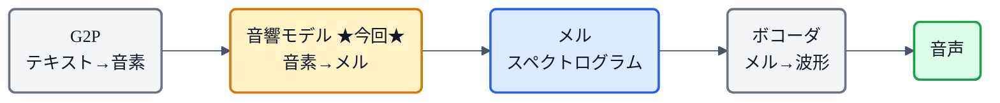
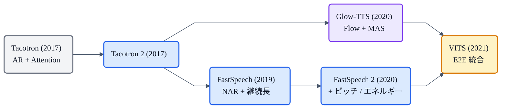

## この記事について

これまでの「猫でもわかる」シリーズで、TTSの入口([G2P](https://zenn.dev/nnn112358/articles/g2p-for-cats))と出口([HiFi-GAN](https://zenn.dev/nnn112358/articles/hifigan-for-cats)などのボコーダ)、その間の[メルスペクトログラム](https://zenn.dev/nnn112358/articles/what-is-mel-spectrogram)を見てきました。

今回はいよいよ、その**ど真ん中**にいる **音響モデル(Acoustic Model)** です。「音響モデルがテキストからメルを作る」と何度も書いてきましたが、その正体を明かします。**音素の列を、メルスペクトログラムに変換する**——言い換えれば「**文字をどう発音するか(長さ・高さ・音色)を予測する**」、TTSで一番"頭を使う"部分です。猫でもわかるように解説します。😻

:::message
数値・仕様は Tacotron 2 / FastSpeech 2 / Glow-TTS の論文本文で確認しています。図は numpy + matplotlib で自作しました。
:::

## 3行で言うと

- 音響モデル = **音素列 → メルスペクトログラム** の変換器。G2Pとボコーダの間の中核。
- 最大の難所は **アライメント(整列)**:短い音素列を、長いメルの各フレームにどう対応させるか(=各音素が何フレーム続くか)。
- 大きく **自己回帰+Attention(Tacotron)** と **非自己回帰+継続長(FastSpeech)** の2流派。**Glow-TTS(Flow+MAS)** がVITSへの橋渡し。

## TTSパイプラインでの位置

まず全体像。音響モデルは、G2Pとボコーダに挟まれた真ん中にいます。

G2Pが出した音素列(例:`k y o o ...`)を受け取り、**それがどんな音の並びになるか**をメルスペクトログラムとして描き出す。この「音の設計図」をボコーダが波形に変える、という分業です。

## 一番の難所:アライメント(整列)と継続長

音響モデルが難しい理由はこれ一点に尽きます。

- **入力(音素列)は短い**:「こんにちは」なら 9 音素ほど。
- **出力(メル)は長い**:同じ発話でも数十〜数百フレーム。

つまり、**1つの音素が「何フレーム分」続くのか**を決めて、短い記号列を長いフレーム列に**引き伸ばして対応づける**必要があります。これが**アライメント(alignment)**問題。TTSの音響モデルは、要するにこの整列の解き方で流派が分かれます。

*音響モデルの核心 = 短い音素列(縦)を長いメルのフレーム列(横)に対応づけること。左: 自己回帰+Attentionは「柔らかく学習された」対応(対角の帯)。右: 非自己回帰+継続長は「各音素が何フレームか」を明示した硬いブロック(数字=継続長)。*

## もう一つの壁:一対多問題(one-to-many)

さらに厄介なのが、**同じテキストでも喋り方は無数にある**こと。ピッチ(高さ)、リズム(速さ)、抑揚……テキストだけでは、これらは一意に決まりません。FastSpeech 2 の論文はこう指摘します。

> *"TTS is a typical one-to-many mapping problem, since multiple possible speech sequences can correspond to a text sequence due to variations in speech, such as pitch, duration, sound volume and prosody."*

「入力(テキスト)には、出力(メル)を決めきる情報が足りない」。この**情報ギャップ**をどう埋めるかが、各モデルの工夫のしどころです。

## 2大流派 + 橋渡し役

### A. 自己回帰(AR)+ Attention ― Tacotron 系

[Tacotron](https://zenn.dev/nnn112358/articles/tacotron-for-cats) の後継 **Tacotron 2** に代表される古典派。**1フレームずつ順番に**メルを生成し、**Attention機構** が「今どの音素を見て喋るか」を暗黙に学習します(上図・左)。

> Tacotron 2 = *"a recurrent sequence-to-sequence feature prediction network with attention which predicts a sequence of mel spectrogram frames from an input character sequence"*(+ WaveNetボコーダ)。

- **長所**: アライメントを明示せず、Attentionが自動で学習してくれる。自然な韻律。
- **短所**: **逐次生成で遅い**。そしてAttentionが壊れると **単語のスキップ・繰り返し・もごもご**が起きる(**頑健性の問題**)。

### B. 非自己回帰(NAR)+ 継続長 ― FastSpeech 系

**FastSpeech / FastSpeech 2** の並列派。**継続長予測器(duration predictor)** で各音素の長さを**明示的に**予測し、**Length Regulator** で音素の特徴を frame 長に引き伸ばしてから、**全フレームを一気に並列生成**します(上図・右)。

FastSpeech 2 の肝は **Variance Adaptor**。ここに一対多問題の答えがあります。

| 予測器 | 補う情報 |
|---|---|
| **継続長(duration)** | 各音素が何フレーム続くか(Length Regulator で展開) |
| **ピッチ(pitch / F0)** | 声の高さ・抑揚 |
| **エネルギー(energy)** | 音量・強さ |

テキストに足りない「ピッチ・エネルギー・正確な継続長」を**明示的に注入**することで、一対多問題を緩和します。継続長は **Montreal Forced Alignment(MFA)** で抽出(TacotronのAttentionマップより正確)。

- **長所**: **速い(並列)**・**頑健(スキップ/繰り返しが起きない)**・**制御可能**(ピッチやエネルギーを触れる)。
- **短所**: 学習に**継続長ラベル**が要る(教師モデルや forced aligner が必要)。

### C. 橋渡し役 ― Glow-TTS(Flow + MAS)

**Glow-TTS** は、[正規化フロー](https://zenn.dev/nnn112358/articles/flow-for-cats)を使い、**外部アライナー無し**で単調アライメントを**動的計画法(MAS: Monotonic Alignment Search)**で自力探索します。これが**VITS**に受け継がれ、単段E2Eへとつながります(→[TTS系譜マップ](https://zenn.dev/nnn112358/articles/tts-lineage-map-from-vits))。

## 出力の使い方 ― 2段 or E2E

音響モデルが出したメルは、次のどちらかで音になります。

- **2段構成**: 音響モデル → メル → **ボコーダ(HiFi-GAN等)** → 波形。分業なので差し替えが効く。
- **単段E2E**: **VITS** のように、メルを外に出さず内部の潜在変数として扱い、テキストから波形まで一気通貫。

ちなみに Tacotron 2 の論文は、なぜメルを中間表現に選んだかをこう説明しています——*"smoother than waveform samples and is easier to train using a squared error loss because it is invariant to phase within each frame"*(波形より滑らかで、フレーム内の位相に不変なので二乗誤差で学習しやすい)。[メルの記事](https://zenn.dev/nnn112358/articles/what-is-mel-spectrogram)で「位相を捨てている」と書いた話と表裏一体ですね。

## 進化の流れ

「AR+Attentionで自然さを」→「NAR+継続長で速さと頑健さを」→「Flow+MASでアライメントを自動化し、E2Eへ」という大きな流れです。

## 猫のまとめ 😻

- 音響モデル = **音素列 → メルスペクトログラム**。G2Pとボコーダの間の中核。
- 核心は **アライメント**:短い音素列を長いメルに対応づけ、**各音素の継続長**を決めること。
- **AR+Attention(Tacotron)**: 自然だが遅い・Attentionが壊れやすい。**NAR+継続長(FastSpeech2)**: 速い・頑健・制御可能(継続長/ピッチ/エネルギー)。
- **一対多問題**(同じ文でも喋り方は無数)を、FastSpeech2は variance adaptor で、VITSは確率的モデル化で緩和。
- **Glow-TTS(Flow+MAS)がVITSへの橋渡し**。

これで「[G2P](https://zenn.dev/nnn112358/articles/g2p-for-cats) → **音響モデル** → [メル](https://zenn.dev/nnn112358/articles/what-is-mel-spectrogram) → [ボコーダ](https://zenn.dev/nnn112358/articles/hifigan-for-cats)」というTTSの全工程が、1本につながりました。

## 参考リンク

- [Tacotron 2 (arXiv:1712.05884)](https://arxiv.org/abs/1712.05884)
- [FastSpeech (arXiv:1905.09263)](https://arxiv.org/abs/1905.09263) / [FastSpeech 2 (arXiv:2006.04558)](https://arxiv.org/abs/2006.04558)
- [Glow-TTS (arXiv:2005.11129)](https://arxiv.org/abs/2005.11129) / [VITS (arXiv:2106.06103)](https://arxiv.org/abs/2106.06103)
- 関連記事: [猫でもわかるG2P](https://zenn.dev/nnn112358/articles/g2p-for-cats) / [猫でもわかるメルスペクトログラム](https://zenn.dev/nnn112358/articles/what-is-mel-spectrogram) / [猫でもわかるHiFi-GAN](https://zenn.dev/nnn112358/articles/hifigan-for-cats) / [VITSから見るTTS 10系統マップ](https://zenn.dev/nnn112358/articles/tts-lineage-map-from-vits)

:::message
🐾 **猫でもわかるTTSシリーズ**(全28本) ― [目次](https://zenn.dev/nnn112358/articles/tts-for-cats-index) ／ 前: [G2P](https://zenn.dev/nnn112358/articles/g2p-for-cats) ／ 次: [メルスペクトログラム](https://zenn.dev/nnn112358/articles/what-is-mel-spectrogram)
:::
