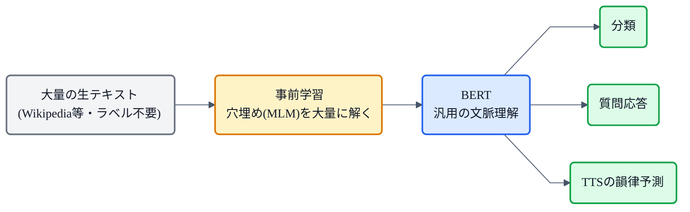

## この記事について

前回の [StyleTTS 2](https://zenn.dev/nnn112358/articles/styletts-for-cats) で「PL-BERT(音素レベルBERT)」がさらっと出てきました。この記事はその **BERT** の話です。

BERT(2018, Google)は、**文章の"文脈"を読む**ための、自然言語処理(NLP)の土台となったモデル。TTS(音声合成)では、テキストの**意味や構造を捉えて、より自然な抑揚(韻律)を作る**ために使われます。[Bert-VITS2](https://zenn.dev/nnn112358/articles/tts-lineage-map-from-vits) や StyleTTS 2、PnG-BERT など、TTSのあちこちに顔を出す縁の下の力持ち。猫でもわかるように見ていきましょう。📚

:::message
BERT: Devlin et al., *"BERT: Pre-training of Deep Bidirectional Transformers for Language Understanding"* (2018, [arXiv:1810.04805](https://arxiv.org/abs/1810.04805))。TTS への応用は PnG-BERT([arXiv:2103.15060](https://arxiv.org/abs/2103.15060))等の論文で確認しています。図は matplotlib、フローチャートは mermaid です。
:::

## 3行で言うと

- BERT = **Transformer エンコーダを、大量テキストで事前学習**し、各単語を**文脈込みの表現**にするモデル。
- 学習は **穴埋め(MLM)**:マスクした単語を、**左右"両方向"の文脈**から当てる。だから深く文脈を理解できる。
- TTSでは、この文脈理解を足すと **抑揚・間・読みが自然**になる(同じ綴りでも文脈で変わる、を捉えられる)。

## 何が問題か:意味は文脈で決まる

言葉は、**前後の文脈で意味も読み方も変わります**。TTSでもこれは切実で、PnG-BERT の論文はこんな例を挙げています。

> "..., press one; or to continue, **two**." と "..., **too**." は、音は同じ(同音)でも、自然な話し方が違う。前者はカンマで**軽く間を置く**が、後者は**間を置かない**方が自然。

同音・同綴でも、文脈で**間の取り方や抑揚**が変わる。これを当てるには、単語を**文脈込みで**理解した表現が必要です。BERT はまさにそれを作ります。

## BERTのアイデア:両方向の文脈で表現する

BERT は、[Transformer](https://zenn.dev/nnn112358/articles/tts-lineage-map-from-vits) の**エンコーダ**を使い、文中の各トークンを、**文全体(左も右も)を見た表現**に変換します。同じ単語でも、周りの文脈次第で表現が変わる——これを **文脈表現(contextual embedding)** と呼びます。

「両方向を同時に見る」のが BERT の"B"(Bidirectional)。文章を左から右へ順番に読む GPT のような自己回帰モデルとは、ここが根本的に違います。

## 事前学習=穴埋め(MLM)

では、その「両方向の文脈理解」をどう身につけるのか。答えは **穴埋め問題を大量に解く**ことです。これを **MLM(Masked Language Model)** と呼びます。

*文の一部をマスクして隠し、**左右両方の文脈**からその単語を当てる。「猫 が [MASK] を 飲む」なら「牛乳」。正解ラベルは元の文そのものなので、**ラベル不要の大量テキスト**で自己教師あり学習できる。*

ランダムに1〜2割の単語を隠し、周りから当てる。正解は"元の単語"なので、人手のラベルは要らず、**Wikipedia などの生テキストを大量に**学習できます(自己教師あり)。穴埋めを解くには両側の文脈を使うしかないので、自然と**深い双方向の文脈理解**が身につきます。

## 事前学習 → ファインチューニング

こうして一度**汎用の言語理解**を身につけたら、あとは各タスク(分類・質問応答・そしてTTS)に、**少しの追加学習(ファインチューニング)**で転用できます。「大量テキストで基礎学力をつけ、あとは各科目に応用する」イメージ。この**事前学習→転用**という型が、BERT が NLP を塗り替えた理由です。

*一度の事前学習で「基礎学力」を身につけ、各タスクには少しの追加学習で転用できる。*

## TTSでの使われ方

TTS では、テキストや音素の列に **BERT の文脈表現を足す**ことで、韻律(どこを強く、どこで区切り、上げ下げするか)が自然になります。先の「two / too」のような、**文字だけでは分からない間の取り方**を、文脈から補えるわけです。

代表的な使われ方はこんな感じです。

- **PnG-BERT**:音素(Phoneme)と書記素(Grapheme)の両方を入力にした TTS用BERT。事前学習で発音と韻律が改善し、**人間の録音と有意差なし**の自然さを達成。
- **PL-BERT(音素レベルBERT)**:[StyleTTS 2](https://zenn.dev/nnn112358/articles/styletts-for-cats) が韻律用のテキストエンコーダに採用。
- **Bert-VITS2**:多言語BERTの表現を [VITS](https://zenn.dev/nnn112358/articles/vits-for-cats) に注入し、表現力・韻律を強化。

## 猫のまとめ 📚

- BERT = **Transformer エンコーダ**を大量テキストで事前学習し、単語を**文脈込みの表現**にするモデル。
- 学習は **穴埋め(MLM)**:マスクした単語を**左右両方向の文脈**から当てる → ラベル不要で深い文脈理解。
- **事前学習 → ファインチューニング**で各タスクに転用。GPT(左→右生成)と違い、BERTは**両方向で理解**する係。
- TTSでは、文脈理解を足して **抑揚・間・読みを自然**に(PnG-BERT / PL-BERT / Bert-VITS2)。

「文字面の奥の"文脈"を読む」BERT の力が、TTS の"人間らしい喋り"も支えているわけです。

## 参考リンク

- [BERT (arXiv:1810.04805)](https://arxiv.org/abs/1810.04805)
- [PnG-BERT (arXiv:2103.15060)](https://arxiv.org/abs/2103.15060) ― 音素+書記素のTTS用BERT
- 関連記事: [猫でもわかるStyleTTS 2](https://zenn.dev/nnn112358/articles/styletts-for-cats) / [猫でもわかるVITS](https://zenn.dev/nnn112358/articles/vits-for-cats) / [VITSから見るTTS 10系統マップ](https://zenn.dev/nnn112358/articles/tts-lineage-map-from-vits)

:::message
🐾 **猫でもわかるTTSシリーズ**(全25本) ― [目次](https://zenn.dev/nnn112358/articles/tts-for-cats-index) ／ 前: [StyleTTS 2](https://zenn.dev/nnn112358/articles/styletts-for-cats) ／ 次: [LLM TTS](https://zenn.dev/nnn112358/articles/llm-tts-for-cats)
:::
