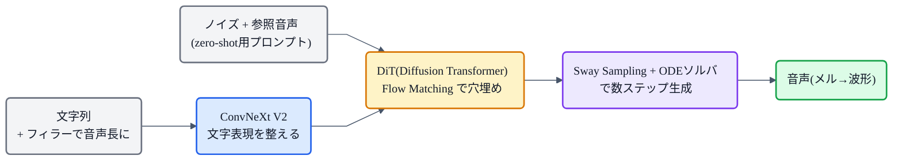

## この記事について

[猫でもわかるFlow Matching](https://zenn.dev/nnn112358/articles/flow-matching-for-cats)の応用として、いま人気の **F5-TTS**(2024)を見ます。名前は "**F**airytaler that **F**akes **F**luent and **F**aithful speech with **F**low matching"(Fが5つ)。

F5-TTS のすごさは、**継続長予測器も、テキストエンコーダも、音素アライメントも要らない**という潔さ。それでいて高品質な zero-shot 音声合成ができ、しかも速い(RTF 0.15)。猫でもわかるように、その仕掛けを見ていきましょう。🧚

:::message
F5-TTS: Chen et al. (2024, [arXiv:2410.06885](https://arxiv.org/abs/2410.06885))。公開100K時間・多言語で学習。本記事の仕様は論文本文で確認しています。図は matplotlib と mermaid で作成しました。
:::

## 3行で言うと

- F5-TTS = **[Flow Matching](https://zenn.dev/nnn112358/articles/flow-matching-for-cats) + DiT(Diffusion Transformer)** の完全非自己回帰TTS。
- **継続長予測器・テキストエンコーダ・音素アライメントが不要**。文字列をフィラーで音声長にそろえ、「穴埋め(infilling)」で生成する。
- 前身 E2 TTS の弱点(遅い収束・低い頑健性)を、**ConvNeXt V2** と **Sway Sampling** で解決。zero-shot で自然、RTF 0.15 で速い。

## 潔い設計:継続長予測もアライメントも捨てる

これまで見た音響モデル([→記事](https://zenn.dev/nnn112358/articles/acoustic-model-for-cats))は、「各音素が何フレーム続くか」を決める **継続長予測器** や、テキストと音の対応をとる **アライメント([MAS](https://zenn.dev/nnn112358/articles/mas-for-cats)等)** が必須でした。

F5-TTS(と、その元になった **E2 TTS**)は、これを大胆に捨てます。やり方はこう。**文字列を、フィラー(埋め草)トークンで音声の長さまで水増し**して、あとは **[Flow Matching](https://zenn.dev/nnn112358/articles/flow-matching-for-cats) で音声を"穴埋め"** するだけ。

*文字「Hello」を、フィラー(F)で音声(メル)の長さまでパディング。継続長を明示的に予測せず、**各文字がどれだけ伸びるかはモデルが総尺の中で自分で学ぶ**。だから継続長予測器もアライメントも要らない。*

「全体の長さだけ決めれば、各文字の割り当てはモデルが勝手に学ぶ」——これで韻律やリズムがむしろ自然になる、というのが E2/F5 系の発見です。

## E2 TTS の弱点と、F5-TTS の2つの解決

ただ、元の E2 TTS には弱点がありました。**文字と音声を素朴に連結する**ため意味と音響が深く絡まり、**収束が遅く、アライメントが壊れやすい**(頑健性が低い)。F5-TTS は2つの工夫でこれを直します。

- **① ConvNeXt V2 でテキストを整える**:連結の前に、文字表現を [ConvNeXt](https://zenn.dev/nnn112358/articles/vocos-for-cats) V2 ブロックで洗練。音声とそろえやすくなり、アライメントが安定。
- **② Sway Sampling(推論時)**:Flow Matching の「時間ステップ」の刻み方を工夫する推論時テクニック。品質・効率が大きく上がり、**再学習なしで既存の flow matching 系にも使える**。

## 全体像

- **骨格は DiT(Diffusion Transformer)**:画像生成由来の Transformer を、Flow Matching の速度場ネットとして使う。
- **非自己回帰**なので[並列生成で速い](https://zenn.dev/nnn112358/articles/llm-tts-for-cats)(RTF 0.15)。
- **zero-shot**:参照音声をプロンプトに与えれば、その声で喋る([→zero-shot](https://zenn.dev/nnn112358/articles/zero-shot-for-cats))。多言語のコードスイッチや速度制御も得意。

## 系譜での位置

F5-TTS は、Flow Matching 系TTSの到達点の一つです。

**Flow Matching(Lipman) → Voicebox → E2 TTS →(ConvNeXt + Sway Sampling)→ F5-TTS**

「継続長予測もテキストエンコーダも要らない、シンプルで強い」路線を、実用レベルまで磨き上げたのが F5-TTS([→系譜マップ](https://zenn.dev/nnn112358/articles/tts-lineage-map-from-vits))。コードも公開され、コミュニティで広く使われています。

## 猫のまとめ 🧚

- F5-TTS = **Flow Matching + DiT** の完全非自己回帰TTS。名前は"F"が5つ。
- **継続長予測器・テキストエンコーダ・音素アライメント不要**。文字をフィラーで音声長にそろえ、穴埋め(infilling)で生成。
- 前身 E2 TTS の遅さ・脆さを、**① ConvNeXt V2**(テキストを整える)と **② Sway Sampling**(推論時の刻み方)で解決。
- **zero-shot・多言語・速い(RTF 0.15)**。Voicebox → E2 → F5 の系譜。

「余計な部品を削って、Flow Matching に任せる」——引き算の美学が効いた、いまどきの人気モデルです。

## 参考リンク

- [F5-TTS (arXiv:2410.06885)](https://arxiv.org/abs/2410.06885) / [SWivid/F5-TTS](https://github.com/SWivid/F5-TTS)
- 関連記事: [猫でもわかるFlow Matching](https://zenn.dev/nnn112358/articles/flow-matching-for-cats) / [猫でもわかるzero-shot TTS](https://zenn.dev/nnn112358/articles/zero-shot-for-cats) / [猫でもわかるVocos(ConvNeXt)](https://zenn.dev/nnn112358/articles/vocos-for-cats) / [VITSから見るTTS 10系統マップ](https://zenn.dev/nnn112358/articles/tts-lineage-map-from-vits)

:::message
🐾 **猫でもわかるTTSシリーズ**(全32本) ― [目次](https://zenn.dev/nnn112358/articles/tts-for-cats-index) ／ 前: [Flow Matching](https://zenn.dev/nnn112358/articles/flow-matching-for-cats) ／ 次: [zero-shot TTS](https://zenn.dev/nnn112358/articles/zero-shot-for-cats)
:::
