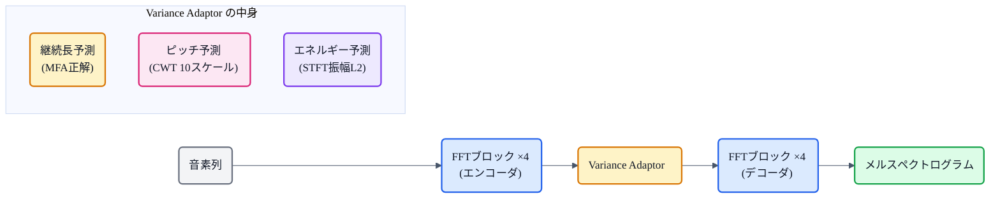
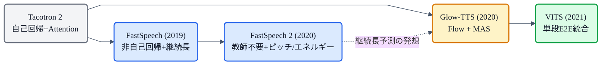

## この記事について

[Tacotron 2](https://zenn.dev/nnn112358/articles/tacotron2-for-cats) は人間レベルの音質(MOS 4.53)に到達しましたが、**自己回帰**(1フレームずつ順に生成)ゆえの2つの弱点がありました。

1. **遅い** — メルの長さだけデコーダを回す必要がある。
2. **不安定** — Attention が崩れると読み飛ばし・繰り返しが起きる。

**FastSpeech**(2019, Microsoft/Zhejiang U）はこの2つを同時に解決した、**初の実用的な非自己回帰E2E TTS** です。続く **FastSpeech 2**(2020）で蒸留の依存を除去し、ピッチ・エネルギー制御も追加。猫でもわかるように見ていきましょう。

:::message
FastSpeech: Ren et al., *"FastSpeech: Fast, Robust and Controllable Text to Speech"* (2019, NeurIPS, [arXiv:1905.09263](https://arxiv.org/abs/1905.09263))。FastSpeech 2: Ren et al., *"FastSpeech 2"* (2021, ICLR, [arXiv:2006.04558](https://arxiv.org/abs/2006.04558))。本記事の仕様・数値は両論文で確認しています。図は mermaid で作成しました。
:::

## 3行で言うと

- FastSpeech = **非自己回帰**(全フレーム並列生成)で、**メル生成 270倍高速**、読み飛ばし・繰り返し **0%**。
- 秘密は **継続長予測器**(Duration Predictor）。「各音素を何フレーム伸ばすか」を予測し、**Length Regulator** で展開。
- FastSpeech 2 は蒸留を廃止し、**ピッチ・エネルギー予測** を追加。直接学習で音質も向上(MOS 3.83 vs v1の3.68)。

## 核心:非自己回帰とは

自己回帰(Tacotron 2)ではフレーム $t$ の出力を作るのに、フレーム $t-1$ の出力が必要です。だからステップ数＝フレーム長になり、並列化できません。

**非自己回帰**では、すべてのフレームを**一度に並列で生成**します。ただし、ここで「音素は3個なのにメルは300フレーム」というような**長さの不一致**が問題になります。Attention に任せると不安定。FastSpeech はこれを**明示的に解決**しました。

## FastSpeech のアーキテクチャ

ポイントは3つ。

### ① FFT ブロック(Feed-Forward Transformer)

Transformer の自己注意層を使いますが、**エンコーダ・デコーダ間のクロスアテンションがない**のが特徴。「すべて Feed-Forward で通せる」から名前に FF が付いています。各ブロックは Multi-Head Self-Attention → 2層 1D Conv(ReLU) → 残差接続+LayerNorm。隠れ次元 384、注意ヘッド 2、パラメータ **30.1M**。

### ② 継続長予測器(Duration Predictor)

2層の 1D Conv(ReLU, カーネル3) + LayerNorm + Dropout → Linear で、**各音素が何フレーム続くか**をスカラーで予測します。対数ドメインで予測し、MSE 損失で学習。

正解の継続長はどこから来るか？ → 学習済み **Tacotron 2(教師モデル)** の Attention 重みから抽出します。各音素に最も多くのフレームが注目していた数を数えるだけ。

### ③ Length Regulator

音素の隠れ表現を、予測された継続長 $d_i$ 回**繰り返す**ことでメル系列長に引き伸ばします。速度係数 $\alpha$ を掛ければ、$\alpha = 0.5$ で2倍速、$\alpha = 1.3$ でゆっくり、と**話速を自由に制御**できます。

## 読み飛ばしゼロ、270倍高速

| | Transformer TTS | Tacotron 2 | **FastSpeech** |
|---|---|---|---|
| メル生成速度 | 6.7秒 | — | **0.025秒 (270倍)** |
| MOS (LJSpeech) | 3.88 | 3.86 | **3.84** |
| 難文50文のエラー率 | 34% | 24% | **0%** |

MOS はわずかに低いものの、**読み飛ばし・繰り返しが完全に消えた**のが画期的です。難しい文(長文・繰り返し表現）50文でエラー率 0%。Attention に頼らず、**継続長を明示的に予測する**ことで頑健性を獲得しました。

## FastSpeech の弱点:教師依存

FastSpeech には大きな弱点がありました。

1. **教師モデル(Tacotron 2)の学習 + 蒸留** が必要 → 学習パイプラインが2段で遅い(計53時間)。
2. **教師のメルを正解にする**(sequence-level knowledge distillation) → 教師の情報ロスが伝播する。
3. **教師のAttentionから抽出した継続長** → 精度が限定的(境界誤差 19.7ms)。

## FastSpeech 2:教師を捨て、抑揚も制御

FastSpeech 2 の変更点:

### ① 教師を完全に排除

- **正解メル** = 生の音声から抽出したもの(教師のメルではない)。
- **正解継続長** = **MFA**(Montreal Forced Alignment)で取得。境界誤差 12.5ms(教師の 19.7ms より精確)。
- 学習時間 **17時間**(v1 の53時間の **1/3**)。

### ② Variance Adaptor(ピッチ・エネルギー)

Duration Predictor に加え、**ピッチ予測器**と**エネルギー予測器**を導入。

- **ピッチ**: F0 を CWT(連続ウェーブレット変換)で10スケールに分解して予測。256段に量子化して埋め込みに変換。ピッチを外すと CMOS −0.245 低下。
- **エネルギー**: 各フレームの STFT 振幅の L2 ノルムを予測。同様に256段量子化。

推論時にこれらの値を手動で変えれば、**声の高さ・大きさ・速さを独立に制御**できます。

### ③ 結果

| | Transformer TTS | FastSpeech | **FastSpeech 2** |
|---|---|---|---|
| MOS | 3.72 | 3.68 | **3.83** |
| 学習時間 | 39h | 53h | **17h** |
| 推論 RTF | 0.93 | 0.019 | **0.020** |

v1 を **音質(+0.15 MOS)・学習速度(3倍)・制御性** すべてで上回り、自己回帰の Transformer TTS も超えました。

## FastSpeech 2s:テキストから波形を直接

FastSpeech 2 にはさらに **2s** バリアントがあり、メルデコーダに加え **波形デコーダ**(非因果 WaveNet 30層 + GAN)を搭載。推論時はメルを経由せず**テキストから波形を直接生成**します。初の完全並列 text-to-waveform モデルですが、MOS は 3.71 とメル経由版(3.83)より低く、「メルを中間表現にする価値」を逆説的に示しました。

## 系譜での位置

FastSpeech は「**Attention に任せず、継続長を明示予測する**」という発想を確立しました。[Glow-TTS](https://zenn.dev/nnn112358/articles/glow-tts-for-cats) は MAS でアライメントを最適化してから Duration Predictor に落とし込み、[VITS](https://zenn.dev/nnn112358/articles/vits-for-cats) は SDP でリズムの確率的制御まで到達しました。FastSpeech が示した「継続長を陽に扱う」路線は、現代TTS の基本設計になっています。

## 猫のまとめ

- FastSpeech = **非自己回帰**で全フレーム並列生成。**メル生成 270倍高速**、読み飛ばしゼロ。
- **継続長予測器 + Length Regulator** で音素→メル長を明示的に解決。Attention に頼らない。
- FastSpeech 2 は**教師を排除**し、**ピッチ・エネルギー予測器**を追加。MOS 3.83、学習3倍速。
- 「継続長を陽に予測する」設計は Glow-TTS → VITS → 現代TTS すべてに受け継がれている。

## 参考リンク

- [FastSpeech (arXiv:1905.09263)](https://arxiv.org/abs/1905.09263) / [FastSpeech 2 (arXiv:2006.04558)](https://arxiv.org/abs/2006.04558)
- 関連記事: [猫でもわかるTacotron 2](https://zenn.dev/nnn112358/articles/tacotron2-for-cats) / [猫でもわかる音響モデル](https://zenn.dev/nnn112358/articles/acoustic-model-for-cats) / [猫でもわかるGlow-TTS](https://zenn.dev/nnn112358/articles/glow-tts-for-cats) / [猫でもわかるVITS](https://zenn.dev/nnn112358/articles/vits-for-cats) / [猫でもわかるMAS](https://zenn.dev/nnn112358/articles/mas-for-cats) / [猫でもわかるSDP](https://zenn.dev/nnn112358/articles/sdp-for-cats)

:::message
🐾 **猫でもわかるTTSシリーズ**(全32本) ― [目次](https://zenn.dev/nnn112358/articles/tts-for-cats-index) ／ 前: [Tacotron 2](https://zenn.dev/nnn112358/articles/tacotron2-for-cats) ／ 次: [VALL-E](https://zenn.dev/nnn112358/articles/valle-for-cats)
:::
