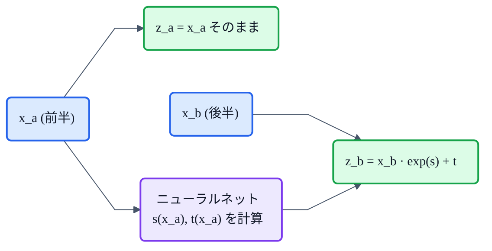

## この記事について

VITSは「**VAE + Flow + GAN**」の合わせ技だ、と[系譜の記事](https://zenn.dev/nnn112358/articles/tts-lineage-map-from-vits)で書きました。今回はその真ん中、**Flow(正規化フロー / Normalizing Flow)** の話です。

:::message
**用語の注意**:「VAE + Flow + GAN」はVITSを構成する3つの技術のこと。VITSの正式名称は **V**ariational **I**nference with adversarial learning for end-to-end **T**ext-to-**S**peech(頭文字は V・I・T・S)で、VAE+Flow+GAN の頭文字を並べたものではありません。
:::

Glow-TTSの心臓部であり、WaveGlow(flowボコーダ)の本体であり、VITSの事前分布を支える——TTSのあちこちで効いている生成モデルの一族。名前は難しそうですが、**「可逆な変換でノイズを目的の形に整形する」**というシンプルな発想です。猫でもわかるように、図と最小限の数式で説明します。🐈‍⬛

:::message
「Flow」には紛らわしい別物 **Flow Matching**(F5-TTS等)もあります。両者の違いは最後にはっきり整理します。この記事の主役は **正規化フロー(Normalizing Flow)** です。
:::

## 3行で言うと

- 正規化フロー = **可逆(invertible)な変換を積み重ねて、単純なガウス分布を複雑なデータ分布に変える**生成モデル。
- 可逆だから、**生成(ノイズ→データ)と尤度計算(データ→ノイズ)の両方**ができ、**厳密な尤度**が測れる。
- キモは**カップリング層**という「逆変換もヤコビアンも簡単」な魔法の部品。VITSはこれを外すと **MOSが1.52も落ちる**。

## 生成モデルの基本発想

まず大前提。画像でも音声でも、生成モデルがやりたいことは共通で、**「簡単な分布(ガウスノイズ)を、複雑なデータの分布に変換する」**ことです。

GAN・VAE・拡散モデル・フローは、**この「変換のやり方」が違うだけ**。フローの答えは——**可逆な関数を何段も重ねる**、です。

*正規化フローは、左の単純なガウス分布を、可逆な変換のステップ(カップリング層・1×1畳み込み…)で右の複雑な分布へと"流して"いく。点の色は最初の位置で塗っており、色の並びが崩れず滑らかなまま=変換が全単射(可逆)であることを表す。*

- **フロー(flow)** = データが変換の連鎖を「流れる」から。
- **正規化(normalizing)** = 逆から見ると、複雑なデータ分布を単純な(正規=ガウス)分布へ「均す」から。

## 2つの向き ― だから「可逆」でなければならない

フローは**双方向**に使います。

- **生成**: ガウスノイズ $z$ をサンプリング → $x = g(z)$ でデータを作る。
- **学習・尤度計算**: データ $x$ を $z = f(x)$ で逆にたどり、**その確率(尤度)を厳密に計算**して最大化する。

この両方を回すには、変換 $f$ が**可逆**で、**順・逆どちらも計算できる**必要があります。ここがフロー最大の制約であり、特徴です。

## 変数変換の公式(猫向け)

「データの尤度を厳密に計算できる」のがフローの売り。その根拠が **変数変換の公式** です。

$$
\log p_X(x) = \log p_Z\big(f(x)\big) + \log \left| \det \frac{\partial f}{\partial x} \right|
$$

猫向けに読み下すと:

- 第1項 = 「$x$ を逆にたどったノイズ $z=f(x)$ が、ガウス分布でどれくらいありそうか」。
- 第2項 = **ヤコビアン行列式**の対数。これは変換による**「空間の伸び縮み率」の補正**です。

分布を変形すると密度が濃くなったり薄くなったりするので、その**体積変化を帳消し**にしないと確率の総和が1になりません。この補正項があるおかげで、厳密な尤度が測れるわけです。

Glow-TTSもまさにこの式で「テキスト条件つきの厳密な対数尤度」を計算しています(論文 §Method: *"By using the change of variables, we can calculate the exact log-likelihood of the data"*)。

## 魔法の部品:カップリング層(coupling layer)

ここで困りごとが1つ。上の式には **ヤコビアン行列式** が出てきますが、一般の行列式は計算が重い($O(n^3)$)し、**逆変換が簡単な関数**を作るのも難しい。

これを一撃で解決するのが **カップリング層(affine coupling layer)** です。入力を半分に割ってこうします。

- 前半 $x_a$ は**そのまま素通し**($z_a = x_a$)。
- 後半 $x_b$ を、前半から作った $s, t$ で**アフィン変換**: $z_b = x_b \odot \exp(s(x_a)) + t(x_a)$。

これの何が天才的かというと:

1. **逆変換が四則演算だけ**: $x_b = (z_b - t(x_a)) / \exp(s(x_a))$。前半はそのままなので $s, t$ も再計算できる。
2. **ヤコビアンが三角行列** → 行列式 = 対角成分の積 = $\exp(\sum s(x_a))$。$\log\lvert\det\rvert = \sum s(x_a)$ で**一瞬**。
3. **$s, t$ は任意のニューラルネットでよい**(可逆である必要すらない!)。表現力はここで稼ぐ。

この仕組みが **NICE / RealNVP**(Dinh et al.)で確立され、**Glow**(Kingma & Dhariwal 2018)が **1×1 可逆畳み込み + ActNorm** を足して強化しました。冒頭の図の「カップリング層」「1×1 conv」がまさにこれです。

## 他の生成モデルとの違い

| モデル | サンプリング | 尤度 | ひとこと |
|---|---|---|---|
| **GAN** | 速い(1回) | 計算できない | 敵対的・不安定だが高品質(→[HiFi-GAN](https://zenn.dev/nnn112358/articles/hifigan-for-cats)) |
| **VAE** | 速い | 近似(ELBO) | 手軽だがぼやけやすい |
| **正規化フロー** | 速い(可逆) | **厳密** | 可逆制約・入出力が同次元・多層必要 |
| **拡散** | 遅い(多ステップ) | (変分) | 高品質だが反復が重い |

フローの強みは**厳密な尤度**と**安定した学習**。弱みは**「可逆」という縛り**で、1層あたりの表現力が限られるため層をたくさん積む必要があり、入力と出力の次元も同じに保たれます。

## TTSでのFlow

フローはTTSの3か所で活躍しています。

- **Glow-TTS**(音響モデル): デコーダが **ActNorm + 可逆1×1畳み込み + アフィンカップリング** のブロックの積み重ね。テキストから**並列に**メルを生成でき、順変換は学習とアライメント探索(MAS)に使う。
- **WaveGlow**(ボコーダ): メル → 波形をフローで生成。自己回帰WaveNetの遅さを、可逆変換の並列サンプリングで克服。
- **VITS**(単段E2E): 事前分布(prior)の上に **normalizing flow** を載せ、「単純な正規分布」を「柔軟な分布」に拡張。カップリング層は WaveNet 残差ブロックで構成し、**簡単のためヤコビアン行列式=1(体積保存)** に設計。撥音の揺れなど「一対多」を表現する確率的継続長予測器にも **neural spline flow** を使用。

そしてフローがどれだけ効くか。VITSの切除実験では——

> *"removing the normalizing flow in the prior encoder results in a 1.52 MOS decrease"*

**事前分布からフローを外すと MOS が 4.5 前後から 2.98 まで激減**します。「事前分布の柔軟さ」こそが品質を左右する、というわけです。VITSの "F" は飾りではありません。

## 【重要】正規化フロー vs Flow Matching

名前が似ていて**超・混同されがち**な両者を、はっきり分けておきます。

| | 正規化フロー(この記事) | Flow Matching |
|---|---|---|
| 変換 | **離散的**な可逆層の積み重ね | **連続時間**のODE(常微分方程式) |
| 学習 | 変数変換で厳密な尤度を最大化 | ベクトル場(速度場)を回帰(simulation-free) |
| 代表 | Glow-TTS, VITS, WaveGlow | Voicebox, Matcha-TTS, **F5-TTS** |

どちらも「ノイズをデータに変換する」点は同じですが、**中の仕組みはまったく別物**です。「flow」という単語だけで同一視しないよう注意(→系譜は[TTS 10系統マップ](https://zenn.dev/nnn112358/articles/tts-lineage-map-from-vits)参照)。厳密には Flow Matching は「連続正規化フロー(CNF)」を効率よく学習する手法、という位置づけです。

## 猫のまとめ 🐈‍⬛

- 正規化フロー = **可逆変換を積み重ねて、ガウスノイズを複雑なデータ分布に整形**する生成モデル。
- 可逆だから**生成と厳密な尤度計算の両方**ができる。カギは**変数変換の公式**と**ヤコビアン補正**。
- **カップリング層**が「逆変換もヤコビアンも簡単、$s,t$ は自由なNN」を実現する魔法の部品。
- TTSでは **Glow-TTS / WaveGlow / VITS** の核。VITSはフローを外すと **-1.52 MOS**。
- **Flow Matching(F5-TTS等)とは別物**。混同注意。

これで VITSの「VAE + **Flow** + GAN」の "F" が腑に落ちたはずです。

## 参考リンク

- [Glow: Generative Flow with Invertible 1×1 Convolutions (arXiv:1807.03039)](https://arxiv.org/abs/1807.03039)
- [RealNVP: Density estimation using Real NVP (arXiv:1605.08803)](https://arxiv.org/abs/1605.08803)
- [Glow-TTS (arXiv:2005.11129)](https://arxiv.org/abs/2005.11129) / [VITS (arXiv:2106.06103)](https://arxiv.org/abs/2106.06103) / [WaveGlow (arXiv:1811.00002)](https://arxiv.org/abs/1811.00002)
- 関連記事: [VITSから見るTTS 10系統マップ](https://zenn.dev/nnn112358/articles/tts-lineage-map-from-vits) / [猫でもわかるメルスペクトログラム](https://zenn.dev/nnn112358/articles/what-is-mel-spectrogram) / [猫でもわかるHiFi-GAN](https://zenn.dev/nnn112358/articles/hifigan-for-cats)

:::message
🐾 **猫でもわかるTTSシリーズ**(全21本) ― [目次](https://zenn.dev/nnn112358/articles/tts-for-cats-index) ／ 前: [VAE](https://zenn.dev/nnn112358/articles/vae-for-cats) ／ 次: [GAN](https://zenn.dev/nnn112358/articles/gan-for-cats)
:::
