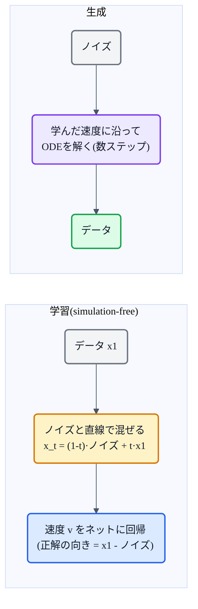

## この記事について

[猫でもわかるFlow(正規化フロー)](https://zenn.dev/nnn112358/articles/flow-for-cats)の最後で、名前が似ている別物 **Flow Matching** に触れました。この記事はその Flow Matching(2022, Lipman et al.)の話です。

Flow Matching は、拡散モデルの「良さ(高品質・安定学習)」を受け継ぎつつ、**もっと速く・まっすぐに**ノイズからデータへ変換する生成手法。Voicebox・Matcha-TTS・[F5-TTS](https://zenn.dev/nnn112358/articles/f5-tts-for-cats)・[CosyVoice/Qwen3-TTS](https://zenn.dev/nnn112358/articles/qwen-tts-for-cats) など、近年のTTSの主役級が続々採用しています。猫でもわかるように見ていきましょう。🎯

:::message
Flow Matching: Lipman et al., *"Flow Matching for Generative Modeling"* (2022, [arXiv:2210.02747](https://arxiv.org/abs/2210.02747))。本記事の仕様は論文本文で確認しています。図は matplotlib と mermaid で作成しました。**正規化フロー([→記事](https://zenn.dev/nnn112358/articles/flow-for-cats))とは別物**なので注意。
:::

## 3行で言うと

- Flow Matching = **ノイズからデータへ向かう「速度(ベクトル場)」をニューラルネットに学ばせ**、それをODEで積分して生成する手法。
- 拡散モデルと同じく「ノイズ→データ」だが、**シミュレーション不要で学習が速い**。特に **OT(最適輸送)経路なら道がまっすぐ** → 少ないステップで生成できる。
- TTSでは Voicebox / Matcha-TTS / F5-TTS / CosyVoice などが採用。拡散より速くて自然。

## 発想:「どっちへ動けばいいか」を教わる

生成モデルの目標は「単純なノイズを、複雑なデータに変換する」ことでした([→生成モデル三兄弟](https://zenn.dev/nnn112358/articles/vae-for-cats))。Flow Matching はこれを、**流れ(flow)** として捉えます。

ノイズの点を出発点に、少しずつ動かしてデータの点まで運ぶ。その各地点で **「次はどっちへ、どれくらいの速さで動くか」= ベクトル場(速度場)** が分かっていれば、あとはそれに沿って進む(＝常微分方程式ODEを解く)だけでデータにたどり着きます。Flow Matching は、**この速度場をニューラルネットに回帰(regression)で学ばせる**手法です。

## なぜ「まっすぐ」がうれしいのか

拡散モデルも「ノイズ→データ」を扱いますが、その道のりは**曲がりくねって**います。だから細かく刻んで何十ステップも進まないと、正しくたどり着けません(＝生成が遅い)。

Flow Matching、とくに **OT(Optimal Transport / 最適輸送)経路** を使うと、ノイズとデータを**まっすぐな直線**で結べます。道がまっすぐなら、**少ないステップ**でゴールに着く。これが「速い」の正体です。

*左: Flow Matching(OT経路)はノイズとデータを直線で結ぶ → 少ないステップで生成できる。右: 拡散の経路は曲がりくねる → 多くのステップが必要。論文いわく OT経路は "faster training, faster generation, and better performance"。*

## Conditional Flow Matching という工夫

「速度場を学ばせる」と言いましたが、**理想の速度場そのものは計算できません**(全データを混ぜた分布の速度が要るため)。

ここが Flow Matching の賢いところ。**「1個のデータ点に向かう速度場」なら簡単に書ける**ことを使い、そちらを学習ターゲットにします。これを **Conditional Flow Matching(CFM)** と呼び、論文は「**この簡単な版でも、本来学びたい速度場と勾配が一致する**」ことを示しました。[VAEの記事](https://zenn.dev/nnn112358/articles/vae-for-cats)や[SDP](https://zenn.dev/nnn112358/articles/sdp-for-cats)で出てきた「計算できないものを、計算できる代理で学ぶ」のと同じ発想です。

学習と生成の流れはこうです。

「学習中に生成(シミュレーション)を回さなくていい(simulation-free)」ので、拡散と同じくらい**安定でスケールする**学習ができます。

## 拡散モデルとの関係

Flow Matching は拡散モデルを**否定するものではなく、包み込む**枠組みです。論文は「拡散の経路も Flow Matching の特殊ケースとして表せる」「拡散経路に Flow Matching を使うと、従来のスコアマッチングより安定・高性能」と述べています。その上で、**拡散以外の経路(OTなど)も選べる**のが新しさ。

| | 拡散モデル | Flow Matching(OT) |
|---|---|---|
| ノイズ→データ | ○ | ○ |
| 経路 | 曲がりくねる | **まっすぐ** |
| 生成ステップ | 多い(遅い) | **少ない(速い)** |
| 学習 | スコアマッチング | 速度場の回帰(simulation-free) |

## TTSでの位置づけ

Flow Matching は、いまや**非自己回帰TTSの主力エンジン**です。

- **Voicebox**(Meta):flow matching + in-context の先駆。
- **Matcha-TTS**:音響モデルに OT-CFM を採用。
- **[F5-TTS](https://zenn.dev/nnn112358/articles/f5-tts-for-cats)**:DiT + flow matching で高品質 zero-shot。
- **[CosyVoice / Qwen3-TTS](https://zenn.dev/nnn112358/articles/qwen-tts-for-cats)**:コーデックトークン→波形の段に flow matching。

「拡散の品質を、より速く」という需要にぴたりとはまり、[系譜マップ](https://zenn.dev/nnn112358/articles/tts-lineage-map-from-vits)の Flow Matching 系統を形づくっています。

## 猫のまとめ 🎯

- Flow Matching = **ノイズ→データへの「速度(ベクトル場)」を学び、ODEで積分して生成**する手法。
- **OT(最適輸送)経路なら道がまっすぐ** → 少ないステップで速く生成。拡散の曲がった道より効率的。
- **Conditional Flow Matching**:計算できない速度場を、「1点に向かう簡単な速度場」で代理学習(勾配は一致)。simulation-freeで安定。
- 拡散を**包含**する枠組み(拡散経路も特殊例)。TTSでは Voicebox / Matcha / F5-TTS / CosyVoice が採用。
- **正規化フロー(可逆層の積み重ね)とは別物**。名前に注意。

「どっちへ動けばいいか」を教わってまっすぐ進む——このシンプルな発想が、速くて高品質な現代TTSを支えています。

## 参考リンク

- [Flow Matching (arXiv:2210.02747)](https://arxiv.org/abs/2210.02747)
- 関連記事: [猫でもわかるFlow(正規化フロー)](https://zenn.dev/nnn112358/articles/flow-for-cats) / [猫でもわかるF5-TTS](https://zenn.dev/nnn112358/articles/f5-tts-for-cats) / [猫でもわかるVAE](https://zenn.dev/nnn112358/articles/vae-for-cats) / [VITSから見るTTS 10系統マップ](https://zenn.dev/nnn112358/articles/tts-lineage-map-from-vits)

:::message
🐾 **猫でもわかるTTSシリーズ**(全28本) ― [目次](https://zenn.dev/nnn112358/articles/tts-for-cats-index) ／ 前: [Flow](https://zenn.dev/nnn112358/articles/flow-for-cats) ／ 次: [F5-TTS](https://zenn.dev/nnn112358/articles/f5-tts-for-cats)
:::
