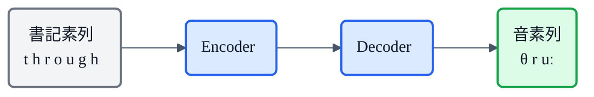

## この記事について

これまでの記事で、TTS(音声合成)の後半——[メルスペクトログラム](https://zenn.dev/nnn112358/articles/what-is-mel-spectrogram)と、それを音にする[HiFi-GAN](https://zenn.dev/nnn112358/articles/hifigan-for-cats)——を見てきました。

今回はその**一番手前**、テキストが最初に通る関門 **G2P(Grapheme-to-Phoneme)** の話です。日本語で言うと「**書記素から音素への変換**」、要するに **「文字」を「発音」に変える処理**。人間が「read」を見て文脈で読み分けるのと同じことを、機械にやらせます。

地味ですが、ここを間違えると**どんなに高性能なモデルでも「読み間違い」で台無し**になる、TTSの縁の下の力持ちです。猫でもわかるように説明します。🐈

## 3行で言うと

- G2P = **文字(書記素)→ 発音(音素)** への変換。TTSの一番最初の処理。
- 綴りと発音は一致しない(英語の `read`、日本語の漢字…)から、**辞書・ルール・ニューラル**で解決する。
- 特に日本語は**分かち書きが無い＋漢字の多重読み＋アクセント**で難易度が高く、`pyopenjtalk` が定番。

## 書記素と音素ってなに?

まず用語だけ。

- **書記素(grapheme)** = 書き言葉の最小単位。要するに **文字**(a, b, c, あ, 今…)。
- **音素(phoneme)** = 意味を区別する **音の最小単位**。英語の `cat` なら /k/ /æ/ /t/ の3つ。

そして厄介なことに、**書記素の数と音素の数は一致しません**し、**同じ文字が違う音になる**こともあります。


*G2Pは「文字の列」を「音の列」に対応づける処理。`cat`は3文字→3音だが、`through`は7文字→3音。しかも `through`と`though`は同じ "th"・"ough" を持つのに、それぞれ /θ/ vs /ð/、/uː/ vs /oʊ/ と別の音になる。*

この図が、G2Pが単純な「1文字＝1音」の置き換えでは済まない理由を物語っています。

## なぜG2Pが必要なのか ― 綴りは発音を裏切る

英語の悪名高い例が **"ough"** です。まったく同じ4文字なのに、単語によって読みがバラバラ。

| 単語 | "ough" の音 | 近い母音 |
|---|---|---|
| thr**ough** | /uː/ | boot の oo |
| th**ough** | /oʊ/ | go の o |
| r**ough** | /ʌf/ | cup の u + f |
| c**ough** | /ɒf/ | hot の o + f |
| b**ough** | /aʊ/ | now の ow |

ルールで書こうとすると例外だらけで破綻します。だから**辞書に頼る**必要が出てくるわけです。

## TTSパイプラインでのG2Pの位置

G2Pは、音響モデルよりさらに前、フロントエンド(テキスト処理)の中核です。


- **テキスト正規化(normalization)**: `3` → 「さん」、`$5` → 「five dollars」、記号・日付・数字を「読める形」に開く前処理。G2Pとセットで語られます。
- **G2P**: 開かれたテキストを音素列へ。
- (日本語では)**アクセント/韻律**の情報もここで付与。

## G2Pの3つのやり方

### 1. 辞書引き(lexicon lookup)

あらかじめ「単語 → 発音」の巨大な辞書を用意して引くだけ。英語では **CMUdict**(約13万語、[ARPABET](https://ja.wikipedia.org/wiki/ARPABET)表記)が有名です。

```
CAT      K AE T
THROUGH  TH R UW
```

**速くて正確**ですが、辞書に無い単語(新語・固有名詞・タイポ)= **OOV(Out-Of-Vocabulary)** に弱いのが弱点。

### 2. ルールベース(letter-to-sound rules)

「この文字の並びはこう読む」という規則を書く方法。**スペイン語**のように綴りと発音がほぼ規則的な言語では有効ですが、**英語のような例外だらけの言語では破綻**します(前述の "ough")。

### 3. ニューラル/統計(seq2seq)

書記素の列を音素の列へ「**翻訳**」する方法。機械翻訳と同じ encoder-decoder を使います。



**未知語(OOV)にも「それらしい発音」を推測できる**のが強み。実用ツールの多くは**ハイブリッド**で、たとえば英語の [`g2p_en`](https://github.com/Kyubyong/g2p) は「**辞書(CMUdict)で引ける単語は辞書 → 同綴異音は品詞で判定 → 未知語はニューラルseq2seq**」という三段構えです。

## 最大の壁:同綴異音(homograph)

辞書があっても解決しないのが、**綴りは同じで読みが違う**単語。文脈を見ないと決められません。

| 単語 | 発音A | 発音B |
|---|---|---|
| read | /riːd/(現在) | /rɛd/(過去) |
| lead | /liːd/(導く) | /lɛd/(鉛) |
| live | /lɪv/(動詞) | /laɪv/(形容詞) |
| record | /ˈrekɔːrd/(名詞) | /rɪˈkɔːrd/(動詞) |
| tear | /tɪər/(涙) | /teər/(裂く) |

`g2p_en` はこれを**品詞(POS)タグ**で解決します。"I **read** a book yesterday"(過去)なら /rɛd/、"I **read** every day"(現在)なら /riːd/、という具合。文脈依存なので、辞書だけでは足りず言語処理が要るわけです。

## 日本語のG2Pは特に難しい

英語以上に大変なのが日本語。理由は主に3つ。

**① 分かち書きがない** → まず単語に区切る **形態素解析(MeCab等)** が必要。

**② 漢字の多重読み** → 文脈で読みが変わる同綴異音の宝庫。

| 表記 | 読み例 |
|---|---|
| 今日 | きょう / こんにち |
| 行った | いった / おこなった |
| 一日 | ついたち / いちにち |
| 私 | わたし / わたくし |

**③ 数詞＋助数詞の連濁・音便** → 数字と単位の組み合わせで読みが変化。

| 表記 | 読み |
|---|---|
| 一本 | いっぽん |
| 二本 | にほん |
| 三本 | さんぼん |
| 六本 | ろっぽん |

こうした処理をまとめて面倒みてくれるのが、[前々回の記事](https://zenn.dev/nnn112358/articles/first-openjtalk)で紹介した **Open JTalk / `pyopenjtalk`** です。

```python
import pyopenjtalk

print(pyopenjtalk.g2p("今日はいい天気ですね"))
# k y o o w a i i t e N k i d e s U n e
```

`今日` を「きょう(ky o o)」と正しく読み、`ん` は撥音 `N`、`です` の `u` は無声化して `U` になる——といった日本語特有の処理まで込みでやってくれます。VITS などの日本語TTSでも、この部分に `pyopenjtalk` が広く使われています。

## 音素の表し方(記法)

出力の「音素」にはいくつか流儀があります。

| 記法 | 例(cat) | 特徴 |
|---|---|---|
| **IPA**(国際音声記号) | /kæt/ | 言語非依存・世界共通。多言語ツール向き |
| **ARPABET** | K AE T | ASCIIで書ける英語用。CMUdictが採用 |
| **日本語音素**(カナ/ローマ字系) | k y o o … | pyopenjtalk等。アクセント情報と併用 |

## コードで試す

### 英語:phonemizer(IPA・多言語)

[`phonemizer`](https://github.com/bootphon/phonemizer)は `espeak-ng` をバックエンドに、100以上の言語をIPAへ変換できます。

```python
from phonemizer import phonemize

print(phonemize("through though", language="en-us", backend="espeak"))
# θɹuː ðoʊ
```

### 英語:g2p_en(ARPABET・同綴異音対応)

```python
from g2p_en import G2p
g2p = G2p()

print(g2p("read"))     # ['R', 'IY1', 'D'] など(品詞で読み分け)
```

### 日本語:pyopenjtalk

```python
import pyopenjtalk
print(pyopenjtalk.g2p("水を3本ください"))   # 数詞・助数詞も読み下す
```

## 実は「G2Pを使わない」流れも

近年は、**G2Pをあえて省いて、文字(バイト)を直接モデルに入れる**アプローチも増えています。BPEなどで生テキストをトークン化し、発音は大量データから暗黙に学習させる方式です。

たとえば **IndexTTS** の論文は、こう明言しています(前回の[系譜記事](https://zenn.dev/nnn112358/articles/tts-lineage-map-from-vits)で確認したもの)。

> *"We remove the front-end G2P module and use raw text as input, along with a BPE-based text tokenizer."*
> (フロントエンドのG2Pモジュールを取り除き、BPEベースのトークナイザで生テキストを直接入力とする)

トレードオフはこうです。

- **G2Pあり**: 読みが正確・頑健。ただし**言語ごとに辞書やルールが必要**で、同綴異音・未知語で失敗もする。
- **G2Pなし(文字直接)**: 実装がシンプルで**多言語に拡張しやすい**。ただし**大量の学習データが必要**で、レアな読みを外しやすい。

日本語のように読みが複雑な言語では、まだ **G2P(pyopenjtalk等)を前段に置くのが主流**です。

## 猫のまとめ 🐈

- G2P = **文字(書記素)→ 発音(音素)** への変換。TTSの入口。
- 綴りは発音を裏切る(`ough`、同綴異音)ので、**辞書 + ルール + ニューラル**を組み合わせて解く。
- 英語は `phonemizer` / `g2p_en`、**日本語は `pyopenjtalk`** が定番。
- 日本語は「分かち書き無し・漢字の多重読み・数詞の音便・アクセント」で特に手強い。
- 最近は**G2Pを省いて生テキスト直接**のモデルも増えているが、日本語ではまだ前段G2Pが主流。

これで「G2P(入口)→ 音響モデル → メルスペクトログラム → HiFi-GAN(出口)」というTTSの全工程が、一通りつながりました。

## 参考リンク

- [CMUdict(英語発音辞書)](https://github.com/cmusphinx/cmudict)
- [g2p_en(英語G2P・同綴異音対応)](https://github.com/Kyubyong/g2p)
- [phonemizer(多言語・IPA)](https://github.com/bootphon/phonemizer) / バックエンドの [espeak-ng](https://github.com/espeak-ng/espeak-ng)
- [pyopenjtalk(日本語G2P)](https://github.com/r9y9/pyopenjtalk)
- 関連記事: [はじめてのOpenJTalk](https://zenn.dev/nnn112358/articles/first-openjtalk) / [猫でもわかるメルスペクトログラム](https://zenn.dev/nnn112358/articles/what-is-mel-spectrogram) / [猫でもわかるHiFi-GAN](https://zenn.dev/nnn112358/articles/hifigan-for-cats) / [VITSから見るTTS 10系統マップ](https://zenn.dev/nnn112358/articles/tts-lineage-map-from-vits)

:::message
🐾 **猫でもわかるTTSシリーズ**(全28本) ― [目次](https://zenn.dev/nnn112358/articles/tts-for-cats-index) ／ 次: [音響モデル](https://zenn.dev/nnn112358/articles/acoustic-model-for-cats)
:::
