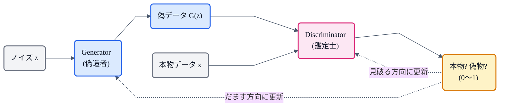
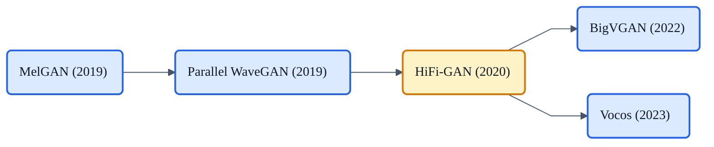

## この記事について

[VAE(V)](https://zenn.dev/nnn112358/articles/vae-for-cats)、[Flow(F)](https://zenn.dev/nnn112358/articles/flow-for-cats)ときたので、いよいよVITSを構成する「**VAE + Flow + GAN**」の最後のひとつ、**GAN(敵対的生成ネットワーク / Generative Adversarial Network)** です。

:::message
**用語の注意**:「VAE + Flow + GAN」はVITSを構成する3つの技術のこと。VITSの正式名称は **V**ariational **I**nference with adversarial learning for end-to-end **T**ext-to-**S**peech(頭文字は V・I・T・S)で、VAE+Flow+GAN の頭文字を並べたものではありません。
:::

[猫でもわかるHiFi-GAN](https://zenn.dev/nnn112358/articles/hifigan-for-cats)で「偽造者と鑑定士」の比喩を使いましたが、あれはGANの一応用でした。今回は**GANという仕組みそのもの**を、猫でもわかるように解説します。TTSの音づくりでGANがなぜ効くのかも、最後にちゃんと回収します。😼

:::message
GANは生成モデル三兄弟(VAE・Flow・GAN)の最後の一角。原論文は Goodfellow et al. (2014, [arXiv:1406.2661](https://arxiv.org/abs/1406.2661))。TTSでの利用は HiFi-GAN / VITS の論文で確認しています。図は numpy + matplotlib で自作しました。
:::

## 3行で言うと

- GAN = **偽造者(Generator)と鑑定士(Discriminator)を競わせて**、本物そっくりのデータを作る生成モデル。
- 尤度を計算せず、**「本物と見分けがつくか」だけを頼りに**学習する。だから**尖鋭で高品質**、でも**不安定**(モード崩壊など)。
- TTSでは**ボコーダの主戦場**。VITSの "G" もこれ(波形への敵対的学習)。

## 基本の発想:偽造者 vs 鑑定士

GANは2つのネットワークを競わせます。

- **Generator(生成器)= 偽造者**: ノイズ $z$ から偽データ $G(z)$ を作る。
- **Discriminator(識別器)= 鑑定士**: 与えられたデータが**本物か偽物か**を見破る。

偽造者は鑑定士を騙そうと腕を上げ、鑑定士は見破ろうと目を鍛える。この**いたちごっこ**の果てに、偽造者は本物と見分けのつかないデータを作れるようになります。

## ミニマックスゲーム(数式)

この「競争」を1つの式で書くと、こうなります。

$$
\min_{G}\ \max_{D}\ \ \mathbb{E}_{x \sim p_{\text{data}}}\big[\log D(x)\big] + \mathbb{E}_{z \sim p_z}\big[\log\big(1 - D(G(z))\big)\big]
$$

猫向けに読むと:

- **鑑定士 $D$** は式を**最大化**したい:本物 $x$ には $D(x) \to 1$、偽物 $G(z)$ には $D(G(z)) \to 0$ と当てたい。
- **偽造者 $G$** は式を**最小化**したい:$D(G(z)) \to 1$ にして鑑定士を騙したい。

尤度(データの確率)を一切計算しないのがポイント。**「鑑定士を騙せるか」という間接的な信号だけ**で学習します。ここがVAEやFlowと根本的に違うところです。

:::message
実際には、学習初期に鑑定士が強すぎると偽造者への勾配が消えてしまう問題があり、$G$ は $\log(1 - D(G(z)))$ を最小化する代わりに $\log D(G(z))$ を**最大化**する「非飽和損失」で訓練するのが定番です。
:::

## 学習で「分布」を覚えていく

学習は、鑑定士の更新(本物→1, 偽物→0)と偽造者の更新(騙す)を**交互に**繰り返します。うまくいくと、偽造者が生成する分布が**本物のデータ分布に一致**していきます。

*8個の山(モード)に分かれた本物データ(灰)を、生成器の出力(青)が学んでいく様子。左: 最初はノイズの塊。中: 広がり始めるが一部のモードを取りこぼす。右: 収束すると全モードを覆い、本物の分布に一致する。*

## GANが難しい理由

GANは強力ですが、**訓練が不安定**なことで有名です。代表的な失敗が3つ。

- **モード崩壊(mode collapse)**: 偽造者が「鑑定士を騙せる一部のパターン」ばかり量産し、**多様性を失う**(上図・中央のように一部のモードしか出せない状態が固定化する)。
- **勾配消失**: 鑑定士が強くなりすぎると、偽造者に有効な学習信号が来ない。
- **バランスの繊細さ**: 偽造者と鑑定士の強さが釣り合わないと崩壊する。しかも**尤度で進捗を測れない**ので、良し悪しの判断も難しい。

これらを緩和するために、たくさんの改良が生まれました。

## 改良の系譜(TTSにも効くもの)

| 手法 | 何をした |
|---|---|
| **DCGAN** (2015) | 畳み込みアーキテクチャで安定化 |
| **LSGAN** (2017) | 損失を最小二乗に。勾配が消えにくい(**HiFi-GANが採用**) |
| **WGAN / WGAN-GP** | Wasserstein距離(+勾配ペナルティ)で安定化 |
| **Spectral Norm** | 識別器の重みを正規化して安定化(HiFi-GANのMSDで使用) |
| **Feature Matching** | 識別器の中間特徴を合わせる補助損失(HiFi-GAN/VITSで使用) |
| **Conditional GAN** | ラベル等で条件づけて生成を制御 |

## 他の生成モデルとの違い(三兄弟の締め)

| モデル | サンプリング | 尤度 | 品質・安定性 |
|---|---|---|---|
| **GAN** | 速い | **計算できない** | 尖鋭・高品質だが**不安定** |
| **VAE** | 速い | 近似(ELBO) | 安定だが**ぼやけやすい**(→[VAE](https://zenn.dev/nnn112358/articles/vae-for-cats)) |
| **正規化フロー** | 速い(可逆) | **厳密** | 可逆制約・同次元(→[Flow](https://zenn.dev/nnn112358/articles/flow-for-cats)) |
| **拡散** | 遅い(多ステップ) | (変分) | 高品質だが反復が重い |

GANの「尖鋭さ」とVAEの「安定性」は**相補的**。だから両者を組み合わせるのは自然な発想で——それがVITSです。

## TTSでのGAN ― ボコーダの主戦場

なぜTTSでGANが重宝されるのか。理由は**音の"シャープさ"**です。

L1/L2の再構成損失**だけ**で波形やスペクトログラムを学習すると、モデルは「平均的な安全な出力」に寄り、**こもった・ぼやけた・ブザーのような音**になりがち。そこに**敵対的損失**を足すと、鑑定士が「本物らしくない細部」を容赦なく指摘するので、生成器は**本物らしい微細構造や位相**を作り込むよう強制されます。

この発想でボコーダが次々と生まれました。

- **ボコーダ**: MelGAN → Parallel WaveGAN → **HiFi-GAN** → BigVGAN / Vocos。いずれもGANで波形をシャープに(→[HiFi-GAN記事](https://zenn.dev/nnn112358/articles/hifigan-for-cats)。HiFi-GANのMPD/MSDは"複数の鑑定士"の好例)。
- **VITS**: 波形ドメインに**敵対的学習**を適用。総損失の $L_{adv}(G) + L_{fm}(G)$ がまさにGAN部分で、これが「**VAE + Flow + GAN**」の **G**。
- **StyleTTS 2**: 音声言語モデル(WavLM)を識別器に使う敵対的学習で人間並みの品質を達成。

つまりGANは、**VAEやFlowが作った"構造"に、最後の"生々しさ"を与える**役回り。VITSではこの3つが1つのモデルに同居しているわけです。

## 猫のまとめ 😼

- GAN = **偽造者(G)と鑑定士(D)のいたちごっこ**で本物そっくりを作る生成モデル。
- **ミニマックスゲーム**を解く。尤度を使わず「騙せるか」だけで学習 → 尖鋭・高品質だが**不安定**(モード崩壊・勾配消失)。
- LSGAN・WGAN・feature matching 等の改良で安定化。多くは**TTSボコーダにも流用**。
- TTSでは**ボコーダの主役**(MelGAN→HiFi-GAN→BigVGAN/Vocos)。**再構成損失だけの"こもった音"を、敵対的損失がシャープにする**。
- **GAN** は VITS では波形への敵対的学習として働く。VAE + Flow + GAN が1つのモデルに合流する。

これで **VITSの3本柱(VAE・Flow・GAN)** が全部そろいました。次はいよいよ、この3つを1つに束ねる本体「VITS」そのものが書けます。

## 参考リンク

- [GAN原論文: Generative Adversarial Networks (arXiv:1406.2661)](https://arxiv.org/abs/1406.2661)
- [DCGAN (arXiv:1511.06434)](https://arxiv.org/abs/1511.06434) / [LSGAN (arXiv:1611.04076)](https://arxiv.org/abs/1611.04076) / [WGAN (arXiv:1701.07875)](https://arxiv.org/abs/1701.07875)
- [HiFi-GAN (arXiv:2010.05646)](https://arxiv.org/abs/2010.05646) / [VITS (arXiv:2106.06103)](https://arxiv.org/abs/2106.06103)
- 関連記事: [猫でもわかるVAE](https://zenn.dev/nnn112358/articles/vae-for-cats) / [猫でもわかるFlow](https://zenn.dev/nnn112358/articles/flow-for-cats) / [猫でもわかるHiFi-GAN](https://zenn.dev/nnn112358/articles/hifigan-for-cats) / [VITSから見るTTS 10系統マップ](https://zenn.dev/nnn112358/articles/tts-lineage-map-from-vits)

:::message
🐾 **猫でもわかるTTSシリーズ**(全21本) ― [目次](https://zenn.dev/nnn112358/articles/tts-for-cats-index) ／ 前: [Flow](https://zenn.dev/nnn112358/articles/flow-for-cats) ／ 次: [MAS](https://zenn.dev/nnn112358/articles/mas-for-cats)
:::
