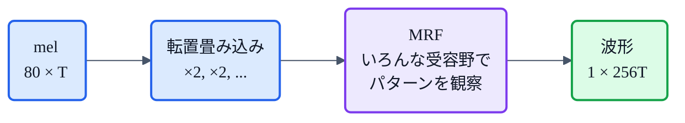
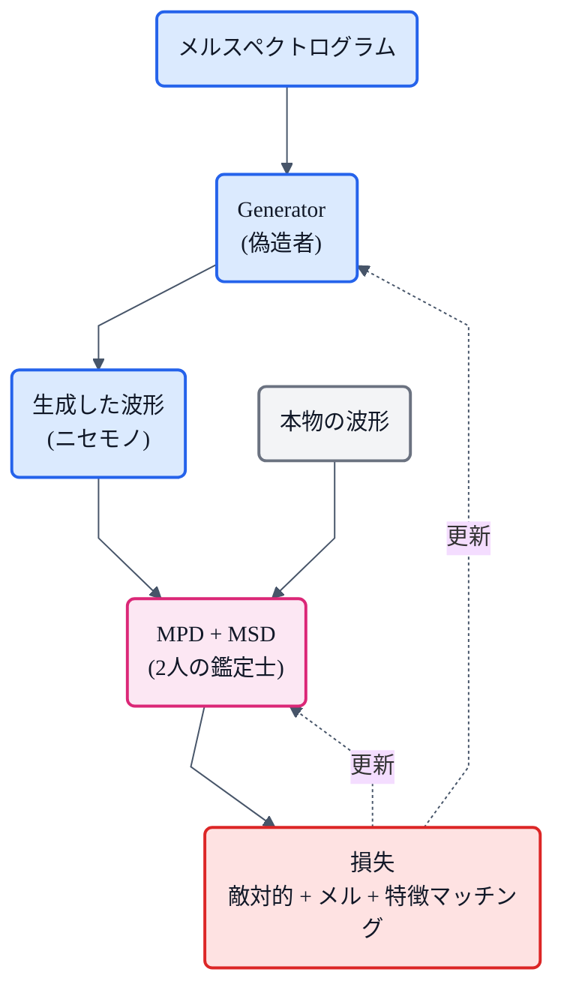

## この記事について

前回の記事で、TTS(音声合成)の中間表現である[メルスペクトログラム](https://zenn.dev/nnn112358/articles/what-is-mel-spectrogram)を説明しました。音響モデルがテキストからメルスペクトログラムを作り、**ボコーダ**がそれを波形(音)に変換する——という2段構成でしたね。

この記事の主役 **HiFi-GAN** は、その後半「**メルスペクトログラム → 波形**」を担当するボコーダの決定版です。VITS のデコーダにも使われ、BigVGAN・Vocos の親でもある、TTS界の超重要部品。

でも中身は「**偽造者と鑑定士のいたちごっこ**」というシンプルな発想。猫でもわかるように、図を交えて説明します。🐱

:::message
元論文: Kong, Kim, Bae, *"HiFi-GAN: Generative Adversarial Networks for Efficient and High Fidelity Speech Synthesis"* (NeurIPS 2020, [arXiv:2010.05646](https://arxiv.org/abs/2010.05646))。この記事の数値・仕様は論文本文で確認しています。図は合成信号から numpy + matplotlib で自作しました。
:::

## 3行で言うと

- HiFi-GAN = **メルスペクトログラムから波形を作る GAN ボコーダ**。速くて高品質。
- キモは **「音声はいろんな周期の正弦波の集まり」→ 周期パターンを捉える2種類の鑑定士(MPD / MSD)**。
- 人間とほぼ聴き分けられない品質(MOS差 0.09)を、GPUで**実時間の167倍**の速さで合成できる。

## HiFi-GANの立ち位置

もう一度おさらい。TTSは多くの場合こうなっています。


HiFi-GAN が解こうとしている問題はただ一つ、**「80次元しかないスカスカのメルスペクトログラムから、1秒あたり2万個以上のサンプルを持つ生々しい波形を、どうやってでっち上げるか」** です。

メルスペクトログラムは作られる過程で**位相情報を捨てて**います(前記事参照)。だから単純な逆変換では戻せず、「それらしい波形」を**生成**する必要がある。ここで GAN の出番です。

## GANって何だっけ(30秒で)

GAN(敵対的生成ネットワーク)は、2つのネットワークを競わせる仕組みです。

- **Generator(生成器)= 偽造者**: ニセモノ(ここでは波形)を作る。
- **Discriminator(識別器)= 鑑定士**: 本物かニセモノかを見破る。

偽造者は鑑定士を騙そうと腕を上げ、鑑定士は見破ろうと目を鍛える。この**いたちごっこ**の果てに、偽造者は「本物と見分けがつかない」波形を作れるようになる——というわけです。

## HiFi-GANの登場人物:偽造者1人＋鑑定士2人

HiFi-GAN は、**1人の Generator(偽造者)と、2人の Discriminator(鑑定士)** で構成されます。

- **Generator** … メルスペクトログラム → 波形 を作る。
- **MPD**(Multi-Period Discriminator)… 波形を「**周期**」の目で鑑定する鑑定士。
- **MSD**(Multi-Scale Discriminator)… 波形を「**ズーム**」を変えて鑑定する鑑定士。

なぜ鑑定士が2人もいるのか? そこにHiFi-GANの一番のアイデアが詰まっています。

## Generator(偽造者)の仕事:アップサンプリング

Generator は**全層が畳み込み**のネットワークです。入力の小さなメルスペクトログラム(80 × フレーム数)を、**転置畳み込み(transposed convolution)** で少しずつ引き伸ばし、最終的に波形の長さ(× 256 倍など)まで拡大します。



各アップサンプリングの後には **MRF(Multi-Receptive Field Fusion)** というモジュールが入ります。これは**カーネルサイズや膨張率(dilation)の違う複数の残差ブロック(ResBlock)の出力を足し合わせる**もの。「短い模様も長い模様も、いろんな長さのパターンを並行して観察する」ための工夫です。

:::message
ちなみに Generator に**ノイズは入力しません**。よくある画像GANと違い、「メルスペクトログラムという設計図」があるので、乱数から作る必要がないんですね。
:::

## 鑑定士1:MPD ― 波形を「折りたたんで」周期を見る

HiFi-GANの核心的な発想はこれです。

> **音声は、いろいろな周期を持つ正弦波の集まりである。だから周期パターンをモデル化することが品質の鍵。**

そこで **MPD(Multi-Period Discriminator)** は、面白いトリックを使います。**1次元の波形を、周期 $p$ ごとに2次元に折りたたむ**のです。

長さ $T$ の波形を、高さ $T/p$・幅 $p$ の2次元データに `reshape` する。そして幅方向のカーネルを1に制限した2次元畳み込みをかける。こうすると、**$p$ サンプルおきに並ぶ「同じ位相の点」だけをまとめて処理**できます。


*上: 周期約75サンプルの音声波形(1次元)。下: 同じ波形を幅 p = 2, 3, 5 で2次元画像に折りたたんだもの。周期構造が、pごとに異なる間隔の横縞として浮かび上がる。この2D画像を各サブ鑑定士が見る。*

MPD は $p \in \{2, 3, 5, 7, 11\}$ の **5人のサブ鑑定士**からなります。周期を **素数**にしているのは、**重複をできるだけ避けて、なるべく多くの種類の周期を捉えるため**。実際、論文の実験では $p=[2,4,8,16,32]$ のように2のべき乗にすると品質が **0.20 MOS 悪化**しました。素数、大事。

## 鑑定士2:MSD ― 波形を「ズームアウト」して見る

MPD は「$p$ サンプルおきの飛び飛びの点」しか見ないので、**連続した長いつながり**を見る係も必要です。それが **MSD(Multi-Scale Discriminator)**(MelGAN 由来)。

MSD は同じ波形を **3つのスケール**で見る3人のサブ鑑定士です。

- **生の波形**
- **×2 平均プーリング**した波形
- **×4 平均プーリング**した波形


*同じ波形を3つのズーム率で見る。ダウンサンプリング(平均プーリング)で細かいノイズが均され、大きな形が見えてくる。MPD の「飛び飛び」に対し、MSD は「連続した流れ」を捉える。*

MPD が波形の**細かい周期**の担当、MSD が**大きな流れ**の担当。役割分担で死角をなくしているわけです。

## 3つの損失(採点基準)

偽造者はどう鍛えられるのか? HiFi-GAN は3つの損失を組み合わせます。

| 損失 | 役割 | 重み |
|---|---|---|
| **敵対的損失** | 鑑定士を騙せたか(LS-GAN=最小二乗) | 1 |
| **メルスペクトログラム損失** | 生成波形のメルが、入力メルとどれだけ一致するか(L1距離) | λ = 45 |
| **特徴マッチング損失** | 鑑定士の中間特徴が、本物と偽物でどれだけ近いか(L1距離) | λ = 2 |

特に効いているのが **メルスペクトログラム損失**。生成した波形をもう一度メルスペクトログラムに変換し、**入力メルとのズレ(L1)を罰する**。これで「入力の設計図に忠実な波形」が出るよう強制され、学習も安定します。重み 45 という大きさからも重要度が伝わります。

## 学習ループ全体

まとめると、こういう「いたちごっこ」です。



- **鑑定士**は「本物→1、ニセモノ→0」と当てられるよう学習。
- **偽造者**は「ニセモノを1と誤判定させる」よう＋「メルを一致させる」よう学習。

## V1 / V2 / V3 ― 品質と速度のトレードオフ

HiFi-GAN には、**鑑定士は同じまま、Generator のサイズだけ変えた**3種類があります。

| 版 | パラメータ | 特徴 |
|---|---|---|
| **V1** | 13.92M | **最高品質**。人間の音声とのMOS差わずか **0.09**(ほぼ聴き分け不可)。V100 で**実時間の167.9倍**速い |
| **V2** | 0.92M | 小型でも高品質(MOS 4.23)。メモリと速度を大幅節約 |
| **V3** | 小 | 最速。**CPUで実時間の13.4倍**、V100で**1,186倍**。オンデバイス向け |

「品質最優先なら V1、組込み・CPUなら V3」という選び分けができ、しかも**鑑定士を共通化できる**のが設計上の強みです。

## どれくらい効いているのか(アブレーション)

論文の切除実験(V3ベース)で、各パーツの効き目が分かります。

| 構成 | MOS | 一言 |
|---|---|---|
| ベースライン | 4.0前後 | — |
| **MPDを外す** | **2.28** | 💥 激減。MPDが最重要 |
| MSDを外す | 3.74 | そこそこ低下 |
| MRFを外す | 3.92 | 少し低下 |
| メル損失を外す | 3.25 | 明確に低下 |

**MPDを外した瞬間に品質が崩壊**するのが印象的。「周期を2Dに折りたたんで見る」という一見トリッキーなアイデアが、HiFi-GANの品質を支えているわけです。

## 使ってみる(推論)

学習済みモデルを使えば、メルスペクトログラムから波形を得るのは一瞬です。公式実装 [jik876/hifi-gan](https://github.com/jik876/hifi-gan) のAPIだとこんな感じ。

```python
import torch
from models import Generator          # 公式リポジトリの定義

generator = Generator(h).to(device)   # h は設定(V1/V2/V3)
state = torch.load("g_02500000", map_location=device)
generator.load_state_dict(state["generator"])
generator.eval()
generator.remove_weight_norm()        # 推論時は weight norm を畳み込む

# mel: (1, 80, フレーム数) — 音響モデルの出力や librosa で用意
with torch.no_grad():
    audio = generator(mel)            # → (1, 1, フレーム数 × 256) の波形
```

入力メルは **80バンド、FFT=1024・窓=1024・ホップ=256** で作るのが標準設定です(学習時と揃えないと鳴りません。前記事の注意点そのままですね)。

## 猫のまとめ 🐱

- HiFi-GAN は **メルスペクトログラム → 波形** を作る **GANボコーダ**。
- **偽造者(Generator)1人 + 鑑定士(MPD・MSD)2人**のいたちごっこで学習。
- 一番のアイデアは **MPD**:「音声はいろんな周期の集まり」だから、**波形を周期ごとに2Dへ折りたたんで**周期パターンを鑑定する(素数 $\{2,3,5,7,11\}$)。
- **メルスペクトログラム損失**で「設計図に忠実な音」に。人間並みの品質を**実時間の百倍超**の速度で。

## 系譜での位置づけ

HiFi-GAN は、その後のボコーダの標準になりました。

- **BigVGAN**(NVIDIA)… HiFi-GANを大規模化・汎用化
- **Vocos**… 時間領域生成をやめ、iSTFTで一発生成(→[前記事の系譜マップ参照](https://zenn.dev/nnn112358/articles/tts-lineage-map-from-vits))
- **VITS** … デコーダにHiFi-GAN V1のGeneratorをそのまま採用

「メルスペクトログラム(前々回)→ HiFi-GAN(今回)→ TTS全体の系譜(前回)」とつながります。あわせてどうぞ。

## 参考リンク

- 論文: [HiFi-GAN (arXiv:2010.05646)](https://arxiv.org/abs/2010.05646)
- 公式実装: [jik876/hifi-gan](https://github.com/jik876/hifi-gan)
- 関連記事: [猫でもわかるメルスペクトログラム](https://zenn.dev/nnn112358/articles/what-is-mel-spectrogram) / [VITSから見るTTS 10系統マップ](https://zenn.dev/nnn112358/articles/tts-lineage-map-from-vits)

:::message
🐾 **猫でもわかるTTSシリーズ**(全21本) ― [目次](https://zenn.dev/nnn112358/articles/tts-for-cats-index) ／ 前: [WaveNet](https://zenn.dev/nnn112358/articles/wavenet-for-cats) ／ 次: [iSTFTNet](https://zenn.dev/nnn112358/articles/istftnet-for-cats)
:::
