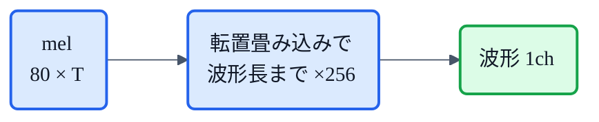
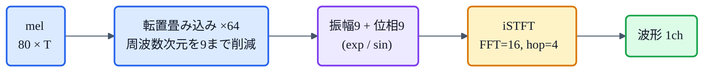
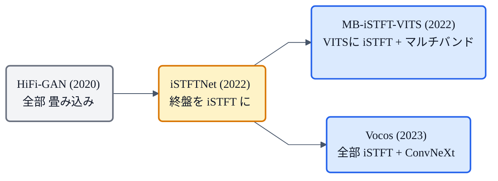

## この記事について

前回の[猫でもわかるHiFi-GAN](https://zenn.dev/nnn112358/articles/hifigan-for-cats)で、メルスペクトログラムを波形に変えるGANボコーダを見ました。今回はその**軽量・高速版**、**iSTFTNet** の話です。

アイデアは一言でいうと、**「HiFi-GANが最後まで頑張って波形を作っている終盤の部分を、枯れた信号処理である iSTFT(逆短時間フーリエ変換)に丸投げする」**。これで品質をほぼ保ったまま、速く・小さくなります。後で出てくる Vocos や MB-iSTFT-VITS の**布石**でもある、重要な一手です。🐾

:::message
元論文: Kaneko, Tanaka, Kameoka, Seki (NTT), *"iSTFTNet: Fast and Lightweight Mel-Spectrogram Vocoder Incorporating Inverse Short-Time Fourier Transform"* (ICASSP 2022, [arXiv:2203.02395](https://arxiv.org/abs/2203.02395))。数値・仕様は論文本文で確認しています。図は合成信号から numpy + matplotlib で自作しました。
:::

## 3行で言うと

- iSTFTNet = **HiFi-GANの出力側の層を iSTFT に置き換えた**、速くて軽いボコーダ。
- ネットワークは**途中までアップサンプリング**して周波数次元を十分に下げ、**残りの「周波数→時間」変換は iSTFT に任せる**。
- HiFi-GAN V1 の場合、**最後の2ブロックを iSTFT に置換**すると、品質はほぼ同じで**約1.7倍速**・パラメータ減。

## ボコーダが解いている「3つの逆問題」

論文はまず、メルボコーダの仕事を綺麗に分解します。メルスペクトログラムは、波形から次の手順で作られました([メルの記事](https://zenn.dev/nnn112358/articles/what-is-mel-spectrogram)参照)。

1. STFTで**振幅**と**位相**のスペクトログラムを得る
2. **位相を捨てる**
3. 振幅を**メルスケール**に圧縮する

だからメルボコーダ(逆処理)は、次の**3つの逆問題**を解く必要があります。

- **(3′)** 元スケールの振幅スペクトログラムの復元(メル80次元 → 元の513次元へ)
- **(2′)** 位相の再構成(捨てられた位相を作り直す)
- **(1′)** 周波数→時間の変換(スペクトログラム → 波形)

## HiFi-GANのムダ:全部を「ブラックボックス」で

HiFi-GANのような普通の畳み込みボコーダは、この**3つを全部まとめて、CNNの中で暗黙的に**解いています。メルを転置畳み込みで**波形の長さになるまで**ひたすらアップサンプリングして、いきなり波形を吐く。

これは強力ですが、2つの弱点があります。

- **終盤が重い**: 波形に近い高い時間解像度で、重い畳み込みを回す必要がある。
- **せっかくのSTFT構造を使えていない**: 周波数→時間変換は本来 iSTFT という**確立された計算**で一発なのに、それをCNNに"再発明"させている(ブラックボックス化)。

## iSTFTNetのアイデア:途中でバトンタッチ

そこで iSTFTNet はこう考えます。

> **周波数次元を十分に小さくするところまではCNNでやり、最後の「周波数→時間＋位相」は iSTFT に任せればいい。**

ポイントは、STFTの **「時間分解能と周波数分解能はトレードオフ」** という性質。ネットワークで $s$ 倍アップサンプリングしておくと、そのあと必要な iSTFT は次のように**小さなFFTで済みます**。

$$
\mathrm{iSTFT}(f_s,\, h_s,\, w_s) = \mathrm{iSTFT}\!\left(\frac{f_1}{s},\, \frac{h_1}{s},\, \frac{w_1}{s}\right)
$$

元のメルは FFTサイズ $f_1=1024$・ホップ $h_1=256$ で作られています。もし $s=64$ 倍アップサンプリングしたら、必要なFFTサイズは $1024/64 = 16$。つまり **ネットワークは「9次元(=16/2+1)だけの極小スペクトログラム」を予測すればよく**、残りは iSTFT が波形にしてくれる。

*同じ音を、FFTサイズを変えて表したスペクトログラム。アップサンプリング $s$ を増やすほど、ネットが予測すべき周波数ビンは 513 → 17 → **9** と激減する(その分、時間フレーム数は増える)。iSTFTNet(C8C8I, 右)は、この極小の9ビンだけをネットに作らせ、残りを iSTFT に任せる。*

## HiFi-GANへの改造は「たった3箇所」

嬉しいことに、既存のHiFi-GANをiSTFTNet化するのは簡単。**3つの小さな修正**だけです。

1. **最終畳み込み層の出力チャンネルを `1` → `(f_s/2 + 1) × 2`** に変更(波形1chの代わりに、**振幅**と**位相**のスペクトログラムを出す)。
2. **活性化関数**: 振幅には **exp**(入力メルはlogスケールだが振幅はリニアスケールなので)、位相には **sin**(位相の周期性を表すため)。
3. **iSTFT** で振幅・位相から波形を生成。

損失関数は HiFi-GAN と同じ **LS-GAN + メルスペクトログラム損失 + 特徴マッチング損失**。鑑定士(MPD/MSD)もそのまま流用できます。

**従来のHiFi-GAN**:波形の長さまで畳み込みで一気に拡大。

**iSTFTNet(C8C8I)**:途中まで拡大してから iSTFT にバトンタッチ。

## どこまで iSTFT に置き換える? ― 「置き換えすぎ」は崩壊する

ここが一番おもしろいところ。**iSTFTにどれだけ任せるか**でモデル名が変わります(`Cx…(I)`:Cx=×x倍アップサンプリングのResBlock、I=iSTFT)。

- HiFi-GAN V1 = **C8C8C2C2**(8×8×2×2 = 256倍を全部畳み込み)
- **C8C8C2I** … 最後の1ブロックをiSTFT化
- **C8C8I** … 最後の**2ブロック**をiSTFT化 ★ここが最適点
- **C8I** … アグレッシブに置き換え → **品質が崩壊**

論文の実測(LJSpeech, V1)がこれを裏づけます。

| モデル | MOS↑ | CPU速度(対実時間) | GPU速度 | パラメータ |
|---|---|---|---|---|
| V1 原版 (C8C8C2C2) | 4.22 | ×1.34 | ×143.6 | 約14M |
| **V1-C8C8I**(iSTFTNet) | **4.26** | **×2.33** | ×245.7 | 約13M |
| V1-C8I(置き換えすぎ) | 3.32 💥 | ×7.57 | ×609.4 | — |

**C8C8I は原版と同等(むしろ微増)の品質のまま、CPUで約1.74倍速**。一方 C8I まで削ると速いけど品質が崩壊します。

さらに論文は、**「1回だけアップサンプリング＋ResBlock2個」(C8C1I)でも C8C8I に及ばない**ことを示し、こう結論します。

> **iSTFTを効かせるには、アップサンプリングで周波数次元を十分に下げることが必須**。

つまり「iSTFTは万能ではなく、ネットが周波数構造を整えてからバトンを渡すのが肝」というわけです。

## 結果まとめ

- **V1-C8C8I**: 原版と同等品質・約1.7倍速・パラメータ減。
- **V2-C8C8I**(小型版): 高速GANの代表 **MB-MelGAN を MOSで上回りつつ**、より小さく同等速度。しかも「マルチバンド」と「iSTFT」は**直交・両立可能**(組み合わせOK)。
- **V3-C8C8I**: V3は元々ギリギリまで層を削った版なので、iSTFT化で品質が落ちる(MOS 3.41)。**削りすぎたモデルには効きにくい**。
- **TTS(Conformer-FS2 + V1-C8C8I)**: 原版と同等以上で、正解音声(GT)にも匹敵。実TTSでも品質を損なわない。

## 系譜での位置づけ

iSTFTNetは「**畳み込みを iSTFT に部分的に置き換える**」という潮流の起点になりました。

- **MB-iSTFT-VITS** … VITS本体に iSTFT とマルチバンドを持ち込んで軽量化。
- **Vocos** … iSTFTNetが「置き換えすぎると崩壊する」と諦めた部分を、**ConvNeXt という良い骨格をフレームレートで回す**ことで克服し、**アップサンプリングを完全に廃止**(全部 iSTFT)。CPUで HiFi-GAN の約13倍速。

実際、Vocosの論文は iSTFTNet をこう評しています——「最適モデルは最後の2つのアップサンプルブロックしか iSTFT に置き換えられず、それ以上置き換えると品質が急落する」。iSTFTNetが見つけた**限界**を、Vocosが**骨格の工夫**で突破した、という綺麗な系譜です(→[TTS系譜マップ](https://zenn.dev/nnn112358/articles/tts-lineage-map-from-vits))。

## 猫のまとめ 🐾

- iSTFTNet = **HiFi-GANの終盤を iSTFT に任せた**軽量・高速ボコーダ。
- ネットは**周波数次元を小さく整える**ところまでやり、**周波数→時間＋位相は iSTFT** が担当。
- 改造は**3箇所**(出力=振幅+位相、活性化=exp/sin、iSTFT)。損失も鑑定士もHiFi-GANのまま。
- **C8C8I(最後の2ブロック置換)が最適点**。置き換えすぎ(C8I)は崩壊 → 「周波数次元を下げてからiSTFT」が鉄則。
- この発想が **MB-iSTFT-VITS / Vocos** へ受け継がれた。

これで「メル → HiFi-GAN → iSTFTNet」と、ボコーダの進化が一本につながりました。

## 参考リンク

- 論文: [iSTFTNet (arXiv:2203.02395)](https://arxiv.org/abs/2203.02395)
- 実装(コミュニティ版): [rishikksh20/iSTFTNet-pytorch](https://github.com/rishikksh20/iSTFTNet-pytorch)
- 関連記事: [猫でもわかるHiFi-GAN](https://zenn.dev/nnn112358/articles/hifigan-for-cats) / [猫でもわかるメルスペクトログラム](https://zenn.dev/nnn112358/articles/what-is-mel-spectrogram) / [VITSから見るTTS 10系統マップ](https://zenn.dev/nnn112358/articles/tts-lineage-map-from-vits)

:::message
🐾 **猫でもわかるTTSシリーズ**(全21本) ― [目次](https://zenn.dev/nnn112358/articles/tts-for-cats-index) ／ 前: [HiFi-GAN](https://zenn.dev/nnn112358/articles/hifigan-for-cats) ／ 次: [Vocos](https://zenn.dev/nnn112358/articles/vocos-for-cats)
:::
