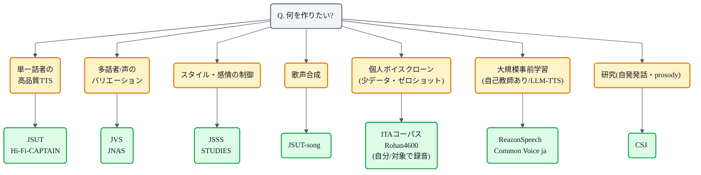

## この記事について

TTS の勉強を始めると、論文にはたいてい **LJSpeech / VCTK / LibriTTS** が並んでいます。これらはどれも英語のコーパスで、いざ日本語の TTS を組もうとした瞬間に、選択肢の地図が急に見えなくなります ── これは日本語で TTS をやろうとする多くの人が最初にぶつかる戸惑いです。

この記事は、日本語 TTS のためのコーパスを **「収録時間」「話者数」「サンプリングレート」「ライセンス」** の 4 つでまず並べ、そのうえで **「何を作りたいか」から候補を絞れる案内図** として書きます。データセットそのものの詳細ページや DL 手順は公式に任せて、ここでは *どれを、いつ、どう組み合わせるか* に絞ります。

対象読者は次のような人を想定しています。

- 英語の TTS チュートリアルは触ったが、日本語で組み直したい人
- 「自分の声を合成したい」「特定キャラクターの声で読ませたい」など、少データからのボイスクローンを考えている人
- 論文の再現実験を日本語で試したい人

TTS そのものの仕組みや個別モデルの解説は、シリーズの本 「[**TTS ― テキストが音になるまで**](https://zenn.dev/nnn112358/books/tts-from-text-to-audio)」で読めます。この記事はその「材料選び」の章として読んでもらえるとちょうどよいと思います。

:::message
数字（時間・話者数など）は公開資料からの代表値の目安です。改訂やサブセット追加もあるので、実際に使う前に **公式配布ページで最新値とライセンスを必ず確認** してください。特にモデルを配布するときは、学習に使ったコーパスのライセンスがモデルの配布条件まで伝播することが多いので要注意です。
:::

## TTS 用データセットの「見どころ」5 つ

コーパスを比べるとき、TTS の観点では次の 5 つがだいたい効いてきます。並び順の理由も含めて短く整理しておきます。

1. **収録時間** ── 音響モデルの学習には最低でも数時間、快適に組むなら 10 時間前後は欲しい規模感です。多話者や大規模事前学習では 100〜1000 時間、最近の基盤モデルは万時間クラスになります。
2. **話者数** ── 単一話者はコピー品質が上限、多話者は「別人の声」を学習させたいときや、少データ話者の Zero-shot / Few-shot 適応の土台として重要です。
3. **サンプリングレート** ── 16kHz は電話品質、24kHz が TTS の伝統的なデフォルト、48kHz は最近のハイファイ系。ボコーダのアーキテクチャや帯域感に直結します。Mel の細部は本の [「メルスペクトログラム」](https://zenn.dev/nnn112358/books/tts-from-text-to-audio/viewer/mel-spectrogram) の章を参照。
4. **書き起こしの精度と表記** ── 書き起こしがない・タイムスタンプがない・仮名/漢字が揺れる、といった状態のデータは前処理コストが跳ね上がります。読み上げ (read speech) と自発発話 (spontaneous speech) では性質もかなり違います。
5. **ライセンス** ── 「研究用途のみ」「商用可」「クレジット表記必要」「派生モデルの配布不可」など、思っている以上に細かく分かれます。個人利用ならほぼ問題にならないケースも、モデル配布までスコープに入れると急に条件がきつくなります。

## 用途で選ぶ ── 決定フロー

まずは「作りたいもの」から候補を絞る図です。ここに載せたコーパスは後続の節で 1 つずつ扱います。

「これ 1 つ」で完結するコーパスは実はあまりなくて、たいていは **「基盤 (多話者・大規模) + 目的話者の少量データ」** の組み合わせで運用します。この視点は最後の節でまた戻ってきます。

## 規模で並べる ── 時間 × 話者数のマップ

主要な日本語音声コーパスを、収録時間（x 軸, 対数）と話者数（y 軸, 対数）でざっと並べたのが下の図です。円の大きさはサンプリングレート（48kHz が大, 16kHz が小）を表しています。

見どころは次のあたり:

- **単一話者・高音質 TTS 用の 「読み上げ」 コーパスは、左下の狭いエリアに固まっている**。10 時間前後・48kHz というのが日本語 TTS の一つの標準サイズです。
- **JVS が「多話者 TTS の入り口」として飛び抜けた位置にある**。100 話者・24kHz・30 時間規模で、話者埋め込みや Zero-shot 系の実験のスタート地点になります。
- **JNAS / CSJ は本来 ASR 用**。話者数は多いですが 16kHz なので、TTS で使うときはボコーダとの相性を意識する必要があります。
- **ReazonSpeech v2 は桁違いに大きい**。事前学習や自己教師あり音声モデル (self-supervised) の土台として、この 1 つだけ別の役割を持っています。

## コーパスカタログ

ここからは 1 つずつ。順序は「用途で選ぶ」フローに近い並びにしています。

### JSUT (Japanese Speech corpus of Saruwatari-lab UTokyo)

- 単一話者（女性・プロ）／ **約 10 時間**／ 48kHz
- 東京大学 猿渡・高道研究室が 2017 年に公開
- `basic5000` (音素バランス文 5000) を中心に、`voiceactress100` / `utparaphrase512` / `onomatopee300` / `countersuffix26` / `loanword128` / `travel1000` / `precedent130` / `repeat500` などのサブセット群
- ライセンス: **CC BY-SA 4.0**（配布条件の詳細は公式サイトを要確認）

日本語 TTS で最も広く使われているベースラインです。単一話者・高音質・きれいなアラインメント・音素バランス設計と、TTS が扱うすべての要素が「まず動くこと」を優先して整えられています。「日本語で音声合成を試したい」と言われたときの最初の答えはほぼ確実にこれになります。

VITS や JVS 論文でもベースラインとして頻出します。VITS を触ってみるなら、本の [「VITS」](https://zenn.dev/nnn112358/books/tts-from-text-to-audio/viewer/vits) の章と組み合わせて読むのがちょうどよいと思います。

### JVS (Japanese Versatile Speech corpus)

- **100 話者**／合計 約 30 時間／ 24kHz
- 東京大学 猿渡・高道研究室が 2019 年に公開
- 話者ごとに `parallel100`（同一 100 文をパラレル読み）／`nonpara30`（各話者オリジナル 30 文）／`whisper10`（ささやき）／`falsetto10`（裏声）
- ライセンス: 個人研究の範囲は自由（詳細は公式サイトを要確認）

多話者 TTS・話者埋め込み・Zero-shot TTS を試す上での「日本語の VCTK」的な位置づけのコーパスです。とりわけ `parallel100` は 100 話者が同じ文を読むので、話者と発話内容を切り離して学習させる実験に向いています。本の [「zero-shot TTS」](https://zenn.dev/nnn112358/books/tts-from-text-to-audio/viewer/zero-shot) の章を試すときの主要な素材でもあります。

### JSSS (Japanese Speech Style corpus of Saruwatari-lab UTokyo)

- スタイル多様な単一話者コーパス／合計 十数時間／ 24kHz
- 短発話 (short-form) と長文発話 (long-form) の両方を含む
- 猿渡・高道研

「同じ人が違うスタイルで話す」ように整備されていて、スタイル・韻律の制御を学ばせたいときの素材になります。**StyleTTS 系**の実験や、長文向けの prosody 学習で使いやすい構成です。

### STUDIES

- スタイル制御 TTS のための小規模コーパス
- 「教師役」の 1 名が **中立 / 喜び / 悲しみ / 怒り** など複数の感情で発話するテキスト対応データセット
- 感情ラベル・スタイル埋め込みを学習させたいときのターゲット

より本格的な感情 TTS を目指すなら、この STUDIES と JSSS の 2 本を使い分ける、というのが 2020 年代前半の定番でした。最近は事前学習モデル + 少量スタイルデータ、という組み合わせに主役が移りつつあります。

### JSUT-song

- **単一話者の歌声コーパス**（JSUT と同一話者）／数時間
- 猿渡・高道研

歌声合成のベースライン。読み上げの JSUT と同じ話者なので、「同じ声で話す/歌う」を扱うクロスドメイン実験の入り口として便利です。歌声だけを本気でやるなら **NIT-SONG070 / NNSVS 系** の別コーパスや、ユーザー参加型の歌声データセットも見に行く必要があります。

### Hi-Fi-CAPTAIN

- 単一話者・**48kHz** の高音質コーパス／日本語話者・英語話者の 2 種類
- CyberAgent が 2023 年に公開
- Hi-Fi = 高音質、CAPTAIN = 話者名にちなむ命名

「高いサンプリングレートで、単一話者を綺麗に学習させたい」というときに、JSUT より新しい選択肢として選ばれることが増えています。特に **BigVGAN や Vocos** といった 44/48kHz を狙う近年のボコーダとの相性がよいコーパスです。ボコーダの話は本の [「Vocos」](https://zenn.dev/nnn112358/books/tts-from-text-to-audio/viewer/vocos) の章で扱っています。

### ITA コーパス

- **テキストだけ**が配布される朗読用文セット（音声は録音者が自前で用意）
- `recitation324` (Balance系, 424 文) + `emotion100` (100 文, 感情読み) が基本セット
- ライセンス: **CC BY-SA 4.0**（テキスト側）

ITA は「コーパス」というよりコーパス設計のための **テキスト集**で、ここが日本語 TTS の面白いところです。個人の声・キャラクターの声を録音してもらい、それを組み合わせることで「実質的にはコーパス」を作る運用が広まっています。あみたろ、つくよみちゃん、狐子など、Zenn / Qiita / GitHub で見かける公開ボイスバンクの多くが ITA を素材にしています。

ライセンス的にもフレンドリーで、短時間で録れるので **少データ・話者クローン系の実験** に最も選ばれるテキストセットです。

### Rohan4600

- **4600 文**の音素バランス設計テキスト（ITA より大規模）
- 単一話者による録音を前提とした「もう一段しっかりしたバランス」コーパス
- テキスト側は自由に使えるライセンスで配布

ITA が「短い時間で試せる」入り口だとすれば、Rohan4600 は「本気で 1 話者を数時間しっかり録る」ときのテキストソースです。**Coeiroink / COEIRO Operator** のようなオープン系日本語 TTS モデルでも、こちらのバランス設計が使われている例があります。

### JNAS (Japanese Newspaper Article Sentences)

- **306 話者**／合計 約 44 時間／ 16kHz
- 新聞記事の読み上げ
- 有償配布（NII / GSK 経由）

もともと **ASR 用**の多話者コーパスですが、多話者 TTS や話者埋め込みの実験でも使われてきました。16kHz なので TTS 全帯域の学習には制限がありますが、話者数の多さが目的なら十分候補になります。研究プロジェクトで使うなら、まず JVS で試して規模が足りないと感じたら追加、という順序が現実的です。

### CSJ (Corpus of Spontaneous Japanese)

- **660 時間 +**／数千話者／ 16kHz
- 学会講演・模擬講演・自発対話などの **自発発話**中心
- 国立国語研究所（有償）

TTS を作るためのコーパスというより、**「日本語の自発発話がどう変形するか」を研究するためのコーパス**という色合いが強いです。フィラー・言い淀み・韻律の分析、prosody 予測モデル、非流暢性を含む TTS、話し言葉の ASR など、少し実験的な方向で強みを発揮します。

### ReazonSpeech

- **v1: 約 19,000 時間 / v2: 約 35,000 時間**
- TV 放送 (地上波) を素材とし、自動書き起こしを付与
- Reazon Human Interaction Lab が公開／商用可のオープンライセンス（詳細は公式）
- 16kHz 相当

ここまで並べてきたコーパスとは桁が違う、日本語音声のいわば **「基盤モデル用の大規模データ」** です。読み上げではなくニュース・バラエティ・トーク・ドラマなどの実発話で、書き起こしも完全ではありませんが、**HuBERT / wav2vec2 / VALL-E / LLM-TTS の日本語事前学習**を回すならまず候補になります。

TTS の「音響モデル本体」をここだけで学習するというより、事前学習で表現を得ておき、Hi-Fi-CAPTAIN や少量録音で **仕上げのファインチューニング** をする、という 2 段構えの使い方が主流です。

### Common Voice (Japanese)

- Mozilla のクラウドソースコーパス
- 数百時間・数千話者クラス（バージョンにより変動）
- **CC0**（パブリックドメイン相当）

「ライセンスがとにかく自由」というのが最大の強みです。音質・話者バランスは公式コーパスに劣るものの、「まずライセンスの心配なく大量の日本語音声を触りたい」というときの候補になります。ノイズが多いので、そのまま TTS の学習には不向きですが、**事前学習・ASR ・話者識別**の日本語データ源として使われています。

## 見比べる表

「1 枚だけ持って行くならこれ」という比較表として、下にざっくりまとめます。数字は目安で、詳細は公式ページで確認してください。

| コーパス            | 話者数 | 時間  | SR (kHz) | 主な用途                          |
|---------------------|:------:|:-----:|:--------:|-----------------------------------|
| JSUT                | 1      | 〜10  | 48       | 単一話者・高音質 TTS の基準       |
| Hi-Fi-CAPTAIN       | 2      | 〜20  | 48       | 単一話者・より高音質              |
| JVS                 | 100    | 〜30  | 24       | 多話者 TTS / 話者埋め込み         |
| JSSS                | 1      | 〜16  | 24       | スタイル・長文 TTS                |
| STUDIES             | 1      | 数h   | 24       | 感情 TTS                          |
| JSUT-song           | 1      | 数h   | 48       | 歌声合成のベースライン            |
| ITA コーパス        | -      | -     | -        | 少データ・自作コーパスのテキスト  |
| Rohan4600           | -      | -     | -        | 音素バランス強めの自作テキスト    |
| JNAS                | 306    | 〜44  | 16       | 多話者 ASR / TTS 補助             |
| CSJ                 | 数千   | 660+  | 16       | 自発発話研究                      |
| ReazonSpeech v2     | -      | 35,000| 16       | 大規模事前学習                    |
| Common Voice ja     | 数千   | 数百  | 48       | ライセンス自由・自己教師あり      |

## 使い方の型 ── 「基盤 + 目的話者」

現実の TTS システムは、単一のコーパスだけで学習することはあまりありません。だいたい次の 2 パターンに落ち着きます。

**パターン A: 単一話者 TTS を作る場合**

1. まず **JSUT** か **Hi-Fi-CAPTAIN** で音響モデル + ボコーダを学習
2. 目的話者の 30 分〜数時間を録音（テキストは **ITA** か **Rohan4600**）
3. その少量データで話者アダプト（fine-tuning）または VITS / StyleTTS2 の話者埋め込みで切り替え

**パターン B: 大規模・ゼロショットに寄せる場合**

1. **ReazonSpeech** で自己教師あり音声モデル / LLM-TTS 系を事前学習
2. **JVS** の 100 話者で多話者ヘッドを整える
3. 最終ターゲットの話者は数十秒〜数分の参照音声だけを与えて **Zero-shot 合成**

パターン B は VALL-E、Fish-Speech、Qwen3-TTS など最近の LLM-TTS 系の実装で採用されつつあるやり方です。それぞれのモデルの中身は、本の [「LLM TTS」](https://zenn.dev/nnn112358/books/tts-from-text-to-audio/viewer/llm-tts) や [「VALL-E」](https://zenn.dev/nnn112358/books/tts-from-text-to-audio/viewer/valle) の章で扱っています。

## ライセンスの落とし穴

最後に、日本語 TTS で特にひっかかりやすいライセンス上の注意を 3 つだけ。

1. **CC BY-SA は「継承」がある** ── SA (Share-Alike) 系のライセンスで学習したモデルは、しばしば派生モデルにも同じ条件が伝わると解釈されがちです。厳密な法解釈は場合によりますが、モデル配布を予定するなら CC0 / MIT / Apache 系のデータの比率を意識しておくのが安全です。
2. **「なりすまし禁止」条項がある** ── 声そのものは「人格」に近い情報なので、多くの公開音声コーパスに **他人の声を模した合成音の公開を制限する条項** が含まれています。ボイスクローン系の実装を配布する場合は、単にライセンス文字列を見るだけでなく、規約本文を要確認。
3. **自作テキスト × 他者音声の組み合わせ** ── ITA / Rohan4600 のような「テキストのみ」配布は自由に使える一方、そのテキストを読み上げた **音声側は録音者のライセンスに従います**。二次配布・再学習の可否は録音者ごとに確認する必要があります。

## 関連リンク

- 本: [TTS ― テキストが音になるまで](https://zenn.dev/nnn112358/books/tts-from-text-to-audio) ── VITS までのモデルを一つずつ解説
- 記事: [はじめてのOpenJTalk](https://zenn.dev/nnn112358/articles/first-openjtalk) ── 日本語 TTS の伝統芸能ラインを触ってみる
- 記事: [TTS学習向けのGPUの選び方](https://zenn.dev/nnn112358/articles/gpu-for-tts-training) ── コーパスが決まったら次はハード
- 記事: [VITSから見るTTS 10系統マップ](https://zenn.dev/nnn112358/articles/tts-lineage-map-from-vits) ── 系譜で俯瞰したいときに
