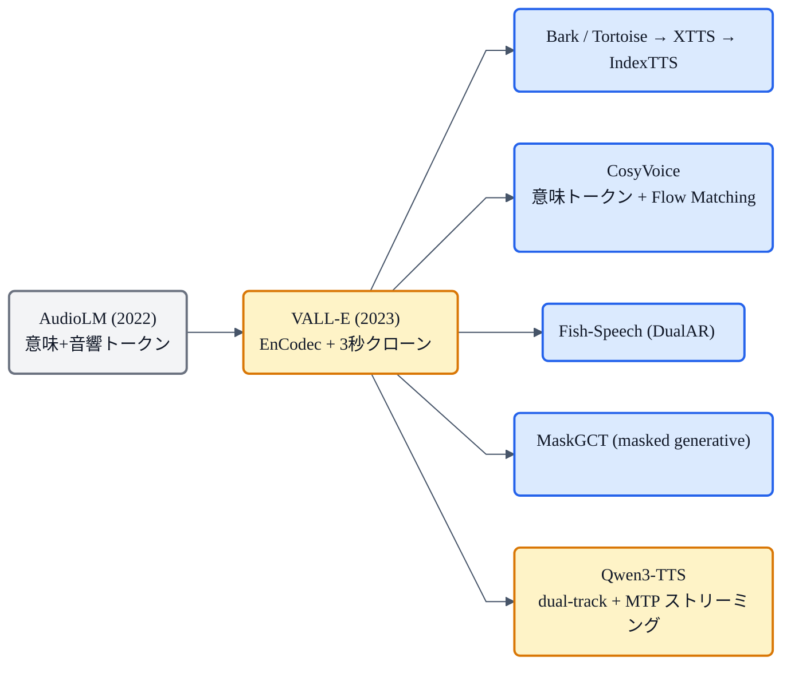

## この記事について

前回の [Qwen3-TTS](https://zenn.dev/nnn112358/articles/qwen-tts-for-cats) は「LLMに喋らせる」タイプのTTSでした。実はこれ、VALL-E や CosyVoice、Bark、XTTS…… と、近年の多くのモデルが共有する**大きな路線**の一員です。この記事では、その **LLM TTS(コーデック言語モデル型TTS)** というパラダイムを、一段上から俯瞰します。

キーワードは **「音声生成を、言語モデル(LM)の問題として解く」**。GPT が次の単語を予測するのと同じ要領で、**次の"音声トークン"を予測**して喋る——この発想を、猫でもわかるように解きほぐします。🤖

:::message
この記事は個別モデルの詳細ではなく、**共通する考え方**の解説です。代表例(VALL-E / AudioLM / CosyVoice / Qwen3-TTS 等)の位置関係は [TTS系譜マップ](https://zenn.dev/nnn112358/articles/tts-lineage-map-from-vits) を参照してください。図は matplotlib と mermaid で作成しました。
:::

## 3行で言うと

- LLM TTS = **音声を離散トークンの列にして、LLM(GPT風)が次のトークンを自己回帰で生成**するTTS。
- 部品は3つ:**① ニューラルコーデック**(音声↔トークン)、**② 自己回帰LM**、**③ 条件づけ**(テキスト＋話者プロンプト)。
- 強みは**スケール**と**文脈内学習**(3秒プロンプトで即クローン=zero-shot)。弱みは**遅さ**と**不安定さ**。

## 基本の発想:音声版のGPT

文章生成では、GPT が「これまでの単語列」から「次の単語」を予測して、文を伸ばしていきます。LLM TTS は、これを**音声**でやります。

まず音声を、単語のような**離散トークンの列**に変換します。あとは、**LLM が「これまでの音声トークン列」から「次の音声トークン」を1つずつ予測**して、音声を伸ばしていく。最後にトークン列をコーデックで波形に戻せば、音声のできあがりです。

*テキストと話者プロンプトを条件に、自己回帰LMが音声トークンを1つずつ生成(GPTと同じ)。トークン列をコーデックのデコーダに通すと波形になる。「音声を言語のように扱う」のが LLM TTS。*

## 3つの部品

LLM TTS は、だいたい次の3つでできています。

1. **ニューラルコーデック(トークナイザ)**:連続的な音声波形を、**離散トークン**に変換する部品([SoundStream / EnCodec](https://zenn.dev/nnn112358/articles/encodec-for-cats) / DAC / Mimi など。元をたどれば [VQ-VAE](https://zenn.dev/nnn112358/articles/vae-for-cats))。逆にトークンから波形も復元する。
2. **自己回帰LM(GPT風)**:デコーダ型 Transformer で、次のトークンを予測する本体。
3. **条件づけ**:何を喋るかの**テキスト**(音素やBPE)と、誰の声かの**話者プロンプト**(数秒の参照音声)。

## 2種類のトークン:意味 と 音響

ここが LLM TTS のキモの一つ。音声トークンには、**性質の違う2種類**があります。

- **意味トークン(semantic)**:**何を言っているか**を粗く捉える(HuBERT や Whisper 由来)。文の内容・発音に対応。
- **音響トークン(acoustic)**:**どう響くか**を細かく捉える(EnCodec / SoundStream 由来)。音色・韻律・話者性など。

多くのモデルは、まず**意味トークンで大枠を作り、次に音響トークンで肉付けする**(粗→細)という順で生成します。AudioLM が確立し、VALL-E などに受け継がれた考え方です。

## なぜこの路線が強いのか

- **スケールの恩恵**:LLM の"大きくすれば賢くなる"性質と、大量データ・既存のLLM技術(トークン化・学習・推論の道具立て)をそのまま活かせる。
- **文脈内学習(in-context learning)**:GPT が例を見せると真似るように、**数秒の参照音声(プロンプト)を与えると、その声の続きとして喋る**。これで**zero-shot 音声クローン**(学習していない話者を3秒で再現)ができる——VALL-E が示した衝撃でした。
- **表現力・多様性**:確率的に生成するので、自然で多彩。

## 多コードブックの捌き方

コーデックは普通、[RVQ(残差ベクトル量子化)](https://zenn.dev/nnn112358/articles/tts-lineage-map-from-vits)で**複数のコードブック**(層)を持ちます。全部を素直に自己回帰すると遅いので、各モデルは工夫します。

- **AR + NAR**(VALL-E):1層目は自己回帰、残りは並列(非自己回帰)。
- **Masked Generative**([SoundStorm / MaskGCT](https://zenn.dev/nnn112358/articles/tts-lineage-map-from-vits)):画像の MaskGIT 風に、マスクして並列に埋める。
- **MTP**([Qwen3-TTS](https://zenn.dev/nnn112358/articles/qwen-tts-for-cats)):1フレームで残りコードブックをまとめて予測 → 超低遅延。

## 弱点

- **遅い**:1トークンずつの自己回帰は、[WaveNet](https://zenn.dev/nnn112358/articles/wavenet-for-cats) と同じで逐次生成。ストリーミングやNAR化で緩和する。
- **不安定**:LMなので**繰り返し・飛ばし・言い間違い**(誤りの蓄積)が起きやすい。
- **コーデック依存**:トークナイザの品質が上限を決める。

## 代表モデルの系譜

## VITS系(単段E2E)との違い

| | VITS系(単段E2E) | LLM TTS(コーデックLM) |
|---|---|---|
| 生成 | 並列(Flow / GAN) | 自己回帰(トークン列) |
| 速度 | **速い** | 遅め(逐次) |
| zero-shotクローン | 弱め | **得意**(文脈内学習) |
| 安定性 | **高い** | 繰り返し/飛ばしが出やすい |
| スケール感 | 中 | **大**(LLMの恩恵) |

どちらが上というより、**得意が違う**。安定・高速なら [VITS](https://zenn.dev/nnn112358/articles/vits-for-cats) 系、zero-shot や大規模なら LLM TTS、という住み分けです。

## 猫のまとめ 🤖

- LLM TTS = **音声を離散トークン列にして、LLMが次のトークンを自己回帰生成**する路線(=音声版のGPT)。
- 部品は **コーデック + 自己回帰LM + 条件づけ**。トークンは **意味(何を言う)** と **音響(どう響く)** の2種で、粗→細に生成。
- 強みは **スケール**と **文脈内学習(3秒でzero-shotクローン)**。弱みは **遅さ**と **不安定さ**。
- VALL-E が口火を切り、CosyVoice / Fish-Speech / MaskGCT / Qwen3-TTS などへ広がった。
- **VITS系(速い・安定)** と **LLM TTS(zero-shot・スケール)** は、得意の違う2大路線。

「音声を、言葉のように扱う」——この一つの発想が、現代TTSの半分を動かしています。

## 参考リンク

- [VALL-E (arXiv:2301.02111)](https://arxiv.org/abs/2301.02111) / [AudioLM (arXiv:2209.03143)](https://arxiv.org/abs/2209.03143)
- 関連記事: [猫でもわかるQwen3-TTS](https://zenn.dev/nnn112358/articles/qwen-tts-for-cats) / [猫でもわかるVITS](https://zenn.dev/nnn112358/articles/vits-for-cats) / [猫でもわかるVAE](https://zenn.dev/nnn112358/articles/vae-for-cats) / [VITSから見るTTS 10系統マップ](https://zenn.dev/nnn112358/articles/tts-lineage-map-from-vits)

:::message
🐾 **猫でもわかるTTSシリーズ**(全25本) ― [目次](https://zenn.dev/nnn112358/articles/tts-for-cats-index) ／ 前: [BERT](https://zenn.dev/nnn112358/articles/bert-for-cats) ／ 次: [Qwen3-TTS](https://zenn.dev/nnn112358/articles/qwen-tts-for-cats)
:::
