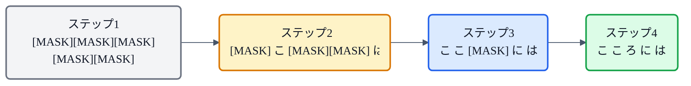
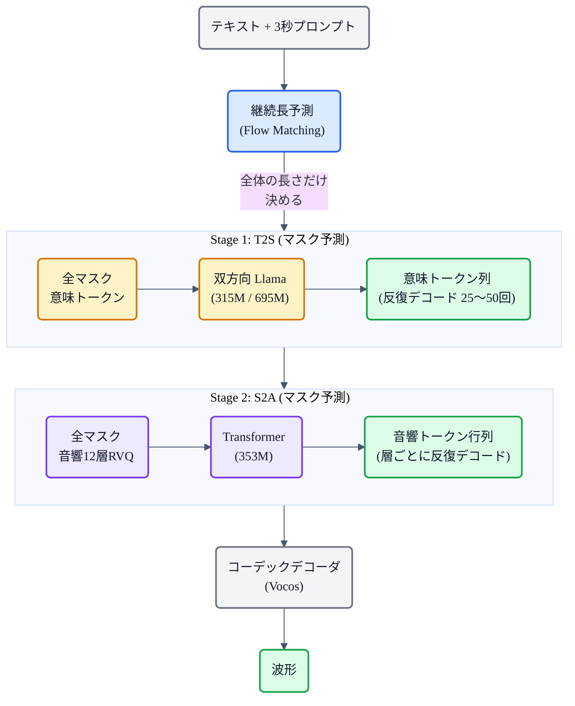
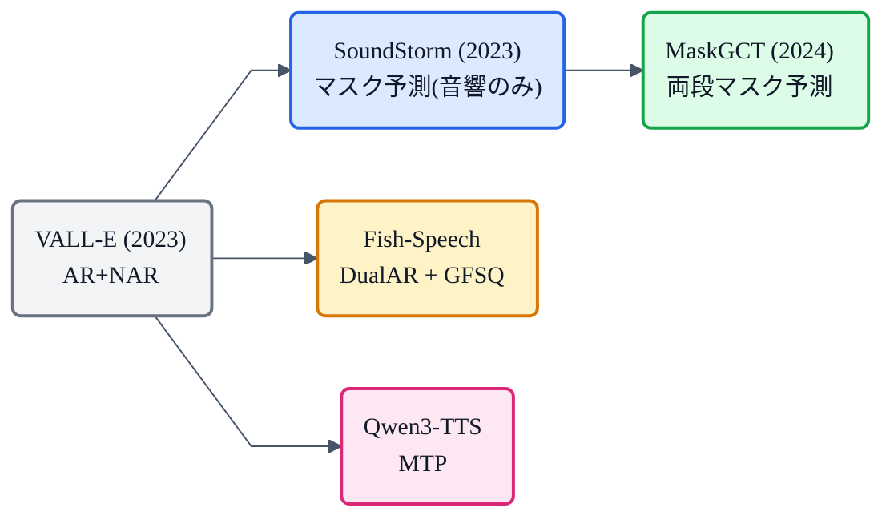

## この記事について

[LLM TTS の記事](https://zenn.dev/nnn112358/articles/llm-tts-for-cats)で、音声トークンの生成戦略には **AR+NAR**([VALL-E](https://zenn.dev/nnn112358/articles/valle-for-cats))、**マスク予測**(SoundStorm)、**MTP**([Qwen3-TTS](https://zenn.dev/nnn112358/articles/qwen-tts-for-cats))の3つがあると紹介しました。今回はそのマスク予測方式を極めた **MaskGCT**(2024, CUHK Shenzhen)を見ます。

MaskGCT は**テキスト→意味トークン → 音響トークンの両段階をマスク予測**で解いた、**完全非自己回帰** の zero-shot TTS です。明示的なテキスト-音声アライメントも、音素レベルの継続長予測も不要。それでいて**人間の録音を上回る自然さ**(CMOS +0.10 vs GT)を達成しています。

:::message
MaskGCT: Wang et al., *"MaskGCT: Zero-Shot Text-to-Speech with Masked Generative Codec Transformer"* (2024, [arXiv:2409.00750](https://arxiv.org/abs/2409.00750))。100K時間で学習。SoundStorm: Borsos et al., *"SoundStorm"* (2023, [arXiv:2305.09636](https://arxiv.org/abs/2305.09636))。本記事の仕様・数値は両論文で確認しています。図は mermaid で作成しました。
:::

## 3行で言うと

- MaskGCT = **テキスト→意味トークン、意味→音響トークンの両段階をマスク予測**で生成する、完全非自己回帰 TTS。
- **アライメント不要・継続長予測不要**。「全部マスクして、自信がある所から順に埋める」反復デコードで生成。
- **100K時間**で学習。CMOS **+0.10**(LibriSpeech）、人間の録音より高い自然さと評価された。

## マスク予測とは

[VALL-E](https://zenn.dev/nnn112358/articles/valle-for-cats) の AR は「左から右に1つずつ生成」でした。マスク予測は発想が違います。

1. **全トークンをマスク**(隠す)した状態から始める。
2. モデルが**全位置を同時に予測**する。
3. **自信が高い予測**だけを確定し、残りを再マスク。
4. これを**数十回繰り返す**と、すべてのトークンが埋まる。

AR が「左から順に」という硬い制約を持つのに対し、マスク予測は**全体を見渡して自信のある所から埋める**。文脈を双方向で使えるので、長い入力でも読み飛ばしや繰り返しが起きにくいのが大きな利点です。

## 前身:SoundStorm(2023, Google)

マスク予測を音声トークンに初めて大規模適用したのが **SoundStorm** です。

- **SoundStream**（12層 RVQ）のトークンを、**Conformer**（350M params）で生成。
- RVQ を粗い層から細かい層へ順に処理。各層の中でマスク予測を反復(16回→1回…)。
- **30秒の音声を 0.5秒で生成**(TPU-v4)。AudioLM の音響生成器の **100倍高速**。
- ただし SoundStorm は**音響トークンの生成**のみ。意味トークン(テキスト→音声の内容)は別の AR モデルが必要でした。

## MaskGCT:両段階をマスク予測で統一

MaskGCT は SoundStorm の「音響段階だけマスク予測」という制限を取り払い、**テキスト→意味トークン(T2S)と意味→音響トークン(S2A)の両方をマスク予測**にしました。

### Stage 1: T2S(テキスト→意味トークン)

- **双方向 Llama Transformer**(SwiGLU, RoPE, Adaptive RMSNorm)。315M〜695M パラメータ。
- 意味トークンは **W2v-BERT 2.0** の17層目の隠れ状態を VQ-VAE(コードブック 8192)で離散化したもの。
- 入力: テキスト + プロンプトの意味トークン(prefix)。出力: テキストに対応する意味トークン。
- **25〜50回の反復デコード**。Classifier-free guidance(スケール 2.5)で品質向上。

### Stage 2: S2A(意味→音響トークン)

- SoundStorm ベースの **Transformer**（353M params）。
- 音響コーデック: **12層 RVQ**(コードブック 1024, 24kHz)。DAC エンコーダ + Vocos デコーダ。
- 粗い層(第1層)から細かい層(第12層)へ順に、各層でマスク予測を反復。第1層は40回、それ以降は1〜16回。

### 継続長予測

MaskGCT にも継続長予測はありますが、**音素単位ではなく文全体の長さ**だけを決めます。[Flow Matching](https://zenn.dev/nnn112358/articles/flow-matching-for-cats) ベースの 12層 Transformer で予測。これにより**音素レベルのアライメントが完全に不要**になりました。

## なぜ AR+NAR より強いか

MaskGCT 論文は、同じデータ・同じ条件で **AR(T2S) + SoundStorm(S2A)** と比較しています。

| | MaskGCT (両段マスク) | AR + SoundStorm |
|---|---|---|
| WER (LibriSpeech) | **2.63** | 3.27 |
| CMOS | **+0.10** | −0.02 |
| WER (難文, SeedTTS-hard) | **10.3** | 34.2 |

特に**難しい文での差が劇的**。AR は長い入力で Attention が崩れやすいのに対し、マスク予測は全体を双方向で見るため頑健です。

## 性能

**LibriSpeech test-clean(3秒プロンプト、zero-shot）**:

| | 話者類似度 ↑ | WER ↓ | SMOS | CMOS (vs GT) |
|---|---|---|---|---|
| 人間(GT) | 0.68 | 1.94 | 4.05 | 0.00 |
| **MaskGCT** | **0.69** | **2.63** | **4.27** | **+0.10** |
| NaturalSpeech 3 | 0.67 | 1.94 | 4.26 | +0.16 |
| VALL-E | 0.50 | 5.90 | 3.47 | −0.52 |
| CosyVoice | 0.64 | 4.08 | 3.52 | −0.41 |

CMOS +0.10 は **人間の録音より自然だと評価された** ことを意味します。話者類似度 0.69 も GT(0.68)を上回ります。VALL-E(0.50)からの進化は顕著。

5回生成して最良を選ぶ rerank では WER 1.98 まで改善し、GT(1.94)とほぼ同等。

## SoundStorm → MaskGCT の進化まとめ

| | SoundStorm (2023) | **MaskGCT (2024)** |
|---|---|---|
| マスク予測の範囲 | 音響段階のみ | **意味+音響の両段階** |
| テキスト→意味 | 別の AR モデル | **マスク予測(T2S)** |
| アライメント | 別モデルが担当 | **不要** |
| 学習データ | 60K時間 | **100K時間** |
| 品質(CMOS vs GT) | — | **+0.10** |

## 系譜での位置

VALL-E が開いた「音声トークンの言語モデリング」に対する3つの回答:
- **AR+NAR**: VALL-E → VALL-E 2(human parity)
- **マスク予測**: SoundStorm → **MaskGCT**(完全非自己回帰)
- **MTP / DualAR**: [Qwen3-TTS](https://zenn.dev/nnn112358/articles/qwen-tts-for-cats) / [Fish-Speech](https://zenn.dev/nnn112358/articles/fish-speech-for-cats)

MaskGCT は「AR を一切使わない」という選択で、頑健性と品質を両立した到達点です。

## 猫のまとめ 🎭

- MaskGCT = **テキスト→意味、意味→音響の両段階をマスク予測**で生成する完全非自己回帰 zero-shot TTS。
- **「全部マスクして、自信がある所から順に埋める」** 反復デコード。AR の読み飛ばし・繰り返しが構造的に起きない。
- **アライメント不要・音素単位の継続長予測不要**。テキストと音声の対応は暗黙的に学習。
- **100K時間**学習、CMOS **+0.10** vs GT(人間の録音を上回る自然さ)。
- SoundStorm(音響のみマスク予測)を拡張し、VALL-E の AR+NAR に対する**マスク予測系の回答**。

## 参考リンク

- [MaskGCT (arXiv:2409.00750)](https://arxiv.org/abs/2409.00750) / [SoundStorm (arXiv:2305.09636)](https://arxiv.org/abs/2305.09636)
- 関連記事: [猫でもわかるLLM TTS](https://zenn.dev/nnn112358/articles/llm-tts-for-cats) / [猫でもわかるVALL-E](https://zenn.dev/nnn112358/articles/valle-for-cats) / [猫でもわかるEnCodec](https://zenn.dev/nnn112358/articles/encodec-for-cats) / [猫でもわかるFish-Speech](https://zenn.dev/nnn112358/articles/fish-speech-for-cats) / [猫でもわかるQwen3-TTS](https://zenn.dev/nnn112358/articles/qwen-tts-for-cats)

:::message
🐾 **猫でもわかるTTSシリーズ**(全32本) ― [目次](https://zenn.dev/nnn112358/articles/tts-for-cats-index) ／ 前: [Grad-TTS](https://zenn.dev/nnn112358/articles/grad-tts-for-cats)
:::
