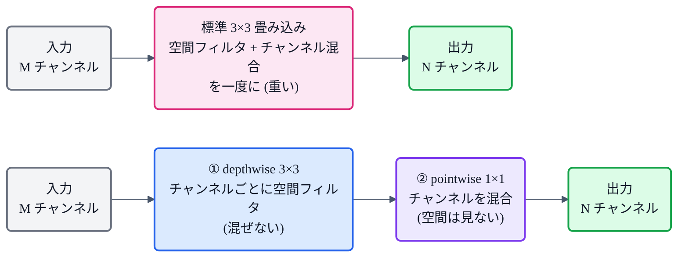

## この記事について

このシリーズは TTS(音声合成)中心ですが、今回は少し番外編。画像認識の**軽量モデル MobileNet**(2017, Google)です。

なぜ TTS シリーズで? ——MobileNet の核である **depthwise separable 畳み込み(depthwise separable convolution)** が、**軽量・高速な音声モデルの土台**にもなっているからです。[Vocos](https://zenn.dev/nnn112358/articles/vocos-for-cats) が使う ConvNeXt の depthwise 畳み込みも、オンデバイス向け TTS の LightSpeech も、この発想の子孫。**「畳み込みを安くする」1つのアイデア**が、画像から音声まで効いています。猫でもわかるように見ていきましょう。📱

:::message
MobileNet: Howard et al., *"MobileNets: Efficient Convolutional Neural Networks for Mobile Vision Applications"* (2017, [arXiv:1704.04861](https://arxiv.org/abs/1704.04861))。本記事の数値・仕様は論文本文で確認しています(PDFも取得済み)。図は matplotlib、フローチャートは mermaid です。
:::

## 3行で言うと

- MobileNet = スマホ/組込み向けの軽量CNN。核は **depthwise separable 畳み込み**。
- 標準の畳み込みを **「空間フィルタ(depthwise)」＋「チャンネル混合(pointwise 1×1)」** の2段に分解し、**計算量を約 1/8〜1/9** に。
- この部品は画像だけでなく、**軽量TTS(LightSpeech, Vocos の ConvNeXt 等)** でも使われている。

## 問題:普通の畳み込みは重い

普通の(標準の)畳み込みは、1回の操作で **2つのこと**を同時にやっています。

- **空間フィルタ**:3×3 などの窓で、近くのピクセルをまとめる。
- **チャンネル混合**:入力の全チャンネルを混ぜて、新しいチャンネルを作る。

そのため計算量は、入力チャンネル数 M・出力チャンネル数 N・窓の大きさ 3×3・特徴マップの広さ、の**掛け算**で膨らみます。とくに M×N の部分が大きい。ここを削りたい、というのが出発点です。

## depthwise separable 畳み込み:2つに分ける

MobileNet のアイデアは、この「同時にやっている2つ」を**別々の層に分解**することです。

- **① depthwise 畳み込み**:**各チャンネルを、それぞれ独立に**3×3 でフィルタする(チャンネルは混ぜない)。空間フィルタだけを担当。
- **② pointwise 畳み込み(1×1)**:1×1 の畳み込みで、**チャンネルだけを混ぜる**(空間は見ない)。

この2段を合わせると、標準の畳み込みとほぼ同じ働きをしつつ、計算量が大きく減ります。

## なぜ軽くなるのか

標準の畳み込みに対する depthwise separable の計算量の比は、論文の式でこうなります。

$$
\frac{1}{N} + \frac{1}{D_K^{\,2}}
$$

$N$ は出力チャンネル数、$D_K$ は窓のサイズ。3×3($D_K=3$)なら $1/D_K^2 = 1/9$ で、$N$ は普通大きいので $1/N$ は小さい。合わせて **およそ 1/8〜1/9**。つまり**1割ちょっとの計算量**で、ほぼ同じことができてしまいます。

*標準の3×3畳み込みを1.0とすると、depthwise separable は約0.12(≈1/8)。しかも内訳を見ると、計算のほぼ全部(論文の実測で約95%)は **1×1 の pointwise 側**で、depthwise はほぼタダ。「重いのは実はチャンネル混合(1×1)の方」というのが面白いところ。*

面白いのは、**depthwise(空間フィルタ)はほとんど計算を食わず、重いのは 1×1(チャンネル混合)の方**だと分かること。論文でも MobileNet の計算時間の**約95%が1×1畳み込み**に使われ、しかも 1×1 は高度に最適化された行列積(GEMM)で速く回せる、と述べています。

## さらに削る:2つのつまみ

MobileNet はもっと軽くするための**2つのハイパーパラメータ**も用意しています。

- **width multiplier(幅の係数)$\alpha$**:各層のチャンネル数を一律に細くする($M \to \alpha M$)。計算量とパラメータが**約 $\alpha^2$ 倍**に。典型値は 1, 0.75, 0.5, 0.25。
- **resolution multiplier(解像度の係数)$\rho$**:入力画像の解像度を下げる。計算量が**約 $\rho^2$ 倍**に。

どちらも「精度を少し犠牲に、速度とサイズを稼ぐ」ためのつまみです。

## 音声との関係

MobileNet 自体は画像向けですが、**depthwise separable 畳み込みという部品はモデルの種類を選びません**。軽量・高速が命の音声モデルでも定番になっています。

- **LightSpeech**:分離畳み込み(SepConv)を NAS で組み合わせた、超軽量な音響モデル。
- **[Vocos](https://zenn.dev/nnn112358/articles/vocos-for-cats) の ConvNeXt**:ConvNeXt ブロックの中核は **depthwise 畳み込み**。MobileNet 由来の発想が、フーリエ系ボコーダの高速化にも効いています。
- オンデバイス/エッジ TTS 全般で、この「畳み込みを安くする」考え方が土台になっています。

「重い畳み込みを、空間とチャンネルに分けて安くする」——このシンプルな一手が、画像から音声まで、軽量モデルの共通言語になっているわけです。

## 猫のまとめ 📱

- MobileNet = 軽量CNN。核は **depthwise separable 畳み込み**。
- 標準の畳み込みを **depthwise(チャンネルごと空間フィルタ)＋ pointwise 1×1(チャンネル混合)** に分解 → **計算量 約 1/8〜1/9**。
- 計算のほぼ全部(≈95%)は **1×1(pointwise)側**。depthwise はほぼタダ。
- **width($\alpha$)・resolution($\rho$)** のつまみで、さらに速度・サイズをトレードできる。
- この部品は **軽量TTS(LightSpeech, Vocosの ConvNeXt 等)** の土台にもなっている。

## 参考リンク

- [MobileNets (arXiv:1704.04861)](https://arxiv.org/abs/1704.04861) ― V1(本記事)。続編に MobileNetV2(倒立残差), V3(NAS+SE)
- 関連記事: [猫でもわかるVocos](https://zenn.dev/nnn112358/articles/vocos-for-cats) / [VITSから見るTTS 10系統マップ](https://zenn.dev/nnn112358/articles/tts-lineage-map-from-vits)

:::message
🐾 **猫でもわかるTTSシリーズ**(全28本) ― [目次](https://zenn.dev/nnn112358/articles/tts-for-cats-index) ／ 前: [zero-shot TTS](https://zenn.dev/nnn112358/articles/zero-shot-for-cats)
:::
