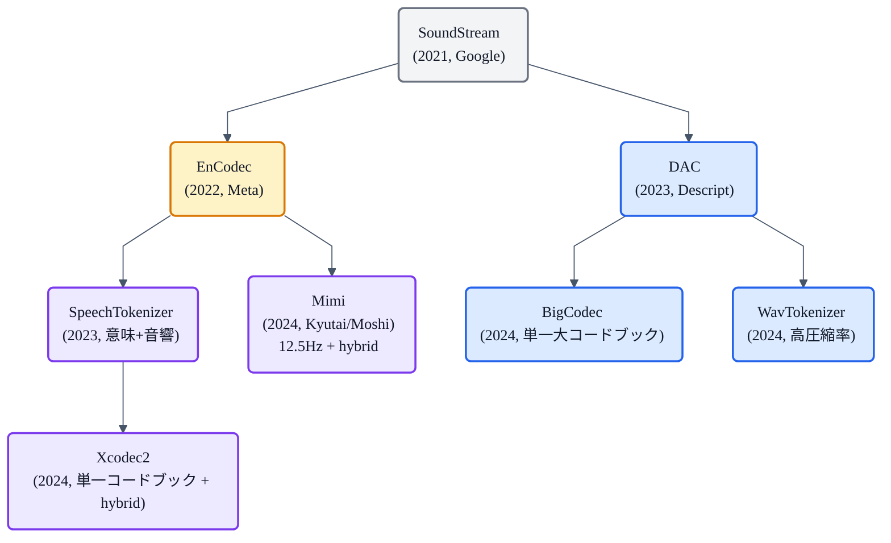

## この記事について

VALL-E が「音声を言語モデルで生成する」というやり方を切り拓いてから、TTS の世界では **「音声を離散トークン列に変える道具 = 音声トークナイザ (Neural Audio Codec)」** が急に主役級の役割を持つようになりました。

本の [「EnCodec」](https://zenn.dev/nnn112358/books/tts-from-text-to-audio/viewer/encodec) の章では、その代表格である EnCodec の中身（Residual Vector Quantization = RVQ を軸にした音声圧縮）を扱いました。ただ、いま実際に LLM-TTS 系の実装を触ると、**EnCodec 以外**のコーデック ── **DAC / Mimi / SpeechTokenizer / BigCodec / WavTokenizer / Xcodec2** ── が次々に出てきます。名前がややこしいうえに、それぞれ違う軸で改良していて、パッと見の違いがわかりにくい。

この記事はその「EnCodec 以外」の主要コーデックを、**フレームレート × コードブック数 × 意味/音響の分担**という 3 つの軸で並べ直し、どこがどう違うのか一望できる比較記事として書きます。

シリーズの位置づけ:
- 前提: 本の [「EnCodec」](https://zenn.dev/nnn112358/books/tts-from-text-to-audio/viewer/encodec) / [「LLM TTS」](https://zenn.dev/nnn112358/books/tts-from-text-to-audio/viewer/llm-tts) / [「VALL-E」](https://zenn.dev/nnn112358/books/tts-from-text-to-audio/viewer/valle) の 3 章
- 関連: 記事 [「日本語TTSのためのデータセット選び」](https://zenn.dev/nnn112358/articles/japanese-tts-datasets)、[「TTSの評価指標カタログ」](https://zenn.dev/nnn112358/articles/tts-evaluation-metrics)

## なぜ音声トークナイザが急に重要になったのか

自己回帰の言語モデル (LLM) は、離散トークンを 1 個ずつ生成することで文章を作ります。TTS でこの発想を借りると、**「音声も離散トークン列に変換しておけば、あとは LLM に任せて生成できる」** という道筋になります。VALL-E 以降の **LLM-TTS 系** はまさにこれで、その要が音声トークナイザです。

音声トークナイザに求められる性質は 3 つ:

1. **可逆に近い圧縮** ── トークン列から高品質な音声波形に戻せる（=デコーダの再構成品質）
2. **時間分解能** ── 1 秒あたりのトークン数がある程度少ないと、LLM 側の生成コストが下がる
3. **モデル化しやすさ** ── トークン分布が LLM で学びやすい構造（例: 意味と音響の分離）

この 3 つは **互いにトレードオフ**の関係にあります。強く圧縮すれば LLM は嬉しいが、デコーダの復元が難しい。時間分解能を粗くすれば LLM は嬉しいが、細かい発音や韻律を捨てることになる。この 3 軸を、コーデックごとに違う攻め方で埋めているのが今の状況です。

## 全体像: 家系図

音声トークナイザの主要系統を系譜図にまとめると次のようになります。

大きく 3 系統に分かれます:

- **音響側 (青)** ── 忠実な音声再構成を優先。RVQ を深く、あるいはコードブックを大きくして音質を稼ぐ (DAC / BigCodec / WavTokenizer)
- **ハイブリッド (紫)** ── 最初の 1 層に「意味情報」、それ以降に「音響情報」を持たせる分業型 (SpeechTokenizer / Mimi / Xcodec2)
- **オリジナル (琥珀)** ── EnCodec は両方の系譜の親で、いまだに実装の第一候補

## 設計空間: フレームレート × RVQ 層数

数字で並べたのが下のマップです。x 軸がフレームレート (1 秒あたりのトークン数)、y 軸が RVQ の層数、円の大きさが概算ビットレートを表しています。

このマップから見えるのは:

- **右上ゾーン (深い RVQ ＋ 高フレームレート)** ── DAC / SoundStream / EnCodec の「音響再構成優先」系。高音質だが、LLM は多層 × 高頻度のトークンを扱う必要があってコスト大
- **左上ゾーン (深い RVQ ＋ 低フレームレート)** ── Mimi が代表。時間軸を粗く、意味と音響を層で分けることで、LLM が扱いやすい形に圧縮
- **下ゾーン (単一コードブック)** ── BigCodec / WavTokenizer / Xcodec2。RVQ をやめて 1 つの大きなコードブックで表現する。LLM 側から見ると「普通の 1 系列トークン」になり、扱いが劇的に単純

つまり **「LLM が扱いやすい形」への圧縮**が、この 2 年の主戦場になっている、という景色です。

## コーデックカタログ

ここからは 1 つずつ。

### SoundStream (2021, Google)

- **RVQ を音声コーデックに応用した先駆け**
- 24kHz / 8 層 RVQ / 各層 1024 コードブック → 3 〜 12 kbps 可変
- **Streamable** (ストリーミング推論対応) を最初から設計

RVQ + GAN + reconstruction loss の枠組みを提示したのがこのモデル。以降のすべての音声コーデックの雛形になっています。単独で使われることは今は少ないですが、**「音声コーデックの祖」**として理解しておくと後続が読みやすい。

### EnCodec (2022, Meta)

- SoundStream の直系。24kHz / 32kHz / 48kHz の 3 バリアント
- 8 層 RVQ / 各層 1024 コードブック / 6 kbps
- **LM-based entropy coding** を組み合わせた圧縮効率化

VALL-E がタグ付けに採用したことで一気に有名になりました。以降の LLM-TTS 系のリファレンス実装として、多くのモデルが「EnCodec のトークン」を暗黙のインターフェースにしています。詳細は本の [「EnCodec」](https://zenn.dev/nnn112358/books/tts-from-text-to-audio/viewer/encodec) の章。

### DAC (Descript Audio Codec, 2023)

- 44.1kHz **フル帯域**対応（音楽含む高音質）
- 9 層 RVQ / 各層 1024 コードブック / 8 kbps
- **HiFi-GAN 系損失**と改良された Snake activation で音質改善

EnCodec と同じ枠組みだが、**音楽まで含めて再構成できる音質**を狙ったバージョン。SoundStream/EnCodec が「音声品質は良いが音楽の再現は苦手」だった弱点をカバー。TTS よりも、**汎用音声・音楽 LLM の裏側**で使われることが多い。

### SpeechTokenizer (2023)

- **意味と音響を RVQ の層で分業させた**最初の実装
- 第 1 層: HuBERT の semantic 情報を蒸留（この層だけで発話内容が概ね伝わる）
- 第 2 層以降: 音響（音色・韻律・話者性）を担当
- 50Hz / 8 層

これが「音声コーデックにおける意味/音響分業」の始祖。LLM-TTS の系で「semantic token を先に生成 → acoustic token をあとで生成」という 2 段構造（VALL-E の AR + NAR に似た構造）を作りやすくなります。

### Mimi (2024, Kyutai)

- Moshi (Kyutai の会話 LLM) の裏側で使われるコーデック
- **12.5Hz** と極端に低いフレームレート／8 層 RVQ ／ 1.1 kbps
- 第 1 層は Whisper のような semantic 表現、以降が音響
- **ストリーミング対応**（1 フレーム 80ms で低遅延）

「意味＋音響」を **強く圧縮した**代表格。12.5Hz は 1 秒あたり 12.5 トークンなので、LLM 側の生成負荷が桁で下がります。Moshi のリアルタイム会話は Mimi あってこそ成立している設計。

### BigCodec (2024)

- **単一 VQ** (RVQ をやめる) ／コードブックを 8192 と巨大にすることで表現力を確保
- 40Hz / 1 コードブック / 1.04 kbps

「LLM は 1 系列のトークン列を扱うのが得意」という前提に立ち返り、**RVQ の多層構造をなくす**方針。LLM 側は普通の言語モデルとほぼ同じ扱いで音声を生成できる。単純さが強み。

### WavTokenizer (2024)

- 単一 VQ ／大コードブック
- 75Hz / 1 コードブック / 0.9 kbps
- 「Extreme compression」を謳う超低ビットレート

BigCodec と近い思想。**単一コードブック × 高圧縮率**で、LLM-TTS のトークン負荷を極小にする方向。

### Xcodec2 (2024)

- 単一 VQ ／意味 + 音響のハイブリッド
- 50Hz / 1 コードブック / 0.8 kbps
- **BigCodec と SpeechTokenizer の「いいとこ取り」**を狙う設計

「単一トークン」と「意味/音響の分業」の両方を成立させる、というのが Xcodec2 の主張。ここが 2024 年時点でのハイブリッド系の最新の到達点の一つになっています。

## 選び方の型

用途別の目安をまとめると:

| やりたいこと | 候補 | 理由 |
|---|---|---|
| VALL-E ライクな LLM-TTS を組む | **EnCodec** or **DAC** | 実装例が豊富、リファレンスとしての安定感 |
| 低遅延・ストリーミング LLM-TTS | **Mimi** | 12.5Hz でトークン数が少なく、リアルタイム向き |
| LLM の実装をなるべく素の言語モデルにしたい | **BigCodec / WavTokenizer / Xcodec2** | 単一コードブックなので普通の LM とほぼ同じ扱い |
| 音楽含む音声全般の圧縮 | **DAC** | 音楽の再現性が飛び抜けている |
| 意味と音響を分けたモデル設計 | **SpeechTokenizer / Mimi / Xcodec2** | 第 1 層に semantic 情報を分離 |

新しい研究を始めるときの現実解は、**「まずは EnCodec で動かす」→「速度が問題なら Mimi や単一コードブック系に置き換え」**が最も摩擦が少ないと思います。EnCodec は生態系が広く、事前学習チェックポイントも取得しやすい。

## トークン系のこれから: LLM-TTS との共進化

音声トークナイザは、LLM-TTS 全体のボトルネックとして進化を続けています。今後見えている方向性は:

- **さらに低いフレームレート** ── Mimi の 12.5Hz が新しい下限ライン。次は 6.25Hz や 5Hz を狙う研究が出ている
- **音楽・非音声の統合** ── DAC 的な広帯域と、Mimi 的な低ビットレートを両立させる方向
- **意味レベルの階層化** ── 単なる acoustic vs semantic の 2 層ではなく、「音素-単語-文」といった言語的階層をコードブックに埋め込む試み

LLM-TTS 側の [Fish-Speech](https://zenn.dev/nnn112358/books/tts-from-text-to-audio/viewer/fish-speech) や [Qwen3-TTS](https://zenn.dev/nnn112358/books/tts-from-text-to-audio/viewer/qwen3-tts) が、どのコーデックのどんな性質を要求しているかを見ると、この共進化がよく見えます。

## まとめ

- LLM-TTS の要は音声トークナイザ。「可逆再構成 / 低フレームレート / 学習しやすさ」の 3 軸をトレードオフする
- **3 系統**: 音響優先 (DAC 系) / ハイブリッド (Mimi 系) / 単一コードブック (BigCodec 系)
- Mimi の **12.5Hz** はリアルタイム会話の必要条件
- 単一コードブック系 (BigCodec / WavTokenizer / Xcodec2) は、**LLM 側が普通の言語モデルとして扱える**のが強み
- 現実解は「EnCodec で動かして、必要に応じて置き換え」

## 関連リンク

- 本: [EnCodec](https://zenn.dev/nnn112358/books/tts-from-text-to-audio/viewer/encodec) / [LLM TTS](https://zenn.dev/nnn112358/books/tts-from-text-to-audio/viewer/llm-tts) / [VALL-E](https://zenn.dev/nnn112358/books/tts-from-text-to-audio/viewer/valle) / [Fish-Speech](https://zenn.dev/nnn112358/books/tts-from-text-to-audio/viewer/fish-speech) / [Qwen3-TTS](https://zenn.dev/nnn112358/books/tts-from-text-to-audio/viewer/qwen3-tts)
- 記事: [TTSの評価指標カタログ](https://zenn.dev/nnn112358/articles/tts-evaluation-metrics)
- 記事: [VITSから見るTTS 10系統マップ](https://zenn.dev/nnn112358/articles/tts-lineage-map-from-vits)
