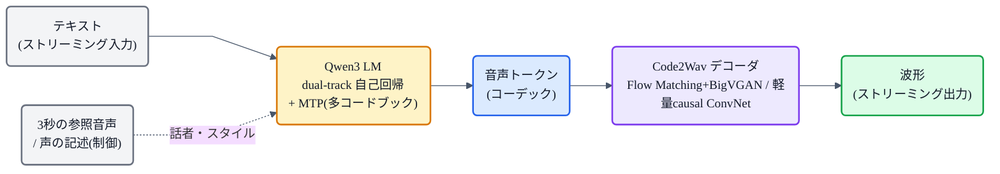

## この記事について

[TTS系譜マップ](https://zenn.dev/nnn112358/articles/tts-lineage-map-from-vits)の「LLM統合」系統、その最新形が **Qwen3-TTS**(2026, Alibaba Qwen)です。**Qwen シリーズ初のTTS**で、多言語・制御可能・そして**超低遅延ストリーミング(最初の音まで97ms)** が売り。

中身は、これまで見てきた「音声を**離散トークン**にして、**LLM(大規模言語モデル)で自己回帰生成**する」というコーデックLM([→VALL-E / CosyVoice](https://zenn.dev/nnn112358/articles/tts-lineage-map-from-vits))の系譜。それを **Qwen3 の LLM** で、リアルタイム向けに徹底的にみがいたモデルです。猫でもわかるように見ていきましょう。⚡

:::message
Qwen3-TTS: Qwen Team, *"Qwen3-TTS Technical Report"* (2026, [arXiv:2601.15621](https://arxiv.org/abs/2601.15621))。**5M時間以上・10以上の言語**で学習、モデルとトークナイザは **Apache 2.0** で公開。本記事の仕様・数値は論文本文で確認しています。ストリーミングの図は matplotlib、フローチャートは mermaid です。
:::

## 3行で言うと

- Qwen3-TTS = **音声を離散トークンにして、Qwen3 の LLM で自己回帰生成**するコーデックLM型のTTS。
- **dual-track(2トラック)** 構成で、テキストを受け取るそばから音声を生成 → **最初の音まで 97ms** の超低遅延ストリーミング。
- **3秒の声クローン**、**自然言語での声デザイン**、多言語(10+)。1.7Bモデルは人間並みの自然さ。

## 位置づけ:「音声トークン + LLM」の系譜

Qwen3-TTS は、[系譜マップ](https://zenn.dev/nnn112358/articles/tts-lineage-map-from-vits)で言う **Codec LM(コーデック言語モデル)** の仲間です。ざっくり言うと、

1. 音声を、テキストの単語のような**離散トークン**に変換する(コーデック)。
2. その音声トークン列を、**LLMが「次のトークン」を自己回帰で予測**して生成する(VALL-E や CosyVoice と同じ発想)。

Qwen3-TTS の新しさは、これを **Qwen3 の LLM を土台に**、そして**リアルタイム(ストリーミング・超低遅延)** で回せるように設計したことです。

## 中身① 音声トークナイザ(コーデック)を2種類

まず「音声をどうトークンにするか」。Qwen3-TTS は目的別に**2つのトークナイザ**を用意しています。

- **25Hz(単一コードブック)**:意味(semantic)を重視。[Qwen2-Audio](https://zenn.dev/nnn112358/articles/tts-lineage-map-from-vits) のエンコーダを土台に、意味と音響のバランスを取る。波形化は **block-wise な DiT + [Flow Matching](https://zenn.dev/nnn112358/articles/flow-for-cats) → メル → BigVGAN**。
- **12.5Hz(多コードブック)**:超低遅延・超低ビットレート向け。Mimi 風に**意味と音響を分離**(最初のコードブック=意味[WavLM 教師]、残り=音響[RVQ])。**完全に因果的(未来を見ない)** なので、**軽量な causal ConvNet だけ**で波形を復元でき、**拡散も話者ベクトルも不要**。これが 97ms を可能にします。

「意味だけのトークンは表現力が足りず、音響だけのトークンは細かすぎてLLMが扱いにくい」——その間を取る、というのが設計思想です。

## 中身② dual-track 自己回帰LM + MTP

そして本体の LLM。Qwen3-TTS は **dual-track(2トラック)** という構成を採ります。テキストのトークンと音声のトークンを**チャンネル方向に並べ**、**テキストトークンを1つ受け取るたびに、対応する音声トークンをすぐ予測**する。だから、発話全体を待たずに**流れ込むテキストから逐次喋りだせます**。

*従来(上)は発話ぜんぶを生成し終えてから音を出すので、最初の音まで待たされる。Qwen3-TTS(下)はテキストが流れ込むそばから音声トークンを出し、**わずか97ms(0.6B)で最初の音**が出て、あとは途切れず流れ続ける。*

多コードブック(12.5Hz)の生成には **MTP(Multi-Token Prediction)** を使います。まず土台のLLMが**0番目のコードブック**を予測し、MTP モジュールが**残りのコードブックをまとめて1フレームで生成**する。これで「1フレーム目からすぐ音にできる」= 超低遅延を実現しています。

## 何ができるのか

- **3秒の声クローン**:3秒の参照音声で、その人の声で喋らせる。
- **声のデザイン・制御**:「落ち着いた低い声で」のような**自然言語の指示**で、新しい声を作ったり細かく調整できる(VoiceDesign / CustomVoice / VoiceEditing)。入力の先頭に指示を付け足すだけ。
- **多言語**:10以上の言語を、**話者を保ったまま**多言語で喋れる。
- **人間並みの自然さ**:1.7B モデルは SOTA の人間らしい品質。
- **オープン**:モデルもトークナイザも **Apache 2.0** で公開。

## 猫のまとめ ⚡

- Qwen3-TTS = **音声を離散トークンにして Qwen3 の LLM で自己回帰生成**するコーデックLM型TTS(VALL-E / CosyVoice の系譜)。
- **dual-track** でテキストを受け取るそばから喋り、**MTP** で多コードブックを1フレーム生成 → **最初の音まで97ms**の超低遅延ストリーミング。
- コーデックは目的別に **25Hz(意味重視・DiT+Flow Matching)** と **12.5Hz(多コードブック・causal ConvNet・超低遅延)** の2種。
- **3秒クローン・自然言語での声デザイン・多言語**、1.7Bは人間並み、Apache 2.0。

VITS のような単段E2E とはまた別の、「**LLMに喋らせる**」路線の最前線。リアルタイム対話AIの音声を支える技術です。

## 参考リンク

- [Qwen3-TTS Technical Report (arXiv:2601.15621)](https://arxiv.org/abs/2601.15621) / [QwenLM/Qwen3-TTS](https://github.com/QwenLM/Qwen3-TTS)
- 関連記事: [VITSから見るTTS 10系統マップ](https://zenn.dev/nnn112358/articles/tts-lineage-map-from-vits) / [猫でもわかるFlow](https://zenn.dev/nnn112358/articles/flow-for-cats) / [猫でもわかるBERT](https://zenn.dev/nnn112358/articles/bert-for-cats)

:::message
🐾 **猫でもわかるTTSシリーズ**(全28本) ― [目次](https://zenn.dev/nnn112358/articles/tts-for-cats-index) ／ 前: [LLM TTS](https://zenn.dev/nnn112358/articles/llm-tts-for-cats) ／ 次: [zero-shot TTS](https://zenn.dev/nnn112358/articles/zero-shot-for-cats)
:::
