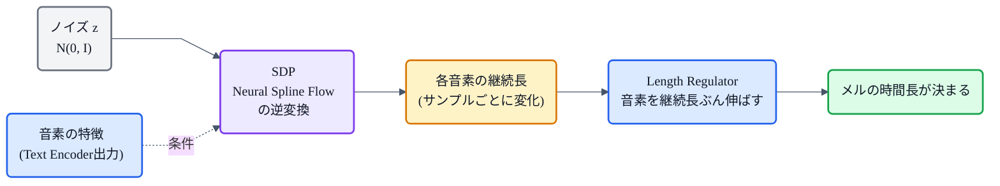

## この記事について

[猫でもわかるVITS](https://zenn.dev/nnn112358/articles/vits-for-cats)で、VITS を構成する部品として **SDP(確率的継続長予測器 / Stochastic Duration Predictor)** をちらっと紹介しました。この記事はその深掘りです。

SDP は、VITS が **「同じ文でも、読むたびに少しずつ違う自然なリズム」** を生み出すための仕組み。中身は[正規化フロー](https://zenn.dev/nnn112358/articles/flow-for-cats)の応用で、少し技巧的ですが、狙いはとてもシンプルです。猫でもわかるように解いていきます。🎲

:::message
SDP は VITS(Kim et al., ICML 2021, [arXiv:2106.06103](https://arxiv.org/abs/2106.06103))の一部です。本記事の仕様・数式は論文本文で確認しています。図のうちフローチャートは mermaid、リズムの図は matplotlib で作成しました。
:::

## 3行で言うと

- SDP = 各音素の**継続長(長さ)を「1つの値」ではなく「分布」でモデル化**し、そこからサンプリングする仕組み。
- だから同じテキストでも**毎回ちがう自然なリズム**が出る(=リズムの「一対多問題」への答え)。
- 中身は**正規化フロー**。継続長が「整数・1次元」で扱いにくいので、**脱量子化とデータ拡張**という2つの工夫を使う。

## まず「継続長予測」と、その限界

[音響モデルの記事](https://zenn.dev/nnn112358/articles/acoustic-model-for-cats)で見たように、TTS では **各音素が何フレーム続くか(継続長)** を決める必要があります。FastSpeech 2 などの非自己回帰モデルは、継続長予測器で**各音素に1つの長さを決め打ち**します(決定的)。

これは速くて頑健なのですが、弱点があります。**同じ文はいつも同じリズム**になってしまうのです。でも人間は、同じ「こんにちは」でも、そのつど微妙に違う間(ま)や速さで話します。テキスト1つに対して"正解の話し方"は無数にある——これが[一対多問題](https://zenn.dev/nnn112358/articles/acoustic-model-for-cats)です。

*同じ音素列 `ko N ni chi wa` でも、決定的予測(最上段)は毎回まったく同じ区切り。SDP(下3つ)はサンプルごとに各音素の長さが変わり、毎回ちがうリズムになる。*

## SDPのアイデア:継続長を「分布」にする

SDP の発想はこうです。

> 継続長を**1つの数**に決めるのをやめ、**確率分布**としてモデル化する。使うときはそこから**サンプリング**する。

サンプリングなので、引くたびに少しずつ違う長さが出てきます。結果、同じテキストから**毎回ちがう自然なリズム**が生まれる。この「分布からのサンプリング」を担うのが**正規化フロー**です([→Flow](https://zenn.dev/nnn112358/articles/flow-for-cats))。

推論のときは、ノイズをサンプリングして、それをフローの**逆変換**(テキストの特徴で条件づけ)に通し、継続長へと変換します。ノイズを変えれば、出てくるリズムも変わります。

## なぜ難しいのか:継続長は「整数・1次元」

ここでひと工夫が要ります。[正規化フロー](https://zenn.dev/nnn112358/articles/flow-for-cats)は本来、**連続的で高次元**なデータを変換するのが得意です。ところが継続長は、

- **整数**(3フレーム、5フレーム…)であって連続値ではない、
- 1音素につき**スカラー(1次元)** しかない、

という、フローにとって扱いにくい相手です。1次元だと、可逆変換の自由度が足りず、うまく変換できません。

## 2つの工夫:脱量子化 と データ拡張

VITS はこれを、**変分的な**2つのテクニックで解決します。

**① 脱量子化(dequantization)**:整数のままだと連続フローに載らないので、小さなノイズ `u` を引いて連続値にします。VITS では `u` の範囲を **0以上1未満**に制限し、`d − u` が**正の実数の列**になるようにします。

**② データ拡張(data augmentation)**:1次元では可逆変換の自由度が足りないので、追加の変数 `ν` を継続長にくっつけて**次元を増やし**、フローが変換できる"余地"を作ります。

この `u` と `ν` は、小さな事後分布ネットワーク `q(u, ν | d, テキスト)` からサンプリングします。そして学習は、音素継続長の対数尤度の**変分下限(ELBO)を最大化**する形で行います。損失 `L_dur` はこの**負の変分下限**です。VAE の記事で見た「変分下限を最大化する」考え方([→VAE](https://zenn.dev/nnn112358/articles/vae-for-cats))が、ここでも効いているわけです。

## 中身の部品:Neural Spline Flow と stop gradient

SDP のフローには、[VITS本流のフロー](https://zenn.dev/nnn112358/articles/flow-for-cats)で使うアフィンカップリングよりも表現力の高い **Neural Spline Flow**(単調な有理二次スプラインを使う可逆変換, Durkan et al. 2019)を採用しています。同じくらいのパラメータ数で、より複雑な分布を表せます。

もう一つの工夫が **stop gradient**。SDP の入力条件(テキストの特徴)には勾配を逆伝播させないようにして、**SDP の学習が VITS の他のモジュールに悪影響を与えない**ようにしています。継続長という"別問題"を、本体の音質学習から切り離しているイメージです。

## どこで効くのか

SDP のおかげで、VITS は同じ「こんにちは」でも、**そのつど少し違う、自然な間や速さ**で発話できます。決定的予測にありがちな**「棒読み感」「毎回そっくり同じ」を避けられる**のが最大の価値です。

VITS 全体では、SDP は **VAE + Flow + GAN + MAS + SDP** という部品のひとつ。骨格や音質を V・F・G・MAS が担い、**"喋り方の多様性"だけを SDP が引き受けている**、という分業になっています([→VITS](https://zenn.dev/nnn112358/articles/vits-for-cats))。

## 猫のまとめ 🎲

- SDP = 継続長を**分布**にしてサンプリングする仕組み。だから**毎回ちがう自然なリズム**が出る(リズムの一対多問題への答え)。
- 中身は**正規化フロー**。推論は「ノイズ → 逆変換(テキスト条件) → 継続長」。
- 継続長が「整数・1次元」で扱いにくいので、**① 脱量子化(連続値に)** と **② データ拡張(高次元に)** の2工夫。学習は**変分下限の最大化**(損失 `L_dur`)。
- 表現力のため **Neural Spline Flow**、他モジュールを乱さないため **stop gradient**。
- VITS の中では、**"喋り方の多様性"担当**の部品。

決定的な予測が「速い・頑健」を担うのに対し、SDP は「人間らしいゆらぎ」を足す係。地味ですが、VITS の"生っぽさ"を支える大事なピースです。

## 参考リンク

- [VITS (arXiv:2106.06103)](https://arxiv.org/abs/2106.06103) / 実装 [jaywalnut310/vits](https://github.com/jaywalnut310/vits)
- [Neural Spline Flows (arXiv:1906.04032)](https://arxiv.org/abs/1906.04032)
- 関連記事: [猫でもわかるVITS](https://zenn.dev/nnn112358/articles/vits-for-cats) / [猫でもわかるFlow](https://zenn.dev/nnn112358/articles/flow-for-cats) / [猫でもわかるVAE](https://zenn.dev/nnn112358/articles/vae-for-cats) / [猫でもわかる音響モデル](https://zenn.dev/nnn112358/articles/acoustic-model-for-cats)

:::message
🐾 **猫でもわかるTTSシリーズ**(全27本) ― [目次](https://zenn.dev/nnn112358/articles/tts-for-cats-index) ／ 前: [MAS](https://zenn.dev/nnn112358/articles/mas-for-cats) ／ 次: [Glow-TTS](https://zenn.dev/nnn112358/articles/glow-tts-for-cats)
:::
