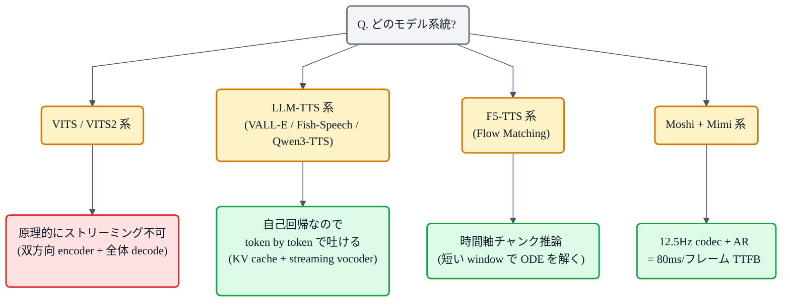

## この記事について

TTS を「アプリに組み込む」段階まで進むと、モデルの MOS よりも **「読み上げボタンを押して最初の音が出るまで、何秒待つか」** の方が体験を左右します。会話ボットや読み上げアシスタントを作ろうとした瞬間、**リアルタイム性 (streaming)** が主戦場に上がってきます。

面白いのは、モデルの世代によって「そもそもストリーミングできるかどうか」が **アーキテクチャの都合で決まっている**ことです。VITS は原理上一発推論なのに対し、F5-TTS や Qwen3-TTS や Moshi は生まれつきストリーミングできる。ここが混乱の元にもなっています。

この記事は、TTS のリアルタイム性を **「なぜ一発推論しかできないのか / どうすればストリーミングできるのか」** の視点から解きほぐし、実装レベルで何が違うのかを一望できる形にまとめます。

シリーズの位置づけ:
- 前提: 本の [「VITS」](https://zenn.dev/nnn112358/books/tts-from-text-to-audio/viewer/vits) / [「LLM TTS」](https://zenn.dev/nnn112358/books/tts-from-text-to-audio/viewer/llm-tts) / [「F5-TTS」](https://zenn.dev/nnn112358/books/tts-from-text-to-audio/viewer/f5-tts) / [「Qwen3-TTS」](https://zenn.dev/nnn112358/books/tts-from-text-to-audio/viewer/qwen3-tts) の各章
- 関連: 記事 [「音声トークナイザ徹底比較」](https://zenn.dev/nnn112358/articles/neural-audio-codecs) ── ストリーミング化のカギ Mimi の話が出ます

## 「リアルタイム」に必要な 2 つの数字

TTS の速さを議論するとき、ふつう次の 2 つを区別します。

- **RTF (Real Time Factor)** ── 生成にかかった時間 ÷ 生成された音声の長さ。RTF < 1 なら「話す速さより速く作れる」= 実時間再生に間に合う
- **TTFB (Time To First Byte)** ── 「合成開始」から「最初の音」までの待ち時間。ユーザー体験に直接効く数字

同じ RTF 0.3 のモデルでも、**TTFB が 3 秒**か **TTFB が 200ms** かで体験は別物です。前者は「読み上げ機能」、後者は「対話エージェント」に使えます。

## VITS が「一発推論」しかできない理由

まず、VITS 系はなぜ原理上、ストリーミングにできないのかから見ておきます。理由は 3 つ:

1. **Text エンコーダが双方向 Transformer** ── 文の全体を見てから中間表現を作る。文が最後まで揃わないと、前方の音素の埋め込みも決まらない
2. **Monotonic Alignment Search (MAS)** による duration 予測が、**シーケンス全体**に対して最適化される（本の [「MAS」](https://zenn.dev/nnn112358/books/tts-from-text-to-audio/viewer/mas) の章参照）
3. **Flow デコーダの逆変換**もシーケンス全体を通す設計

つまり VITS は、テキストが全部揃った段階で **1 回の順伝播で音声波形を吐き出す**、という設計思想の結晶です。品質と実装のシンプルさは両立するが、テキストの続きを待つ「対話」のような使い方には向きません。

## ストリーミング化に必要な 4 つの技術要素

一方、F5-TTS や LLM-TTS 系がストリーミングできるのは、次の 4 要素を持っているからです。

### 1. Chunked processing (チャンク分割)

音声を **短い時間チャンク (10ms 〜 数百 ms)** に区切って、1 チャンクずつ処理・出力する。全体を待たず、1 チャンク完成したら即座に再生キューに流せる。

### 2. Causal architecture (因果的アーキテクチャ)

未来を見ないで現在の出力を決められる構造。具体的には:

- **Causal Attention** ── 未来のトークンをマスクする
- **Causal Convolution** ── フィルタが左方向のみを参照する（本の [「WaveNet」](https://zenn.dev/nnn112358/books/tts-from-text-to-audio/viewer/wavenet) の章の dilated conv がまさにこれ）
- **RNN / SSM 系** ── 状態を左から右へ順に流す

VITS の双方向 Transformer とちょうど反対の構造です。

### 3. KV cache (キーバリューキャッシュ)

過去のトークンに対する Attention の Key / Value を **保存しておき、再計算しない**。LLM の推論高速化と同じ考え方で、Transformer を「順に 1 トークンずつ生成する」形にしたときに必須の技術。

### 4. Lookahead と overlap-add

「未来を見ない」を厳密に守ると音質が下がるので、**少しだけ未来を先読み**して、境界の連続性を保つ。**overlap-add** は隣接チャンクの端を重ねて滑らかに繋ぐ古典的手法で、STFT ベースのボコーダで多用されます。

これら 4 つを組み合わせて、**「文が終わる前から音を流し始める」**ができるようになります。

## 一発推論 vs ストリーミング: 時間軸で見る

上で述べた「一発推論」と「ストリーミング」の違いを、時間軸で表したのが下の図です。同じ長さの発話を作るのに、**TTFB (最初の音が出るまで)** が桁で違うことがわかります。

- **上段 (一発推論)** ── テキスト全体をエンコード → 全波形をまとめて生成 → 4 秒後にやっと再生開始
- **下段 (ストリーミング)** ── prefix を短くエンコードしたら、あとは 1 秒未満で最初のチャンクが出せる。TTFB が桁で改善

VITS の RTF は速いのに、対話に向かないのはこのため。RTF < 1 でも **TTFB は音声全長に近い**からです。

## ストリーミング TTS の実装パターン

主要な実装がどのパターンでストリーミングを達成しているか、系統立てて並べます。

### LLM-TTS 系 (VALL-E / Fish-Speech / Qwen3-TTS)

**自己回帰の言語モデル**として音声トークンを 1 つずつ生成するので、**素で streaming に向いた構造**です。実装のコツ:

- **KV cache** を有効化して 1 トークンずつ生成
- 音声トークナイザ側も **streaming decoder** を用意（EnCodec / Mimi 等はストリーミング推論を初めからサポート）
- テキスト側 (LLM のプロンプト) も **prefix caching** で温存

これで「テキストの続きが来たら、そのままトークンを追加して喋り続ける」という対話モデルが組めます。

### Moshi + Mimi 系

Kyutai の Moshi は「会話しながら喋る」ためのモデルで、その裏の音声トークナイザが Mimi です。詳細は [「音声トークナイザ徹底比較」](https://zenn.dev/nnn112358/articles/neural-audio-codecs) 参照。

- Mimi は **12.5Hz** = 1 フレーム 80ms
- LLM が 1 フレーム生成するたびに、Mimi デコーダが 80ms 分の音を出力
- **理論上の最小 TTFB ≒ 80 〜 数百 ms**

低フレームレートのコーデックを選ぶことが、リアルタイム TTS の実装コストを一段下げているのが Moshi のポイントです。

### F5-TTS 系 (Flow Matching)

F5-TTS は本来「非自己回帰」なのに、実装上はストリーミングできます。ここには少し工夫があります:

- 時間軸を **チャンク**に区切って、それぞれのチャンクで **短い ODE を解く**
- チャンク間の連続性は overlap-add と lookahead 数フレームで担保
- 品質と TTFB のトレードオフをチャンク幅で調整できる

Flow Matching の仕組みは本の [「Flow Matching」](https://zenn.dev/nnn112358/books/tts-from-text-to-audio/viewer/flow-matching) の章、F5 の具体的な設計は [「F5-TTS」](https://zenn.dev/nnn112358/books/tts-from-text-to-audio/viewer/f5-tts) の章を。

### VITS 系

VITS を「無理やり streaming にする」実装もあります (例: chunked VITS, streaming HiFi-GAN の組み合わせ)。ただし:

- Text エンコーダは **短い prefix ずつ**エンコードするか、テキストを句読点で **cut して個別合成**
- ボコーダ (HiFi-GAN) は 1 秒程度の Mel から wave を出せるので、Mel が届いた瞬間に streaming ボコード

結果、**「1 文単位のバッチ処理 + ボコーダは streaming」** という形が現実解になります。VITS の TTFB を 1 秒以下に持って行くには、この妥協が必要です。

## トレードオフ: 品質 vs 遅延

「早ければ早いほど良い」ではなく、遅延を短くすると品質が犠牲になる場面もあります。

| 打ち手 | TTFB への効き | 品質への影響 |
|---|---|---|
| チャンク幅を短くする | 大 (短いほど TTFB↓) | 境界のアーティファクト増、音質低下 |
| lookahead を減らす | 中 (減らすほど TTFB↓) | 韻律・イントネーションが不自然に |
| コーデックのフレームレートを下げる (Mimi 化) | 大 (12.5Hz で TTFB 桁下がる) | 高周波・細かい発音の再現が難しく |
| KV cache 有効化 | 中 | 品質影響なし。実装コストのみ |
| Overlap-add の窓を長くする | 小 (窓分だけ TTFB↑) | 境界の連続性が改善 |

**「対話用途なら TTFB 400ms 以下を目標、読み上げアプリなら 1 秒以下」**が 2020 年代後半の相場感です。ChatGPT の音声対話や Moshi は、この 400ms のラインを狙って設計しています。

## 実運用の型

「今から新規で TTS を組む」ときの、目的別のおすすめ構成をまとめると:

**バッチ処理でよい (読み上げアプリ、ナレーション生成)**
→ **VITS 系** をそのまま使う。品質が高く、実装も枯れている

**低遅延の対話 (音声アシスタント、Voice AI)**
→ **Moshi + Mimi** か **Qwen3-TTS streaming**。TTFB 400ms 以下が現実的

**長文の連続読み上げで、途中経過も返したい**
→ **F5-TTS の chunked streaming** か **VITS の文単位 streaming**。段落レベルでの UX 改善

**Zero-shot でしゃべらせたい + そこそこ低遅延**
→ **Fish-Speech**。streaming と少データ話者クローンを両立させやすい

## まとめ

- リアルタイム性は **RTF** と **TTFB** の 2 軸で見る
- VITS 系は原理的に **一発推論** (双方向 encoder + 全体 decode) なので、素の streaming は不可
- ストリーミング化には **チャンク分割 / 因果的アーキテクチャ / KV cache / lookahead** の 4 要素が要る
- LLM-TTS 系は素で streaming 向き。**低フレームレートのコーデック (Mimi の 12.5Hz)** が実装を一段楽にする
- 品質と TTFB は明確にトレードオフ。用途に合わせて **対話 400ms / 読み上げ 1s** を目安に設計

## 関連リンク

- 本: [VITS](https://zenn.dev/nnn112358/books/tts-from-text-to-audio/viewer/vits) / [LLM TTS](https://zenn.dev/nnn112358/books/tts-from-text-to-audio/viewer/llm-tts) / [F5-TTS](https://zenn.dev/nnn112358/books/tts-from-text-to-audio/viewer/f5-tts) / [Qwen3-TTS](https://zenn.dev/nnn112358/books/tts-from-text-to-audio/viewer/qwen3-tts) / [Fish-Speech](https://zenn.dev/nnn112358/books/tts-from-text-to-audio/viewer/fish-speech) / [Flow Matching](https://zenn.dev/nnn112358/books/tts-from-text-to-audio/viewer/flow-matching)
- 記事: [音声トークナイザ徹底比較](https://zenn.dev/nnn112358/articles/neural-audio-codecs)
- 記事: [TTSの評価指標カタログ](https://zenn.dev/nnn112358/articles/tts-evaluation-metrics)
- 記事: [日本語TTSのためのデータセット選び](https://zenn.dev/nnn112358/articles/japanese-tts-datasets)
