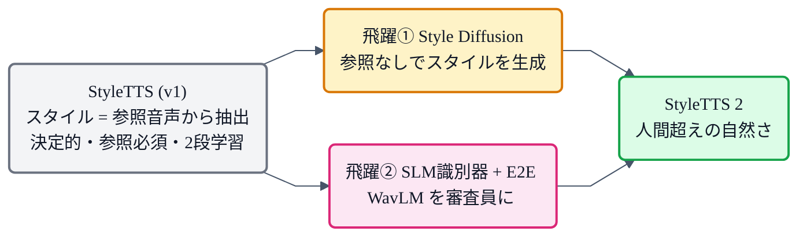
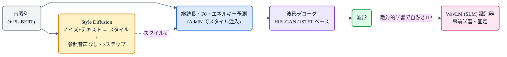

## この記事について

これまで [VITS](https://zenn.dev/nnn112358/articles/vits-for-cats) を「人間並み品質」の到達点として見てきましたが、そこを**さらに超えた**と報告されたモデルが **StyleTTS 2**(2023)です。LJSpeech で**人間の録音を上回る**評価(CMOS +0.28)を出しました。

カギは2つ、**Style Diffusion**(スタイルを拡散モデルで生成)と、**SLM(大規模音声言語モデル WavLM)を識別器に使う敵対的学習**。これまでの記事の [GAN](https://zenn.dev/nnn112358/articles/gan-for-cats)・[HiFi-GAN](https://zenn.dev/nnn112358/articles/hifigan-for-cats)・[iSTFTNet](https://zenn.dev/nnn112358/articles/istftnet-for-cats) に、拡散モデルと巨大事前学習モデルが合わさる形です。猫でもわかるように見ていきましょう。🎭

:::message
StyleTTS 2: Li, Han, Mesgarani (2023, [arXiv:2306.07691](https://arxiv.org/abs/2306.07691))。前身の StyleTTS(2022)を土台にしています。本記事の仕様・数値は論文本文で確認しています。スタイルの図は matplotlib、フローチャートは mermaid です。
:::

## 3行で言うと

- StyleTTS 2 = **「スタイル」という1本のベクトルで話し方を操る**TTS。人間超えを達成。
- **Style Diffusion**:スタイルを、参照音声なしで**拡散モデルからサンプリング**して生成 → 多様で自然。しかも小さなベクトルだけ拡散するので**速い**。
- **SLM識別器**:巨大な事前学習済み音声モデル **WavLM を"審査員"** にして敵対的学習 → 人間の知覚に近い自然さ。

## 「スタイル」とは何か

StyleTTS 系のキーワードは **スタイル(style)**。これは論文いわく「音素(何を喋るか)以外のすべて」——**韻律・抑揚・話速・強勢・感情**などをひっくるめた概念で、これを**1本の固定長ベクトル `s`** にまとめて表します。

このスタイルベクトルを、音響生成や継続長・韻律の予測器に **AdaIN(adaptive instance normalization)** という仕組みで注入すると、同じテキストでも `s` を変えるだけで**話し方(長さ・抑揚・感情)がガラッと変わる**。これが前身 StyleTTS の発明でした。

## 前身 StyleTTS の限界

ただ、StyleTTS(v1)には弱点がありました。**スタイル `s` を参照音声から取り出していた**のです(`s = 話者音声のエンコード`)。つまり、

- 生成が**決定的**(参照が同じなら同じ話し方)で表現が限られる、
- そもそも**参照音声が必要**、
- しかもメル→波形が別段(ボコーダ)で品質が落ちる、

という課題がありました。StyleTTS 2 は、ここを作り替えます。

*v1 の3つの課題(決定的・参照必須・2段)を、2つの飛躍で作り替えたのが StyleTTS 2。*

## 飛躍① Style Diffusion:スタイルを"生成"する

StyleTTS 2 の一番の発明が **Style Diffusion**。スタイルを参照音声からコピーするのをやめ、**テキストを条件に、拡散モデルでスタイルベクトル `s` をサンプリングして生成**します。式で書くと、音声 `x` を「スタイル `s` を介した」分布として表し、`s` を `p(s|テキスト)` から拡散で引きます。

*同じテキストでも、スタイルをサンプリングし直すたびに、ピッチ(F0)の高さ・幅・抑揚がちがう。全部「それらしく自然」なまま多様——これが拡散でスタイルを生成する狙い。参照音声はいらない。*

ここが賢いのは、**拡散するのが"小さな固定長ベクトル"だけ**という点。メルや波形を拡散でちまちま作る従来の拡散TTSと違い、スタイルベクトルだけなら**たった3ステップ**で済み、**速い**。拡散の「多様さ」を、GANの「速さ」を殺さずに取り込んだわけです。

## 飛躍② SLM識別器:WavLMを審査員に

もう一つが **SLM(Speech Language Model)を識別器に使う**こと。SLM とは、大量の音声で自己教師あり事前学習された巨大モデル([HuBERT や WavLM](https://zenn.dev/nnn112358/articles/tts-lineage-map-from-vits))で、その内部表現は**人間の音声知覚に近い**とされます。

StyleTTS 2 は、**94,000時間で学習ずみの WavLM を"審査員(識別器)"** にして([→GANの敵対的学習](https://zenn.dev/nnn112358/articles/gan-for-cats))、生成音声を本物らしく鍛えます。WavLM 自体は固定して、小さな判定ヘッドだけ付ける形。人間に近い目を持つ審査員に合格するよう学習することで、自然さが跳ね上がります。

これを可能にしたのが **微分可能な継続長モデリング(differentiable duration modeling)**。継続長は普通そのままでは微分できず、末端まで勾配を流せませんが、そこを微分可能にすることで、**テキストから波形までを一気通貫(E2E)で、SLMの敵対的損失で最適化**できるようにしました。

## 全体像

波形デコーダは **[HiFi-GAN](https://zenn.dev/nnn112358/articles/hifigan-for-cats) ベース**か **[iSTFTNet](https://zenn.dev/nnn112358/articles/istftnet-for-cats) ベース**を選べ、メルを介さず**波形を直接生成**(E2E)。これまで見てきたボコーダ技術が、そのまま中で効いています。

## 成果

- **LJSpeech で人間の録音を上回る**(CMOS +0.28, p<0.05)。NaturalSpeech に対しても +1.07。
- **VCTK(多話者)で人間並み**の自然さ。
- **データ効率**:LibriTTS 学習で、zero-shot 話者適応において **VALL-E を自然さで上回り**、しかも**約250分の1のデータ**量。3秒の参照で話者を真似られる。

「単段・公開データで、初めて人間レベルを達成」した点が画期的でした。

## 猫のまとめ 🎭

- StyleTTS 2 = **スタイル(音素以外の話し方すべて)を1本のベクトルで操る**TTS。人間超えを達成。
- **Style Diffusion**:スタイルを拡散モデルで生成(参照音声なし・多様)。小さなベクトルだけ拡散するので**3ステップで速い**。
- **SLM識別器**:人間の知覚に近い **WavLM を審査員**に敵対的学習 → 自然さUP。**微分可能な継続長**でE2E化。
- 波形は **HiFi-GAN / iSTFT ベースのデコーダ**で直接生成。AdaIN でスタイル注入。
- 結果、**LJSpeechで人間超え**・VCTK人間並み・zero-shotもデータ効率よく高性能。

拡散の多様さ、GANの速さ・品質、巨大事前学習モデルの知覚——これらを"スタイル"という小さな鍵でまとめ上げたのが StyleTTS 2 でした。

## 参考リンク

- [StyleTTS 2 (arXiv:2306.07691)](https://arxiv.org/abs/2306.07691) / 実装 [yl4579/StyleTTS2](https://github.com/yl4579/StyleTTS2) / 前身 [StyleTTS (arXiv:2205.15439)](https://arxiv.org/abs/2205.15439)
- 関連記事: [猫でもわかるGAN](https://zenn.dev/nnn112358/articles/gan-for-cats) / [猫でもわかるHiFi-GAN](https://zenn.dev/nnn112358/articles/hifigan-for-cats) / [猫でもわかるiSTFTNet](https://zenn.dev/nnn112358/articles/istftnet-for-cats) / [猫でもわかるVITS](https://zenn.dev/nnn112358/articles/vits-for-cats) / [VITSから見るTTS 10系統マップ](https://zenn.dev/nnn112358/articles/tts-lineage-map-from-vits)

:::message
🐾 **猫でもわかるTTSシリーズ**(全27本) ― [目次](https://zenn.dev/nnn112358/articles/tts-for-cats-index) ／ 前: [VITS2](https://zenn.dev/nnn112358/articles/vits2-for-cats) ／ 次: [BERT](https://zenn.dev/nnn112358/articles/bert-for-cats)
:::
