## この記事について

このシリーズでは VITS や [Qwen3-TTS](https://zenn.dev/nnn112358/articles/qwen-tts-for-cats) といった現代のモデルを見てきましたが、今回は歴史をさかのぼって **Tacotron**(2017, Google)を見ます。**文字から音(スペクトログラム)を直接作った、エンドツーエンド(E2E)TTS の原点**です。

いまでは当たり前の「文字を入れたら音が出る」——これを、人手の設計をほぼ捨てて、**seq2seq + Attention** ひとつで実現した記念碑的モデル。ここから [Tacotron 2](https://zenn.dev/nnn112358/articles/acoustic-model-for-cats) → 現代へと続く流れが始まりました。猫でもわかるように見ていきましょう。🌮

:::message
Tacotron: Wang et al., *"Tacotron: Towards End-to-End Speech Synthesis"* (2017, [arXiv:1703.10135](https://arxiv.org/abs/1703.10135))。US英語で MOS 3.82(当時の商用パラメトリック方式を上回る)。本記事の仕様は論文本文で確認しています。図は matplotlib と mermaid で作成しました。
:::

## 3行で言うと

- Tacotron = **文字列 →(seq2seq + Attention)→ スペクトログラム** を、ゼロから一括学習する最初期のE2E TTS。
- **Attention が「どの文字を今喋るか」の対応(アライメント)を自分で学ぶ**。音素アライメントは不要。
- 波形化は **Griffin-Lim**(ニューラルボコーダではない)。ここを WaveNet に差し替えたのが Tacotron 2。

## 何が新しかったか:多段パイプラインを畳む

Tacotron 以前の TTS は、**テキスト解析フロントエンド → 音響モデル → ボコーダ** と、専門知識で作った部品を積み重ねる多段構成でした。各段の設計は職人芸で、誤りも積み重なります。

Tacotron は、これを **1つのニューラルネットに畳み込み**ました。〈文字, 音声〉のペアさえあれば、**ランダム初期化から丸ごと学習**できる。音素への変換もアライメント注釈も要らないので、大量の音声データにそのままスケールできます。当時としては大きな飛躍でした。

## 心臓:seq2seq + Attention

Tacotron の背骨は、機械翻訳などで使われていた **seq2seq(系列変換)+ Attention** です。

- **エンコーダ**:文字列を読み込み、意味のある表現の列にする。
- **Attention(注意機構)**:出力の各時刻で、**入力のどの文字に注目すべきか**を選ぶ。
- **デコーダ**:注目先を頼りに、**スペクトログラムを1フレームずつ**生成する。

ここで生まれるのが **アライメント(対応関係)**。「今このフレームは、だいたいこの文字あたりを喋っている」という対応を、**Attention が学習の中で自動的に獲得**します。

*縦が入力文字、横がスペクトログラムのフレーム(時間)。明るい帯が「そのフレームでどの文字に注目したか」。きれいな斜めの帯 = 文字が順番どおり音に対応している証拠で、これが崩れると読み飛ばしや繰り返しが起きる。*

## 全体像

```mermaid
%%{init: {'theme':'base','themeVariables':{'lineColor':'#475569','fontFamily':'Noto Sans CJK JP, sans-serif','fontSize':'15px'},'flowchart':{'padding':14,'nodeSpacing':46,'rankSpacing':50,'curve':'linear'}}}%%
flowchart LR
    C("文字列<br/>Tacotron"):::gray --> E("エンコーダ<br/>(CBHG)"):::blue
    E --> AT("Attention<br/>対応を学ぶ"):::amber
    AT --> D("デコーダ<br/>フレーム単位で生成"):::purple
    D --> S("スペクトログラム"):::green
    S --> GL("Griffin-Lim<br/>(位相を復元)"):::gray
    GL --> W("波形"):::green
    classDef blue fill:#dbeafe,stroke:#2563eb,stroke-width:2px,color:#111827
    classDef amber fill:#fef3c7,stroke:#d97706,stroke-width:2px,color:#111827
    classDef purple fill:#ede9fe,stroke:#7c3aed,stroke-width:2px,color:#111827
    classDef green fill:#dcfce7,stroke:#16a34a,stroke-width:2px,color:#111827
    classDef gray fill:#f3f4f6,stroke:#6b7280,stroke-width:2px,color:#111827
```

工夫の目玉が **CBHG** というモジュール(1次元畳み込みバンク + ハイウェイ網 + 双方向GRU)。文字列や中間表現から特徴をうまく引き出すために、エンコーダと後処理で使われます。

また、[WaveNet](https://zenn.dev/nnn112358/articles/wavenet-for-cats) が波形を**サンプル単位**で作る(ゆえに遅い)のに対し、Tacotron は**フレーム単位**でスペクトログラムを作るので、はるかに高速でした。

## 波形化は Griffin-Lim

Tacotron が出すのはスペクトログラム(振幅情報)まで。そこから波形にするには**位相**を補う必要があり、Tacotron(v1)は古典的な **Griffin-Lim 法**を使いました。手軽ですが、ニューラルボコーダほどの音質は出ません。

だからこそ次の一手が分かりやすい。**この Griffin-Lim を [WaveNet](https://zenn.dev/nnn112358/articles/wavenet-for-cats) ボコーダに差し替え、中間表現を[メルスペクトログラム](https://zenn.dev/nnn112358/articles/what-is-mel-spectrogram)にした**のが **Tacotron 2**。音質が一気に人間レベルへ近づきました([→音響モデルの記事](https://zenn.dev/nnn112358/articles/acoustic-model-for-cats))。

## 意義と系譜

Tacotron は、**ニューラルE2E TTS の起点**です。ここから、

- **Tacotron 2**:メル + WaveNet で高音質化。自己回帰+Attention 系の代表に。
- しかし Attention は**読み飛ばし・繰り返し**(アライメント崩壊)が起きやすい弱点も持ちます。これを決定的に解いたのが、[Glow-TTS](https://zenn.dev/nnn112358/articles/glow-tts-for-cats) / [VITS](https://zenn.dev/nnn112358/articles/vits-for-cats) の **[MAS](https://zenn.dev/nnn112358/articles/mas-for-cats)**(単調アライメント)や、[F5-TTS](https://zenn.dev/nnn112358/articles/f5-tts-for-cats) のフィラー方式でした。

つまり Tacotron が示した「文字→音を丸ごと学ぶ」という発想が、その後のTTS([→系譜マップ](https://zenn.dev/nnn112358/articles/tts-lineage-map-from-vits))すべての土台になっています。

## 猫のまとめ 🌮

- Tacotron = **文字 →(seq2seq + Attention)→ スペクトログラム**をゼロから一括学習した、最初期のE2E TTS。
- 多段パイプライン(フロントエンド+音響+ボコーダ)を1つのネットに畳み込んだのが革命的だった。
- **Attention がアライメント(文字と音の対応)を自分で学ぶ**。CBHGで特徴抽出、フレーム単位で高速。
- 波形化は **Griffin-Lim**。ここを WaveNet に替えたのが **Tacotron 2** で、高音質化。
- Attention の暴走(読み飛ばし)問題は、後の **MAS** や **フィラー方式** が解決していく。E2E TTSの原点。

「文字を入れたら音が出る」——今では当たり前のこの体験は、Tacotron から始まりました。🌮

## 参考リンク

- [Tacotron (arXiv:1703.10135)](https://arxiv.org/abs/1703.10135) / [Tacotron 2 (arXiv:1712.05884)](https://arxiv.org/abs/1712.05884)
- 関連記事: [猫でもわかる音響モデル(Tacotron 2)](https://zenn.dev/nnn112358/articles/acoustic-model-for-cats) / [猫でもわかるWaveNet](https://zenn.dev/nnn112358/articles/wavenet-for-cats) / [猫でもわかるMAS](https://zenn.dev/nnn112358/articles/mas-for-cats) / [VITSから見るTTS 10系統マップ](https://zenn.dev/nnn112358/articles/tts-lineage-map-from-vits)

:::message
🐾 **猫でもわかるTTSシリーズ**(全25本) ― [目次](https://zenn.dev/nnn112358/articles/tts-for-cats-index) ／ 次: [音響モデル(Tacotron 2)](https://zenn.dev/nnn112358/articles/acoustic-model-for-cats)
:::
