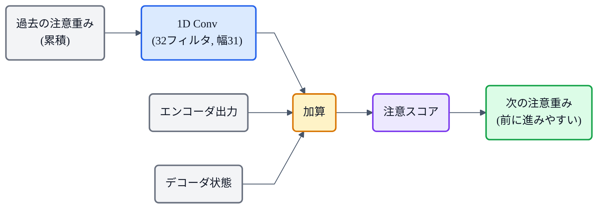
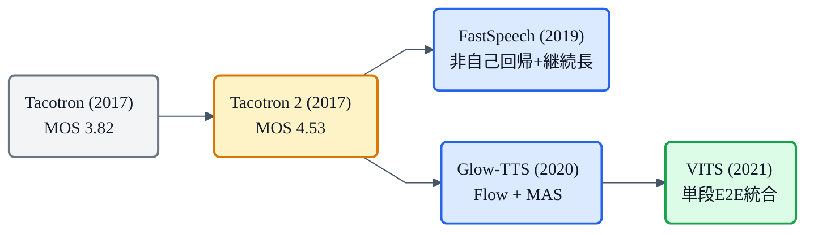

## この記事について

[猫でもわかるTacotron](https://zenn.dev/nnn112358/articles/tacotron-for-cats) の続きです。Tacotron は「文字→音を丸ごと学ぶ」E2E TTS を切り拓きましたが、波形化に Griffin-Lim を使っていたため音質に限界がありました（MOS 3.82）。

**Tacotron 2**(2017, Google）は、Tacotron の各部品を洗練し、波形化を **WaveNet** に差し替えることで、**MOS 4.53 ― 人間の録音(4.58)とほぼ区別がつかない**品質を達成しました。猫でもわかるように、何が変わったのかを見ていきましょう。🌮

:::message
Tacotron 2: Shen et al., *"Natural TTS Synthesis by Conditioning WaveNet on Mel Spectrogram Predictions"* (2017, [arXiv:1712.05884](https://arxiv.org/abs/1712.05884))。同じ 24.6 時間・単一話者データで、MOS 4.53（GT 4.58）。本記事の仕様・数値は論文本文で確認しています。図は matplotlib と mermaid で作成しました。
:::

## 3行で言うと

- Tacotron 2 = Tacotron の5大改良版。**MOS 3.82 → 4.53** で人間レベルに到達。
- 最大の変更は **Griffin-Lim → WaveNet ボコーダ** と、**Attention の Location-Sensitive 化**(アライメント安定)。
- 構造をシンプルに(**CBHG → Conv+BiLSTM、GRU → LSTM**)しつつ、**Post-Net**(残差学習)と **Stop Token** を追加。

## Tacotron から何が変わったか

*左: Tacotron。右: Tacotron 2。5つの主要ブロックがすべて刷新されている。MOS は 3.82 → 4.53 へ。*

大きな変更を5つに整理します。

## ① ボコーダ:Griffin-Lim → WaveNet

最大のインパクト。Tacotron の Griffin-Lim（古典的な位相推定・50回反復）を、**modified [WaveNet](https://zenn.dev/nnn112358/articles/wavenet-for-cats)** に差し替えました。

- **30層の dilated conv**（3周期、膨張率 2^(k mod 10)）
- 出力は **10成分の混合ロジスティック分布(MoL)**（16bit, 24kHz）
- メルスペクトログラムを条件として受け取り、波形を直接生成

論文はメルを中間表現に選んだ理由をこう述べています：*"smoother than waveform samples and is easier to train … because it is invariant to phase within each frame"*（波形より滑らかで、フレーム内の位相に不変なので学習しやすい）。これは [メルスペクトログラムの記事](https://zenn.dev/nnn112358/articles/what-is-mel-spectrogram) で「位相を捨てている」と書いた話と表裏一体です。

## ② Attention:content-based → Location-Sensitive

Tacotron の content-based tanh attention は、**どの文字に注目するかが内容だけで決まる**ため、似た発音の文字で混乱して **読み飛ばし・繰り返し** が起きやすい弱点がありました。

Tacotron 2 は **Location-Sensitive Attention** を採用。**過去の注意重みの累積**を畳み込みで処理して、次の注意に加えます。

論文いわく *"encourages the model to move forward consistently through the input, mitigating potential failure modes where some subsequences are repeated or ignored"*（入力を一貫して前に進むよう促し、繰り返し・飛ばしを緩和する）。

ただしこれでも長文では崩れることがあり、この根本課題は後に [MAS](https://zenn.dev/nnn112358/articles/mas-for-cats)（Glow-TTS / VITS）が解決します。

## ③ エンコーダ:CBHG → Conv + BiLSTM

Tacotron の複雑な CBHG モジュール(Conv Bank + Highway + BiGRU)を、**3層の Conv(512フィルタ, 幅5, BN+ReLU) + 1層 BiLSTM(512ユニット)** というシンプルな構成に置き換えました。論文は *"simpler building blocks"* と表現しています。

## ④ Post-Net:CBHG → 残差学習

Tacotron では後処理 CBHG がメル→線形の変換を担っていましたが、Tacotron 2 は **5層の Conv Post-Net**(512フィルタ, 幅5, BN, tanh）が**メルスペクトログラムの残差**を予測して足す、という設計に変わりました。

これにより、デコーダの出力がすでにメルの大枠を捉えていて、Post-Net が微調整する——という**残差学習**の構造になります。Post-Net を外すと MOS が 4.53 → 4.43 に低下（論文の ablation）。

## ⑤ Stop Token:いつ止まるか

Tacotron は固定の最大長まで生成していましたが、Tacotron 2 は **Stop Token** を導入。デコーダの各ステップで「ここで終わるか」をシグモイドで予測し、0.5 を超えたら停止します。これで **文の長さに応じた動的な生成**が可能に。

## その他の変更

- **GRU → LSTM** に統一。デコーダ LSTM は 1024 ユニット（Tacotron の GRU 256 から大幅拡大）
- **Reduction factor r=1**(1フレームずつ生成、Tacotron は r=2〜5）
- **文字埋め込み 512次元**（Tacotron は256次元）
- **損失が L1 → MSE** に変更（Post-Net 前後のメルに対して合算）
- **Pre-net の Dropout 0.5 は推論時も適用**（出力の多様性を生む）

## 全体像

```mermaid
%%{init: {'theme':'base','themeVariables':{'lineColor':'#475569','fontFamily':'Noto Sans CJK JP, sans-serif','fontSize':'15px'},'flowchart':{'padding':14,'nodeSpacing':46,'rankSpacing':50,'curve':'linear'}}}%%
flowchart LR
    C("文字列\n(512-D embedding)"):::gray --> E("エンコーダ\n3層Conv + BiLSTM"):::blue
    E --> AT("Location-Sensitive\nAttention"):::amber
    AT --> D("デコーダ\n(2層LSTM 1024\n+ Pre-net + Stop)"):::purple
    D --> MEL("メルスペクトログラム"):::green
    MEL --> PN("Post-Net\n5層Conv(残差)"):::blue
    PN --> MEL2("改善メル"):::green
    MEL2 --> WN("WaveNet\n30層dilated conv"):::pink
    WN --> WAV("波形"):::green
    classDef blue fill:#dbeafe,stroke:#2563eb,stroke-width:2px,color:#111827
    classDef amber fill:#fef3c7,stroke:#d97706,stroke-width:2px,color:#111827
    classDef purple fill:#ede9fe,stroke:#7c3aed,stroke-width:2px,color:#111827
    classDef green fill:#dcfce7,stroke:#16a34a,stroke-width:2px,color:#111827
    classDef pink fill:#fce7f3,stroke:#db2777,stroke-width:2px,color:#111827
    classDef gray fill:#f3f4f6,stroke:#6b7280,stroke-width:2px,color:#111827
```

## 性能

| | Tacotron | **Tacotron 2** | 人間(GT) |
|---|---|---|---|
| **MOS** | 3.82 | **4.53** | 4.58 |

MOS 4.53 は、人間の録音(4.58)との差がわずか 0.05。サイドバイサイド評価でも人間との選好差は −0.27 で、**誤発音がまれに起きる**ことだけが主な差異だったと論文は報告しています。

## 系譜での位置

Tacotron 2 は **自己回帰+Attention 系の代表格**です。

Tacotron 2 は「メル + WaveNet で人間レベルが出せる」ことを証明しましたが、自己回帰ゆえの**遅さ**と Attention の**不安定さ**が課題として残りました。これを非自己回帰+継続長予測で解いたのが FastSpeech 系、Flow+MAS で解いたのが [Glow-TTS](https://zenn.dev/nnn112358/articles/glow-tts-for-cats)、そしてすべてを統合したのが [VITS](https://zenn.dev/nnn112358/articles/vits-for-cats) です。

## 猫のまとめ 🌮

- Tacotron 2 = Tacotron の5大改良で **MOS 3.82 → 4.53**(人間 4.58 とほぼ同等）に到達。
- **① Griffin-Lim → WaveNet**(30層dilated conv + MoL。音質の飛躍）。
- **② content-based → Location-Sensitive Attention**(累積重みで前進を保証、繰り返し・飛ばし緩和）。
- **③ CBHG → Conv+BiLSTM**（シンプル化）、**④ Post-Net**(5層Conv残差）、**⑤ Stop Token**(動的長さ）。
- **自己回帰+Attention の到達点**。この先の課題（遅さ・Attention崩壊）を FastSpeech / Glow-TTS / VITS が解決していく。

「シンプルにして強くする」——Tacotron 2 は、部品の洗練と WaveNet の力で、合成音声を人間レベルに引き上げました。

## 参考リンク

- [Tacotron 2 (arXiv:1712.05884)](https://arxiv.org/abs/1712.05884) / [Tacotron (arXiv:1703.10135)](https://arxiv.org/abs/1703.10135)
- 関連記事: [猫でもわかるTacotron](https://zenn.dev/nnn112358/articles/tacotron-for-cats) / [猫でもわかるWaveNet](https://zenn.dev/nnn112358/articles/wavenet-for-cats) / [猫でもわかるメルスペクトログラム](https://zenn.dev/nnn112358/articles/what-is-mel-spectrogram) / [猫でもわかる音響モデル](https://zenn.dev/nnn112358/articles/acoustic-model-for-cats) / [猫でもわかるMAS](https://zenn.dev/nnn112358/articles/mas-for-cats) / [VITSから見るTTS 10系統マップ](https://zenn.dev/nnn112358/articles/tts-lineage-map-from-vits)

:::message
🐾 **猫でもわかるTTSシリーズ**(全32本) ― [目次](https://zenn.dev/nnn112358/articles/tts-for-cats-index) ／ 前: [Tacotron](https://zenn.dev/nnn112358/articles/tacotron-for-cats) ／ 次: [音響モデル(FastSpeech 2 等)](https://zenn.dev/nnn112358/articles/acoustic-model-for-cats)
:::
