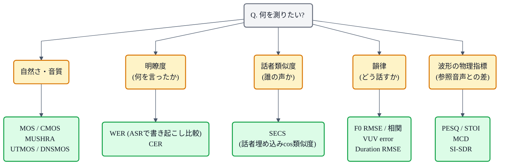

## この記事について

TTS の論文を読み進めると、モデルの説明よりも **評価指標の表**の方が難関に感じることがあります。「MOS 4.12」「UTMOS 3.98」「WER 5.4%」「SECS 0.72」…… 数字は並んでいるけれど、それぞれ何を測っていて、どこを比べれば「新しいモデルの方が良い」と言えるのか、パッと見わかりにくい。

この記事は、TTS の評価指標を **「何を測るか」の軸**で並べ直し、指標同士の役割・限界・使い分けを一覧できる形にまとめます。実装の詳細やコードは公式ツールに任せて、ここでは *どの軸の指標を、どの局面で見ればいいのか* に絞ります。

前提として、TTS の材料選び（コーパス）については [「日本語TTSのためのデータセット選び」](https://zenn.dev/nnn112358/articles/japanese-tts-datasets)、モデルの系譜については [「VITSから見るTTS 10系統マップ」](https://zenn.dev/nnn112358/articles/tts-lineage-map-from-vits) が姉妹編になります。

## 大前提: 「TTS の品質」は 1 次元ではない

まず、TTS の評価は 1 つの数字にまとめられないという性質があります。合成音声が「良い」と言うとき、少なくとも次の 4 つの独立した軸で見る必要があります。

1. **自然さ / 音質** ── 人間の声に聞こえるか、ノイズや歪みがないか
2. **明瞭度** ── 何を言っているか正しく聞き取れるか
3. **話者類似度** ── ターゲット話者に似ているか（ボイスクローンや Zero-shot TTS で重要）
4. **韻律** ── アクセント・イントネーション・話速が自然か

**「自然だが聞き取れない」「聞き取れるがロボット声」「声質は似ているがアクセントが変」** ── どれも実際に起こります。だから 1 個の指標では足りず、複数を組み合わせる。ここが TTS 評価の出発点です。

## 指標を「軸で選ぶ」ためのフロー

まずは全体像として、「どの軸を測りたいか」から指標を選ぶための地図を出しておきます。

以下、この順で 1 つずつ扱います。

## 軸 1: 自然さ・音質 ── 「人間らしく聞こえるか」

TTS 評価の「本丸」がここです。人間の耳が最終審判者なので、原則としては **人間による主観評価が正**、それを自動化した近似が **UTMOS / DNSMOS** という関係になります。

### MOS (Mean Opinion Score) ── 主観評価の伝統芸

最も基本の指標です。複数の被験者に「1 (非常に悪い) 〜 5 (非常に良い)」の 5 段階で音声を評価してもらい、平均を取ります。以下のルールが慣例:

- 被験者数はふつう 20 〜 30 名
- 1 モデルあたり数十発話をランダム提示
- **95% 信頼区間**（$\pm$ 0.05 〜 0.10 程度）を必ず併記
- 「絶対値の比較」ではなく **同じ実験内での相対比較**にしか意味がない（実験が変われば絶対値も変わる）

論文の Table で「MOS 4.12 $\pm$ 0.08」のような表記があるときは、この信頼区間の重なりを見て「有意差があるか」を判断します。数字だけ見て 4.12 > 4.10 を「勝った」と判断してはいけません。

### CMOS (Comparative MOS) ── 差を測るときの決定版

新モデルとベースラインを A/B で聞き比べ、「A が B よりどれくらい良いか」を **-3 (非常に悪い) 〜 +3 (非常に良い)** で答えてもらう指標です。**CMOS 0.20 以上**あれば「聴感上わかる差」の目安、というのが 2020 年代 TTS 論文での相場感です。

MOS よりも差の検出感度が高いので、モデル A と B のどちらが良いかを厳密に議論したい局面で使われます。

### SMOS (Similarity MOS) ── 話者類似度の主観版

Zero-shot TTS や Voice Cloning の論文で頻出する指標で、「参照話者にどれくらい似ているか」を 5 段階で聞きます。VALL-E や NaturalSpeech 系の話者類似度の主観比較でよく出てきます。

### ABX / MUSHRA ── より厳密に

- **ABX テスト** ── A / B の 2 音声を聞かせて、参照 X と近い方を選ばせる強制選択。二値なので統計処理が単純
- **MUSHRA (MUltiple Stimuli with Hidden Reference and Anchor)** ── 複数音声を 0-100 で相対評価。**hidden reference** (元音声) と **anchor** (品質を意図的に劣化させたもの) を混ぜて、被験者のスケール感覚を較正する。オーディオコーデック評価から輸入された手法

これらは MOS より高コストなので、決定版に近い比較を出したい重要論文で使われます。

### UTMOS ── 学習で自動化された MOS の代替

主観評価は毎回コストがかかるので、それを **回帰モデルで代替** する取り組みが進みました。**UTMOS** は VoiceMOS Challenge 2022 で優勝した MOS 予測モデルで、事前学習済みの音声表現（wav2vec2 系）に基づいて MOS スコアを推定します。

論文の実験や日常的な評価では、UTMOS が「自動 MOS」として広く使われています。ただし後述の通り、**代用として万能ではない**という重要な注意点があります。

### DNSMOS

Microsoft の **DNS Challenge** 由来の音質評価モデルで、もともとはノイズ抑制 (denoising) の評価向け。**SIG / BAK / OVRL** の 3 軸（音声成分・背景ノイズ・総合）を出します。TTS でもノイズや歪みの検出用途で使われることがあります。

## 軸 2: 明瞭度 ── 「何を言ったか正しく伝わるか」

自然に聞こえても、単語が聞き取れなければ TTS としては失格です。ここは主観評価より、**ASR に書き起こさせて元テキストと比較**する自動指標が主役になります。

### WER (Word Error Rate)

- 生成音声を **ASR** に通して書き起こし、元のターゲットテキストとの単語誤り率を計算
- ASR モデルには **Whisper large** や **wav2vec2-large-960h** のような十分に強いものを使うのが慣例
- 「明瞭度」と「発音の正しさ」を同時に測っている

日本語の場合、単語区切りが曖昧なので **CER (Character Error Rate)** で測ることもあります。

WER を評価に使うとき、注意点が 2 つあります。

- **ASR モデル自身に得意/不得意がある**。Whisper は英語話者向けの学習が厚いので、日本語 TTS の WER をこれで測ると母語ネイティブの聴感より甘めになりがち
- **参照音声で先に WER を測って上限を確認**する。人間が話している元の音声を ASR に通しても WER が 3% 出るなら、TTS の WER 3% は上限に近い品質と読める

### intelligibility WER (実験文脈)

論文では「Ground truth (人間の実音声) の WER」と「TTS 出力の WER」を並べて、その差分で明瞭度の劣化を議論することが多いです。

## 軸 3: 話者類似度 ── 「誰の声か」

Zero-shot TTS、ボイスクローン、多話者 TTS で重要な軸。参照話者と合成音声のスタイル（というより声質そのもの）が一致しているかを測ります。

### SECS (Speaker Encoder Cosine Similarity)

- **話者識別モデル**（Resemblyzer, WavLM, ECAPA-TDNN 等）で参照音声と合成音声から話者埋め込み (speaker embedding) を抽出
- その 2 つのベクトルの **コサイン類似度**を計算

$$
\mathrm{SECS} = \frac{\mathbf{e}_{\text{ref}} \cdot \mathbf{e}_{\text{syn}}}{\|\mathbf{e}_{\text{ref}}\|\, \|\mathbf{e}_{\text{syn}}\|}
$$

範囲は -1 〜 1 で、TTS では **0.6 前後で「同じ話者と識別できる」ライン**、0.8 以上で「非常に近い」というのが 2020 年代の相場です。ただし話者識別モデルによって絶対値がずれるので、**論文間の直接比較には慎重に**。

VALL-E, StyleTTS2, Fish-Speech など Zero-shot 系のモデルはほぼ必ずこの SECS を報告しています。関連する仕組みは本の [「zero-shot TTS」](https://zenn.dev/nnn112358/books/tts-from-text-to-audio/viewer/zero-shot) の章を参照。

## 軸 4: 韻律 ── 「どう話すか」

音素の並びは合っていても、**アクセントやイントネーション**が変だと日本語 TTS はとくに違和感が強く出ます。ここを測るのが韻律指標です。

### F0 RMSE / F0 correlation

参照音声と合成音声から F0 (基本周波数 = 声の高さ) を抽出し、時間軸に沿った RMSE または相関を計算します。ボコーダの評価というよりは、**F0 予測器や prosody predictor** の直接評価に使われます。

### VUV Error (Voiced/Unvoiced Error)

「有声/無声」の判定が正しく揃うかの誤り率。声帯振動の on/off が合っていないと、極端に不自然な音になります。

### Duration RMSE

音素の継続時間（duration）の予測誤差。**FastSpeech 系**や **VITS2** の Stochastic Duration Predictor の評価で使われます。この辺りは本の [「SDP (Stochastic Duration Predictor)」](https://zenn.dev/nnn112358/books/tts-from-text-to-audio/viewer/sdp) と [「FastSpeech」](https://zenn.dev/nnn112358/books/tts-from-text-to-audio/viewer/fastspeech) の章で扱っています。

## 軸 5: 波形の物理指標 ── 「参照音声との差」

こちらは主にボコーダの評価や、Mel から波形への再構成の品質を測る、より低レベルな指標です。

### MCD (Mel Cepstral Distortion)

参照音声と合成音声のメルケプストラム係数の距離。**DB 単位**で表現され、6 dB 未満で「かなり近い」の目安。伝統的な音響モデル・ボコーダ評価の定番。

### PESQ (Perceptual Evaluation of Speech Quality)

もともとは **電話音声品質の ITU-T 標準**（P.862）。参照音声との比較で -0.5 〜 4.5 のスコアを出します。ノイズ抑制・音声強調で広く使われ、TTS では **ボコーダ評価**の補助指標として登場。

### STOI (Short-Time Objective Intelligibility)

参照音声との相関ベースで **明瞭度** を推定する物理指標。0 〜 1 で、値が大きいほど良い。

### SI-SDR (Scale-Invariant SDR)

**音源分離**由来の指標。スケール不変な形で信号と歪みの比を測る。VITS 系のボコーダ論文で稀に登場します。

## MOS と UTMOS の関係 ── どこまで代用できるか

UTMOS が広く使われるようになってから、「じゃあ人間評価はもう要らない？」という話は必ず出ます。結論を先に言うと **代用にはならない**。相関はするけれど、破綻するパターンが明確にあります。

左のパネルは典型的なベンチマークで、MOS と UTMOS はだいたい線形に並びます。右のパネルは、その関係が壊れる 2 つの主要ケース:

- **生音声の天井効果** ── 実収録された参照音声は人間評価だと MOS 4.5+ が普通なのに対し、UTMOS は 4.0-4.2 でサチる傾向がある（学習データの分布に引きずられる）
- **過剰平滑化した TTS** ── FastSpeech のような非確率的なモデルが「無難な平均声」を出すとき、UTMOS は「よく整った音」に見えて高く出るが、人間評価はロボット的で低く出る

つまり:
- **同一モデル同士の比較や、学習中の指標追跡**には UTMOS は便利
- **論文の主張として品質を報告する**なら、UTMOS だけでは弱く、MOS/CMOS の主観評価と併記する必要がある

## 論文の MOS 表を読むときのチェックポイント

MOS 表を見て「新モデルが勝った」と判断する前に、5 つ確認する癖をつけると事故が減ります。

1. **信頼区間は併記されているか** ── されていない論文はそっと信頼度を下げる
2. **同じ実験内での比較か** ── 別の被験者プールで測った MOS 4.12 と 4.10 を並べても意味がない
3. **Ground Truth (実音声) の MOS も同時に測っているか** ── 実音声が 4.2 なら、モデルが 4.15 でも「かなり近い」と読める
4. **どのコーパスの何話者で測ったか** ── LJSpeech と VCTK では話者バリエーションが違う。日本語なら JSUT / JVS どちらか
5. **UTMOS しか出していない論文は「一次資料としては保留」** ── UTMOS の値が MOS の代替になっていない場合がある

## 実運用の型: 「4 指標で最小構成」

論文の再現実験や、自作 TTS の品質モニタリングをするときの現実的な最小構成として、次の 4 指標を「1 モデル 1 レポート」に載せておくとほぼ困りません。

| 軸 | 指標 | 補足 |
|---|---|---|
| 自然さ | UTMOS + (可能なら) MOS | UTMOS は自動、MOS は決定的な比較で |
| 明瞭度 | WER (Whisper) or CER | 日本語なら CER の方が読みやすい |
| 話者類似度 | SECS (WavLM 等) | Zero-shot / 多話者を作るなら必須 |
| 韻律 | F0 RMSE または F0 correlation | Prosody 予測モデルの評価で |

これに、**推論速度 (RTF, Real Time Factor)** を並べて出せば、品質と速度のトレードオフが 1 表で読めます。

## まとめ

- TTS の品質は **自然さ / 明瞭度 / 話者類似度 / 韻律** の 4 軸で見る。1 指標では足りない
- 人間評価 (MOS/CMOS/SMOS/ABX/MUSHRA) が正、UTMOS/DNSMOS はその近似
- UTMOS は便利だが **代用にはならない** ── 生音声の天井効果、過剰平滑化 TTS の高評価という 2 つの破綻パターンがある
- MOS 表を読むときは、**信頼区間・実験の同一性・Ground Truth の値**の 3 点を必ず確認
- 実運用は **UTMOS + WER + SECS + F0 系 + RTF** の 5 点セットで足りる

## 関連リンク

- 記事: [日本語TTSのためのデータセット選び](https://zenn.dev/nnn112358/articles/japanese-tts-datasets) ── 学習に使うコーパスを選ぶ
- 記事: [VITSから見るTTS 10系統マップ](https://zenn.dev/nnn112358/articles/tts-lineage-map-from-vits) ── モデルの系譜
- 本: [TTS ─ テキストが音になるまで](https://zenn.dev/nnn112358/books/tts-from-text-to-audio) ── モデル各論
