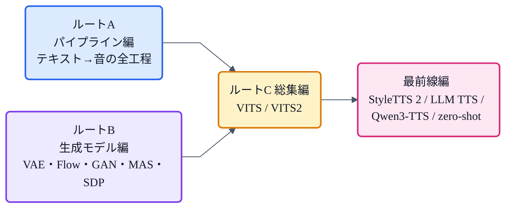

## このシリーズについて

「猫でもわかる」は、TTS(音声合成)のしくみを、**1記事1テーマ**で、図と最小限の数式だけで解きほぐすシリーズです。各記事は独立して読めますが、順番に読むと「テキストが音になるまで」の全体像と、その裏にある生成モデルの考え方、そして最前線までが一本につながるように作ってあります。

この記事はその**目次**です。全32本を、**3つの読むルート＋発展トピック**に分けて案内します。🐾

:::message
各記事の技術的な主張は、元論文を実際に読んで確認した内容に基づいています。図はすべて自作(matplotlib / mermaid)です。俯瞰には姉妹記事「[VITSから見るTTS 10系統マップ(2016–2026)](https://zenn.dev/nnn112358/articles/tts-lineage-map-from-vits)」もどうぞ。
:::

## 全体マップ

## ルートA:パイプライン編(テキストが音になるまで)

TTSの処理の流れを、入口から出口まで順にたどるルートです。まずここから読むのがおすすめ。

| # | 記事 | ひとこと |
|---|---|---|
| 1 | [G2P](https://zenn.dev/nnn112358/articles/g2p-for-cats) | 文字を発音記号に変える、TTSの入口 |
| 2 | [音響モデル](https://zenn.dev/nnn112358/articles/acoustic-model-for-cats) | 音素をメルに変える中核。アライメントが難所 |
| 3 | [メルスペクトログラム](https://zenn.dev/nnn112358/articles/what-is-mel-spectrogram) | 音の「設計図」となる中間表現 |
| 4 | [WaveNet](https://zenn.dev/nnn112358/articles/wavenet-for-cats) | 波形を直接作る、ニューラルボコーダの元祖 |
| 5 | [HiFi-GAN](https://zenn.dev/nnn112358/articles/hifigan-for-cats) | メルを音にするGANボコーダの決定版 |
| 6 | [iSTFTNet](https://zenn.dev/nnn112358/articles/istftnet-for-cats) | 終盤をiSTFTに任せて軽く |
| 7 | [Vocos](https://zenn.dev/nnn112358/articles/vocos-for-cats) | フーリエで一発、桁違いに速く |

## ルートB:生成モデル編(VITSの部品たち)

VITSを構成する生成モデルと部品を、1つずつ理解するルートです。

| # | 記事 | ひとこと |
|---|---|---|
| 8 | [VAE](https://zenn.dev/nnn112358/articles/vae-for-cats) | 分布に圧縮して生成する。VITSの骨格 |
| 9 | [Flow(正規化フロー)](https://zenn.dev/nnn112358/articles/flow-for-cats) | 可逆変換でノイズを整形。VITSの"F" |
| 10 | [GAN](https://zenn.dev/nnn112358/articles/gan-for-cats) | 偽造者vs鑑定士。VITSの"G" |
| 11 | [MAS](https://zenn.dev/nnn112358/articles/mas-for-cats) | 音素と音の対応を自力で探す |
| 12 | [SDP](https://zenn.dev/nnn112358/articles/sdp-for-cats) | 毎回ちがう自然なリズムを作る |
| 13 | [Glow-TTS](https://zenn.dev/nnn112358/articles/glow-tts-for-cats) | FlowとMASが出会う、VITSの前身 |

## ルートC:総集編(合流点)

ルートA・Bの部品が、1つのモデルに合流します。

| # | 記事 | ひとこと |
|---|---|---|
| 14 | [VITS](https://zenn.dev/nnn112358/articles/vits-for-cats) | VAE+Flow+GAN+MAS+SDPが1つになる場所 |
| 15 | [VITS2](https://zenn.dev/nnn112358/articles/vits2-for-cats) | VITSの弱点を3つの改良でみがく |

## 最前線編(人間超えとLLMの時代)

| # | 記事 | ひとこと |
|---|---|---|
| 16 | [StyleTTS 2](https://zenn.dev/nnn112358/articles/styletts-for-cats) | Style Diffusion + WavLMで人間超え |
| 17 | [BERT](https://zenn.dev/nnn112358/articles/bert-for-cats) | 文脈を読んで抑揚を自然に |
| 18 | [LLM TTS](https://zenn.dev/nnn112358/articles/llm-tts-for-cats) | 音声を「言語モデル」で喋らせる路線 |
| 19 | [Qwen3-TTS](https://zenn.dev/nnn112358/articles/qwen-tts-for-cats) | LLM×コーデックの超低遅延ストリーミング |
| 20 | [zero-shot TTS](https://zenn.dev/nnn112358/articles/zero-shot-for-cats) | 3秒の声で、学習していない人を喋らせる |

## 番外編

| # | 記事 | ひとこと |
|---|---|---|
| 21 | [MobileNet](https://zenn.dev/nnn112358/articles/mobilenet-for-cats) | 軽量モデルの主役。音声にも効く部品 |

## 追補編(発展トピック)

パイプラインの理解が進んだら、より深い話題や歴史・最前線の要素技術へ。

| # | 記事 | ひとこと |
|---|---|---|
| 22 | [Tacotron](https://zenn.dev/nnn112358/articles/tacotron-for-cats) | 文字から音を直接作った、E2E TTSの原点 |
| 23 | [Tacotron 2](https://zenn.dev/nnn112358/articles/tacotron2-for-cats) | Location-Sensitive Attention + WaveNetで人間レベルへ |
| 24 | [FastSpeech](https://zenn.dev/nnn112358/articles/fastspeech-for-cats) | 非自己回帰で270倍高速、読み飛ばしゼロ |
| 25 | [VALL-E](https://zenn.dev/nnn112358/articles/valle-for-cats) | 音声トークンの言語モデリングで zero-shot TTS を開拓 |
| 26 | [EnCodec](https://zenn.dev/nnn112358/articles/encodec-for-cats) | 音声を離散トークンにするニューラルコーデック |
| 27 | [Flow Matching](https://zenn.dev/nnn112358/articles/flow-matching-for-cats) | ノイズ→データへ「まっすぐ」進む生成 |
| 28 | [F5-TTS](https://zenn.dev/nnn112358/articles/f5-tts-for-cats) | 継続長予測もテキストエンコーダも無しで喋る |
| 29 | [Fish-Speech](https://zenn.dev/nnn112358/articles/fish-speech-for-cats) | 72万時間×DualAR、RVQもG2Pも捨てたLLM TTS |
| 30 | [Grad-TTS](https://zenn.dev/nnn112358/articles/grad-tts-for-cats) | 拡散モデルで「ノイズからメルを彫り出す」TTS |
| 31 | [MaskGCT](https://zenn.dev/nnn112358/articles/maskgct-for-cats) | マスク予測で完全非自己回帰の zero-shot TTS |

## こんな人はここから

- **とにかく全体像を知りたい** → ルートAを1→7へ。
- **VITSを理解したい** → ルートB(8→13)→ ルートC(14→15)。
- **最新のTTS事情を知りたい** → 16→20(前提が要るときだけ戻る)。
- **系譜・歴史が好き** → [VITSから見るTTS 10系統マップ](https://zenn.dev/nnn112358/articles/tts-lineage-map-from-vits)。

それでは、よい猫ライフを。🐾
