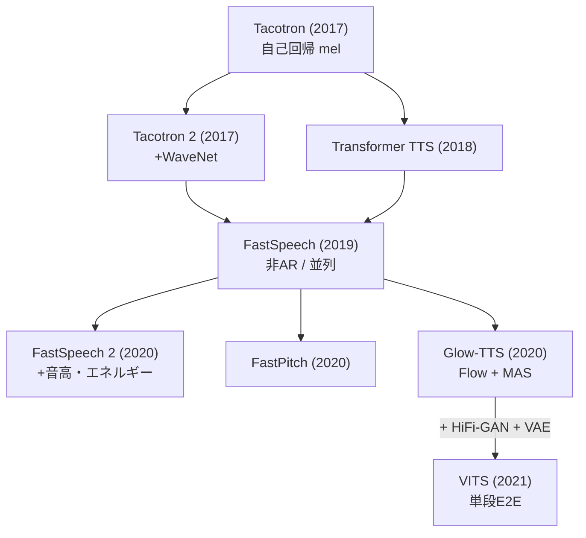
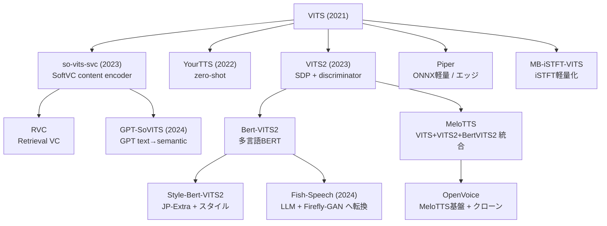
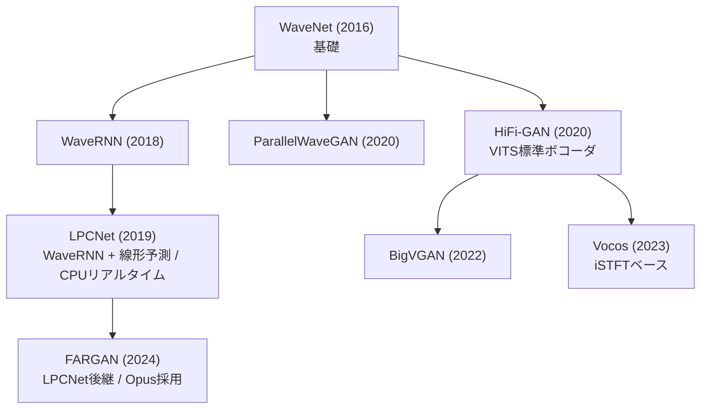
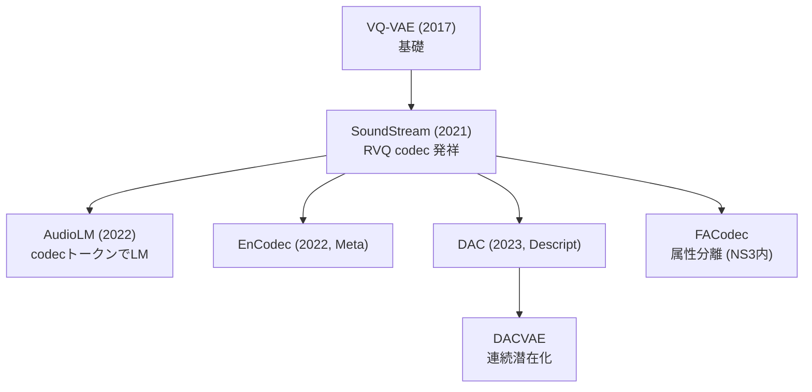
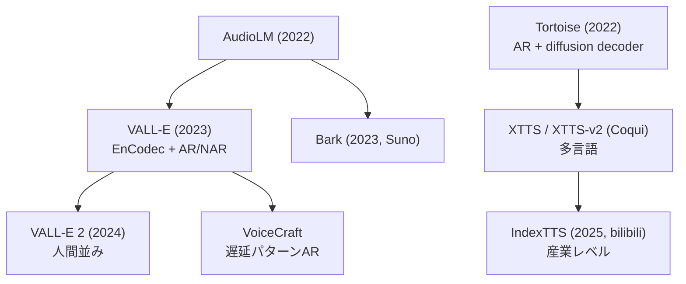
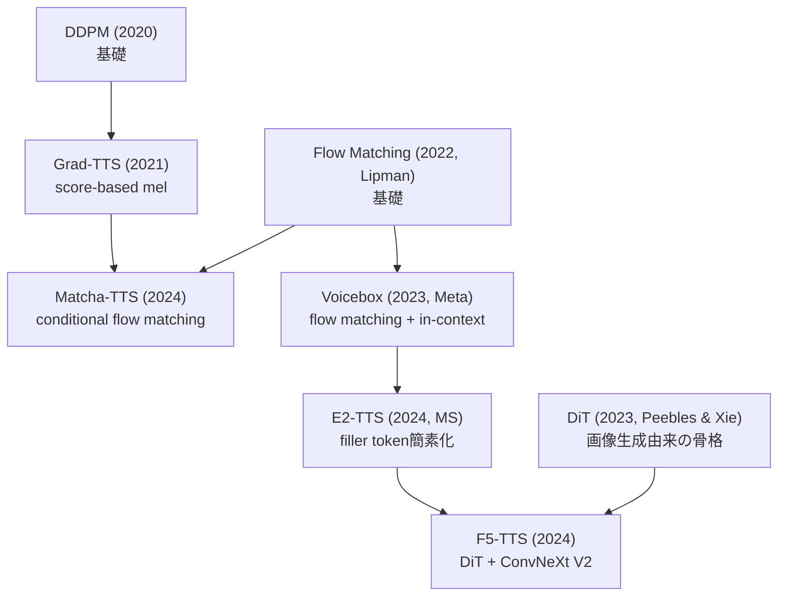
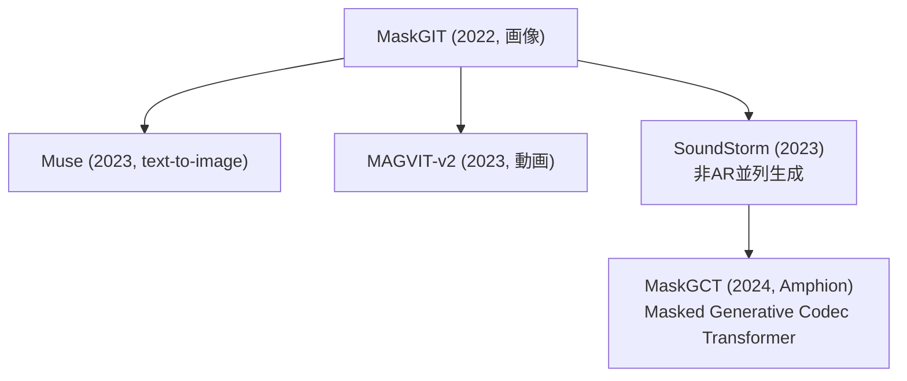
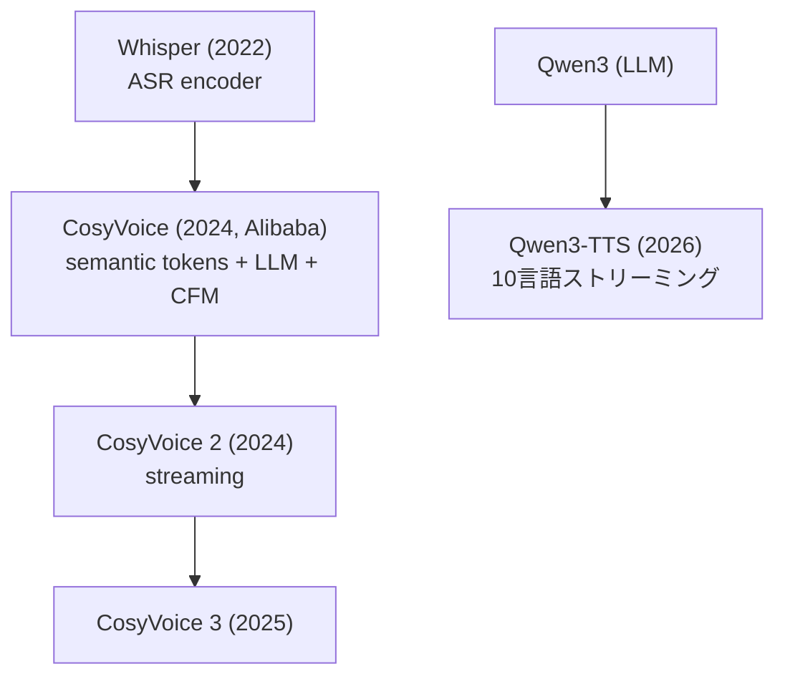

## この記事について

2016年の WaveNet から 2026年の LLM 統合 TTS まで、**Text-to-Speech(音声合成)のモデル系譜**を1枚の地図に落とし込むと、実は **10 の系統**に整理できます。

本記事は、VITS / VITS2 を起点に **155本の論文と 63リポジトリを読み込んで作った系譜メモ**をベースに、「どのモデルが何から派生したのか」を系統図(mermaid)付きでまとめたものです。個々のモデルの実装解説ではなく、**全体の地図**を提供するのが目的です。

:::message
系譜関係は、各論文の `Related Work` / `Method` セクションの引用と、GitHub リポジトリの構造(どのコードをフォークしたか)から抽出しています。「直接派生」と「影響を受けた」を区別して整理しました。
:::

## なぜ VITS を起点にするのか

TTS の歴史は大きく「**2段構成**(音響モデル → ボコーダ)」と「**単段 E2E**(テキストから波形まで一気通貫)」に分かれます。**VITS(2021, Kakao)** は、それまで別々に学習していた要素を**1つのモデルに統合**した転換点でした。

VITS は次の3つを組み合わせています。

- **Glow-TTS** … Flow ベースの音響モデル + MAS(Monotonic Alignment Search)
- **HiFi-GAN** … GAN ベースの高速ボコーダ
- **VAE** … 両者を潜在変数でつなぐ

つまり VITS を理解すると、「音響モデル系統」「ボコーダ系統」「Flow 系統」という3本の川が合流する地点が見えます。ここを基準点にすると、前後の系譜が一気に読み解けるわけです。

## 全体像:10系統

まず結論から。TTS のモデル群は次の10系統に大別できます。

| # | 系統 | 代表モデル | 特徴 |
|---|---|---|---|
| 1 | **VITS本流** | VITS, VITS2, Bert-VITS2 | VAE + Flow + GAN の単段E2E |
| 2 | **Style系** | StyleTTS 2 | Style Diffusion + SLM識別器 |
| 3 | **Flow Matching** | F5-TTS, Matcha | Voicebox → E2 → F5 系統 |
| 4 | **Codec LM (AR)** | VALL-E, Tortoise, XTTS | EnCodec + GPT風 自己回帰 |
| 5 | **LLM統合** | CosyVoice, Qwen3-TTS | Whisper / LLM + Flow Matching |
| 6 | **Codec+拡散** | NaturalSpeech 2/3, MaskGCT | latent / factorized diffusion |
| 7 | **Masked Generative** | SoundStorm → MaskGCT | MaskGIT(画像)から伝播 |
| 8 | **VC系** | so-vits-svc, RVC, GPT-SoVITS | SoftVC content encoder |
| 9 | **軽量実用** | Piper, MeloTTS, OpenVoice | ONNX / CPU エッジ向け |
| 10 | **Fish-Speech独自** | Fish-Speech | DualAR + Firefly-GAN |

この10系統が、いくつかの共通部品(Tacotron2, FastSpeech2, HiFi-GAN, EnCodec, DiT…)を土台に交差しながら発展しています。以下、主要な流れを図で追っていきます。

## 1. 前史:音響モデル系統(Tacotron → FastSpeech → Glow-TTS)

VITS が生まれる前の「音響モデル(テキスト → メルスペクトログラム)」の流れです。**自己回帰(AR)から非自己回帰(並列)へ**、そして**外部アライナーの排除**へ、という2つの潮流があります。

ポイントは **Glow-TTS(2020)** が導入した **MAS(Monotonic Alignment Search)**。これにより、Tacotron 系が必要としていた「注意機構によるアライメント学習」を外部から与える必要がなくなり、学習が安定しました。この MAS がそのまま VITS に受け継がれます。

同時期には AlignTTS / Flow-TTS / Flowtron といった「外部アライナー不要の並列 TTS」が競合として並走していました。

## 2. VITS本流:最も多くの派生を生んだ系統

VITS が単段 E2E を確立したあと、**日本語・多言語・軽量化・歌声**など各方向に爆発的に派生しました。

:::message
**MeloTTS は「VITS + VITS2 + Bert-VITS2」のマージ実装**であり、多言語対応の音声クローン OpenVoice(MyShell + MIT)の base-speaker になっています。「VITS 系の集大成的な実装」を探すなら MeloTTS が入口です。
:::

特筆すべきは **Fish-Speech**。これは Bert-VITS2 の作者チームが **VITS 系を捨てて** LLM(DualAR)+ VQ-GAN(Firefly-GAN)に完全転換したものです。系譜図では VITS 本流から「離脱」する矢印として描かれます。

## 3. ボコーダ系統:WaveNet から HiFi-GAN、そして FARGAN へ

「音響特徴 → 波形」を担うボコーダの流れです。大きく **GAN 系(HiFi-GAN)** と **自己回帰・線形予測系(LPCNet → FARGAN)** に分かれます。

**HiFi-GAN** が VITS 本流の標準ボコーダとして広く使われる一方、**LPCNet → FARGAN** の系譜は「CPU・組込み・低電力」で戦う独立した流れです。FARGAN は Opus コーデックの PLC(パケットロス補償)に採用されており、**専用 C 実装なら極小サイズで実時間を大きく上回る**性能を出します。

一方 **Vocos** は HiFi-GAN 系ながら **iSTFT で波形を1発生成**する設計で、CPU でも高速。WhisperSpeech などで採用されています。

## 4. Codec 系統:VQ-VAE → SoundStream → EnCodec / DAC

2023年以降の「LM で音声を生成する」流れの土台が、この**ニューラルコーデック(離散トークン化)**です。

**SoundStream** が発明した **RVQ(Residual Vector Quantization)** が、EnCodec・DAC へと最適化されていきます。この「音声を離散トークンにする」技術があって初めて、次の Codec LM 系が成立します。

## 5. Codec LM(AR)系統:VALL-E / Tortoise / XTTS

EnCodec のトークンを **GPT のように自己回帰生成**するのが Codec LM 系です。zero-shot 音声クローンの主流になりました。

:::message
**IndexTTS は VITS 系ではなく Tortoise → XTTS → IndexTTS** という別系譜です。「zero-shot クローン = VITS 系」と思い込むと系譜を見誤ります。
:::

## 6. Diffusion / Flow Matching 系統:Grad-TTS から F5-TTS へ

拡散モデル(DDPM)と、その発展形である Flow Matching / Rectified Flow の流れです。**2024年の F5-TTS** が到達点の1つです。

**F5-TTS は E2-TTS の改良**であり、E2-TTS は **Voicebox の系譜**です。F5 は E2-TTS の頑健性の問題を、画像生成由来の **DiT(Diffusion Transformer)+ ConvNeXt V2** を持ち込むことで解決しました。「画像生成のアーキテクチャが音声に流れ込む」典型例です。

## 7. Masked Generative 系統:MaskGIT(画像)→ SoundStorm → MaskGCT

自己回帰でも拡散でもない第三の生成方式。**画像生成の MaskGIT** から音声へ伝播した系統です。

**MaskGCT は MaskGIT(画像)→ SoundStorm(音声)→ MaskGCT** という、画像 → 音声のクロスドメインな系譜を持ちます。SpearTTS の3段構成(text → semantic → acoustic)も受け継いでいます。

## 8. LLM統合系統:CosyVoice / Qwen3-TTS

最も新しい潮流。**ASR モデル(Whisper)や LLM(Qwen)を TTS に組み込む**流れです。

**CosyVoice は Whisper の教師ありセマンティックトークン + LLM + Flow Matching** の構成です。これは Tortoise の「LLM + DDPM」の DDPM 部分を Flow Matching に置換したもの、と位置づけられます。ASR モデル由来のトークンが TTS を駆動する、という発想の転換がポイントです。

## 9. NaturalSpeech シリーズ:Microsoft の独自進化

NaturalSpeech は1本の系譜として明確に進化しているので、独立して見ておく価値があります。

| 世代 | 年 | 手法 | ゴール |
|---|---|---|---|
| **NS1** | 2022 | flow + HiFi-GAN 共同最適化(E2E) | single-speaker で人間品質 |
| **NS2** | 2023 | latent diffusion + 連続codec | zero-shot multi-speaker |
| **NS3** | 2024 | factorized diffusion(FACodec) | LibriSpeech で人間レベル |

NS3 が導入した **FACodec**(prosody / content / timbre / acoustic の属性分離コーデック)は、MaskGCT など他モデルからも参照される独立コンポーネントになりました。

## 10系統マップ:核心的な「意外な事実」

系譜を追っていくと、直感に反する接続がいくつも見つかります。地図があると気づける発見をまとめます。

- 🔀 **MeloTTS は VITS + VITS2 + Bert-VITS2 のマージ**であり、OpenVoice の基盤。
- 🚪 **Fish-Speech は Bert-VITS2 チームが VITS を捨てて** LLM + VQ-GAN に転換したもの。
- 🎨 **F5-TTS は E2-TTS(= Voicebox 系)** に画像生成の DiT + ConvNeXt を導入。
- 🗣️ **CosyVoice は ASR モデル Whisper のトークン**で駆動される TTS(Tortoise の DDPM を Flow Matching に置換)。
- 🖼️ **MaskGCT は画像生成 MaskGIT → SoundStorm → MaskGCT** というクロスドメイン系譜。
- 🏭 **IndexTTS は VITS 系ではなく Tortoise → XTTS → IndexTTS**。
- 🎙️ **GPT-SoVITS / RVC は so-vits-svc(VITS の VC 派生)** から分岐した独立系。
- 🔌 **FARGAN は LPCNet の後継**で Opus に採用。HiFi-GAN 系とは別の「組込み最強」系譜。

## まとめ:3本の川が合流する地図

TTS の系譜は、乱立しているように見えて、実は数本の「基礎技術の川」が合流・分岐しているだけです。

- **音響モデルの川**:Tacotron → FastSpeech → Glow-TTS(MAS)
- **ボコーダの川**:WaveNet → HiFi-GAN(GAN)/ LPCNet → FARGAN(組込み)
- **コーデックの川**:VQ-VAE → SoundStream → EnCodec / DAC(→ Codec LM の土台)

**VITS** は最初の2本が合流した地点であり、**Codec LM / Flow Matching / LLM 統合**は3本目の川(コーデック)が主流化した2023年以降の潮流です。この地図を持っておくと、新しいモデルが出てきたときに「どの川の、どの支流か」を素早く位置づけられます。

:::message
本記事は VITS / VITS2 を起点にした TTS 系譜調査(2016–2026、155論文 + 63リポジトリ)のサマリです。系統図の元データは論文の Related Work / Method の引用と、GitHub リポジトリのフォーク構造から抽出しています。
:::
