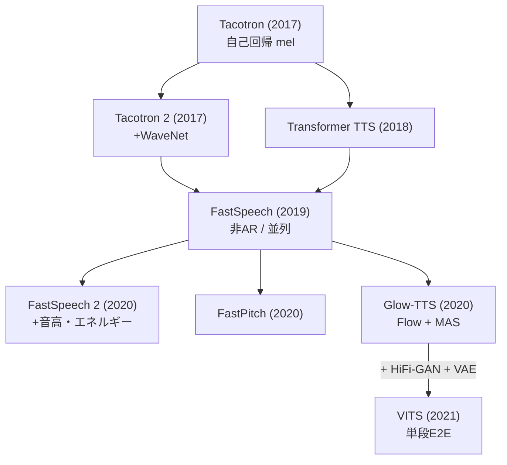
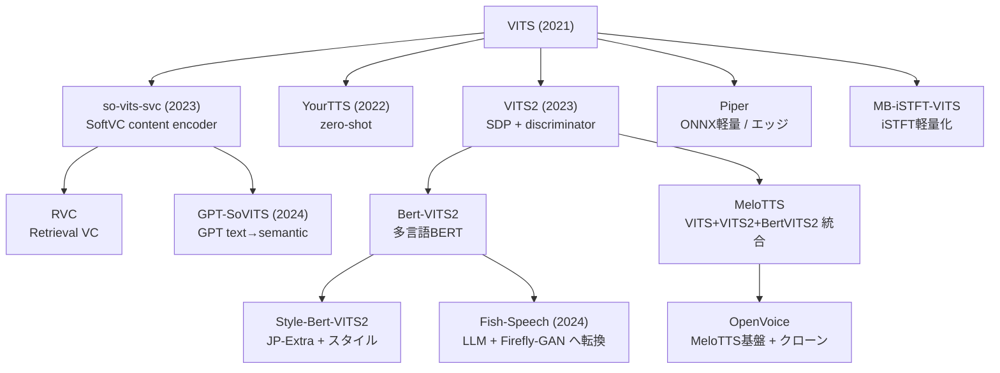
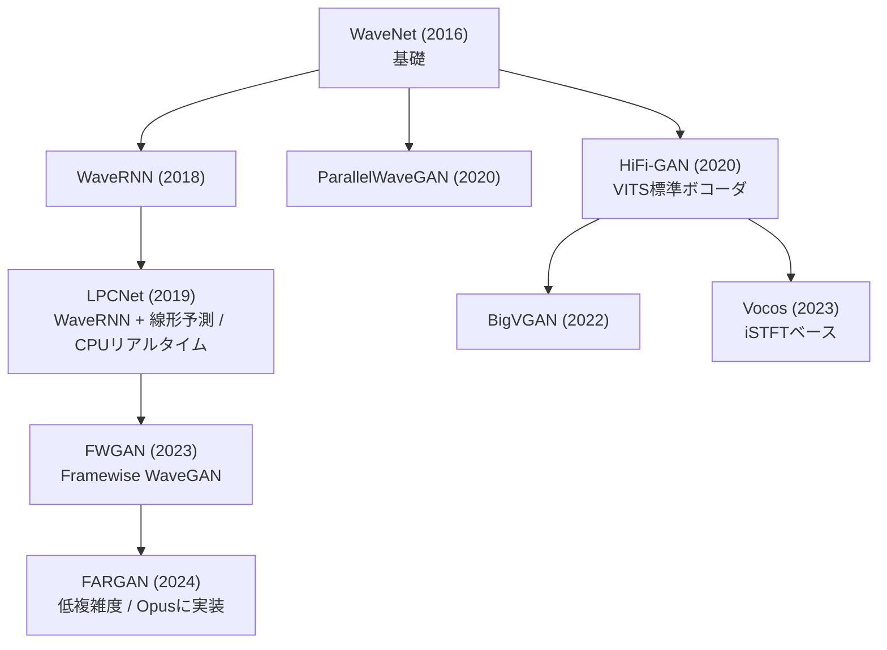
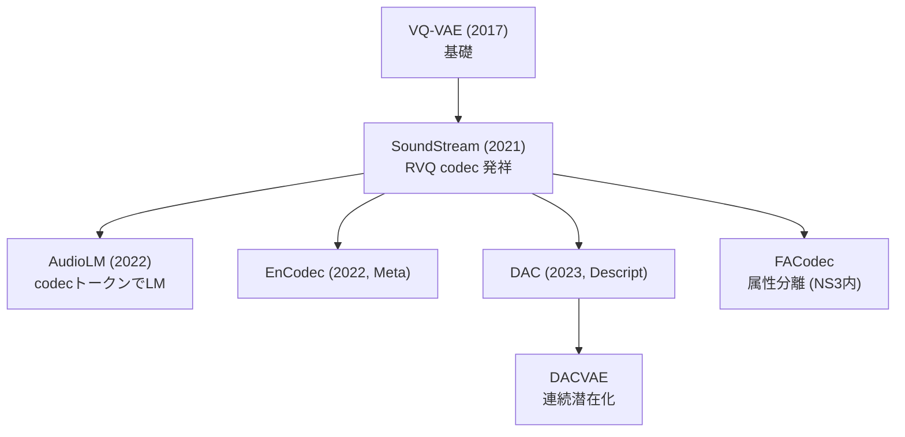
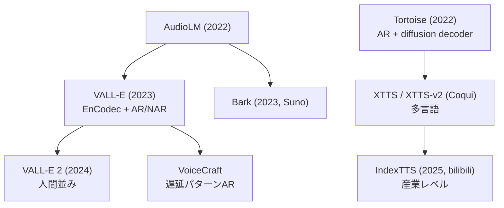
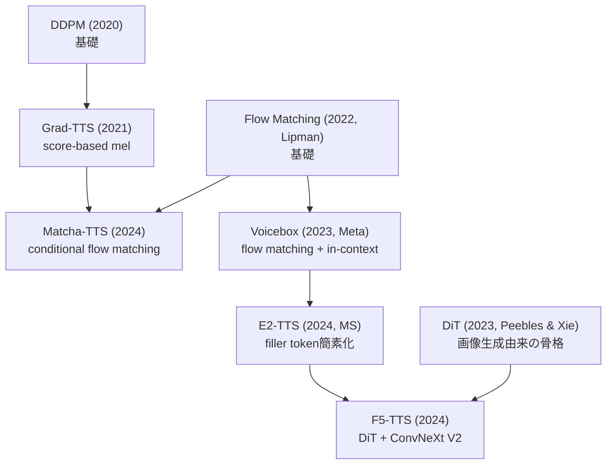
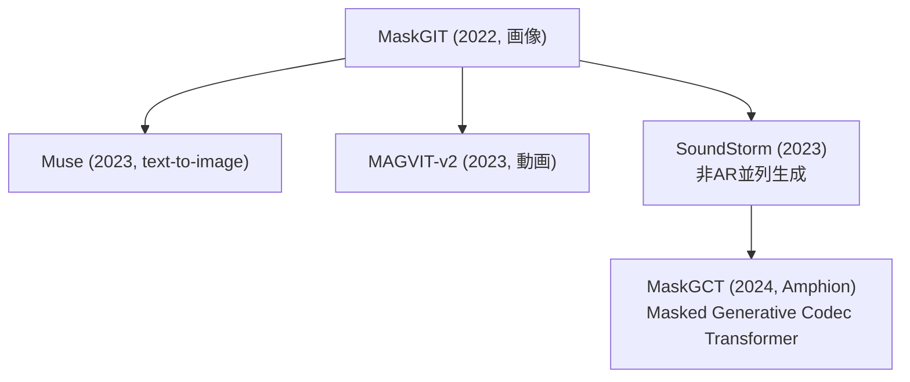
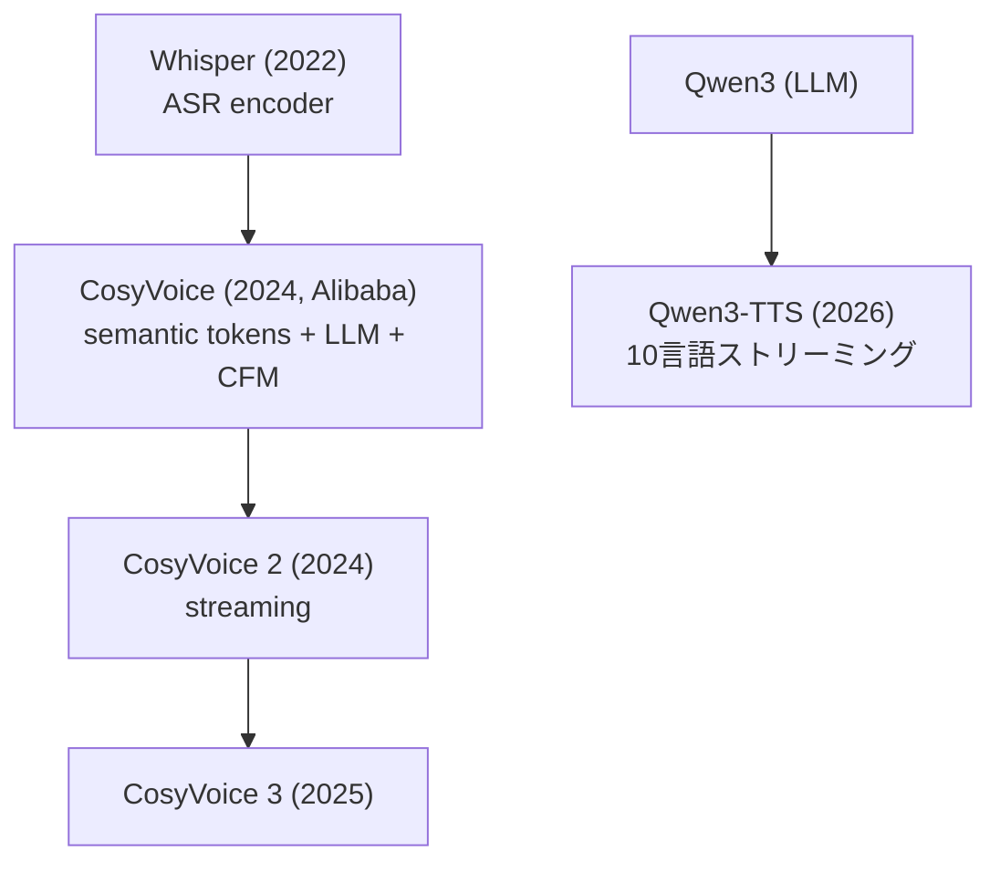

## この記事について

2016年の WaveNet から 2026年の LLM 統合 TTS まで、**Text-to-Speech(音声合成)のモデル系譜**を1枚の地図に落とし込むと、実は **10 の系統**に整理できます。

本記事は、VITS / VITS2 を起点に **155本の論文と 63リポジトリを読み込んで作った系譜メモ**をベースに、「どのモデルが何から派生したのか」を系統図(mermaid)付きでまとめたものです。個々のモデルの実装解説ではなく、**全体の地図**を提供するのが目的です。

:::message
系譜関係は、各論文の `Related Work` / `Method` セクションの引用と、GitHub リポジトリの構造(どのコードをフォークしたか)から抽出しています。「直接派生」と「影響を受けた」を区別して整理しました。**主要な系譜エッジは、実際に論文本文を読んで裏付けを確認済み**です(結果は記事末尾の「系譜の検証」節に掲載)。
:::

## なぜ VITS を起点にするのか

TTS の歴史は大きく「**2段構成**(音響モデル → ボコーダ)」と「**単段 E2E**(テキストから波形まで一気通貫)」に分かれます。**VITS(2021, Kakao)** は、それまで別々に学習していた要素を**1つのモデルに統合**した転換点でした。

VITS は次の3つを組み合わせています。

- **Glow-TTS** … Flow ベースの音響モデル + MAS(Monotonic Alignment Search)
- **HiFi-GAN** … GAN ベースの高速ボコーダ
- **VAE** … 両者を潜在変数でつなぐ

つまり VITS を理解すると、「音響モデル系統」「ボコーダ系統」「Flow 系統」という3本の川が合流する地点が見えます。ここを基準点にすると、前後の系譜が一気に読み解けるわけです。

## 全体像:10系統

まず結論から。TTS のモデル群は次の10系統に大別できます。

| # | 系統 | 代表モデル | 特徴 |
|---|---|---|---|
| 1 | **VITS本流** | VITS, VITS2, Bert-VITS2 | VAE + Flow + GAN の単段E2E |
| 2 | **Style系** | StyleTTS 2 | Style Diffusion + SLM識別器 |
| 3 | **Flow Matching** | F5-TTS, Matcha | Voicebox → E2 → F5 系統 |
| 4 | **Codec LM (AR)** | VALL-E, Tortoise, XTTS | EnCodec + GPT風 自己回帰 |
| 5 | **LLM統合** | CosyVoice, Qwen3-TTS | Whisper / LLM + Flow Matching |
| 6 | **Codec+拡散** | NaturalSpeech 2/3, MaskGCT | latent / factorized diffusion |
| 7 | **Masked Generative** | SoundStorm → MaskGCT | MaskGIT(画像)から伝播 |
| 8 | **VC系** | so-vits-svc, RVC, GPT-SoVITS | SoftVC content encoder |
| 9 | **軽量実用** | Piper, MeloTTS, OpenVoice | ONNX / CPU エッジ向け |
| 10 | **Fish-Speech独自** | Fish-Speech | DualAR + Firefly-GAN |

この10系統が、いくつかの共通部品(Tacotron2, FastSpeech2, HiFi-GAN, EnCodec, DiT…)を土台に交差しながら発展しています。以下、主要な流れを図で追っていきます。

## 1. 前史:音響モデル系統(Tacotron → FastSpeech → Glow-TTS)

VITS が生まれる前の「音響モデル(テキスト → メルスペクトログラム)」の流れです。**自己回帰(AR)から非自己回帰(並列)へ**、そして**外部アライナーの排除**へ、という2つの潮流があります。

ポイントは **Glow-TTS(2020)** が導入した **MAS(Monotonic Alignment Search)**。これにより、Tacotron 系が必要としていた「注意機構によるアライメント学習」を外部から与える必要がなくなり、学習が安定しました。この MAS がそのまま VITS に受け継がれます。

同時期には AlignTTS / Flow-TTS / Flowtron といった「外部アライナー不要の並列 TTS」が競合として並走していました。

## 2. VITS本流:最も多くの派生を生んだ系統

VITS が単段 E2E を確立したあと、**日本語・多言語・軽量化・歌声**など各方向に爆発的に派生しました。

:::message
**MeloTTS は「VITS + VITS2 + Bert-VITS2」のマージ実装**であり、多言語対応の音声クローン OpenVoice(MyShell + MIT)の base-speaker になっています。「VITS 系の集大成的な実装」を探すなら MeloTTS が入口です。
:::

特筆すべきは **Fish-Speech**。これは Bert-VITS2 の作者チームが **VITS 系を捨てて** LLM(DualAR)+ VQ-GAN(Firefly-GAN)に完全転換したものです。系譜図では VITS 本流から「離脱」する矢印として描かれます。

## 3. ボコーダ系統:WaveNet から HiFi-GAN、そして FARGAN へ

「音響特徴 → 波形」を担うボコーダの流れです。大きく **GAN 系(HiFi-GAN)** と **自己回帰・線形予測系(LPCNet → FARGAN)** に分かれます。

**HiFi-GAN** が VITS 本流の標準ボコーダとして広く使われる一方、**LPCNet → FWGAN → FARGAN** の系譜は「CPU・組込み・低電力」で戦う独立した流れです(FARGAN 論文自身は直接の前身を FWGAN / CARGAN としており、LPCNet は同一著者による低複雑度系譜の起点です)。FARGAN の実装は Opus コーデックのリポジトリに置かれ、**専用 C 実装なら極小サイズで実時間を大きく上回る**性能を出します。

一方 **Vocos** も GAN で学習するボコーダですが、時間領域で波形を作る代わりに **iSTFT(逆フーリエ変換)で波形を1発生成**する設計で、CPU でも高速。WhisperSpeech などで採用されています。

## 4. Codec 系統:VQ-VAE → SoundStream → EnCodec / DAC

2023年以降の「LM で音声を生成する」流れの土台が、この**ニューラルコーデック(離散トークン化)**です。

**SoundStream** が発明した **RVQ(Residual Vector Quantization)** が、EnCodec・DAC へと最適化されていきます。この「音声を離散トークンにする」技術があって初めて、次の Codec LM 系が成立します。

## 5. Codec LM(AR)系統:VALL-E / Tortoise / XTTS

EnCodec のトークンを **GPT のように自己回帰生成**するのが Codec LM 系です。zero-shot 音声クローンの主流になりました。

:::message
**IndexTTS は VITS 系ではなく Tortoise → XTTS → IndexTTS** という別系譜です。「zero-shot クローン = VITS 系」と思い込むと系譜を見誤ります。
:::

## 6. Diffusion / Flow Matching 系統:Grad-TTS から F5-TTS へ

拡散モデル(DDPM)と、その発展形である Flow Matching / Rectified Flow の流れです。**2024年の F5-TTS** が到達点の1つです。

**F5-TTS は E2-TTS の改良**であり、E2-TTS は **Voicebox の系譜**です。F5 は E2-TTS の頑健性の問題を、画像生成由来の **DiT(Diffusion Transformer)+ ConvNeXt V2** を持ち込むことで解決しました。「画像生成のアーキテクチャが音声に流れ込む」典型例です。

## 7. Masked Generative 系統:MaskGIT(画像)→ SoundStorm → MaskGCT

自己回帰でも拡散でもない第三の生成方式。**画像生成の MaskGIT** から音声へ伝播した系統です。

**MaskGCT は MaskGIT(画像)→ SoundStorm(音声)→ MaskGCT** という、画像 → 音声のクロスドメインな系譜を持ちます。SpearTTS の3段構成(text → semantic → acoustic)も受け継いでいます。

## 8. LLM統合系統:CosyVoice / Qwen3-TTS

最も新しい潮流。**ASR モデル(Whisper)や LLM(Qwen)を TTS に組み込む**流れです。

**CosyVoice は ASR(音声認識)モデル由来の教師ありセマンティックトークン + LLM + Flow Matching** の構成です。これは Tortoise の「LLM + DDPM」の DDPM 部分を Flow Matching に置換したもの、と位置づけられます。ASR モデル由来のトークンが TTS を駆動する、という発想の転換がポイントです。

:::message
論文の Introduction では「**Whisper 由来**の教師ありトークン」と説明されますが、実装のトークナイザは自社 ASR(SenseVoice / ESPNet Conformer)で、Whisper は主に評価ベースラインとして登場します。「ASR 由来の教師ありトークン」という骨子は正しいものの、`Whisper` の固有名については論文内で記述と実装がややズレている点に注意してください(論文本文を読んで確認しました)。
:::

## 9. NaturalSpeech シリーズ:Microsoft の独自進化

NaturalSpeech は1本の系譜として明確に進化しているので、独立して見ておく価値があります。

| 世代 | 年 | 手法 | ゴール |
|---|---|---|---|
| **NS1** | 2022 | flow系生成モデル + E2E最適化 | single-speaker で人間品質 |
| **NS2** | 2023 | latent diffusion + 連続codec | zero-shot multi-speaker |
| **NS3** | 2024 | factorized diffusion(FACodec) | LibriSpeech で人間レベル |

NS3 が導入した **FACodec**(prosody / content / timbre / acoustic の属性分離コーデック)は、MaskGCT など他モデルからも参照される独立コンポーネントになりました。

## 10系統マップ:核心的な「意外な事実」

系譜を追っていくと、直感に反する接続がいくつも見つかります。地図があると気づける発見をまとめます。

- 🔀 **MeloTTS は VITS + VITS2 + Bert-VITS2 のマージ**であり、OpenVoice の基盤。
- 🚪 **Fish-Speech は Bert-VITS2 チームが VITS を捨てて** LLM + VQ-GAN に転換したもの。
- 🎨 **F5-TTS は E2-TTS(= Voicebox 系)** に画像生成の DiT + ConvNeXt を導入。
- 🗣️ **CosyVoice は ASR モデル Whisper のトークン**で駆動される TTS(Tortoise の DDPM を Flow Matching に置換)。
- 🖼️ **MaskGCT は画像生成 MaskGIT → SoundStorm → MaskGCT** というクロスドメイン系譜。
- 🏭 **IndexTTS は VITS 系ではなく Tortoise → XTTS → IndexTTS**。
- 🎙️ **GPT-SoVITS / RVC は so-vits-svc(VITS の VC 派生)** から分岐した独立系。
- 🔌 **FARGAN は LPCNet の後継**で Opus に採用。HiFi-GAN 系とは別の「組込み最強」系譜。

## 系譜の検証:論文本文との照合

「図の矢印は本当に正しいのか?」——この記事の主要な系譜エッジは、各モデルの**論文本文(Abstract / Introduction / Related Work / Method)を実際に読み、逐語表現で裏付けを取りました**。代表的な確認結果です。

| 系譜エッジ | 判定 | 論文の記述(要旨・逐語) |
|---|---|---|
| VITS = VAE + Flow + 敵対的学習(HiFi-GANデコーダ) | ✅ | VITS: *"variational inference augmented with normalizing flows and an adversarial training process"* / デコーダは *"the HiFi-GAN V1 generator"* |
| VITS の MAS は Glow-TTS 由来 | ✅ | VITS: *"we adopt Monotonic Alignment Search (MAS) (Kim et al., 2020)"*(= Glow-TTS) |
| VITS2 ← VITS | ✅ | VITS2: *"a stochastic duration predictor trained through adversarial learning, normalizing flows improved by utilizing the transformer block and a speaker-conditioned text encoder"* |
| F5-TTS ← E2-TTS ← Voicebox | ✅ | E2-TTS: *"E2 TTS has a close relationship with the Voicebox … replaces a frame-wise phoneme sequence … with a character sequence"* / F5 は E2-TTS の *"slow convergence and low robustness"* を DiT+ConvNeXt で解決 |
| Voicebox は Flow Matching(Lipman) | ✅ | Voicebox: *"a non-autoregressive flow-matching model"* |
| VALL-E ← AudioLM(EnCodec + AR/NAR + in-context) | ✅ | VALL-E: *"we follow AudioLM … using discrete codes derived from … EnCodec"* / AR + NAR 階層 |
| AudioLM = SoundStream音響トークン + 意味トークン | ✅ | AudioLM: *"fine-level acoustic tokens produced by a SoundStream neural codec"* |
| MaskGIT → SoundStorm → MaskGCT | ✅ | MaskGCT: *"Our semantic-to-acoustic model is based on SoundStorm"* / SoundStorm: *"inspired by MaskGIT … for residual vector-quantized token sequences"* |
| NS1(flow)→ NS2(latent diff)→ NS3(factorized) | ✅ | NS3 §3.4: *"Different from NaturalSpeech which utilizes flow-based … and NaturalSpeech 2 which leverages latent diffusion …, NaturalSpeech 3 proposes … factorized diffusion"* |
| CosyVoice = ASR教師ありトークン + LLM + Flow Matching(vs Tortoise の DDPM) | ✅※ | CosyVoice: *"In contrast to … TorToise TTS, which employs an LLM in conjunction with a … DDPM, CosyVoice utilizes a conditional flow matching approach"* |
| EnCodec ← SoundStream(RVQ + GAN) | ✅ | EnCodec: *"The most relevant related work … is the SoundStream model … Residual Vector Quantization (RVQ)"* |
| IndexTTS ← XTTS ← Tortoise(**VITS系ではない**) | ✅ | IndexTTS: *"mainly based on the XTTS and Tortoise model"* / XTTS: *"builds upon the Tortoise model"* |
| YourTTS ← VITS | ✅ | XTTS(Related Work): YourTTS *"proposed several changes to VITS model architecture"* |

**検証で判明し、本文に反映した注意点:**

- **FARGAN の直接の前身は FWGAN / CARGAN**。LPCNet は同一著者(Valin)による低複雑度系譜の起点で、`LPCNet → FWGAN → FARGAN` と辿るのが正確(当初 `LPCNet → FARGAN` と直結していたのを修正)。
- **CosyVoice の「Whisper」帰属(※)**は論文 Introduction の記述であり、実装のトークナイザは自社 ASR(SenseVoice 等)。「ASR 由来の教師ありトークン」が骨子。
- **Vocos は GAN 系ボコーダそのもの**で、「時間領域 GAN の(iSTFT による)代替」と表現するのが本文に忠実。
- NS3 本文が NS1 に用いる語は *"flow-based generative models"* のみ(「HiFi-GAN」の語は NS3 には無し)。表記を `flow系生成モデル` に統一。

これ以外の主要エッジ(VITS本流・Codec・Codec LM・Flow Matching・Masked Generative)は、いずれも論文の**自己申告(Related Work での明示的な引用)**で確認できました。

## まとめ:3本の川が合流する地図

TTS の系譜は、乱立しているように見えて、実は数本の「基礎技術の川」が合流・分岐しているだけです。

- **音響モデルの川**:Tacotron → FastSpeech → Glow-TTS(MAS)
- **ボコーダの川**:WaveNet → HiFi-GAN(GAN)/ LPCNet → FARGAN(組込み)
- **コーデックの川**:VQ-VAE → SoundStream → EnCodec / DAC(→ Codec LM の土台)

**VITS** は最初の2本が合流した地点であり、**Codec LM / Flow Matching / LLM 統合**は3本目の川(コーデック)が主流化した2023年以降の潮流です。この地図を持っておくと、新しいモデルが出てきたときに「どの川の、どの支流か」を素早く位置づけられます。

:::message
本記事は VITS / VITS2 を起点にした TTS 系譜調査(2016–2026、155論文 + 63リポジトリ)のサマリです。系統図の元データは論文の Related Work / Method の引用と、GitHub リポジトリのフォーク構造から抽出しています。
:::

## 参考文献・リンク

記事で言及したモデルの一次情報(arXiv 論文と主要な実装リポジトリ)です。年は初出/arXiv 版を基準にしています。

### 音響モデル(前史)

- Tacotron (2017) — [arXiv:1703.10135](https://arxiv.org/abs/1703.10135)
- Tacotron 2 (2017) — [arXiv:1712.05884](https://arxiv.org/abs/1712.05884) / [NVIDIA/tacotron2](https://github.com/NVIDIA/tacotron2)
- Transformer TTS (2018) — [arXiv:1809.08895](https://arxiv.org/abs/1809.08895)
- FastSpeech (2019) — [arXiv:1905.09263](https://arxiv.org/abs/1905.09263)
- FastSpeech 2 (2020) — [arXiv:2006.04558](https://arxiv.org/abs/2006.04558) / [ming024/FastSpeech2](https://github.com/ming024/FastSpeech2)
- FastPitch (2020) — [arXiv:2006.06873](https://arxiv.org/abs/2006.06873)
- Glow-TTS (2020) — [arXiv:2005.11129](https://arxiv.org/abs/2005.11129) / [jaywalnut310/glow-tts](https://github.com/jaywalnut310/glow-tts)

### VITS本流・VC系・軽量実用

- VITS (2021) — [arXiv:2106.06103](https://arxiv.org/abs/2106.06103) / [jaywalnut310/vits](https://github.com/jaywalnut310/vits)
- VITS2 (2023) — [arXiv:2307.16430](https://arxiv.org/abs/2307.16430) / [p0p4k/vits2_pytorch](https://github.com/p0p4k/vits2_pytorch)(非公式実装)
- YourTTS (2022) — [arXiv:2112.02418](https://arxiv.org/abs/2112.02418)
- SoftVC / so-vits-svc (2021/2023) — [arXiv:2110.13900](https://arxiv.org/abs/2110.13900) / [svc-develop-team/so-vits-svc](https://github.com/svc-develop-team/so-vits-svc)
- RVC — [RVC-Project/Retrieval-based-Voice-Conversion-WebUI](https://github.com/RVC-Project/Retrieval-based-Voice-Conversion-WebUI)
- GPT-SoVITS — [RVC-Boss/GPT-SoVITS](https://github.com/RVC-Boss/GPT-SoVITS)
- Bert-VITS2 — [fishaudio/Bert-VITS2](https://github.com/fishaudio/Bert-VITS2)
- Style-Bert-VITS2 — [litagin02/Style-Bert-VITS2](https://github.com/litagin02/Style-Bert-VITS2)
- MeloTTS — [myshell-ai/MeloTTS](https://github.com/myshell-ai/MeloTTS)
- OpenVoice (2023) — [arXiv:2312.01479](https://arxiv.org/abs/2312.01479) / [myshell-ai/OpenVoice](https://github.com/myshell-ai/OpenVoice)
- Piper — [rhasspy/piper](https://github.com/rhasspy/piper) / [OHF-Voice/piper1-gpl](https://github.com/OHF-Voice/piper1-gpl)
- MB-iSTFT-VITS2 — [FENRlR/MB-iSTFT-VITS2](https://github.com/FENRlR/MB-iSTFT-VITS2)
- Fish-Speech (2024) — [arXiv:2411.01156](https://arxiv.org/abs/2411.01156) / [fishaudio/fish-speech](https://github.com/fishaudio/fish-speech)

### ボコーダ

- WaveNet (2016) — [arXiv:1609.03499](https://arxiv.org/abs/1609.03499)
- WaveRNN (2018) — [arXiv:1802.08435](https://arxiv.org/abs/1802.08435)
- LPCNet (2019) — [arXiv:1903.12087](https://arxiv.org/abs/1903.12087)
- FARGAN (2024) — [arXiv:2405.21069](https://arxiv.org/abs/2405.21069)(実装は [Opus リポジトリ](https://gitlab.xiph.org/xiph/opus)内)
- ParallelWaveGAN (2019) — [arXiv:1910.11480](https://arxiv.org/abs/1910.11480) / [kan-bayashi/ParallelWaveGAN](https://github.com/kan-bayashi/ParallelWaveGAN)
- HiFi-GAN (2020) — [arXiv:2010.05646](https://arxiv.org/abs/2010.05646) / [jik876/hifi-gan](https://github.com/jik876/hifi-gan)
- BigVGAN (2022) — [arXiv:2206.04658](https://arxiv.org/abs/2206.04658) / [NVIDIA/BigVGAN](https://github.com/NVIDIA/BigVGAN)
- Vocos (2023) — [arXiv:2306.00814](https://arxiv.org/abs/2306.00814) / [gemelo-ai/vocos](https://github.com/gemelo-ai/vocos)

### ニューラルコーデック

- VQ-VAE (2017) — [arXiv:1711.00937](https://arxiv.org/abs/1711.00937)
- SoundStream (2021) — [arXiv:2107.03312](https://arxiv.org/abs/2107.03312)
- AudioLM (2022) — [arXiv:2209.03143](https://arxiv.org/abs/2209.03143)
- EnCodec (2022) — [arXiv:2210.13438](https://arxiv.org/abs/2210.13438)
- DAC (2023) — [arXiv:2306.06546](https://arxiv.org/abs/2306.06546) / [descriptinc/descript-audio-codec](https://github.com/descriptinc/descript-audio-codec)

### Codec LM(自己回帰)

- VALL-E (2023) — [arXiv:2301.02111](https://arxiv.org/abs/2301.02111)
- VALL-E 2 (2024) — [arXiv:2406.05370](https://arxiv.org/abs/2406.05370)
- Bark — [suno-ai/bark](https://github.com/suno-ai/bark)
- Tortoise-TTS (2023) — [arXiv:2305.07243](https://arxiv.org/abs/2305.07243) / [neonbjb/tortoise-tts](https://github.com/neonbjb/tortoise-tts)
- XTTS (2024) — [arXiv:2406.04904](https://arxiv.org/abs/2406.04904) / [coqui-ai/TTS](https://github.com/coqui-ai/TTS)
- IndexTTS (2025) — [arXiv:2502.05512](https://arxiv.org/abs/2502.05512) / [index-tts/index-tts](https://github.com/index-tts/index-tts)
- VoiceCraft (2024) — [arXiv:2403.16973](https://arxiv.org/abs/2403.16973) / [jasonppy/VoiceCraft](https://github.com/jasonppy/VoiceCraft)

### Diffusion / Flow Matching

- DDPM (2020) — [arXiv:2006.11239](https://arxiv.org/abs/2006.11239)
- Grad-TTS (2021) — [arXiv:2105.06337](https://arxiv.org/abs/2105.06337) / [huawei-noah/Speech-Backbones](https://github.com/huawei-noah/Speech-Backbones)
- Matcha-TTS (2024) — [arXiv:2309.03199](https://arxiv.org/abs/2309.03199) / [shivammehta25/Matcha-TTS](https://github.com/shivammehta25/Matcha-TTS)
- Flow Matching (Lipman et al. 2022) — [arXiv:2210.02747](https://arxiv.org/abs/2210.02747)
- Voicebox (2023) — [arXiv:2306.15687](https://arxiv.org/abs/2306.15687)
- E2-TTS (2024) — [arXiv:2406.18009](https://arxiv.org/abs/2406.18009)
- F5-TTS (2024) — [arXiv:2410.06885](https://arxiv.org/abs/2410.06885) / [SWivid/F5-TTS](https://github.com/SWivid/F5-TTS)
- DiT (Peebles & Xie 2023) — [arXiv:2212.09748](https://arxiv.org/abs/2212.09748)

### Masked Generative

- MaskGIT (2022) — [arXiv:2202.04200](https://arxiv.org/abs/2202.04200) / [google-research/maskgit](https://github.com/google-research/maskgit)
- SPEAR-TTS (2023) — [arXiv:2302.03540](https://arxiv.org/abs/2302.03540)
- SoundStorm (2023) — [arXiv:2305.09636](https://arxiv.org/abs/2305.09636)
- MaskGCT (2024) — [arXiv:2409.00750](https://arxiv.org/abs/2409.00750) / [open-mmlab/Amphion](https://github.com/open-mmlab/Amphion)

### LLM統合

- Whisper (2022) — [arXiv:2212.04356](https://arxiv.org/abs/2212.04356) / [openai/whisper](https://github.com/openai/whisper)
- CosyVoice (2024) — [arXiv:2407.05407](https://arxiv.org/abs/2407.05407) / [FunAudioLLM/CosyVoice](https://github.com/FunAudioLLM/CosyVoice)
- CosyVoice 2 (2024) — [arXiv:2412.10117](https://arxiv.org/abs/2412.10117)
- CosyVoice 3 (2025) — [arXiv:2505.17589](https://arxiv.org/abs/2505.17589)
- Qwen3-TTS (2026) — [QwenLM/Qwen3-TTS](https://github.com/QwenLM/Qwen3-TTS)

### NaturalSpeech シリーズ・Style系

- NaturalSpeech (2022) — [arXiv:2205.04421](https://arxiv.org/abs/2205.04421) / [heatz123/naturalspeech](https://github.com/heatz123/naturalspeech)
- NaturalSpeech 2 (2023) — [arXiv:2304.09116](https://arxiv.org/abs/2304.09116)
- NaturalSpeech 3 (2024) — [arXiv:2403.03100](https://arxiv.org/abs/2403.03100)
- StyleTTS 2 (2023) — [arXiv:2306.07691](https://arxiv.org/abs/2306.07691) / [yl4579/StyleTTS2](https://github.com/yl4579/StyleTTS2)

:::message alert
arXiv 番号・リポジトリは調査時点(2026年)のものです。とくに最新モデル(CosyVoice 3 / IndexTTS / Qwen3-TTS 等)は版が更新される可能性があります。系譜エッジのうち上表「系譜の検証」に挙げたものは論文本文で裏付けを確認済みですが、それ以外(Bark、Piper 等の実装系ノード)は各リポジトリの記述に基づく整理です。
:::
