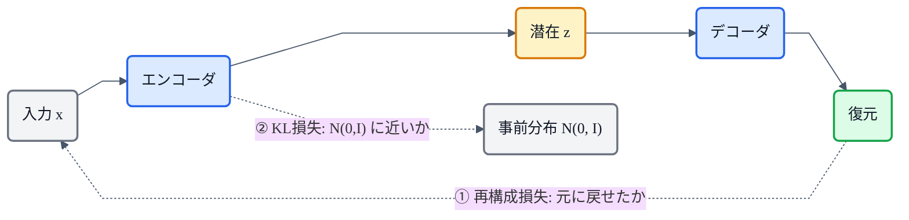
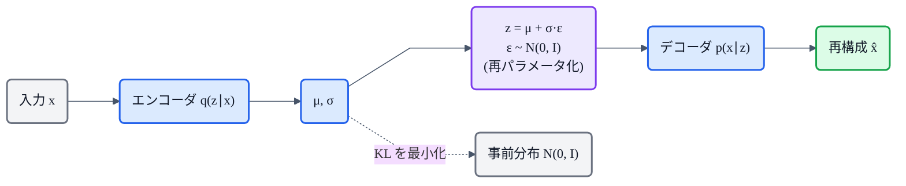

## この記事について

前回の[猫でもわかるFlow](https://zenn.dev/nnn112358/articles/flow-for-cats)で、VITSを構成する「**VAE + Flow + GAN**」のうち "F" を解説しました。今回はその3本柱のひとつ、**VAE(変分オートエンコーダ / Variational Autoencoder)** です。

:::message
**用語の注意**:「VAE + Flow + GAN」はVITSを構成する3つの技術のこと。VITSの正式名称は **V**ariational **I**nference with adversarial learning for end-to-end **T**ext-to-**S**peech(頭文字は V・I・T・S)で、VAE+Flow+GAN の頭文字を並べたものではありません。
:::

VAEは、生成モデル三兄弟(VAE・GAN・Flow)の一角。ひとことで言うと **「オートエンコーダに"確率の衣"を着せて、新しいデータを生成できるようにしたもの」**。そして実は、**VITSはまるごと1つの条件付きVAE**なんです。猫でもわかるように、図と最小限の数式でいきます。😺

:::message
この記事を読むと、これまでの記事(メル → HiFi-GAN → Flow)が **VITSという1つのVAEに合流する**のが見えてきます。数値・枠組みは論文本文で確認しています。図は numpy + matplotlib で自作しました。
:::

## 3行で言うと

- VAE = **エンコーダで入力を"分布"に圧縮 → サンプリング → デコーダで復元**する生成モデル。
- 潜在空間を **N(0, I) に近づける(KL項)** ので、ノイズをサンプルするだけで新データを生成できる。
- **VITSは条件付きVAEそのもの**。エンコーダ・デコーダ・事前分布(=Flow)・再構成損失・KLが全部そろっている。

## まず「オートエンコーダ(AE)」から

VAEの前に、素のオートエンコーダ(AE)。これは **入力を小さな潜在ベクトル $z$ に圧縮して、また復元する**ネットワークです。

```
x ──[エンコーダ]──▶ z(点)──[デコーダ]──▶ x̂(復元)
```

次元圧縮としては優秀ですが、**「生成」には向きません**。理由は潜在空間の構造。AEは $z$ を**1つの点**に詰め込むだけなので、潜在空間は**スカスカで穴だらけ**。適当な $z$ をサンプリングしてデコードしても、**学習データが無い"空白地帯"**を引いてしまい、ゴミが出てきます。


*左(AE): 潜在ベクトルがバラバラに散らばり、中央のサンプリング領域(破線 = N(0,I))は空っぽ。ここから $z$ を引くとデータの無い場所 → ゴミが出る。右(VAE): KL項が潜在を N(0,I) に引き寄せるので、サンプリング領域がちゃんとデータで埋まる → 生成できる。*

## VAEのひとひねり

VAEは、AEに2つの仕掛けを足します。

1. **エンコーダは「点」ではなく「分布」を出す**。入力 $x$ に対して、平均 $\mu$ と分散 $\sigma^2$ を出力し、$z$ を $\mathcal{N}(\mu, \sigma^2)$ から**サンプリング**する。
2. **その分布を、事前分布 $\mathcal{N}(0, I)$ に近づける**(KL項でペナルティ)。

この2つのおかげで、潜在空間が**原点まわりにギュッと整理**され(上図・右)、**$z \sim \mathcal{N}(0, I)$ をサンプリングしてデコードするだけで、それらしい新データが生成できる**ようになります。これがVAEが「生成モデル」である理由です。

## なぜ "variational"(変分)なのか

本当にやりたいのは、データの尤度 $p(x) = \int p(x|z)\,p(z)\,dz$ を最大化すること。でもこの積分(と事後分布 $p(z|x)$)は**まともに計算できません**。

そこで **変分推論**:計算できない $p(z|x)$ を、エンコーダという**近似分布 $q(z|x)$** で置き換え、$\log p(x)$ の**下限**を代わりに最大化します。この下限が **ELBO(Evidence Lower BOund / 変分下限)** です。

## ELBO ― たった2つの項

$$
\log p(x) \;\ge\; \underbrace{\mathbb{E}_{q(z|x)}\big[\log p(x|z)\big]}_{\text{① 再構成}} \;-\; \underbrace{\mathrm{KL}\big(q(z|x)\,\|\,p(z)\big)}_{\text{② 正則化}}
$$

猫向けに読むと、VAEの損失(=負のELBO)は**2つの項の足し算**です。

- **① 再構成損失**: デコーダが $z$ から $x$ をどれだけ正確に復元できるか。
- **② KL正則化**: エンコーダの出す分布 $q(z|x)$ を、事前分布 $\mathcal{N}(0, I)$ にどれだけ近づけられるか。

①だけだと素のAE(穴だらけ)。②を足すことで潜在空間が整い、生成できるようになる——このバランスがVAEの本質です。


*VAEの損失は2本柱。①復元の正確さ(再構成)と、②潜在空間の整い(KL)を同時に最適化する。*

## 再パラメータ化トリック

ひとつ技術的な難所があります。「$z$ を $\mathcal{N}(\mu, \sigma^2)$ からサンプリングする」という操作は**ランダムなので微分できず、誤差逆伝播で $\mu, \sigma$ を学習できません**。

これを解くのが **再パラメータ化トリック(reparameterization trick)**。

$$
z = \mu + \sigma \odot \varepsilon, \qquad \varepsilon \sim \mathcal{N}(0, I)
$$

**ランダム性を $\varepsilon$ という"外部から来るノイズ"に追い出し**、$\mu$ と $\sigma$ は決定的な計算にする。こうすれば $\mu, \sigma$ に勾配が流れ、学習できます。地味ですが、VAEを訓練可能にした決定的なアイデアです。



## 他の生成モデルとの違い

| モデル | サンプリング | 尤度 | ひとこと |
|---|---|---|---|
| **VAE** | 速い | 近似(ELBO) | エンコーダ+デコーダ。手軽だがぼやけやすい |
| **GAN** | 速い | 計算できない | 尖鋭・高品質だが不安定(→[HiFi-GAN](https://zenn.dev/nnn112358/articles/hifigan-for-cats)) |
| **正規化フロー** | 速い(可逆) | **厳密** | 可逆制約・同次元(→[Flow](https://zenn.dev/nnn112358/articles/flow-for-cats)) |
| **拡散** | 遅い(多ステップ) | (変分) | 高品質だが反復が重い |

VAEの弱点である「出力のぼやけ」は、しばしば**GANと組み合わせて**補われます。まさにVITSがそれです。

## TTSでのVAE ― VITSは丸ごと条件付きVAE

ここが今日の山場。VITSの論文はこう明言しています。

> *"VITS can be expressed as a conditional VAE with the objective of maximizing the variational lower bound, also called the evidence lower bound (ELBO)."*

VITSの各部品を、VAEの枠組みに当てはめるとこうなります。

| VAEの部品 | VITSでの実体 |
|---|---|
| エンコーダ $q(z \mid x)$ | posterior encoder(線形スペクトログラム → $z$) |
| デコーダ $p(x \mid z)$ | **HiFi-GAN generator**($z$ → 波形) + 敵対的学習 |
| 事前分布 $p(z \mid c)$ | text encoder + **正規化フロー**(条件つき) |
| 再構成損失 | メルスペクトログラムの **L1 損失** |
| 正則化 | KL( posterior ∥ prior ) |

そして総損失はこうなります(論文 §2.4)。

$$
L_{vae} = L_{recon} + L_{kl} + L_{dur} + L_{adv}(G) + L_{fm}(G)
$$

見てください。**再構成 + KL(VAE)** に、**敵対的損失 + 特徴マッチング(GAN)** が足され、事前分布は **正規化フロー(Flow)** で柔軟化されている。つまり——

**VITS = VAE(骨格) + Flow(事前分布) + GAN(デコーダ学習)**

これまでの記事([メル](https://zenn.dev/nnn112358/articles/what-is-mel-spectrogram)・[HiFi-GAN](https://zenn.dev/nnn112358/articles/hifigan-for-cats)・[Flow](https://zenn.dev/nnn112358/articles/flow-for-cats))が、**この1本の式に合流**します。VITSの "V" は、単なる飾りではなく屋台骨だったわけです。

:::message
VAEには離散版のいとこ **VQ-VAE**(潜在を"コードブック"の離散トークンにする)もいます。これが **SoundStream → EnCodec → DAC** というニューラルコーデックの源流になり、VALL-E などの **Codec LM** につながります(→[TTS系譜マップ](https://zenn.dev/nnn112358/articles/tts-lineage-map-from-vits))。VAEはTTSの至るところに顔を出します。
:::

## 猫のまとめ 😺

- VAE = **入力を"分布"に圧縮 → サンプリング → 復元**する生成モデル。素のAEに確率の衣を着せたもの。
- 損失は **ELBO = 再構成 + KL正則化** の2項。**KL項が潜在空間を N(0,I) に整える**から、ノイズから生成できる。
- **再パラメータ化トリック**($z = \mu + \sigma\varepsilon$)で、サンプリングを含むのに学習できる。
- **VITSは条件付きVAEそのもの**。VAE + Flow + GAN が1つの式に合流する。
- 離散版 **VQ-VAE** はコーデック(EnCodec/DAC)の源流。

これで VITSの3本柱「**VAE** + **Flow** + **GAN**」が全部つながりました。

## 参考リンク

- [Auto-Encoding Variational Bayes(VAE原論文, arXiv:1312.6114)](https://arxiv.org/abs/1312.6114)
- [VQ-VAE: Neural Discrete Representation Learning (arXiv:1711.00937)](https://arxiv.org/abs/1711.00937)
- [VITS (arXiv:2106.06103)](https://arxiv.org/abs/2106.06103)
- 関連記事: [猫でもわかるFlow](https://zenn.dev/nnn112358/articles/flow-for-cats) / [猫でもわかるHiFi-GAN](https://zenn.dev/nnn112358/articles/hifigan-for-cats) / [猫でもわかるメルスペクトログラム](https://zenn.dev/nnn112358/articles/what-is-mel-spectrogram) / [VITSから見るTTS 10系統マップ](https://zenn.dev/nnn112358/articles/tts-lineage-map-from-vits)

:::message
🐾 **猫でもわかるTTSシリーズ**(全28本) ― [目次](https://zenn.dev/nnn112358/articles/tts-for-cats-index) ／ 前: [Vocos](https://zenn.dev/nnn112358/articles/vocos-for-cats) ／ 次: [Flow](https://zenn.dev/nnn112358/articles/flow-for-cats)
:::
