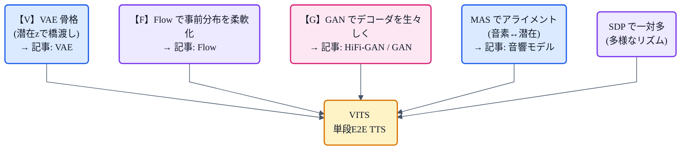
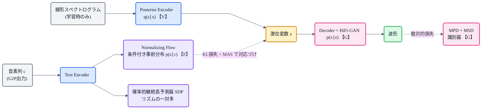
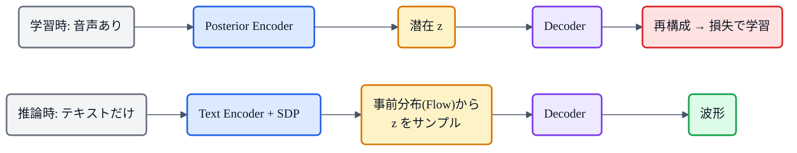

## この記事について

「猫でもわかる」TTSシリーズ、ついに本丸 **VITS** です。

これまで、TTSの部品を1つずつ見てきました——[G2P](https://zenn.dev/nnn112358/articles/g2p-for-cats)、[音響モデル](https://zenn.dev/nnn112358/articles/acoustic-model-for-cats)、[メルスペクトログラム](https://zenn.dev/nnn112358/articles/what-is-mel-spectrogram)、[HiFi-GAN](https://zenn.dev/nnn112358/articles/hifigan-for-cats)、そして生成モデル三兄弟の[VAE](https://zenn.dev/nnn112358/articles/vae-for-cats)・[Flow](https://zenn.dev/nnn112358/articles/flow-for-cats)・[GAN](https://zenn.dev/nnn112358/articles/gan-for-cats)。

**VITSは、これらが1つのモデルに合流する場所**です。VAE(V)を骨格に、Flow(F)で事前分布を柔軟にし、GAN(G)でデコーダを鍛える。さらに MAS でアライメントを自動化し、SDP で「喋り方の多様性」を表現する。総集編にふさわしい"全部入り"を、猫でもわかるように解きほぐします。😸

:::message
VITS = **V**ariational **I**nference with adversarial learning for end-to-end **T**ext-to-**S**peech(Kim et al., Kakao Enterprise, ICML 2021, [arXiv:2106.06103](https://arxiv.org/abs/2106.06103))。本記事の枠組み・数値・損失式はすべて論文本文で確認しています。
:::

## 3行で言うと

- VITS = **VAE + Flow + GAN + MAS + SDP** を1つに束ねた**単段E2E(テキスト→波形一気通貫)** のTTS。
- 従来の「音響モデル + ボコーダ」の2段を**まるごと1モデルに統合**し、並列生成で速く、人間並みの品質。
- 正体は**条件付きVAE**。潜在変数 z を挟んで、テキスト側(事前分布)と音声側(事後分布)をつなぐ。

## VITSとは ― 2段を1つに畳んだE2E

これまでのTTSは**2段構成**でした:音響モデルがメルを作り([→音響モデル](https://zenn.dev/nnn112358/articles/acoustic-model-for-cats))、ボコーダが波形にする([→HiFi-GAN](https://zenn.dev/nnn112358/articles/hifigan-for-cats))。間を**メルスペクトログラム**という中間表現でつないでいたわけです。

VITSは、この**中間のメルを外に出さず**、内部の潜在変数 z として扱うことで、**テキストから波形までを1つのモデルで一気通貫**に学習・生成します。しかも自己回帰ではなく**並列**なので高速。LJSpeechで**正解音声に匹敵するMOS**を達成しました。

## 全体像 ― VITSは「条件付きVAE」

VITSの正体を、論文はこう明言します。

> *"VITS can be expressed as a conditional VAE ... maximizing the ... ELBO."*

つまり中心にあるのは[VAE](https://zenn.dev/nnn112358/articles/vae-for-cats)。登場人物は3つです。

*VITSの学習時の構造。上段(事後分布→再構成): 線形スペクトログラム→Posterior Encoder→潜在 z→Decoder(HiFi-GAN)→波形。下段(事前分布): 音素列→Text Encoder→Normalizing Flow。z は KL損失+MAS で事前分布と対応づけられ、波形は識別器(MPD+MSD)で敵対的に評価される。【V】【F】【G】が VAE / Flow / GAN の担当箇所。*

- **Posterior Encoder(事後分布 q(z|x))**:音声側。線形スペクトログラムから潜在 z を作る。
- **Decoder(尤度 p(x|z))**:潜在 z から波形を作る。中身は **HiFi-GAN の generator**。
- **Prior(事前分布 p(z|c))**:テキスト側。text encoder + **正規化フロー**で「テキストから見た z の分布」を作る。

学習では、音声から作った z(事後)とテキストから作った分布(事前)が**一致する**よう KL で引き寄せ、z から波形を**再構成**します。推論では音声が無いので、**テキスト→事前分布→z→波形**だけで生成します。

## V ― VAE骨格(再構成 + KL)

VITSの背骨は[VAE](https://zenn.dev/nnn112358/articles/vae-for-cats)。損失は **ELBO = 再構成 + KL** の2本柱です。

- **再構成損失** $L_{recon}$:z から作った波形を**メルに変換して、正解メルとの L1 距離**を取る(人間の聴覚に効くメル領域で測る)。
- **KL損失** $L_{kl}$:事後分布 $q(z|x_{lin})$ を、テキスト由来の事前分布 $p(z|c)$ に近づける。

潜在 z が「音声とテキストの共通の待ち合わせ場所」になっているのがポイントです。

## F ― Flow(事前分布を柔軟に)

ここで[Flow](https://zenn.dev/nnn112358/articles/flow-for-cats)が効きます。テキストから作る事前分布を**単純な正規分布のまま**にすると、表現力が足りません。そこで **正規化フロー**(アフィンカップリング層のスタック)を載せ、単純な分布を**複雑で柔軟な分布**に変換します。

これがどれだけ効くか——論文の切除実験では、**この正規化フローを外すと MOS が 1.52 も低下**(2.98 まで激減)します。VITSの "F" は品質の要です。

## G ― GAN(デコーダを生々しく)

デコーダ(HiFi-GAN generator)は、[GAN](https://zenn.dev/nnn112358/articles/gan-for-cats)で鍛えます。再構成の L1 損失**だけ**では音がこもるので、**識別器 MPD + MSD**([→HiFi-GAN](https://zenn.dev/nnn112358/articles/hifigan-for-cats))による**敵対的損失** $L_{adv}$ と**特徴マッチング損失** $L_{fm}$ を足して、本物らしい波形の細部を作り込ませます。

## MAS ― アライメントを自力で探す

テキスト(音素列)は短く、潜在 z は長い。この**対応づけ(アライメント)**を、VITSは外部アライナー無しで解きます。使うのは[音響モデルの記事](https://zenn.dev/nnn112358/articles/acoustic-model-for-cats)で触れた **MAS(Monotonic Alignment Search)**(Glow-TTS 由来)。

VITSでは尤度ではなく **ELBO を最大化するアライメント**を動的計画法で探索するよう再定義されています。これで「どの音素が何フレーム分の z に対応するか」が学習中に自動で決まります。

## SDP ― 一対多(喋り方の多様性)

同じ文でも喋り方は無数にある([一対多問題](https://zenn.dev/nnn112358/articles/acoustic-model-for-cats))。VITSは **確率的継続長予測器(Stochastic Duration Predictor, SDP)** でこれに応えます。

SDPは**フローベースの生成モデル**で、継続長(=リズム)を**確率的に**サンプリングします。だから同じテキストから、**毎回少しずつ違う自然なリズム**の音声が作れる。FastSpeech2 が継続長を1つに決め打ちするのと対照的に、VITSは「多様さ」そのものをモデル化しているわけです。

## 総損失 ― すべてが1つの式に

そしてクライマックス。VITSの学習損失は、これまでの全部が**1本の式**に集約されます。

$$
L_{vae} = \underbrace{L_{recon} + L_{kl}}_{\text{V:VAE(+ F:Flowの事前分布)}} + \underbrace{L_{dur}}_{\text{SDP}} + \underbrace{L_{adv}(G) + L_{fm}(G)}_{\text{G:GAN}}
$$

| 損失項 | 担当 | 記事 |
|---|---|---|
| $L_{recon}$ (メル L1) | VAEの再構成 | [VAE](https://zenn.dev/nnn112358/articles/vae-for-cats) |
| $L_{kl}$ (事後 ∥ 事前) | VAEのKL(事前分布は **Flow** で柔軟化) | [VAE](https://zenn.dev/nnn112358/articles/vae-for-cats) / [Flow](https://zenn.dev/nnn112358/articles/flow-for-cats) |
| $L_{dur}$ | SDP(継続長の一対多) | [音響モデル](https://zenn.dev/nnn112358/articles/acoustic-model-for-cats) |
| $L_{adv}(G) + L_{fm}(G)$ | GANの敵対的 + 特徴マッチング | [HiFi-GAN](https://zenn.dev/nnn112358/articles/hifigan-for-cats) / [GAN](https://zenn.dev/nnn112358/articles/gan-for-cats) |

**V + F + G + SDP が、この1式に同居している**。VITSが「合流点」と呼ばれる理由です。

## 学習と推論のちがい

- **学習時**:音声(線形スペクトログラム)がある。事後 encoder で z を作り、decoder で波形を再構成、MASでアライメント、全損失で最適化。
- **推論時**:音声は無い。**テキストだけ**から、Text Encoder → SDPで継続長 → **事前分布(Flow)から z をサンプル** → Decoder → 波形。**事後 encoder は捨てる**(学習専用)。

「学習では両側から z を挟んで一致させ、推論ではテキスト側だけで z を作る」——VAEらしい使い方です。

*上: 学習時は音声から z を作って再構成。下: 推論時は音声なし、テキスト側から z を作って生成。Posterior Encoder は学習専用。*

*左: 学習時は音声(Posterior Encoder)とテキスト(Flow)の両方から z を挟み、KL損失で一致させる。右: 推論時は Posterior Encoder を外し、テキスト → Flow → z サンプル → Decoder だけで波形を生成。*

## なぜ効いた? そして系譜へ

VITSの意義は、**2段の分離学習の限界を超えた**こと。中間表現(メル)を固定せず、E2Eで最適化することで、より自然で高品質な音声に到達しました。

そして VITS は**膨大な派生**を生みました——VITS2、Bert-VITS2、Style-Bert-VITS2、MeloTTS、so-vits-svc、Fish-Speech……(→[VITSから見るTTS 10系統マップ](https://zenn.dev/nnn112358/articles/tts-lineage-map-from-vits))。TTSの現代史は、この1点から広がっています。

## 猫のまとめ 😸

VITSは、シリーズで学んだ部品の**総合芸術**です。

| 記号 | 部品 | 役割 |
|---|---|---|
| **V** | VAE | 潜在 z で音声とテキストを橋渡し(再構成 + KL) |
| **F** | 正規化フロー | 事前分布を柔軟に(外すと −1.52 MOS) |
| **G** | GAN | デコーダ(HiFi-GAN)を敵対的に鍛えて生々しく |
| — | MAS | 音素↔潜在のアライメントを自力探索 |
| — | SDP | 継続長を確率的にして「喋り方の多様性」を表現 |

- VITS = **単段E2E**の条件付きVAE。テキスト→波形を1モデルで、並列に、高品質に。
- **VAE + Flow + GAN + MAS + SDP** が1つの損失式に合流する。
- ここから VITS2 / Bert-VITS2 / MeloTTS / Fish-Speech など**現代TTSの大半が派生**した。

ここで「猫でもわかる」シリーズは大きな節目。**G2P → 音響モデル → メル → ボコーダ**の全工程、**VAE・Flow・GAN**の生成モデル、そしてそれらを束ねる **VITS** まで、ひととおり猫でもわかるようになりました。おつかれさまでした。🐾

## 参考リンク

- [VITS (arXiv:2106.06103)](https://arxiv.org/abs/2106.06103) / 実装 [jaywalnut310/vits](https://github.com/jaywalnut310/vits)
- シリーズ: [VAE](https://zenn.dev/nnn112358/articles/vae-for-cats) / [Flow](https://zenn.dev/nnn112358/articles/flow-for-cats) / [GAN](https://zenn.dev/nnn112358/articles/gan-for-cats) / [HiFi-GAN](https://zenn.dev/nnn112358/articles/hifigan-for-cats) / [音響モデル](https://zenn.dev/nnn112358/articles/acoustic-model-for-cats) / [メルスペクトログラム](https://zenn.dev/nnn112358/articles/what-is-mel-spectrogram) / [G2P](https://zenn.dev/nnn112358/articles/g2p-for-cats)
- [VITSから見るTTS 10系統マップ](https://zenn.dev/nnn112358/articles/tts-lineage-map-from-vits)

:::message
🐾 **猫でもわかるTTSシリーズ**(全25本) ― [目次](https://zenn.dev/nnn112358/articles/tts-for-cats-index) ／ 前: [Glow-TTS](https://zenn.dev/nnn112358/articles/glow-tts-for-cats) ／ 次: [VITS2](https://zenn.dev/nnn112358/articles/vits2-for-cats)
:::
