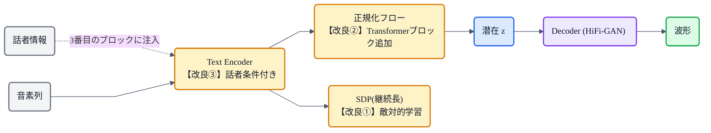

## この記事について

[猫でもわかるVITS](https://zenn.dev/nnn112358/articles/vits-for-cats)で、VAE + Flow + GAN + MAS + SDP を1つに束ねた単段E2E TTS を見ました。この記事はその**正常進化版 VITS2**(2023)です。

VITS は素晴らしい完成度でしたが、いくつか弱点も残っていました。VITS2 は、そこを **3つの的を絞った改良** でみがき、品質と効率をさらに上げたモデル。VITS を知っていれば、差分だけで理解できます。猫でもわかるように見ていきましょう。🆙

:::message
VITS2: Kong et al., *"VITS2: Improving Quality and Efficiency of Single-Stage Text-to-Speech with Adversarial Learning and Architecture Design"* (2023, [arXiv:2307.16430](https://arxiv.org/abs/2307.16430))。本記事の仕様は論文本文で確認しています。継続長の図は matplotlib、フローチャートは mermaid です。
:::

## 3行で言うと

- VITS2 = **VITS の弱点を3つの改良でみがいた**単段E2E TTS。
- 改良は ① **継続長予測(SDP)を敵対的学習に**、② **正規化フローに Transformer ブロック追加**、③ **話者条件付き text encoder**。
- 結果、品質・効率が上がり、**多話者の頑健性**や**音素依存**の課題も改善。

## VITSのおさらいと、残った弱点

[VITS](https://zenn.dev/nnn112358/articles/vits-for-cats) は「VAE + Flow + GAN + MAS + SDP」の合わせ技で、人間並みの品質を達成しました。ただ VITS2 の論文は、VITS になお残る弱点をこう挙げています。

- ときどき出る**不自然さ**、
- **継続長予測器(SDP)の学習効率**の低さ、
- 入力形式の複雑さ(**blank token** が必要など)、
- **多話者**での頑健性・自然さの不足、
- **音素変換への強い依存**。

VITS2 は、このうち特に効くところを3つ選んで改良します。

## 改良① 継続長予測(SDP)を「敵対的学習」に

VITS の [SDP](https://zenn.dev/nnn112358/articles/sdp-for-cats) は、フローベースで最尤推定的に学習していました。VITS2 はこれを **敵対的学習(GAN)** に変えます。ポイントは **time step-wise conditional discriminator(トークン単位の条件付き識別器)**。**各音素トークンの継続長を、1つずつ「本物らしいか」判定**する識別器を置き、生成器(SDP)はそれを騙すように学習します。

*SDP が各音素の継続長を予測 → 識別器が各トークンごとに「本物の継続長らしいか」を判定([→敵対的学習](https://zenn.dev/nnn112358/articles/gan-for-cats)) → 敵対的に自然なリズムへ。VITSより学習が効率的で、品質も向上する。*

これにより、継続長予測の**学習効率と品質**が上がりました。

## 改良② 正規化フローに Transformer ブロック

VITS の[正規化フロー](https://zenn.dev/nnn112358/articles/flow-for-cats)は、アフィンカップリング(＋畳み込み)が中心で、**遠く離れた位置どうしの関係(長距離依存)**を捉えるのは得意ではありませんでした。

VITS2 は、**正規化フローの中に小さな Transformer ブロックを残差接続で追加**します。Transformer の注意機構で長距離依存を捉えられるようになり、より自然な音声になります。

## 改良③ 話者条件付き text encoder

VITS では、text encoder は話者に依存しない設計で、話者情報は他のところで足していました。VITS2 は、**text encoder 自体を話者情報で条件づけ**ます(具体的には話者ベクトルを **3番目の Transformer ブロック**に注入)。テキストの段階から話者の特徴を反映できるので、**多話者での再現性・自然さ**が上がります。

## その他の調整

- **MAS にガウスノイズ**:VITS2 は [MAS](https://zenn.dev/nnn112358/articles/mas-for-cats) にノイズを加える修正版を使い、アライメント探索を改善します。
- **音素依存の緩和**:音素変換への強い依存を減らし、正規化テキストでも動きやすくしています。

## 全体像:VITS のどこに改良が入ったか

| | VITS | VITS2 |
|---|---|---|
| 継続長予測(SDP) | フローベース・最尤 | **敵対的学習**(time step-wise識別器) |
| 正規化フロー | アフィンカップリング | **+ Transformerブロック**(長距離依存) |
| text encoder | 話者非条件 | **話者条件付き**(多話者に強い) |
| 音素依存 | 強い | 緩和 |

VAE・GAN・MASといった土台はそのまま。**「効きどころを3つみがいた」**のが VITS2 だと分かります。

## 猫のまとめ 🆙

- VITS2 = **VITS の弱点を3改良でみがいた**単段E2E TTS。土台(VAE+Flow+GAN+MAS)はそのまま。
- ① **継続長(SDP)を敵対的学習に**(トークン単位の識別器)→ 効率・品質UP。
- ② **正規化フローに Transformer ブロック**→ 長距離依存を捉えて自然に。
- ③ **話者条件付き text encoder**→ 多話者の再現性UP。
- さらに MAS のノイズ化、音素依存の緩和も。

完成形に見えた VITS を、"どこを直せば効くか"を見極めてみがき上げた——それが VITS2 でした。この流れは Bert-VITS2 / MB-iSTFT-VITS2 など、多くの派生に受け継がれています([→系譜マップ](https://zenn.dev/nnn112358/articles/tts-lineage-map-from-vits))。

## 参考リンク

- [VITS2 (arXiv:2307.16430)](https://arxiv.org/abs/2307.16430)
- 関連記事: [猫でもわかるVITS](https://zenn.dev/nnn112358/articles/vits-for-cats) / [猫でもわかるSDP](https://zenn.dev/nnn112358/articles/sdp-for-cats) / [猫でもわかるGAN](https://zenn.dev/nnn112358/articles/gan-for-cats) / [猫でもわかるFlow](https://zenn.dev/nnn112358/articles/flow-for-cats) / [VITSから見るTTS 10系統マップ](https://zenn.dev/nnn112358/articles/tts-lineage-map-from-vits)

:::message
🐾 **猫でもわかるTTSシリーズ**(全27本) ― [目次](https://zenn.dev/nnn112358/articles/tts-for-cats-index) ／ 前: [VITS](https://zenn.dev/nnn112358/articles/vits-for-cats) ／ 次: [StyleTTS 2](https://zenn.dev/nnn112358/articles/styletts-for-cats)
:::
