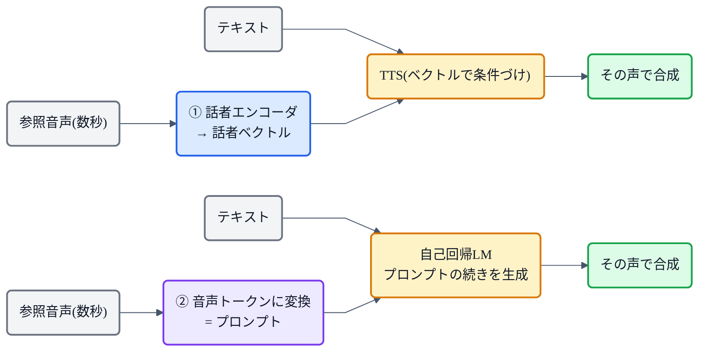

## この記事について

これまでの記事で、[VALL-E の3秒クローン](https://zenn.dev/nnn112358/articles/llm-tts-for-cats)、[StyleTTS 2](https://zenn.dev/nnn112358/articles/styletts-for-cats)、[Qwen3-TTS の3秒クローン](https://zenn.dev/nnn112358/articles/qwen-tts-for-cats)……と、たびたび **「数秒の参照でその人の声になる」** 機能が出てきました。この記事はその正体、**zero-shot(ゼロショット)TTS** の話です。

zero-shot TTS とは、**学習時に一度も聞いたことのない話者**を、**数秒の参照音声だけ**で、**再学習なし**に喋らせる技術。近年のTTSを一気に"実用"へ押し上げた立役者です。猫でもわかるように見ていきましょう。🪞

:::message
この記事は特定モデルではなく、**共通する考え方**の解説です。代表例(YourTTS / VALL-E / XTTS / StyleTTS 2 / Qwen3-TTS 等)の位置は [TTS系譜マップ](https://zenn.dev/nnn112358/articles/tts-lineage-map-from-vits) を参照してください。図は matplotlib と mermaid で作成しました。
:::

## 3行で言うと

- zero-shot TTS = **学習していない話者**を、**数秒の参照音声**だけで、**再学習なし**に再現するTTS。
- やり方は2つ:① **話者エンコーダで"声のベクトル"を抽出して条件づけ**、② **参照音声をプロンプトにして続きを生成**(in-context)。
- カギは **「何を言うか(内容)」と「誰の声か(話者)」を切り分ける**こと。

## 「ゼロショット」とは何か

機械学習で **"ゼロショット"** とは、**その対象を一度も学習していないのに、いきなりこなせる**こと。TTS では「学習データに無い話者の声を、追加学習なしで再現する」を指します。

従来との違いを整理すると:

| 呼び方 | その話者の学習 | 必要なもの |
|---|---|---|
| 単一話者TTS | その人の音声を大量に | 数時間〜 |
| 多話者TTS | 学習時の**決まった話者だけ** | — |
| 話者適応(few-shot / 微調整) | 少し学習(再学習が必要) | 数分＋学習 |
| **zero-shot** | **一切なし** | **数秒の参照だけ・再学習なし** |

*3秒の参照音声(学習に無い話者でOK)＋任意のテキスト → TTS(再学習なし) → その人の声で任意の文章を合成。「参照話者を一度も学習していなくても再現できる」のが zero-shot。*

## どう実現するのか:2つの流派

未知の声を再学習なしに再現するには、**参照音声から"その人らしさ"を取り出して、任意の内容に適用**します。方法は大きく2つ。

- **① 話者エンコーダ(埋め込み)方式**:参照音声から、話者照合で使うような **"話者ベクトル"(d-vector / x-vector)** を1本抽出し、それで TTS を条件づける。VITS系の [YourTTS](https://zenn.dev/nnn112358/articles/tts-lineage-map-from-vits)、XTTS、[StyleTTS 2](https://zenn.dev/nnn112358/articles/styletts-for-cats)(スタイルベクトル)などがこの路線。
- **② in-context(プロンプト)方式**:参照音声を**音声トークンに変換してプロンプトとして与え**、[LLM](https://zenn.dev/nnn112358/articles/llm-tts-for-cats) が「その続き」として同じ声で喋る。GPT が例を真似るのと同じ **文脈内学習**。[VALL-E](https://zenn.dev/nnn112358/articles/llm-tts-for-cats) が示した路線。

これはちょうど、シリーズの2大路線([VITS系](https://zenn.dev/nnn112358/articles/vits-for-cats) と [LLM TTS](https://zenn.dev/nnn112358/articles/llm-tts-for-cats))に対応しています。

## カギは「内容」と「話者」の分離

どちらの方式も、根っこは同じ発想です。**「何を言うか(内容 = テキスト)」と「誰の声で・どう言うか(話者・スタイル = 参照)」を切り分ける**こと。話者性を別ルートで捉えられれば、それを**任意の内容にかけ合わせる**だけで、その人が好きな文章を喋ります。

## 何が難しいのか

- **未知話者への汎化**:学習に無い声でも効くには、**大量で多様な話者データ**での事前学習が要る。
- **類似度 と 自然さ のトレードオフ**:声を似せようとすると不自然に、自然にすると似なくなりがち。
- **情報の少なさ**:3秒の参照には限られた手がかりしかない。それでどこまで再現できるかが勝負。

## どう評価するか

- **話者類似度(SIM)**:生成音声と参照が同じ話者に聞こえるか。WavLM などの**話者照合モデル**で測る。
- **自然さ(MOS / CMOS)**:人間らしいか。
- **WER**:ちゃんと内容を喋れているか(繰り返し・飛ばしのチェック)。

## 代表例

- **YourTTS**:最初期の多言語 zero-shot。VITS + d-vector。
- **VALL-E**:3秒プロンプトの in-context クローンで衝撃を与えた。
- **XTTS**:条件づけエンコーダ + GPT、多言語。
- **StyleTTS 2**:スタイル + 拡散で、**VALL-E の約1/250のデータ**でも高性能([→記事](https://zenn.dev/nnn112358/articles/styletts-for-cats))。
- **CosyVoice / [F5-TTS](https://zenn.dev/nnn112358/articles/f5-tts-for-cats) / [Qwen3-TTS](https://zenn.dev/nnn112358/articles/qwen-tts-for-cats)**:近年の高品質 zero-shot 勢。

## ひとこと倫理の話

zero-shot クローンは強力ゆえに、**本人の同意なく声を複製する"なりすまし"や詐欺・ディープフェイク**に悪用されうる技術でもあります。実サービスでは、**本人同意・用途制限・合成音であることの明示(電子透かし等)** といった配慮が欠かせません。便利さと責任はセットで、というのは覚えておきたいところです。

## 猫のまとめ 🪞

- zero-shot TTS = **学習していない話者を、数秒の参照だけ・再学習なし**で再現する技術。
- 実現法は2つ:① **話者エンコーダで声ベクトルを抽出→条件づけ**、② **参照をプロンプトにして続きを生成(in-context)**。
- 根っこは **「内容」と「話者」の分離**。話者性を別ルートで捉え、任意の内容にかけ合わせる。
- 難所は **未知話者への汎化**・**類似度と自然さの両立**。評価は **SIM / MOS / WER**。
- YourTTS → VALL-E → XTTS / StyleTTS 2 / CosyVoice / Qwen3-TTS と発展。**悪用への配慮**も忘れずに。

「数秒で誰の声にでもなる」——SFのようだったこの機能が、いまや現実。TTSが一気に実用化した鍵が、この zero-shot でした。

## 参考リンク

- [VALL-E (arXiv:2301.02111)](https://arxiv.org/abs/2301.02111) / [YourTTS (arXiv:2112.02418)](https://arxiv.org/abs/2112.02418)
- 関連記事: [猫でもわかるLLM TTS](https://zenn.dev/nnn112358/articles/llm-tts-for-cats) / [猫でもわかるStyleTTS 2](https://zenn.dev/nnn112358/articles/styletts-for-cats) / [猫でもわかるQwen3-TTS](https://zenn.dev/nnn112358/articles/qwen-tts-for-cats) / [VITSから見るTTS 10系統マップ](https://zenn.dev/nnn112358/articles/tts-lineage-map-from-vits)

:::message
🐾 **猫でもわかるTTSシリーズ**(全32本) ― [目次](https://zenn.dev/nnn112358/articles/tts-for-cats-index) ／ 前: [Qwen3-TTS](https://zenn.dev/nnn112358/articles/qwen-tts-for-cats) ／ 次: [MobileNet(番外)](https://zenn.dev/nnn112358/articles/mobilenet-for-cats)
:::
