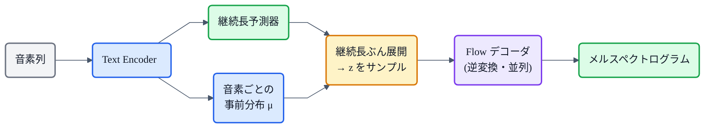
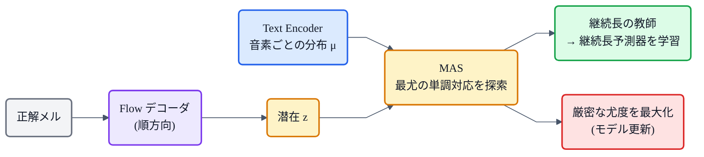

## この章について

これまで [Flow(正規化フロー)](https://zenn.dev/nnn112358/books/tts-for-cats/viewer/flow) と [MAS(単調アライメント探索)](https://zenn.dev/nnn112358/books/tts-for-cats/viewer/mas) を別々に解説してきました。**Glow-TTS** は、その2つが**出会って1つの音響モデルになる場所**です。そして [VITS](https://zenn.dev/nnn112358/books/tts-for-cats/viewer/vits) の**直接の前身**でもあります。

Glow-TTS(2020)は、**テキストからメルスペクトログラムを"並列に"生成する**音響モデル。自己回帰の Tacotron 2 が抱えていた「遅い」「注意が壊れる」という弱点を、**Flow と MAS**で解決しました。これまでの記事がここで合流します。猫でもわかるように見ていきましょう。✨

:::message
Glow-TTS: Kim et al., *"Glow-TTS: A Generative Flow for Text-to-Speech via Monotonic Alignment Search"* (2020, [arXiv:2005.11129](https://arxiv.org/abs/2005.11129))。本記事の仕様は論文本文で確認しています。展開の図は matplotlib、フローチャートは mermaid です。
:::

## 3行で言うと

- Glow-TTS = **Flow(可逆変換)+ MAS(単調アライメント)** で、テキスト → メルを**並列生成**する音響モデル。
- Tacotron 2(自己回帰＋注意)に対し、**速い・頑健(スキップ/繰り返しなし)・制御しやすい**。
- **VITS の前身**。Glow-TTS に VAE と GAN(HiFi-GAN)を足して単段E2E にしたのが VITS。

## 位置づけ:Tacotron 2 の弱点をどう直したか

Glow-TTS は [音響モデル](https://zenn.dev/nnn112358/books/tts-for-cats/viewer/acoustic-model)、つまり**テキスト(音素)→ メルスペクトログラム**を担う部分です。従来主流だった Tacotron 2 は自己回帰＋注意で、自然な反面、**1フレームずつなので遅く**、**注意が壊れると単語のスキップ・繰り返し**が起きました。

Glow-TTS はこれを、2つの柱で作り直します。

- **Flow デコーダ**:メルと潜在 `z` を**可逆変換**でつなぐ。生成時は逆変換で**全フレームを一気に(並列)**メルにする。
- **MAS**:テキストと音声の対応を、**外部アライナー無しで単調に**求める。注意のような崩壊が起きない。

## 柱①:Flow デコーダ(メル ⇔ 潜在 z)

Glow-TTS の背骨は [正規化フロー](https://zenn.dev/nnn112358/books/tts-for-cats/viewer/flow)です。メルの条件付き分布 `P(mel | テキスト)` を、単純な事前分布 `P(z | テキスト)` を**可逆な変換 f で写して**表現します。学習時はメルを `z` に変換して(順方向)、変数変換の公式で**厳密な尤度**を計算し最大化。生成時は逆に `z` からメルを作ります(逆方向)。

デコーダの中身は、[Flow の記事](https://zenn.dev/nnn112358/books/tts-for-cats/viewer/flow)で出てきた **ActNorm + 可逆1×1畳み込み + アフィンカップリング** のブロックの積み重ね(WaveGlow/Glow と同じ部品)。可逆なので、順・逆どちらも**並列**に計算でき、これが高速生成につながります。

## 柱②:MAS(単調アライメント探索)

もう一つの柱が [MAS](https://zenn.dev/nnn112358/books/tts-for-cats/viewer/mas)。実は **MAS はこの Glow-TTS で提案された**アルゴリズムです。

テキスト側は、各音素について「その音素らしい潜在の事前分布(平均 μ)」を持っています。MAS は、音声から得た `z` に対して、**尤度が最大になる単調な対応**を動的計画法で探します。外部ツールに頼らず、しかも単調(順序を守り飛ばさない)なので、注意のような崩壊が起きません。詳しくは[MASの記事](https://zenn.dev/nnn112358/books/tts-for-cats/viewer/mas)へ。

## どう並列に生成するのか

推論の流れはこうです。テキストを Text Encoder に通すと、**音素ごとの事前分布 μ** が出ます。別に **継続長予測器**が各音素の長さを予測するので、その長さぶん μ を**展開**してフレーム長にそろえ、そこから `z` をサンプリングして、**Flow の逆変換で一気にメルへ**変換します。

*① Text Encoder が音素ごとの事前分布 μ を出す。② それを継続長ぶん“展開”してフレーム長にそろえる(図の `ko×3` は「koを3フレーム分」)。あとはサンプルして Flow の逆変換に通せば、全フレームのメルが一気にできる(並列)。*

学習時は逆に、正解メルを Flow で `z` に変換し、MAS でアライメントを求め、そのアライメントから得た継続長を**継続長予測器の教師**にします([→この継続長がのちに VITS では SDP の教師になる](https://zenn.dev/nnn112358/books/tts-for-cats/viewer/sdp))。

学習の流れも図にしておきます。

*学習時: メルを Flow で z に変換し、MAS が最尤の対応を見つける。その対応から継続長の教師も得られる。*

## Tacotron 2 との比較

| | Tacotron 2 | Glow-TTS |
|---|---|---|
| 生成 | 自己回帰(1フレームずつ) | **並列**(一気に) |
| アライメント | soft attention(学習) | **MAS**(単調・DP探索) |
| 速度 | 遅い | **速い** |
| 頑健性 | 注意崩壊あり(skip/repeat) | **単調で頑健** |
| 制御 | 難しい | 速さ・声のゆらぎを**制御しやすい** |

継続長を変えれば**話速**を、事前分布のばらつき(温度)を変えれば**声のゆらぎ**を調整できるのも、Glow-TTS の利点です。なお Glow-TTS が出すのはメルまでなので、波形にするには [HiFi-GAN](https://zenn.dev/nnn112358/books/tts-for-cats/viewer/hifigan) などの**ボコーダが別途必要**(2段構成)です。

## そして VITS へ

Glow-TTS の Flow + MAS は、そのまま [VITS](https://zenn.dev/nnn112358/books/tts-for-cats/viewer/vits) に受け継がれました。VITS は Glow-TTS に、

- **VAE**([→V](https://zenn.dev/nnn112358/books/tts-for-cats/viewer/vae))で音声側と潜在をつなぎ、メルを中間に出さない**単段E2E**化、
- **GAN**([→HiFi-GAN generator](https://zenn.dev/nnn112358/books/tts-for-cats/viewer/hifigan))を波形デコーダに、
- 継続長を決め打ちから**確率的([→SDP](https://zenn.dev/nnn112358/books/tts-for-cats/viewer/sdp))** に、

と足していったもの。**Glow-TTS は、VITS という完成形の一歩手前**なのです。

## 猫のまとめ ✨

- Glow-TTS = **Flow(可逆変換)+ MAS(単調アライメント)** による**並列**音響モデル(テキスト → メル)。
- Tacotron 2 に対し、**速い・頑健・制御しやすい**。MAS はここで生まれた。
- 推論は「音素ごとの事前分布 → 継続長で展開 → サンプル → Flow逆変換 → メル」。全部**並列**。
- メルまでなので、波形化には**ボコーダ(HiFi-GAN等)が別途必要**(2段)。
- **VITS の直接の前身**。ここに VAE・GAN・SDP を足すと VITS になる。

これまで別々に見てきた [Flow](https://zenn.dev/nnn112358/books/tts-for-cats/viewer/flow) と [MAS](https://zenn.dev/nnn112358/books/tts-for-cats/viewer/mas) が、Glow-TTS で1つの形になり、[VITS](https://zenn.dev/nnn112358/books/tts-for-cats/viewer/vits) へと続いていく——シリーズの点と点がつながる記事でした。

## 参考リンク

- [Glow-TTS (arXiv:2005.11129)](https://arxiv.org/abs/2005.11129) / 実装 [jaywalnut310/glow-tts](https://github.com/jaywalnut310/glow-tts)
- 関連記事: [猫でもわかるFlow](https://zenn.dev/nnn112358/books/tts-for-cats/viewer/flow) / [猫でもわかるMAS](https://zenn.dev/nnn112358/books/tts-for-cats/viewer/mas) / [猫でもわかるVITS](https://zenn.dev/nnn112358/books/tts-for-cats/viewer/vits) / [猫でもわかる音響モデル](https://zenn.dev/nnn112358/books/tts-for-cats/viewer/acoustic-model)
