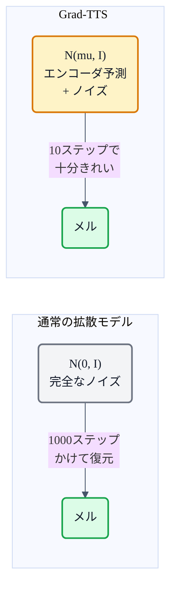
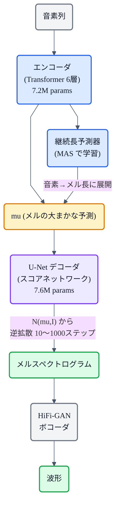
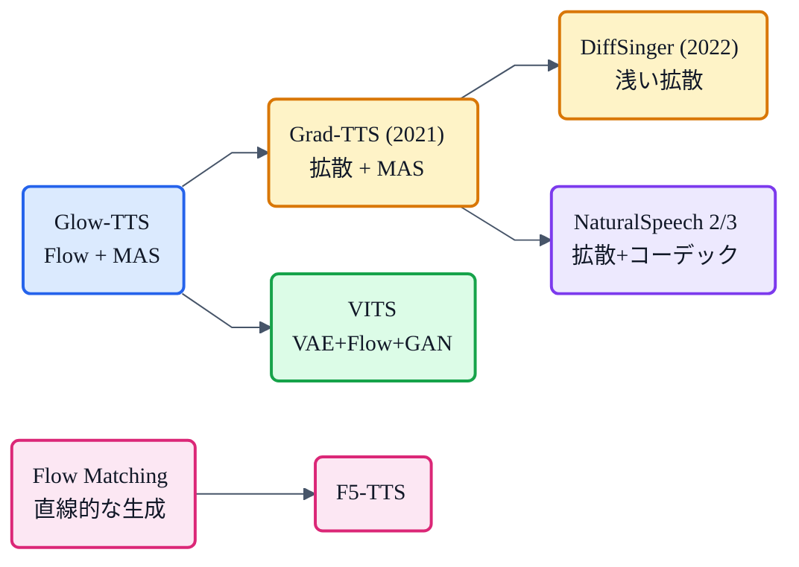

## この章について

ここまでのシリーズでは、メルスペクトログラムを**回帰(直接予測)**するか、**Flow(可逆変換)**で生成するモデルを見てきました。今回は第3の生成アプローチ——**拡散モデル(Diffusion Model)**をTTSに持ち込んだ **Grad-TTS**(2021, Huawei Noah's Ark Lab)を見ます。

「データにノイズを加えていき、そのノイズ除去を学ぶ」という画像生成で爆発的に成功した手法を、メルスペクトログラム生成に応用。しかも Grad-TTS は **ノイズの出発点を「エンコーダの予測」にする** という工夫で、たった **10ステップ** でも高品質な音声を実現しました。

:::message
Grad-TTS: Popov et al., *"Grad-TTS: A Diffusion Probabilistic Model for Text-to-Speech"* (2021, ICML, [arXiv:2105.06337](https://arxiv.org/abs/2105.06337))。LJSpeech(24時間)で学習、MOS 4.44(GT 4.53)。15Mパラメータ。本記事の仕様・数値は論文本文で確認しています。図は mermaid で作成しました。
:::

## 3行で言うと

- Grad-TTS = **拡散モデル(スコアベースSDE)でメルスペクトログラムを生成**するTTS。
- 最大の工夫: ノイズの出発点を N(0,I) でなく **N(mu, I)**(エンコーダ出力)にする「**情報付き事前分布**」。
- **10ステップでも MOS 4.38**（Glow-TTS 4.11 / Tacotron 2 4.32 を上回る）。15Mパラメータ。

## 拡散モデルとは(30秒で)

拡散モデルの基本は2つのプロセスです。

1. **前向き過程**: データに少しずつノイズを加えて、最終的に純粋なノイズにする。
2. **逆過程**: ノイズからデータを少しずつ復元する。この「ノイズ除去」をニューラルネットで学ぶ。

画像生成(DALL-E 2, Stable Diffusion)で大成功した手法ですが、TTSでは **メルスペクトログラム** に対してこれを行います。

## Grad-TTS の核心:「どこからノイズ除去を始めるか」

通常の拡散モデルは、完全にランダムなノイズ **N(0, I)** から復元を始めます。しかし Grad-TTS は違います。

**テキストエンコーダが出力した mu（メルの"大まかな予測"）を中心にしたノイズ N(mu, I) から始める**。

論文の ablation がこれを明確に示しています: **10ステップで N(mu, I) vs N(0, I) を比較すると、93.8% のリスナーが N(mu, I) を好んだ**。50ステップまで増やしても、まだ 60.3% が N(mu, I) を好みます。「出発点がすでに答えに近い」ので、少ないステップで高品質に到達できるのです。

## アーキテクチャ全体像

### エンコーダ + MAS(Glow-TTS と同じ)

エンコーダは [Glow-TTS](https://zenn.dev/nnn112358/books/tts-for-cats/viewer/glow-tts) と同一構造(3層 Conv pre-net + Transformer 6層)。アライメントは **[MAS](https://zenn.dev/nnn112358/books/tts-for-cats/viewer/mas)** で教師なし学習。継続長予測器も同じ 2層 Conv 構成。合計 **7.2M パラメータ**。

### U-Net デコーダ(スコアネットワーク)

拡散の「ノイズ除去」を担う U-Net。DDPM(Ho et al. 2020)の画像用 U-Net をベースに、チャネル数を半分・解像度を3段に削減して軽量化。80次元メルを 80×F → 40×F/2 → 20×F/4 の3段で処理。mu を追加チャネルとして連結入力。**7.6M パラメータ**。

合計わずか **15M パラメータ**(Glow-TTS 28.6M、Tacotron 2 28.2M の約半分)。

## ステップ数 vs 品質のトレードオフ

| ステップ数 | RTF (GPU) | MOS |
|---|---|---|
| 4 | 0.012 | 3.96 |
| **10** | **0.033** | **4.38** |
| 100 | 0.363 | 4.38 |
| 1000 | 3.663 | 4.44 |
| Glow-TTS | 0.008 | 4.11 |
| Tacotron 2 | 0.075 | 4.32 |
| **人間(GT)** | — | **4.53** |

**10ステップで MOS 4.38** は、100ステップと同等で Glow-TTS(4.11)・Tacotron 2(4.32)を上回ります。RTF 0.033 は Tacotron 2 の2倍速。4ステップまで減らすとさすがに劣化しますが、それでも 3.96。

1000ステップの MOS 4.44 は GT(4.53)との差わずか 0.09。拡散モデルは**ステップを増やすほど品質が上がる**という、他の生成手法にない特性を持っています。

## Glow-TTS との関係

Grad-TTS と [Glow-TTS](https://zenn.dev/nnn112358/books/tts-for-cats/viewer/glow-tts) はエンコーダと MAS を共有していますが、デコーダの生成戦略が対照的です。

| | Glow-TTS | Grad-TTS |
|---|---|---|
| デコーダ | Normalizing Flow (可逆変換) | 拡散モデル (スコアベースSDE) |
| 生成方式 | 1パスで変換 | 反復的にノイズ除去 |
| 品質-速度 | 固定(速いが上限あり) | ステップ数で調整可能 |
| パラメータ | 21.4M (デコーダ) | **7.6M (デコーダ)** |
| MOS | 4.11 | **4.38〜4.44** |

Flow は1パスで速いが表現力に限界があり、拡散はステップを費やすほど品質が向上します。Grad-TTS はデコーダが Glow-TTS の **1/3 のパラメータ**で、より高い MOS を達成しています。

## 系譜での位置

Grad-TTS は **拡散モデル系TTS の起点**です。後継の DiffSinger は「浅い拡散」(エンコーダ出力から途中のステップで開始)で推論を高速化。NaturalSpeech 2/3 は拡散をコーデックトークンの潜在空間で行い、さらにスケール。一方 [Flow Matching](https://zenn.dev/nnn112358/books/tts-for-cats/viewer/flow-matching) は拡散の「曲がった経路」を直線化し、[F5-TTS](https://zenn.dev/nnn112358/books/tts-for-cats/viewer/f5-tts) のような簡潔なモデルを生みました。

## 猫のまとめ 🌫️

- Grad-TTS = **拡散モデル(スコアベースSDE)**でメルを生成するTTS。エンコーダ+MAS は Glow-TTS と同じ。
- 核心: ノイズの出発点を **N(mu, I)**(エンコーダ予測)にする「情報付き事前分布」。**10ステップで MOS 4.38**。
- 合計 **15M パラメータ**（Glow-TTS/Tacotron 2 の約半分）で、品質はどちらも上回る。
- **ステップ数で品質-速度を連続的に調整**できるのが拡散モデル特有の強み。
- 拡散TTS の起点。DiffSinger → NaturalSpeech 2/3 へと続く系譜のルーツ。

## 参考リンク

- [Grad-TTS (arXiv:2105.06337)](https://arxiv.org/abs/2105.06337)
- 関連記事: [猫でもわかるGlow-TTS](https://zenn.dev/nnn112358/books/tts-for-cats/viewer/glow-tts) / [猫でもわかるMAS](https://zenn.dev/nnn112358/books/tts-for-cats/viewer/mas) / [猫でもわかるFlow Matching](https://zenn.dev/nnn112358/books/tts-for-cats/viewer/flow-matching) / [猫でもわかるF5-TTS](https://zenn.dev/nnn112358/books/tts-for-cats/viewer/f5-tts) / [猫でもわかるVITS](https://zenn.dev/nnn112358/books/tts-for-cats/viewer/vits)
