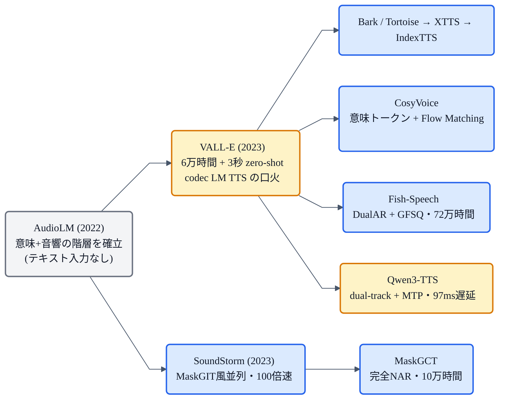

## この章について

前回の [Qwen3-TTS](https://zenn.dev/nnn112358/books/tts-for-cats/viewer/qwen3-tts) は「LLMに喋らせる」タイプのTTSでした。実はこれ、VALL-E や CosyVoice、Bark、XTTS…… と、近年の多くのモデルが共有する**大きな路線**の一員です。この章では、その **LLM TTS(コーデック言語モデル型TTS)** というパラダイムを、一段上から俯瞰します。

キーワードは **「音声生成を、言語モデル(LM)の問題として解く」**。GPT が次の単語を予測するのと同じ要領で、**次の"音声トークン"を予測**して喋る——この発想を、解きほぐします。🤖

:::message
この章は個別モデルの詳細ではなく、**共通する考え方**の解説です。代表例(VALL-E / AudioLM / SoundStorm / MaskGCT / Fish-Speech / Qwen3-TTS 等)の位置関係は [TTS系譜マップ](https://zenn.dev/nnn112358/articles/tts-lineage-map-from-vits) を参照してください。数値は各論文本文で確認しています。図は matplotlib と mermaid で作成しました。
:::

## 3行で言うと

- LLM TTS = **音声を離散トークンの列にして、LLM(GPT風)が次のトークンを自己回帰で生成**するTTS。
- 部品は3つ:**① ニューラルコーデック**(音声↔トークン)、**② 自己回帰LM**、**③ 条件づけ**(テキスト＋話者プロンプト)。
- 強みは**スケール**と**文脈内学習**(3秒プロンプトで即クローン=zero-shot)。弱みは**遅さ**と**不安定さ**。

## 基本の発想:音声版のGPT

文章生成では、GPT が「これまでの単語列」から「次の単語」を予測して、文を伸ばしていきます。LLM TTS は、これを**音声**でやります。

まず音声を、単語のような**離散トークンの列**に変換します。あとは、**LLM が「これまでの音声トークン列」から「次の音声トークン」を1つずつ予測**して、音声を伸ばしていく。最後にトークン列をコーデックで波形に戻せば、音声のできあがりです。

*テキストと話者プロンプトを条件に、自己回帰LMが音声トークンを1つずつ生成(GPTと同じ)。トークン列をコーデックのデコーダに通すと波形になる。「音声を言語のように扱う」のが LLM TTS。*

## 3つの部品

LLM TTS は、だいたい次の3つでできています。

1. **ニューラルコーデック(トークナイザ)**:連続的な音声波形を**離散トークン**に変換する部品([SoundStream / EnCodec](https://zenn.dev/nnn112358/books/tts-for-cats/viewer/encodec) / DAC / Mimi など。元をたどれば [VQ-VAE](https://zenn.dev/nnn112358/books/tts-for-cats/viewer/vae))。逆にトークンから波形も復元する。
2. **自己回帰LM(GPT風)**:デコーダ型 Transformer で、次のトークンを予測する本体。
3. **条件づけ**:何を喋るかの**テキスト**(音素やBPE)と、誰の声かの**話者プロンプト**(数秒の参照音声)。

## 2種類のトークン:意味 と 音響

ここが LLM TTS のキモの一つ。音声トークンには、**性質の違う2種類**があります。

- **意味トークン(semantic)**:**何を言っているか**を粗く捉える(HuBERT や w2v-BERT 由来)。文の内容・発音に対応。
- **音響トークン(acoustic)**:**どう響くか**を細かく捉える([EnCodec](https://zenn.dev/nnn112358/books/tts-for-cats/viewer/encodec) / SoundStream 由来)。音色・韻律・話者性など。

この二段構造を最初に確立したのが **AudioLM**(2022, Google)です。AudioLM 自体はテキスト入力を持たない「音声の続きを生成する」モデルですが、**意味トークンで大枠を作り→音響トークンで肉付けする(粗→細)** という設計パターンを示し、VALL-E 以降の LLM TTS すべてに引き継がれました。人間が聴いても合成音声と見分けがつかない（判別率 51.2%＝ほぼ偶然）という衝撃の結果も出しています。

## なぜこの路線が強いのか

- **スケールの恩恵**:LLM の"大きくすれば賢くなる"性質と、大量データ・既存のLLM技術をそのまま活かせる。VALL-E は **6万時間**の音声で学習し、VITS系の数百時間とは桁が違います。Fish-Speech にいたっては **72万時間**。
- **文脈内学習(in-context learning)**:GPT が例を見せると真似るように、**数秒の参照音声(プロンプト)を与えると、その声の続きとして喋る**。これで**zero-shot 音声クローン**ができる——VALL-E が示した衝撃でした。VCTK データセットでは、**人間の録音と統計的に区別できない**(CMOS +0.04 vs GT)品質を達成しています。
- **表現力・多様性**:確率的に生成するので、自然で多彩。

## 多コードブックの捌き方:3つの戦略

コーデックは普通、[RVQ(残差ベクトル量子化)](https://zenn.dev/nnn112358/books/tts-for-cats/viewer/encodec)で**複数のコードブック**(層)を持ちます。EnCodec なら8層、SoundStream なら12層。全部を素直に自己回帰すると**遅すぎる**ので、各モデルは工夫します。

*A. AR+NAR(VALL-E): 1層目だけ自己回帰(時間方向に順に)、残りは一括で並列生成。B. Masked Generative(SoundStorm/MaskGCT): マスクされたトークンを信頼度順に段階的に埋める。並列なので高速(SoundStormは30秒の音声を0.5秒で生成)。C. MTP(Qwen3-TTS): 1ステップで全コードブックを同時に予測し、フレーム方向に進む。超低遅延(97ms)。*

| 戦略 | 代表 | 速度 | しくみ |
|---|---|---|---|
| **AR + NAR** | VALL-E | 遅め | 1層目は自己回帰、残りは並列 |
| **Masked** | SoundStorm / MaskGCT | **高速** | マスクを段階的に埋める(MaskGIT風) |
| **MTP** | [Qwen3-TTS](https://zenn.dev/nnn112358/books/tts-for-cats/viewer/qwen3-tts) | **超低遅延** | 全層を1ステップで予測 |

なお [Fish-Speech](https://zenn.dev/nnn112358/books/tts-for-cats/viewer/fish-speech) は RVQ ではなく **GFSQ(Grouped Finite Scalar Quantization)** という独自の量子化を使い、意味/音響の二段分割自体を避けています。DualAR(Slow + Fast の2段 Transformer）で高速かつ安定。G2P も不要で、LLM がテキストを直接処理します（[→Fish-Speechの章](https://zenn.dev/nnn112358/books/tts-for-cats/viewer/fish-speech)）。

## 弱点

- **遅い**:1トークンずつの自己回帰は、[WaveNet](https://zenn.dev/nnn112358/books/tts-for-cats/viewer/wavenet) と同じで逐次生成。ストリーミングやNAR化で緩和するが、VITS系の並列生成にはかなわない。
- **不安定**:LMなので**繰り返し・飛ばし・言い間違い**(誤りの蓄積)が起きやすい。MaskGCT は完全NARにすることでこの問題を回避しています。
- **コーデック依存**:トークナイザの品質が上限を決める。

## 代表モデルの系譜

## VITS系(単段E2E)との違い

| | VITS系(単段E2E) | LLM TTS(コーデックLM) |
|---|---|---|
| 生成 | 並列(Flow / GAN) | 自己回帰(トークン列) |
| 速度 | **速い** | 遅め(逐次) |
| 学習データ | 数百〜数千時間 | **数万〜数十万時間** |
| zero-shotクローン | 弱め | **得意**(文脈内学習) |
| 安定性 | **高い** | 繰り返し/飛ばしが出やすい |
| スケール感 | 中 | **大**(LLMの恩恵) |

どちらが上というより、**得意が違う**。安定・高速なら [VITS](https://zenn.dev/nnn112358/books/tts-for-cats/viewer/vits) 系、zero-shot や大規模なら LLM TTS、という住み分けです。最近は CosyVoice のように **LM + [Flow Matching](https://zenn.dev/nnn112358/books/tts-for-cats/viewer/flow-matching)** のハイブリッドも増えています。

## まとめ 🤖

- LLM TTS = **音声を離散トークン列にして、LMが次のトークンを自己回帰生成**する路線(=音声版のGPT)。
- 部品は **コーデック + 自己回帰LM + 条件づけ**。トークンは **意味(何を言う)** と **音響(どう響く)** の2種で、粗→細に生成（AudioLM が確立した設計）。
- 多コードブックの捌き方は3戦略: **AR+NAR**(VALL-E) / **Masked**(SoundStorm・MaskGCT) / **MTP**(Qwen3-TTS)。
- 強みは **スケール**(VALL-E 6万時間, Fish-Speech 72万時間)と **文脈内学習(3秒でzero-shotクローン)**。弱みは **遅さ**と **不安定さ**。
- **VITS系(速い・安定)** と **LLM TTS(zero-shot・スケール)** は、得意の違う2大路線。

「音声を、言葉のように扱う」——この一つの発想が、現代TTSの半分を動かしています。

## 参考リンク

- [VALL-E (arXiv:2301.02111)](https://arxiv.org/abs/2301.02111) / [AudioLM (arXiv:2209.03143)](https://arxiv.org/abs/2209.03143) / [SoundStorm (arXiv:2305.09636)](https://arxiv.org/abs/2305.09636)
- [MaskGCT (arXiv:2409.00750)](https://arxiv.org/abs/2409.00750) / [Fish-Speech (arXiv:2411.01156)](https://arxiv.org/abs/2411.01156)
- 関連する章: [EnCodec](https://zenn.dev/nnn112358/books/tts-for-cats/viewer/encodec) / [Qwen3-TTS](https://zenn.dev/nnn112358/books/tts-for-cats/viewer/qwen3-tts) / [VITS](https://zenn.dev/nnn112358/books/tts-for-cats/viewer/vits) / [VAE](https://zenn.dev/nnn112358/books/tts-for-cats/viewer/vae) / [VITSから見るTTS 10系統マップ](https://zenn.dev/nnn112358/articles/tts-lineage-map-from-vits)
