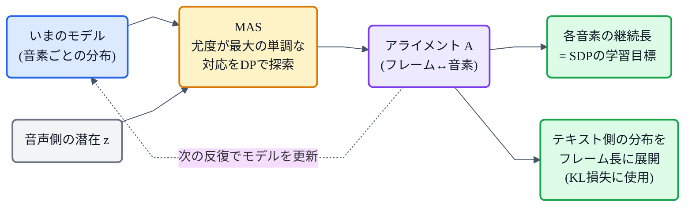

## この章について

[猫でもわかるVITS](https://zenn.dev/nnn112358/books/tts-for-cats/viewer/vits)で、VITS の部品として **MAS(Monotonic Alignment Search / 単調アライメント探索)** を紹介しました。この記事はその深掘りです。

前回の [SDP](https://zenn.dev/nnn112358/books/tts-for-cats/viewer/sdp) が「推論のとき、継続長を**生成する**」係だったのに対し、MAS は「学習のとき、正解のアライメント（＝どのフレームがどの音素か）を**見つける**」係。ちょうど対になる部品です。しかも **外部ツールに一切頼らず、動的計画法で自力で**それをやってのけます。猫でもわかるように解いていきます。🪜

:::message
MAS は Glow-TTS(Kim et al., 2020, [arXiv:2005.11129](https://arxiv.org/abs/2005.11129))で提案され、VITS([arXiv:2106.06103](https://arxiv.org/abs/2106.06103))に受け継がれました。本記事の仕様は両論文で確認しています。図のうちアライメントの図は matplotlib(実際にMASの動的計画法を実装して描画)、フローチャートは mermaid です。
:::

## 3行で言うと

- MAS = 「どのフレームがどの音素に対応するか(アライメント)」を、**尤度が最大になる"単調な"対応**として**動的計画法**で探すアルゴリズム。
- Tacotron の注意やFastSpeech の外部アライナーと違い、**外部ツール不要**で自力かつ**頑健**(スキップ・繰り返しが起きない)。
- 見つけたアライメントから各音素の**継続長**が決まり、それが [SDP](https://zenn.dev/nnn112358/books/tts-for-cats/viewer/sdp) の学習目標にもなる。

## 何を解きたいのか:アライメント問題

[音響モデルの記事](https://zenn.dev/nnn112358/books/tts-for-cats/viewer/acoustic-model)で見たとおり、TTS の中心的な難所は **短い音素列と長い音声フレーム列の対応づけ(アライメント)** です。「こんにちは」の `k` は何フレーム分？ `o` は？——これが分からないと、そもそも学習ができません。

厄介なのは、**正解のアライメントはデータに付いていない**こと。音声とテキストのペアはあっても、「どの瞬間がどの音素か」というラベルは普通ありません。ここをどう埋めるかで、TTS の流派が分かれます。

| 手法 | アライメントの決め方 | 特徴 |
|---|---|---|
| **Tacotron**(注意) | soft attention を学習で獲得 | 自動だが**壊れやすい**(スキップ/繰り返し/もごもご) |
| **FastSpeech**(外部アライナー) | MFA などの外部ツールや教師モデルで事前抽出 | 正確だが**外部依存**・別工程が必要 |
| **Glow-TTS / VITS**(MAS) | 尤度が最大の単調な対応を**自力でDP探索** | **外部不要・単調で頑健** |

## MASのアイデア:尤度が最大の「単調な経路」を探す

MAS の発想はシンプルです。まずモデルは、各音素について「その音素らしい潜在表現の分布」（平均と分散）を持っています。すると、音声から得た潜在 `z` の各フレームが、**どの音素の分布にどれだけ当てはまるか(尤度)** を、音素×フレームの表として計算できます。

あとは、その表の中で **合計の尤度がいちばん大きくなる対応の道すじ(経路)** を選べばよい——ただし、勝手な経路ではなく **「単調」** という制約をつけます。

*音素(縦)×フレーム(横)の各マスに「そのフレームがその音素にどれだけ合うか」の尤度が入っている(濃いほど高い)。MASは、合計尤度が最大になる赤い経路を選ぶ。経路は右(同じ音素にとどまる)か右下(次の音素へ進む)にしか動けず、決して戻らない=**単調**。*

## なぜ「単調」なのか

「単調(monotonic)」とは、**音素の順番を守り、後戻りせず、どの音素も飛ばさない**という制約です。図の赤い経路が、右か右下にしか進まないのがそれです。

これは音声にとって**とても自然な前提**です。人は文章を**左から右へ順番に**読み、音素を入れ替えたり飛ばしたりしません。だから対応も、順序を保った単調なものになるはずです。この強い制約のおかげで、Tacotron の注意で起きがちな「単語のスキップ・繰り返し」が **原理的に起きません**。ここが MAS の頑健さの源です。

## どうやって最大の経路を見つけるか:動的計画法

「単調な経路の中で合計尤度が最大のもの」は、全通り試さなくても **動的計画法(DP)** で効率よく求まります。考え方はこうです。

マス `(音素i, フレームj)` までの最大合計尤度 `Q(i,j)` は、直前が「同じ音素にとどまった `(i, j-1)`」か「前の音素から進んできた `(i-1, j-1)`」のどちらか良い方に、そのマスの尤度を足したものです。

$$
Q(i,j) = \text{value}(i,j) + \max\big(\,Q(i,\,j-1),\; Q(i-1,\,j-1)\,\big)
$$

表の左上から順に `Q` を埋めていき、最後に右下から**逆にたどれば**、最適な経路（＝アライメント）が復元できます。上の図の赤い経路は、まさにこの計算で得たものです（この記事の図は、実際にこのDPを実装して描いています）。

## 学習の中でどう使われるか

正解アライメントが無いのに、どうやって尤度の表を作るモデルを学習するのか——ここが巧妙で、MAS は**学習ループの中で反復的に**使われます。今のモデルで尤度の表を作って MAS で最良のアライメントを求め、そのアライメントを正解とみなしてモデルを更新する。これを繰り返すうちに、モデルとアライメントが二人三脚で良くなっていきます。

そして VITS では、見つけたアライメントが**2つの用途**に使われます。

ひとつは **継続長**。各音素が何フレームに対応したかを数えれば、それがそのまま継続長になり、[SDP](https://zenn.dev/nnn112358/books/tts-for-cats/viewer/sdp) が「継続長を予測できる」ように学習するための**教師データ**になります。つまり **MAS が学習時に正解の継続長を用意し、SDP がそれを推論時に自力で生成できるよう練習する**、という綺麗な役割分担です。もうひとつは **KL 損失**で、テキスト側の事前分布をアライメントに沿ってフレーム長へ引き伸ばし、音声側の分布と突き合わせるのに使います([→VITSのKL](https://zenn.dev/nnn112358/books/tts-for-cats/viewer/vits))。

:::message
Glow-TTS では MAS は「厳密な対数尤度」を最大化するアライメントを探します。VITS の目的関数は尤度ではなく ELBO なので、論文では **MASを「ELBOを最大化するアライメント（＝潜在変数 z の対数尤度を最大化するアライメント）を探す」ように再定義**しています。やっていることの骨格は同じです。
:::

## 猫のまとめ 🪜

- MAS = 音素とフレームの対応を、**尤度が最大の"単調な"経路**として**動的計画法**で探すアルゴリズム。
- **単調**(順序を守り後戻り・飛ばしなし)という制約が、音声の自然さに合致し、**スキップ・繰り返しを原理的に防ぐ**。
- **外部アライナー不要**。Tacotron の注意より頑健、FastSpeech の外部ツールより手軽。
- 学習ループの中で反復的に使われ、見つけたアライメントは **継続長(SDPの教師)** と **KL損失の対応づけ** に使われる。
- Glow-TTS 発、VITS が ELBO 版に再定義して継承。

学習時に正解を「探す」MAS と、推論時に多様さを「生成する」[SDP](https://zenn.dev/nnn112358/books/tts-for-cats/viewer/sdp)。この2つが揃って、VITS はアライメントの問題を外部に頼らず自己完結で解いています。

## 参考リンク

- [Glow-TTS (arXiv:2005.11129)](https://arxiv.org/abs/2005.11129) ― MAS の提案
- [VITS (arXiv:2106.06103)](https://arxiv.org/abs/2106.06103) / 実装 [jaywalnut310/vits](https://github.com/jaywalnut310/vits)
- 関連記事: [猫でもわかるVITS](https://zenn.dev/nnn112358/books/tts-for-cats/viewer/vits) / [猫でもわかるSDP](https://zenn.dev/nnn112358/books/tts-for-cats/viewer/sdp) / [猫でもわかる音響モデル](https://zenn.dev/nnn112358/books/tts-for-cats/viewer/acoustic-model) / [猫でもわかるFlow](https://zenn.dev/nnn112358/books/tts-for-cats/viewer/flow)
