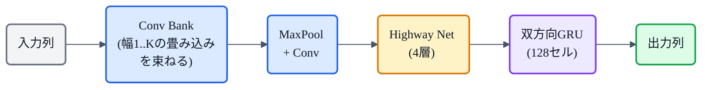

## この章について

このシリーズでは VITS や [Qwen3-TTS](https://zenn.dev/nnn112358/books/tts-for-cats/viewer/qwen3-tts) といった現代のモデルを見てきましたが、今回は歴史をさかのぼって **Tacotron**(2017, Google)を見ます。**文字から音(スペクトログラム)を直接作った、エンドツーエンド(E2E)TTS の原点**です。

いまでは当たり前の「文字を入れたら音が出る」——これを、人手の設計をほぼ捨てて、**seq2seq + Attention** ひとつで実現した記念碑的モデル。ここから [Tacotron 2](https://zenn.dev/nnn112358/books/tts-for-cats/viewer/tacotron2) → 現代へと続く流れが始まりました。猫でもわかるように見ていきましょう。🌮

:::message
Tacotron: Wang et al., *"Tacotron: Towards End-to-End Speech Synthesis"* (2017, [arXiv:1703.10135](https://arxiv.org/abs/1703.10135))。24.6時間・単一話者データで学習、MOS 3.82（当時の商用パラメトリック 3.69 を上回る）。本記事の仕様・数値は論文本文で確認しています。図は matplotlib と mermaid で作成しました。
:::

## 3行で言うと

- Tacotron = **文字列 →(seq2seq + Attention)→ スペクトログラム** を、ゼロから一括学習する最初期のE2E TTS。
- **Attention が「どの文字を今喋るか」の対応(アライメント)を自分で学ぶ**。音素アライメントは不要。
- 波形化は **Griffin-Lim**(ニューラルボコーダではない)。ここを WaveNet に差し替えたのが [Tacotron 2](https://zenn.dev/nnn112358/books/tts-for-cats/viewer/tacotron2)。

## 何が新しかったか:多段パイプラインを畳む

Tacotron 以前の TTS は、**テキスト解析フロントエンド → 音響モデル → ボコーダ** と、専門知識で作った部品を積み重ねる多段構成でした。各段の設計は職人芸で、誤りも積み重なります。

Tacotron は、これを **1つのニューラルネットに畳み込み**ました。〈文字, 音声〉のペアさえあれば、**ランダム初期化から丸ごと学習**できる。音素への変換もアライメント注釈も要らないので、大量の音声データにそのままスケールできます。当時としては大きな飛躍でした。

## 心臓:seq2seq + Attention

Tacotron の背骨は、機械翻訳などで使われていた **seq2seq(系列変換)+ Attention** です。

- **エンコーダ**:文字列を読み込み、意味のある表現の列にする。
- **Attention(注意機構)**:出力の各時刻で、**入力のどの文字に注目すべきか**を選ぶ。
- **デコーダ**:注目先を頼りに、**スペクトログラムを1フレームずつ**生成する。

ここで生まれるのが **アライメント(対応関係)**。「今このフレームは、だいたいこの文字あたりを喋っている」という対応を、**Attention が学習の中で自動的に獲得**します。

*縦が入力文字、横がスペクトログラムのフレーム(時間)。明るい帯が「そのフレームでどの文字に注目したか」。きれいな斜めの帯 = 文字が順番どおり音に対応している証拠で、これが崩れると読み飛ばしや繰り返しが起きる。*

## CBHG:Tacotron 独自の特徴抽出器

Tacotron の工夫の目玉が **CBHG** というモジュールです。名前は **1-D Convolution Bank + Highway network + Bidirectional GRU** の略。

Conv Bank が**異なるスケールの特徴を同時に捉え**(幅1〜Kの畳み込みをK本並べる)、Highway Net が情報を選択的に通し、双方向 GRU が文脈を前後から統合します。エンコーダ(K=16)と後処理ネット(K=8)の両方で使われます。

## もう一つの工夫:Reduction Factor

デコーダは1ステップで**r個のフレーム**を同時に生成します（論文では r=2〜5）。MOS評価は r=2 で実施。

- デコーダのステップ数が **1/r** に減り、学習・推論が速くなる
- Attention が**早く前に進める**ので収束も速い
- フレーム単位の自己回帰なので、[WaveNet](https://zenn.dev/nnn112358/books/tts-for-cats/viewer/wavenet)（サンプル単位）よりはるかに高速

## 全体像

デコーダが出すのは80帯域の**メルスペクトログラム**。そのあと**後処理 CBHG**(K=8)が全系列を見渡してメルから**線形スペクトログラム**に変換し、最後に **Griffin-Lim**（約50回の反復で位相を推定）で波形にします。

Pre-net（2層FC + Dropout 0.5）はエンコーダ・デコーダ両方に置かれ、論文によれば**このドロップアウトが品質に決定的**（scheduled sampling よりも効果的）とのことです。

## 波形化は Griffin-Lim:限界と次への伏線

Griffin-Lim は古典的な位相推定法で、ニューラルボコーダではありません。手軽ですが音質には限界があり、「カチカチした」アーティファクトが残ります。論文では予測した振幅を1.2乗してからGriffin-Limに渡す工夫でアーティファクトを低減しています。

だからこそ次の一手が分かりやすい。**この Griffin-Lim を [WaveNet](https://zenn.dev/nnn112358/books/tts-for-cats/viewer/wavenet) ボコーダに差し替え、中間表現を[メルスペクトログラム](https://zenn.dev/nnn112358/books/tts-for-cats/viewer/mel-spectrogram)に特化させた**のが **[Tacotron 2](https://zenn.dev/nnn112358/books/tts-for-cats/viewer/tacotron2)**。MOS は 3.82 → **4.53** と人間レベルへ一気に近づきました。

## 意義と系譜

Tacotron は、**ニューラルE2E TTS の起点**です。ここから、

- **[Tacotron 2](https://zenn.dev/nnn112358/books/tts-for-cats/viewer/tacotron2)**:メル + WaveNet + Location-Sensitive Attention で高音質化。
- しかし Attention は**読み飛ばし・繰り返し**(アライメント崩壊)が起きやすい弱点も持ちます。これを決定的に解いたのが、[Glow-TTS](https://zenn.dev/nnn112358/books/tts-for-cats/viewer/glow-tts) / [VITS](https://zenn.dev/nnn112358/books/tts-for-cats/viewer/vits) の **[MAS](https://zenn.dev/nnn112358/books/tts-for-cats/viewer/mas)**(単調アライメント)や、[F5-TTS](https://zenn.dev/nnn112358/books/tts-for-cats/viewer/f5-tts) のフィラー方式でした。

つまり Tacotron が示した「文字→音を丸ごと学ぶ」という発想が、その後のTTS([→系譜マップ](https://zenn.dev/nnn112358/articles/tts-lineage-map-from-vits))すべての土台になっています。

## 猫のまとめ 🌮

- Tacotron = **文字 →(seq2seq + Attention)→ スペクトログラム**をゼロから一括学習した、最初期のE2E TTS。
- **CBHG**(Conv Bank + Highway + BiGRU)で特徴抽出、**Reduction Factor**(r=2)でデコーダを高速化。
- **Attention がアライメント(文字と音の対応)を自分で学ぶ**。Pre-net の Dropout 0.5 が品質に決定的。
- 波形化は **Griffin-Lim**(50回反復)。MOS **3.82**(当時の商用パラメトリック 3.69 を上回る）。
- ここを WaveNet に替え、Attention を改良したのが **[Tacotron 2](https://zenn.dev/nnn112358/books/tts-for-cats/viewer/tacotron2)**(MOS 4.53）。E2E TTSの原点。

「文字を入れたら音が出る」——今では当たり前のこの体験は、Tacotron から始まりました。🌮

## 参考リンク

- [Tacotron (arXiv:1703.10135)](https://arxiv.org/abs/1703.10135) / [Tacotron 2 (arXiv:1712.05884)](https://arxiv.org/abs/1712.05884)
- 関連記事: [猫でもわかるTacotron 2](https://zenn.dev/nnn112358/books/tts-for-cats/viewer/tacotron2) / [猫でもわかる音響モデル](https://zenn.dev/nnn112358/books/tts-for-cats/viewer/acoustic-model) / [猫でもわかるWaveNet](https://zenn.dev/nnn112358/books/tts-for-cats/viewer/wavenet) / [猫でもわかるMAS](https://zenn.dev/nnn112358/books/tts-for-cats/viewer/mas) / [VITSから見るTTS 10系統マップ](https://zenn.dev/nnn112358/articles/tts-lineage-map-from-vits)
