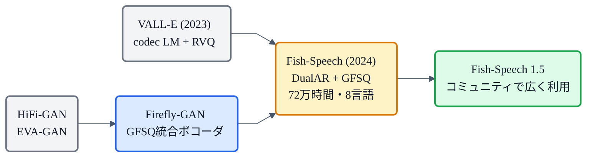

## この章について

[LLM TTS](https://zenn.dev/nnn112358/books/tts-from-text-to-audio/viewer/llm-tts)で「音声を離散トークンにして、LLMが次のトークンを予測する」路線を見ました。この章はその路線の実力派 **Fish-Speech**(2024, Fish Audio)を見ます。

Fish-Speech のすごさは、**72万時間**という桁違いの学習データ、**G2P(音素変換)が不要**でLLMがテキストを直接処理する設計、そして独自量子化 **GFSQ** による高いコードブック利用率。RTF 1:15(RTX 4090)で高速、WER は**正解音声より低い**6.89%。見ていきましょう。🐟

:::message
Fish-Speech: Fish Audio, *"Fish-Speech: Leveraging Large Language Models for Advanced Multilingual Text-to-Speech Synthesis"* (2024, [arXiv:2411.01156](https://arxiv.org/abs/2411.01156))。8言語対応、Apache 2.0ライセンス。本章の仕様・数値は論文本文で確認しています。図は matplotlib と mermaid で作成しました。
:::

## 3行で言うと

- Fish-Speech = **72万時間**の多言語音声で学んだ、**DualAR(2段Transformer)**方式の [LLM TTS](https://zenn.dev/nnn112358/books/tts-from-text-to-audio/viewer/llm-tts)。
- [EnCodec](https://zenn.dev/nnn112358/books/tts-from-text-to-audio/viewer/encodec) 等の **RVQ を使わず、GFSQ(グループ有限スカラー量子化)** で音声を離散化。コードブック利用率ほぼ100%、意味/音響の二段分割も不要。
- **G2P不要**でLLMがテキストを直接処理。MOS 4.05、WER 6.89%(正解GT 9.22%より良い)、RTF 1:15、初パケット150ms。

## RVQをやめた:GFSQ という量子化

[LLM TTS](https://zenn.dev/nnn112358/books/tts-from-text-to-audio/viewer/llm-tts) の多くは、[EnCodec](https://zenn.dev/nnn112358/books/tts-from-text-to-audio/viewer/encodec) や SoundStream の **RVQ(残差ベクトル量子化)** で音声をトークンにします。RVQ は「粗く→残差を→さらに残差を…」と多段で近似する方式（[→EnCodecの章](https://zenn.dev/nnn112358/books/tts-from-text-to-audio/viewer/encodec)）。品質は高いですが、**各段が前段に依存する**（逐次的）、**コードブックの利用率が低くなりがち**という弱点があります。

Fish-Speech は、RVQ の代わりに **GFSQ(Grouped Finite Scalar Quantization / グループ有限スカラー量子化)** を使います。発想はシンプル：入力ベクトルを**G個のグループに分割**し、各グループを**独立にスカラー量子化**して、結合する。

*左: RVQ は各段が前段の残差に依存し逐次的。右: GFSQ は入力をグループに分割し、各グループが独立に量子化（並列）。段間依存がなく、コードブック利用率ほぼ100%。1層で完結するため、[LLM TTS](https://zenn.dev/nnn112358/books/tts-from-text-to-audio/viewer/llm-tts) における「多コードブックをどう捌くか」の問題自体が消える。*

GFSQ の嬉しさは3つ:

1. **段間依存がない**(並列処理できる)
2. **コードブック利用率がほぼ100%**（RVQ は上位層ほど利用率が下がりやすい）
3. **1層で完結**するので、RVQ のような「意味トークン→音響トークン」の二段分割が不要

論文の内部比較(ablation)でも、GFSQ は RVQ・RFSQ・GRFSQ を上回っています。

## 心臓部:DualAR(2段Transformer)

Fish-Speech の生成エンジンは **DualAR**。2つの自己回帰 Transformer が直列に繋がります。

- **Slow Transformer**:テキスト埋め込みを受け取り、**文全体の意味・韻律**(何を、どう喋るか)を捉える。出力は隠れ状態 h とトークンのロジット。
- **Fast Transformer**:Slow の隠れ状態 h とコードブック埋め込みを受け取り、**GFSQのコード列を自己回帰で生成**する。

「Slow が大枠を決め、Fast が音に落とす」——[LLM TTS](https://zenn.dev/nnn112358/books/tts-from-text-to-audio/viewer/llm-tts) の「意味→音響」を、2つの Transformer で明示的に分担しています。この分離が安定性と速度に効いており、7B規模への拡張にも向いています。

## G2P不要:LLMがテキストを直接読む

従来の TTS は [G2P](https://zenn.dev/nnn112358/books/tts-from-text-to-audio/viewer/g2p)(文字→音素変換)が入口に必要でした。G2P が間違えると、その先は全部おかしくなります。

Fish-Speech は G2P を捨て、**LLM がテキスト(BPE)を直接処理**します。LLM は大規模テキストで事前学習されているので、言語知識を自前で持っている。だから音素に変換しなくても読める——この割り切りが、**8言語対応**(英語・中国語各30万時間 + 独・仏・伊・日・韓・アラビア語各2万時間)の設計をシンプルにしています。

## ボコーダ:Firefly-GAN

GFSQコードから波形に戻すボコーダは **Firefly-GAN(FF-GAN)**。[HiFi-GAN](https://zenn.dev/nnn112358/books/tts-from-text-to-audio/viewer/hifigan) の発展形で、主な改良は:

- **ParallelBlock**:HiFi-GAN の MRF(Multi-Receptive Field)モジュールを、3つの ResBlock を並列に走らせて平均する構造に置き換え。
- **Depthwise Separable Conv**:標準の Conv1d よりパラメータ効率がよい。
- GFSQ をボトルネックに統合し、コーデックとボコーダを一体学習。

## 学習:3段階(Pretrain → SFT → DPO)

Fish-Speech の学習は、**LLM と同じ3段階**で進みます。

| 段階 | 内容 | データ |
|---|---|---|
| **Pretrain** | 大規模・多様な音声で汎用表現を学習 | 72万時間(8言語) |
| **SFT** | 高品質データで微調整 | 小バッチ・厳選データ |
| **DPO** | 人手でラベルした良い/悪いペアで好みを学習 | 正例・負例ペア |

ハードウェアは AR モデルが 8× H100(1週間)、ボコーダが 8× RTX 4090(1週間)。Pretrain → SFT → DPO という流れは、ChatGPT の学習パイプラインとまったく同じ構造です。

## 性能:正解より正確

| 指標 | Fish-Speech | CosyVoice | F5-TTS | 正解(GT) |
|---|---|---|---|---|
| **WER** ↓ | **6.89%** | 22.20% | 13.98% | 9.22% |
| **話者類似度** ↑ | **0.914** | 0.881 | 0.802 | 0.921 |
| **MOS** ↑ | **4.05** | 3.80 | 2.90 | — |

WER(単語誤り率)が**正解音声より低い**のは異例。これは Fish-Speech の発音の正確さを示しています。話者類似度も正解にほぼ匹敵。

速度は RTX 4090 で **RTF 約 1:15**(1秒の音声を約0.07秒で生成)、RTX 4060 Mobile でも 1:5。初パケット遅延 **150ms** でストリーミング対応。

## 系譜での位置

[LLM TTS](https://zenn.dev/nnn112358/books/tts-from-text-to-audio/viewer/llm-tts) の系譜で言えば、VALL-E が切り拓いた codec LM 路線を、**RVQ→GFSQ、G2P→不要、DualARで高速安定**に仕上げたのが Fish-Speech。Apache 2.0 でコードと重みが公開されており、コミュニティでの利用が広がっています。

## まとめ 🐟

- Fish-Speech = **DualAR(Slow + Fast Transformer)** で喋る [LLM TTS](https://zenn.dev/nnn112358/books/tts-from-text-to-audio/viewer/llm-tts)。72万時間・8言語で学習。
- **GFSQ** で音声を離散化。RVQ と違い段間依存なし、コードブック利用率100%、1層で完結。意味/音響の二段分割も不要。
- **G2P 不要**——LLMがテキストを直接処理(BPE)。学習は Pretrain → SFT → DPO の3段階（ChatGPTと同じ構成）。
- WER **6.89%**(正解 GT の 9.22% より良い)、MOS **4.05**、RTF **1:15**（RTX 4090）。CosyVoice・F5-TTS を大きく上回る。
- ボコーダは **Firefly-GAN**（HiFi-GAN の発展、ParallelBlock + Depthwise Sep Conv + GFSQ統合）。

「RVQ をやめて、G2P も捨てた」——削ぎ落としと大規模データで、LLM TTS の実力を示したモデルです。

## 参考リンク

- [Fish-Speech (arXiv:2411.01156)](https://arxiv.org/abs/2411.01156) / [fishaudio/fish-speech](https://github.com/fishaudio/fish-speech)
- 関連する章: [LLM TTS](https://zenn.dev/nnn112358/books/tts-from-text-to-audio/viewer/llm-tts) / [EnCodec](https://zenn.dev/nnn112358/books/tts-from-text-to-audio/viewer/encodec) / [HiFi-GAN](https://zenn.dev/nnn112358/books/tts-from-text-to-audio/viewer/hifigan) / [G2P](https://zenn.dev/nnn112358/books/tts-from-text-to-audio/viewer/g2p) / [VITSから見るTTS 10系統マップ](https://zenn.dev/nnn112358/articles/tts-lineage-map-from-vits)
