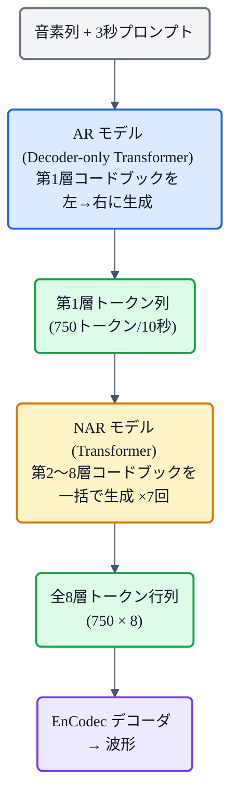
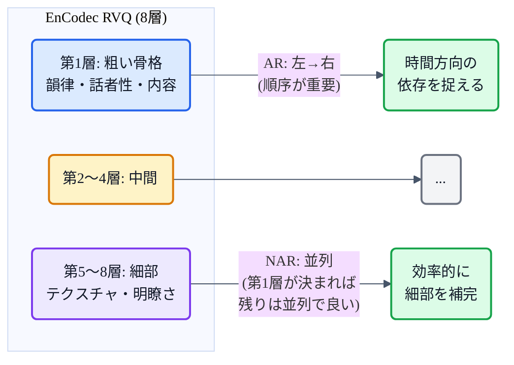
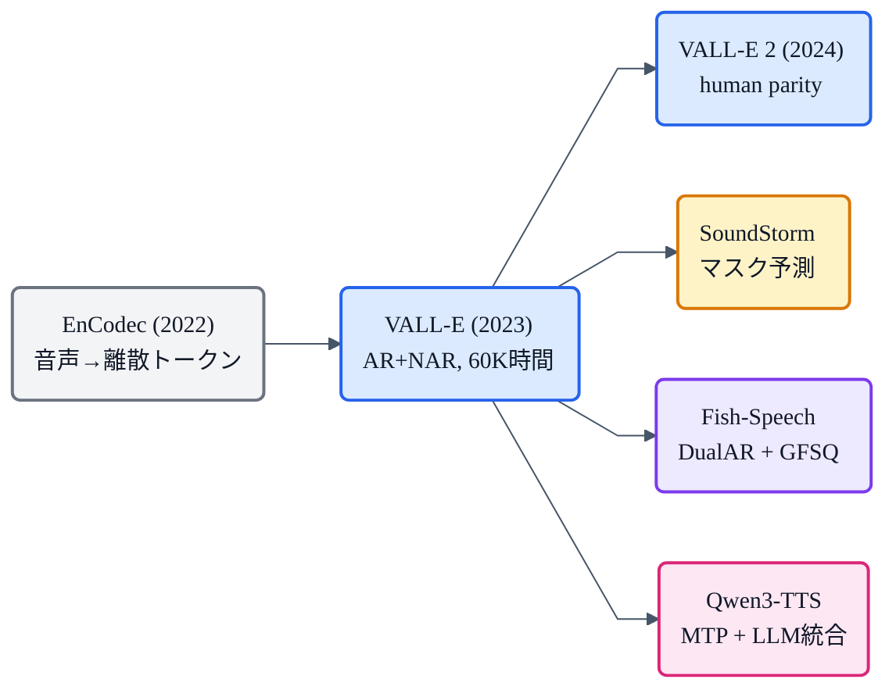

## この章について

[LLM TTS](https://zenn.dev/nnn112358/books/tts-from-text-to-audio/viewer/llm-tts) で「音声を離散トークンにして、言語モデルで生成する」というパラダイムを紹介しました。その**起点になったモデル**が **VALL-E**(2023, Microsoft）です。

それまでの TTS は「メルスペクトログラムを回帰で予測する」ものでしたが、VALL-E は**音声をコーデック(EnCodec)で離散トークンに変換し、言語モデルで次のトークンを予測する**——つまり**TTS を言語モデリング問題として再定義**しました。**3秒の音声プロンプトだけで未知の話者を模倣**する zero-shot 能力も、ここから始まりました。

:::message
VALL-E: Wang et al., *"Neural Codec Language Models are Zero-Shot Text to Speech Synthesizers"* (2023, [arXiv:2301.02111](https://arxiv.org/abs/2301.02111))。60K時間の LibriLight で学習、3秒プロンプトで zero-shot TTS。本章の仕様・数値は論文本文で確認しています。図は mermaid で作成しました。
:::

## 3行で言うと

- VALL-E = **TTS を「音声トークンの言語モデリング」として解いた最初のモデル**。
- [EnCodec](https://zenn.dev/nnn112358/books/tts-from-text-to-audio/viewer/encodec) の8層 RVQ トークンを、**AR(第1層)+ NAR(第2〜8層)** の2段 Transformer で生成。
- **60K時間**で学習し、**3秒の音声プロンプト**だけで未知話者の声を模倣(zero-shot)。

## 発想の転換:メル回帰からトークン言語モデルへ

従来の TTS(Tacotron 2 / FastSpeech / VITS)は、すべて **メルスペクトログラムの連続値を回帰(予測)** するモデルでした。

VALL-E は、これを根本から変えます。

1. 音声を **[EnCodec](https://zenn.dev/nnn112358/books/tts-from-text-to-audio/viewer/encodec)** で**離散トークンの行列**にする(75Hz × 8コードブック = 10秒で 750×8 トークン)。
2. このトークン列を、**言語モデル(Transformer)で自己回帰的に予測**する。
3. 予測したトークンを EnCodec デコーダで波形に戻す。

つまり **NLP と同じ「次のトークンを当てる」問題に帰着**させたのです。これにより、言語モデルが持つスケーリング則(データが増えると性能が伸び続ける)や in-context learning(プロンプトだけで新タスクに適応)を音声にも使えるようになりました。

## アーキテクチャ:AR + NAR の2段構成

[LLM TTS の章](https://zenn.dev/nnn112358/books/tts-from-text-to-audio/viewer/llm-tts)で紹介した **AR+NAR 方式**の原点です。

### AR モデル(第1コードブック)

- **Decoder-only Transformer**: 12層、16ヘッド、隠れ次元 1024、FFN 4096。
- 入力: 音素列 + プロンプト音声の第1層トークン列を**連結**。
- 出力: テキストに対応する**第1層コードブック**のトークンを、左から右に1つずつ生成。
- **サンプリングベースの復号**(ビームサーチは無限ループを誘発する)。

第1コードブックが音声の**粗い骨格**(韻律・話者性・内容)を決めます。

### NAR モデル(第2〜8コードブック)

- **Full-attention Transformer**: 12層、同じ寸法。因果マスクなし。
- 入力: 音素列 + プロンプト全8層 + AR が生成した第1層。
- 出力: 第 $n$ コードブックのトークンを**全フレーム並列で**生成。$n=2,3,...,8$ の順に7回呼ぶ。
- **Adaptive Layer Norm**: 現在どの層を生成中かを層ごとに注入。

第2〜8層は**音質の細部**(テクスチャ・明瞭さ）を補います。RVQ の構造上、上位層ほど粗く、下位層ほど細かい残差を表すからです([→EnCodec の章](https://zenn.dev/nnn112358/books/tts-from-text-to-audio/viewer/encodec))。

## なぜ2段に分けるか

- 第1層は**時間方向の依存が強い**(何をいつ喋るか)→ AR で丁寧に生成。
- 第2〜8層は第1層が決まれば比較的独立 → NAR で効率的に一括生成。
- 全8層を AR で生成すると、系列長が 750×8 = 6000 トークンになり現実的でない。

## 学習:60K時間で in-context learning を獲得

| | 従来(Tacotron 2等) | **VALL-E** |
|---|---|---|
| 学習データ | 24.6時間(1話者) | **60K時間(7000話者)** |
| 学習目標 | メルの回帰 | **次トークン予測** |
| 話者適応 | ファインチューニング必要 | **3秒プロンプトのみ** |

LibriLight 60K 時間(英語オーディオブック、約7000話者)を使用。音声を EnCodec(24kHz, 6Kbps)でトークン化し、テキストは外部 ASR で転写。16台の V100 で 800K ステップ。

大量のデータで学習することで、**プロンプトの話者特徴を in-context で捉え、指定テキストをその声で生成**する能力が自然に身につきます。これが [zero-shot TTS](https://zenn.dev/nnn112358/books/tts-from-text-to-audio/viewer/zero-shot) の始まりです。

## 性能

**LibriSpeech test-clean(未知話者、3秒プロンプト）**:

| | WER ↓ | 話者類似度 ↑ | SMOS |
|---|---|---|---|
| 人間(GT) | 2.2 | 0.754 | 4.50 |
| YourTTS | 7.7 | 0.337 | 3.45 |
| **VALL-E** | **5.9** | **0.580** | **4.38** |

WER 5.9 は GT(2.2)よりは高いものの、zero-shot TTS としては当時最高水準。話者類似度は YourTTS の 0.337 を大きく引き離す 0.580。人間評価でも SMOS 4.38(GT 4.50)と差は小さい。

## VALL-E の弱点と後継

VALL-E は画期的でしたが、弱点もはっきりしていました。

1. **読み飛ばし・繰り返し**(AR の Attention 不安定)。
2. **長い系列への弱さ**(750トークン/10秒)。
3. **AR + NAR が別モデル**(統一したい）。

これらを解決する後継が続きます:

| モデル | 主な改良 |
|---|---|
| **VALL-E 2** (2024) | Repetition Aware Sampling + Grouped Code Modeling → **初の human parity** (CMOS +0.03 vs GT) |
| **VALL-E R** (2024) | 単調アライメント制約 + Codec merging → WER 3.18(V1の5.9→半減)、推論 2.8倍速 |
| **VALL-E X** (2023) | 70K時間英中2言語 → クロスリンガル zero-shot |

また VALL-E の AR+NAR 方式に対し、異なるアプローチも登場しました:
- **SoundStorm / MaskGCT**: マスク予測方式（[→LLM TTS の章](https://zenn.dev/nnn112358/books/tts-from-text-to-audio/viewer/llm-tts)参照）
- **[Fish-Speech](https://zenn.dev/nnn112358/books/tts-from-text-to-audio/viewer/fish-speech)**: DualAR + GFSQ（RVQ 自体を捨てた）
- **[Qwen3-TTS](https://zenn.dev/nnn112358/books/tts-from-text-to-audio/viewer/qwen3-tts)**: Multi-Token Prediction + LLM 統合

## 系譜での位置

VALL-E は「メル回帰 → トークン言語モデル」というパラダイムシフトを起こし、[LLM TTS](https://zenn.dev/nnn112358/books/tts-from-text-to-audio/viewer/llm-tts) 全体の土台を築きました。

## まとめ 🔊

- VALL-E = **TTS を「音声トークンの次トークン予測」に変えた最初のモデル**。
- **EnCodec 8層 RVQ** を、**AR(第1層)+ NAR(第2〜8層)** の2段 Transformer で生成。
- **60K時間**(従来の2500倍)で学習し、**3秒プロンプト**だけで未知話者を模倣(zero-shot)。
- SMOS **4.38**(GT 4.50)、話者類似度 **0.580**。VALL-E 2 は human parity を達成。
- メル回帰 → トークン言語モデルへの**パラダイムシフト**。LLM TTS すべてのルーツ。

## 参考リンク

- [VALL-E (arXiv:2301.02111)](https://arxiv.org/abs/2301.02111) / [VALL-E 2 (arXiv:2406.05370)](https://arxiv.org/abs/2406.05370)
- 関連する章: [LLM TTS](https://zenn.dev/nnn112358/books/tts-from-text-to-audio/viewer/llm-tts) / [EnCodec](https://zenn.dev/nnn112358/books/tts-from-text-to-audio/viewer/encodec) / [zero-shot TTS](https://zenn.dev/nnn112358/books/tts-from-text-to-audio/viewer/zero-shot) / [Fish-Speech](https://zenn.dev/nnn112358/books/tts-from-text-to-audio/viewer/fish-speech) / [Qwen3-TTS](https://zenn.dev/nnn112358/books/tts-from-text-to-audio/viewer/qwen3-tts) / [VITSから見るTTS 10系統マップ](https://zenn.dev/nnn112358/articles/tts-lineage-map-from-vits)
