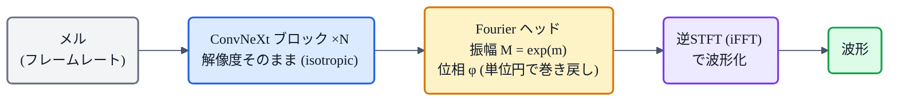

## この章について

[iSTFTNet](https://zenn.dev/nnn112358/books/tts-from-text-to-audio/viewer/istftnet)の最後で、「iSTFTNet が諦めた"全部 iSTFT 化"を、良い骨格で克服したのが **Vocos**」と紹介しました。この章はその Vocos の話です。

Vocos(2023)は、**HiFi-GAN と同等の音質を、桁違いに速く**出すフーリエ系ボコーダ。カギは「**ネットワークを高い解像度で走らせない**」という発想の転換にあります。図で解いていきます。🌀

:::message
Vocos: Siuzdak, *"Vocos: Closing the gap between time-domain and Fourier-based neural vocoders"* (2023, [arXiv:2306.00814](https://arxiv.org/abs/2306.00814))。本章の仕様・数値は論文本文で確認しています。解像度の図は matplotlib、フローチャートは mermaid です。
:::

## 3行で言うと

- Vocos = **複素スペクトル(振幅＋位相)を直接予測し、逆STFT(iFFT)で波形化**するGANボコーダ。
- HiFi-GAN のように転置畳み込みで段階的にアップサンプルせず、**全層をフレームレートのまま(isotropic)** 処理する。
- だから **HiFi-GAN の約13倍・BigVGAN の約70倍速い**(CPU)。しかも音質はSOTA同等。

## おさらい:時間領域ボコーダの「ムダ」

[HiFi-GAN](https://zenn.dev/nnn112358/books/tts-from-text-to-audio/viewer/hifigan) のような時間領域のボコーダは、メル(低い時間解像度)を **転置畳み込みで少しずつ引き伸ばし**、波形(高い解像度)まで持っていきます。数百倍のアップサンプルをネットワークの中で行うため、**後半は高い解像度で重い計算**を回すことになり、エイリアシング(折り返し雑音)も起きやすい。ここに改善の余地があります。

## Vocosのアイデア:解像度そのまま + iSTFTで一発

Vocos の答えはこうです。

> ネットワークは**ずっとフレームレートのまま**(解像度を上げない)。波形への引き伸ばしは、**最後の逆STFT(iFFT)一発**で済ませる。

論文はこれを **isotropic architecture(全層で同じ時間解像度)** と呼びます。転置畳み込みによる学習ずみのアップサンプル層を**まるごと廃止**し、代わりに**枯れた高速アルゴリズムである逆フーリエ変換**で波形を復元するのです。

*上(HiFi-GAN): ネットワークの中で解像度が ×1→×8→×64→×256 と上がり、赤い面積ぶんの高解像度計算が重い。下(Vocos): 全層 ×1(フレームレート)のまま処理し、最後に iSTFT で一気に ×256。ネットワークは低解像度のままなので軽い=速い。*

この図が Vocos の速さの理由そのものです。**重い計算をネットワークにさせず、安いFFTに任せる**。だから桁違いに速くなります。

## 位相の壁と、その乗り越え方

「フーリエで一発」と言いましたが、これは昔から難しいとされてきました。理由は **位相(phase)** です。スペクトルは振幅と位相の複素数ですが、**位相は $(-\pi, \pi]$ でぐるぐる巻き戻る(phase wrapping)** ため、そのまま予測させると不連続でうまく学習できません。だから多くの手法は位相を捨て、Griffin-Lim のような反復推定に頼っていました。

Vocos の工夫は、**位相を"単位円の上"で表現する**こと。ネットワークの出力から角度 $\varphi = \mathrm{atan2}(y, x)$ を作ると、**自然に $(-\pi, \pi]$ に巻き戻る**ので、位相の周期性を壊さずに扱えます。論文の切除実験でも、この工夫を外して素朴に位相を予測すると品質が落ちることが示されており、**暗黙の巻き戻しが効いている**とわかります。

## 中身:ConvNeXt骨格とFourierヘッド

- **骨格は ConvNeXt**:低解像度のまま処理するので、時間領域ボコーダで定番の拡張畳み込み([→WaveNet](https://zenn.dev/nnn112358/books/tts-from-text-to-audio/viewer/wavenet))は不要。画像で成功した ConvNeXt ブロック(深さ方向畳み込み＋逆ボトルネック)を使います。
- **Fourierヘッド**:各周波数ビンについて、振幅 $M = \exp(m)$ と位相を出力し、複素スペクトルを組み立てます。あとは逆STFTで波形へ。

学習は [HiFi-GAN](https://zenn.dev/nnn112358/books/tts-from-text-to-audio/viewer/hifigan) と同じレシピ——**識別器(MPD + 多重解像度識別器 MRD)**、**メル再構成損失**、**特徴マッチング損失**——ただし敵対的損失は最小二乗ではなく **hinge損失**を使います。

## iSTFTNet との関係(なぜ克服できたか)

[iSTFTNet](https://zenn.dev/nnn112358/books/tts-from-text-to-audio/viewer/istftnet) も「終盤を iSTFT に置き換える」発想でしたが、**最後の2ブロックしか置き換えられず、それ以上やると品質が急落**しました(残りは転置畳み込みのまま)。Vocos はこの壁を、**ConvNeXt という良い骨格でフレームレートのまま高解像度スペクトルを直接予測**することで突破し、**アップサンプルを完全に廃止**しました。

| | HiFi-GAN | iSTFTNet | **Vocos** |
|---|---|---|---|
| アップサンプル | 全部 転置畳み込み | 終盤だけ iSTFT | **全部 iSTFT**(転置畳み込み無し) |
| 骨格 | 拡張畳み込み | HiFi-GAN流用 | **ConvNeXt**(解像度そのまま) |
| 速度(CPU) | 基準 | やや速い | **約13倍速** |

## どれくらい速い?

論文の評価では、Vocos は **HiFi-GAN の約13倍、BigVGAN の約70倍**の速度(とくにGPUなしで顕著)。それでいて**音質はSOTAと同等**。「速さと品質はトレードオフ」を、フーリエ表現という良い"型"の力で崩したわけです([→実測でも Vocos は CPU 最速級でした](https://zenn.dev/nnn112358/books/tts-from-text-to-audio/viewer/hifigan))。

## まとめ 🌀

- Vocos = **複素スペクトル(振幅＋位相)を直接予測 → 逆STFTで波形化**するGANボコーダ。
- **全層フレームレートのまま(isotropic)** 処理し、アップサンプルは **iSTFT一発**。だから軽くて速い。
- 難所の**位相**は、**単位円上での表現**で暗黙に巻き戻して解決。
- 骨格は **ConvNeXt**。学習は HiFi-GAN 流(MPD+MRD+メル再構成+特徴マッチング、hinge損失)。
- iSTFTNet が「終盤だけ」だったのを、**全部 iSTFT** に。HiFi-GAN の約13倍速でSOTA同等品質。

「重い計算をネットワークにさせず、フーリエに任せる」——シンプルだけど効く、ボコーダ設計の good idea でした。

## 参考リンク

- [Vocos (arXiv:2306.00814)](https://arxiv.org/abs/2306.00814) / 実装 [gemelo-ai/vocos](https://github.com/gemelo-ai/vocos)
- 関連する章: [iSTFTNet](https://zenn.dev/nnn112358/books/tts-from-text-to-audio/viewer/istftnet) / [HiFi-GAN](https://zenn.dev/nnn112358/books/tts-from-text-to-audio/viewer/hifigan) / [メルスペクトログラム](https://zenn.dev/nnn112358/books/tts-from-text-to-audio/viewer/mel-spectrogram) / [VITSから見るTTS 10系統マップ](https://zenn.dev/nnn112358/articles/tts-lineage-map-from-vits)
