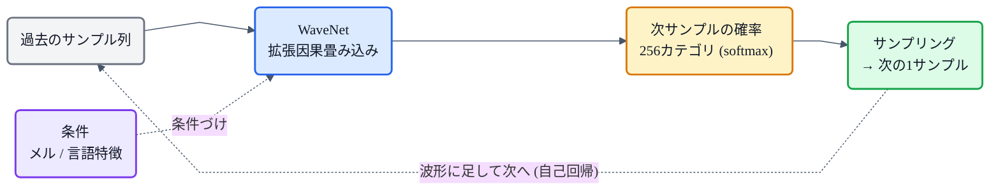
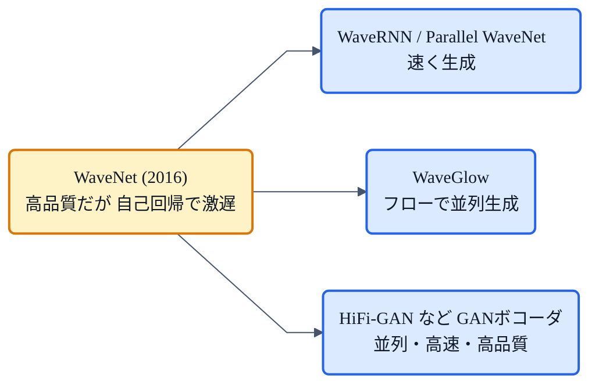

## この章について

[HiFi-GAN](https://zenn.dev/nnn112358/books/tts-from-text-to-audio/viewer/hifigan)や[TTS系譜マップ](https://zenn.dev/nnn112358/articles/tts-lineage-map-from-vits)で、ボコーダの系譜を「**WaveNet** → WaveRNN → … → HiFi-GAN」と何度もたどってきました。この章は、その**いちばん根っこ**にある WaveNet の話です。

WaveNet(2016, DeepMind)は、**生の音声波形をニューラルネットで直接生成する**という発想を確立した、ニューラルボコーダの元祖。当時の音声合成を一気に「人間並み」に近づけた立役者です。中心にあるのは **自己回帰** と **拡張因果畳み込み** という2つのアイデア。図で解いていきます。🌊

:::message
WaveNet: van den Oord et al., *"WaveNet: A Generative Model for Raw Audio"* (2016, [arXiv:1609.03499](https://arxiv.org/abs/1609.03499))。本章の仕様は論文本文で確認しています。拡張畳み込みの図は matplotlib、フローチャートは mermaid で作成しました。
:::

## 3行で言うと

- WaveNet = **生の波形を1サンプルずつ、過去のサンプルから予測して作る**自己回帰モデル(=音声版の言語モデル)。
- キモは **拡張因果畳み込み**:過去だけを見て(因果)、飛ばし飛ばしに畳む(拡張)ことで、**少ない層で広い受容野**を得る。
- 品質は当時最高だったが、**1サンプルずつ生成するので推論が激遅**。これを速くするために後のボコーダが生まれた。

## 何をしたいのか

音声は、1秒あたり16,000〜24,000個ものサンプル(数値)の列です([→メルの章](https://zenn.dev/nnn112358/books/tts-from-text-to-audio/viewer/mel-spectrogram))。WaveNet の目標は、この**生の波形を、音声らしく1個ずつ並べていく**こと。画像を1画素ずつ、文章を1単語ずつ生成する自己回帰モデルの、音声版だと思ってください。

## WaveNetのアイデア:1サンプルずつの自己回帰

WaveNet は、波形全体の確率を「各サンプルを、それまでの全サンプルで条件づけた確率」の積として表します。

$$
p(x) = \prod_{t} p\big(x_t \mid x_1, x_2, \ldots, x_{t-1}\big)
$$

つまり、**次の1サンプルを、過去のサンプル列から予測する**。それを1個ずつ繰り返して波形を伸ばしていきます。論文の言葉では *"fully probabilistic and autoregressive, with the predictive distribution for each audio sample conditioned on all previous ones"* です。

## 拡張因果畳み込み:少ない層で「遠い過去」まで見る

ここが WaveNet の心臓部です。過去のサンプルから次を予測するには、**そこそこ遠い過去まで見渡す**必要があります(音のうねりや韻律のため)。でも普通の畳み込みでこれをやると、層をものすごく積まないと受容野(見える範囲)が広がりません。

WaveNet は2つの工夫でこれを解決します。

- **因果(causal)**:予測は**過去のサンプルだけ**に依存し、未来を覗き見しません。「順番を破らない」ための制約です。
- **拡張(dilated)**:畳み込みの入力を**飛ばし飛ばし**に取ります。層ごとに間隔を 1, 2, 4, 8, … と倍々にしていくと、**受容野が指数的に**広がります。

*過去だけを見て(因果=矢印は左下から右上へ、未来は見ない)、間隔を1→2→4→8と倍にして畳む(拡張)ことで、たった4層で16サンプル分の受容野になる。青い扇形が、右上の「次サンプル」が見ている範囲(受容野)。層を足すほど、この扇はネズミ算式に広がる。*

論文では 1, 2, 4, …, 512 のブロックで**受容野1024**を実現し、それを積み重ねてさらに広げています。「わずかな層数で、とても広い受容野」——これが拡張畳み込みの威力です。

## 出力は「256段階の分類」(μ-law)

次のサンプルの値を、WaveNet はどう出すのでしょう。実数をピタリ当てるのではなく、**値を段階に区切って「どの段階か」を分類**します(softmax)。

ところが 16bit 音声をそのまま扱うと、値は 65,536 通り。分類先が多すぎます。そこで **μ-law という圧縮**をかけてから **256段階に量子化**し、**256カテゴリの分類問題**にします。人間の聴覚が小さい音の違いに敏感なことを利用した、うまい圧縮です。

このほか、`tanh` と `シグモイド` を掛け合わせる **ゲート付き活性化**や、深く積むための **残差接続・スキップ接続**も使われていますが、大枠は「拡張因果畳み込みで過去を見て、256カテゴリを当てる」です。

## ボコーダとしての使い方:条件づけ

ここまでは「それらしい音声を勝手に作る」話でした。実際の TTS では、**何を喋るか**を指定する必要があります。そこで WaveNet を、**言語特徴やメルスペクトログラムで条件づけ**します。これを **local conditioning** と呼び、これによって WaveNet は「メル → 波形」の**ボコーダ**になります。[Tacotron 2](https://zenn.dev/nnn112358/books/tts-from-text-to-audio/viewer/acoustic-model) は、まさに音響モデルの出したメルを WaveNet に渡して音声にしていました。

## 弱点は「遅さ」、そこから後継が生まれた

WaveNet は品質こそ画期的でしたが、大きな弱点がありました。**1サンプルずつ順番に生成する**ため、1秒の音声に何万回もネットワークを走らせる必要があり、**推論がとても遅い**のです(学習は並列にできますが、生成は逐次)。

この「遅さ」を克服することが、その後のボコーダ研究の大きなテーマになりました。サンプルをまとめて速く出す **WaveRNN**、教師 WaveNet を並列モデルへ蒸留する **Parallel WaveNet**、フローで一気に生成する **WaveGlow**、そして敵対的学習で高速・高品質を両立した **[HiFi-GAN](https://zenn.dev/nnn112358/books/tts-from-text-to-audio/viewer/hifigan)** ——いずれも「WaveNet 級の品質を、もっと速く」を目指した子孫たちです。

## まとめ 🌊

- WaveNet = **生の波形を1サンプルずつ予測して作る**自己回帰モデル。ニューラルボコーダの元祖。
- **拡張因果畳み込み**(過去だけ見る＝因果 × 飛ばし畳み＝拡張)で、**少ない層で広い受容野**を得るのが心臓部。
- 出力は **μ-law で256段階に量子化した分類**(softmax)。
- **言語特徴やメルで条件づける**とボコーダになる(Tacotron 2 が採用)。
- 弱点は **1サンプルずつで遅い**こと。これを速くするために WaveRNN / Parallel WaveNet / WaveGlow / **HiFi-GAN** が生まれた。

「生波形をニューラルネットで直接作る」という当たり前になった発想は、ここから始まりました。ボコーダの系譜を読むときの原点です([→系譜マップ](https://zenn.dev/nnn112358/articles/tts-lineage-map-from-vits))。

## 参考リンク

- [WaveNet (arXiv:1609.03499)](https://arxiv.org/abs/1609.03499)
- 関連する章: [HiFi-GAN](https://zenn.dev/nnn112358/books/tts-from-text-to-audio/viewer/hifigan) / [メルスペクトログラム](https://zenn.dev/nnn112358/books/tts-from-text-to-audio/viewer/mel-spectrogram) / [音響モデル](https://zenn.dev/nnn112358/books/tts-from-text-to-audio/viewer/acoustic-model) / [VITSから見るTTS 10系統マップ](https://zenn.dev/nnn112358/articles/tts-lineage-map-from-vits)
